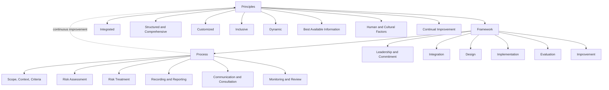
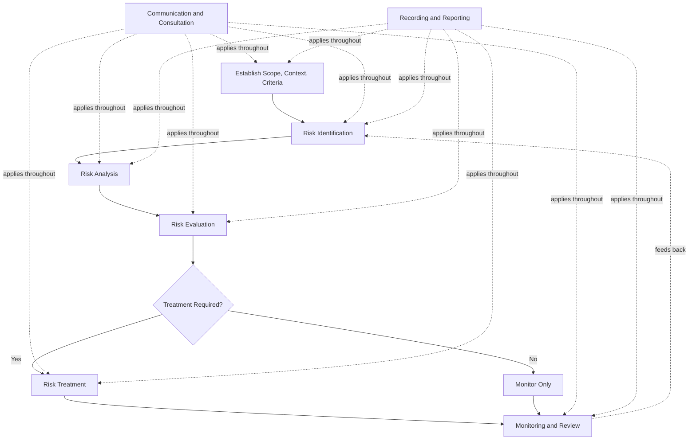

## ISO 31000 Risk Management Guidelines and Their Role in QMS

### Definition and Scope

ISO 31000 is an international standard providing principles, a framework, and a process for managing risk, applicable to any organization regardless of size, activity, or sector. Unlike ISO 9001, ISO 31000 is explicitly **not certifiable** — it is a guidance document, not a management system standard with auditable requirements. Its current edition is ISO 31000:2018, which superseded ISO 31000:2009.

ISO 31000 defines risk as "the effect of uncertainty on objectives," a deliberately broad definition that applies equally to financial risk, strategic risk, operational risk, and quality-related risk, encompassing both negative effects (threats) and positive effects (opportunities).

**Key Points:**

- ISO 31000 is a guideline standard (like ISO 9004), not a requirements standard (like ISO 9001)
- It cannot be used for third-party certification — organizations cannot be "ISO 31000 certified"
- It is designed to be integrated into existing management systems (including QMS) rather than implemented as a standalone system

### Structure of ISO 31000:2018

ISO 31000:2018 is organized around three core components:

**1. Principles** — Eight principles describing the characteristics of effective risk management (value creation and protection, integration into all organizational activities, structured approach, customization, stakeholder inclusion, dynamism, best available information use, and consideration of human/cultural factors)

**2. Framework** — The organizational arrangements for designing, implementing, monitoring, reviewing, and continually improving risk management, integrated throughout governance and strategic planning

**3. Process** — The systematic application of policies, procedures, and practices to communication/consultation, establishing scope/context/criteria, risk assessment (identification, analysis, evaluation), risk treatment, monitoring/review, and recording/reporting

### The ISO 31000 Risk Management Process in Detail

**Risk Assessment sub-stages:**

- **Risk Identification** — Finding, recognizing, and describing risks that might affect objectives
- **Risk Analysis** — Understanding the nature of risk, its causes, sources, likelihood, and consequences
- **Risk Evaluation** — Comparing analyzed risk against risk criteria to determine significance and treatment priority

**Risk Treatment options** (conceptually consistent with ISO 9001 Clause 6.1.2's response options):

- Avoiding the risk
- Taking/increasing risk to pursue an opportunity
- Removing the risk source
- Changing likelihood or consequences
- Sharing the risk (contracts, insurance)
- Retaining the risk by informed decision

### Relationship Between ISO 31000 and ISO 9001

This is a frequently misunderstood relationship:

| Aspect | ISO 9001:2015 | ISO 31000:2018 |
| --- | --- | --- |
| Type | Management system requirements standard | Guidance standard |
| Certifiable | Yes | No |
| Scope | Quality management specifically | Any type of risk, any organization |
| Risk requirement | Clause 6.1 requires risk/opportunity consideration | Provides methodology to fulfill such requirements |
| Mandatory adoption | N/A | Not required to satisfy ISO 9001 |

ISO 9001:2015 does **not** require or reference ISO 31000 as a mandatory methodology. Organizations may fulfill Clause 6.1's risk-based thinking requirements using any proportionate approach — informal brainstorming for a small service business, or a fully developed ISO 31000-aligned framework for a complex manufacturing enterprise.

[Unverified] ISO 9001:2015's own introductory text references risk management concepts but does not cite ISO 31000 as a required reference standard; organizations choosing to adopt ISO 31000 principles do so voluntarily as good practice, not as a certification requirement.

**Key Points:**

- ISO 31000 can serve as a *voluntary* structured methodology to satisfy ISO 9001 Clause 6.1
- Organizations with mature enterprise risk management (ERM) functions often use ISO 31000 as the overarching framework, with QMS risk (Clause 6.1) as one subset/application area
- Using ISO 31000 is not evidence of "better" ISO 9001 compliance per se — proportionate, documented risk consideration by any credible method satisfies the clause

### How ISO 31000 Principles Map to QMS Risk-Based Thinking

| ISO 31000 Principle | QMS Application Example |
| --- | --- |
| Integrated | Risk consideration embedded in process approach (Clause 4.4), not siloed |
| Structured and comprehensive | Consistent risk criteria applied across supplier, process, and product risk |
| Customized | Risk depth proportional to organizational complexity (aligns with Clause 6.1's proportionality) |
| Inclusive | Process owners and relevant interested parties involved in risk identification |
| Dynamic | Risk registers updated as context changes (Clause 4.1 links to Clause 6.1) |
| Best available information | Risk decisions based on data (nonconformity trends, customer feedback, audit findings) |
| Human and cultural factors | Recognizes that risk perception varies; supports quality culture considerations |
| Continual improvement | Risk framework matures over PDCA cycles, consistent with Clause 10 |

### Example: Applying ISO 31000 Process to a QMS Risk Scenario

**Context:** A contract electronics manufacturer wants to apply a structured ISO 31000-aligned process to satisfy ISO 9001 Clause 6.1 for a new product line.

**1. Establish scope, context, criteria:**

- Scope: New product line introduction over next two quarters
- Context: New untested supplier for a critical component; new automated testing equipment being commissioned
- Criteria: Risk unacceptable if likelihood of field failure exceeds a defined threshold or if schedule delay exceeds four weeks

**2. Risk identification:**

- Supplier component quality variability (new, unproven supplier)
- Testing equipment calibration/commissioning delays
- Staff training gaps on new equipment

**3. Risk analysis:**

- Supplier risk: Medium likelihood (no track record), High consequence (potential field failures)
- Equipment risk: Low likelihood (vendor-supported commissioning), Medium consequence (schedule delay)

**4. Risk evaluation:**

- Supplier risk exceeds acceptable threshold — requires treatment
- Equipment risk within tolerable range — monitor only

**5. Risk treatment:**

- Require supplier to provide first-article inspection reports and enhanced incoming inspection sampling for initial lots
- Qualify a secondary backup supplier in parallel

**6. Monitoring and review:**

- Track incoming inspection reject rates against defined thresholds monthly
- Review at next management review cycle (Clause 9.3), closing the loop back into the QMS

This demonstrates ISO 31000's process structure being used as the methodology to fulfill ISO 9001 Clause 6.1's requirement, with output feeding back into standard QMS mechanisms (management review, supplier evaluation under Clause 8.4).

### When Organizations Typically Adopt ISO 31000 Alongside QMS

- Organizations operating in highly regulated or high-consequence industries (aerospace, pharmaceuticals, financial services) seeking a more rigorous, auditable risk framework than ISO 9001 alone mandates
- Organizations with integrated management systems (IMS) combining ISO 9001, ISO 14001 (environmental), and ISO 45001 (occupational health/safety), where a unified enterprise risk framework simplifies cross-standard risk management
- Organizations pursuing enterprise risk management (ERM) maturity beyond quality-specific risk, where QMS risk becomes one input into a broader corporate risk register

### Common Pitfalls

- Assuming ISO 31000 adoption is required for ISO 9001 certification — it is not
- Treating ISO 31000 implementation as equivalent to certification, when no such certification exists (only individual competency certifications from some training bodies exist, which are not the same as organizational certification)
- Over-complicating a small organization's Clause 6.1 compliance by forcing full ISO 31000 process rigor when a simpler proportionate approach would suffice
- Running ISO 31000-aligned risk processes as a parallel system disconnected from actual QMS documentation and management review, violating the integration principle central to both standards

**Related Topics:**

- Actions to Address Risks and Opportunities (ISO 9001 Clause 6.1)
- Risk-Based Thinking Fundamentals
- FMEA and Quantitative Risk Scoring Methods
- Integrated Management Systems (ISO 9001, ISO 14001, ISO 45001)
- Management Review as a Risk Monitoring Mechanism (Clause 9.3)
- Enterprise Risk Management (ERM) Frameworks
- ISO 31010: Risk Assessment Techniques (companion standard)