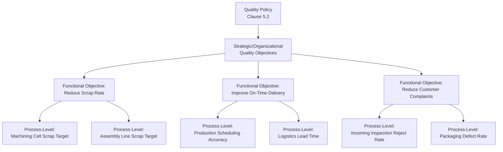
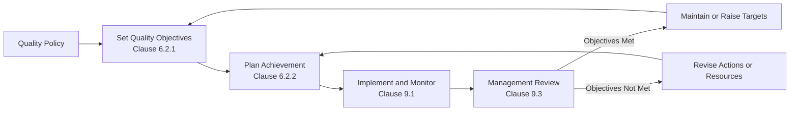

## Setting Quality Objectives and Planning to Achieve Them

### Definition and Clause Reference

This topic corresponds to **ISO 9001:2015 Clause 6.2**, which requires organizations to establish quality objectives at relevant functions, levels, and processes needed for the QMS, and to plan how to achieve them. Clause 6.2 is split into two sub-clauses: **6.2.1** (characteristics required of quality objectives) and **6.2.2** (planning requirements for achieving them).

Quality objectives translate the quality policy (Clause 5.2) from a high-level statement of intent into specific, measurable targets that drive operational activity and provide a basis for evaluating QMS performance.

**Key Points:**

- Quality objectives must be consistent with the quality policy — they operationalize policy intent into concrete targets
- Objectives are required at "relevant functions, levels, and processes," meaning they cascade beyond top management into departmental and process-level targets
- Clause 6.2 links directly to Clause 9.1 (monitoring/measurement) and Clause 9.3 (management review), since objectives must be measurable and tracked

### Required Characteristics of Quality Objectives (Clause 6.2.1)

Per ISO 9001:2015 Clause 6.2.1, quality objectives shall:

(a) be consistent with the quality policy

(b) be measurable

(c) take into account applicable requirements

(d) be relevant to conformity of products/services and to enhancement of customer satisfaction

(e) be monitored

(f) be communicated

(g) be updated as appropriate

A commonly used mnemonic for evaluating objective quality, though not an ISO-defined term itself, is the **SMART** framework:

| SMART Element | Application |
| --- | --- |
| Specific | Clearly defined, unambiguous target |
| Measurable | Quantifiable via defined metric |
| Achievable | Realistic given available resources |
| Relevant | Tied to conformity, customer satisfaction, or QMS effectiveness |
| Time-bound | Defined timeframe for achievement |

[Inference] SMART is a widely used management heuristic commonly applied by practitioners to satisfy Clause 6.2.1's requirements, but it is not an ISO 9001-defined or mandated term — organizations may use other frameworks provided the seven explicit requirements above are met.

### Planning to Achieve Quality Objectives (Clause 6.2.2)

For each quality objective, the organization must determine:

(a) what will be done

(b) what resources will be required

(c) who will be responsible

(d) when it will be completed

(e) how the results will be evaluated

This is frequently mapped to a simple planning matrix:

| Element | Example (Reduce Customer Complaints) |
| --- | --- |
| What | Reduce customer complaint rate related to packaging damage |
| Resources | Revised packaging design, updated work instructions, staff retraining |
| Responsible | Packaging Engineering Lead |
| Timeline | Achieve 50% reduction within 2 quarters |
| Evaluation | Monthly complaint rate tracking against baseline; review at management review |

### Objective Cascading Across Organizational Levels

**Key Points:**

- Cascading ensures line-of-sight between individual/team activity and strategic quality intent, satisfying the "relevant functions, levels, and processes" requirement
- Objectives should not exist only at the top management level — auditors typically probe whether process owners can articulate objectives relevant to their own area
- Effective cascading avoids contradictory objectives (e.g., a throughput objective that inadvertently conflicts with a defect-reduction objective) — this tension itself may need to be identified as a risk under Clause 6.1

### Distinguishing Quality Objectives from Quality Policy

| Aspect | Quality Policy (Clause 5.2) | Quality Objectives (Clause 6.2) |
| --- | --- | --- |
| Nature | Broad statement of intent and direction | Specific, measurable targets |
| Timeframe | Relatively stable, long-term | Often reviewed/updated annually or per cycle |
| Measurability | Not required to be quantified | Explicitly required to be measurable |
| Example | "We are committed to delivering defect-free products that exceed customer expectations" | "Reduce field return rate from 2.1% to below 1.0% by Q4" |

### The Role of Objectives in Management Review

Quality objectives are a mandatory input to management review (Clause 9.3.2), and the extent to which objectives have been met is a required output consideration. This creates a closed-loop system:

### Example: Full Lifecycle of a Quality Objective

**Quality Policy excerpt:** "Our organization is committed to continual improvement in product reliability and customer satisfaction."

**Derived quality objective:** "Reduce customer-reported field failures for Product Line X from 3.5% to 1.5% within 12 months."

**Characteristics check (Clause 6.2.1):**

- Consistent with policy — directly supports "product reliability" commitment ✓
- Measurable — percentage field failure rate ✓
- Takes into account applicable requirements — aligned with contractual reliability specifications ✓
- Relevant to conformity/customer satisfaction — directly tied to both ✓
- Monitored — monthly tracking planned ✓
- Communicated — cascaded to engineering, production, and quality teams ✓
- Updated as appropriate — reviewed quarterly for relevance ✓

**Planning (Clause 6.2.2):**

- **What:** Implement enhanced design verification testing and revise critical-to-quality (CTQ) inspection criteria
- **Resources:** Additional test equipment budget; two engineering FTEs allocated part-time
- **Responsible:** Design Engineering Manager (overall), QA Manager (monitoring)
- **When:** Design changes implemented by Q2; full 12-month tracking period to validate improvement
- **Evaluation:** Monthly field failure rate dashboard; formal review at each quarterly management review

**Outcome tracking:** Progress reviewed against baseline at defined intervals; if trending off-target by mid-period, root cause analysis (Clause 10.2) triggered to adjust the action plan.

### Common Metrics Used as Quality Objectives

| Category | Example Metrics |
| --- | --- |
| Product conformity | Defect rate, scrap rate, rework rate, first-pass yield |
| Customer satisfaction | Net Promoter Score, complaint rate, on-time delivery rate |
| Process efficiency | Cycle time, process capability ($C_{pk}$) |
| Supplier performance | Supplier defect rate, on-time delivery from suppliers |
| Internal QMS health | Audit finding closure rate, corrective action cycle time |

$$C_{pk} = \min\left(\frac{USL - \mu}{3\sigma}, \frac{\mu - LSL}{3\sigma}\right)$$

Process capability indices such as $C_{pk}$ are commonly used as quantitative quality objectives in manufacturing contexts, where $USL$ and $LSL$ represent upper and lower specification limits, $\mu$ is the process mean, and $\sigma$ is the process standard deviation.

### Common Pitfalls

- Setting objectives only at the top management/organizational level without cascading to relevant functions and processes
- Establishing objectives that are not genuinely measurable (e.g., "improve quality culture" without a defined metric or proxy indicator)
- Failing to document the planning elements required by Clause 6.2.2 (what, resources, responsibility, timeline, evaluation method)
- Setting objectives disconnected from the quality policy, creating inconsistency between stated intent and actual operational targets
- Treating objective-setting as an annual paperwork exercise rather than an actively monitored, dynamically adjusted management tool
- Objectives that conflict with each other across functions (e.g., cost-reduction objectives undermining quality-improvement objectives) without this tension being identified and managed

**Related Topics:**

- Quality Policy Development (Clause 5.2)
- Management Review Inputs and Outputs (Clause 9.3)
- Monitoring, Measurement, Analysis and Evaluation (Clause 9.1)
- Actions to Address Risks and Opportunities (Clause 6.1)
- Process Capability and Statistical Process Control
- Corrective Action and Root Cause Analysis (Clause 10.2)
- Balanced Scorecard and KPI Cascading Methodologies