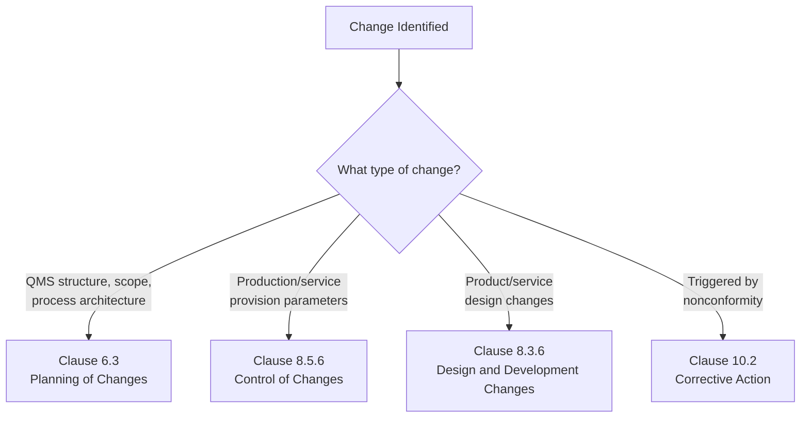
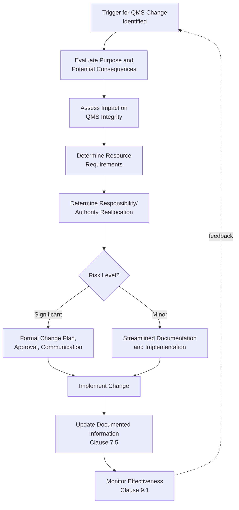

## Planning of Changes to the Quality Management System

### Definition and Clause Reference

This topic corresponds to **ISO 9001:2015 Clause 6.3**, which requires that when an organization determines the need for changes to the QMS, the changes shall be carried out in a planned manner. Clause 6.3 is deliberately brief in the standard's text but carries significant practical weight, since uncontrolled or ad hoc QMS changes are a common source of nonconformity, process breakdown, and audit findings.

The clause requires the organization to consider:

(a) the purpose of the changes and their potential consequences

(b) the integrity of the QMS

(c) the availability of resources

(d) the allocation or reallocation of responsibilities and authorities

**Key Points:**

- Clause 6.3 applies to changes to the QMS itself (processes, structure, documented information, scope) — it is distinct from Clause 8.5.6 (Control of Changes), which addresses changes to production or service provision
- The clause is intentionally general, giving organizations flexibility in how formally they plan changes, proportional to change complexity and risk
- "Planned manner" implies deliberate consideration before implementation, not retroactive documentation after a change has already occurred

### Distinguishing Clause 6.3 from Related Change Clauses

A frequent point of confusion is which "change" clause applies to a given scenario:

| Clause | Scope | Example |
| --- | --- | --- |
| 6.3 – Planning of Changes | Changes to the QMS itself | Restructuring quality department reporting lines; changing which processes fall within QMS scope |
| 8.5.6 – Control of Changes | Changes to production/service provision | Changing a manufacturing process parameter or work instruction |
| 8.3.6 – Design and Development Changes | Changes during/after product design | Modifying a product's design specification |
| 10.2 – Corrective Action | Changes triggered by nonconformity | Revising a procedure after root cause analysis reveals a gap |

[Inference] In practice, many QMS changes trigger more than one clause simultaneously — for example, adding a new production line may require both Clause 6.3 planning (QMS scope expansion) and Clause 8.5.6 controls (new process parameters) — and organizations should map which controls apply rather than treating these clauses as mutually exclusive.

### The Four Required Considerations in Detail

**1. Purpose of the Change and Potential Consequences**

- Why is the change being made? (e.g., regulatory requirement, customer requirement, improvement opportunity, corrective action)
- What are the downstream effects, including on interfacing processes, interested parties, and product/service conformity?
- This consideration directly links to risk-based thinking (Clause 6.1) — potential consequences should be evaluated as risks/opportunities

**2. Integrity of the QMS**

- Does the change maintain consistency across the QMS, or does it create gaps, contradictions, or orphaned requirements?
- For example, changing a process boundary without updating related procedures, roles, or the quality manual/scope documentation would compromise integrity

**3. Availability of Resources**

- Are sufficient personnel, infrastructure, technology, and budget available to implement the change effectively?
- Under-resourced changes are a common root cause of QMS degradation following well-intentioned modifications

**4. Allocation/Reallocation of Responsibilities and Authorities**

- Does the change affect who is accountable for specific QMS processes or decisions?
- Authority matrices, job descriptions, and delegation documentation may require corresponding updates

### Change Planning Process Flow

### Common Triggers for QMS Changes

- Changes in external/internal context (Clause 4.1) — e.g., new regulatory requirements, market shifts, technology adoption
- Changes in interested party needs/expectations (Clause 4.2) — e.g., new customer contractual quality requirements
- Outputs from management review (Clause 9.3) identifying need for QMS structural change
- Results of internal or external audits identifying systemic gaps
- Organizational restructuring, mergers, acquisitions, or significant growth
- Introduction of new products, services, technologies, or facilities expanding QMS scope
- Corrective actions (Clause 10.2) revealing the need for broader QMS process changes rather than localized fixes

### Example: Applying Clause 6.3 to a Real Scenario

**Scenario:** A mid-sized manufacturer decides to consolidate quality functions from three regional sites into a single centralized quality department, driven by a strategic cost-reduction and standardization initiative.

**Applying the four considerations:**

**Purpose and consequences:**

- Purpose: Standardize quality practices, reduce redundant headcount, improve consistency across sites
- Potential consequences: Risk of reduced site-level responsiveness to local production issues; risk of communication delays between centralized quality and site operations; opportunity for improved cross-site best-practice sharing

**QMS integrity:**

- Review whether centralization affects existing process documentation that assumes site-level quality authority
- Ensure nonconformance disposition authority (previously site-based) is clearly redefined without creating approval bottlenecks
- Update the quality manual and process interaction diagrams to reflect the new structure

**Resource availability:**

- Assess whether centralized quality staffing levels are adequate to cover three sites' workload
- Evaluate need for remote monitoring technology or travel budget to maintain site presence

**Responsibility/authority reallocation:**

- Revise organizational charts and RACI matrices
- Update delegation of authority for nonconformance disposition, internal audit assignment, and supplier approval decisions
- Communicate new escalation paths to all affected site personnel

**Outcome:** A formal change plan is documented, approved by top management (linking to Clause 5.1 leadership commitment), communicated to affected personnel (Clause 7.3 awareness), and its effectiveness monitored over subsequent management review cycles.

### Documentation Expectations

ISO 9001:2015 does not prescribe a specific "change management procedure" format for Clause 6.3, but organizations commonly document:

- Change request/proposal records
- Impact assessment records (linking to Clause 6.1 risk consideration)
- Approval records showing appropriate authority sign-off
- Updated documented information reflecting the implemented change (Clause 7.5)
- Communication records demonstrating affected personnel were informed

[Unverified] The degree of formal documentation required for Clause 6.3 compliance is proportional to change significance and organizational risk profile; ISO 9001 does not mandate a specific change control form or software tool, and certification bodies generally accept varying levels of formality provided the four required considerations are demonstrably addressed.

### Relationship to Integrated Management Systems

For organizations operating integrated management systems (combining ISO 9001 with ISO 14001, ISO 45001, or other standards), QMS changes often have cross-system implications. A change affecting production processes, for instance, may simultaneously require consideration under environmental management (emissions, waste) and occupational health and safety (worker exposure, equipment safety) frameworks. Mature organizations often maintain a unified change management process addressing all applicable management system standards concurrently, rather than parallel, disconnected change processes per standard.

### Common Pitfalls

- Implementing QMS changes reactively without documented consideration of the four required factors, then attempting to retroactively justify the change during audit
- Failing to update interconnected documentation (procedures, authority matrices, process maps) when a change is made, resulting in QMS integrity gaps
- Underestimating resource requirements for change implementation, leading to incomplete or poorly sustained changes
- Treating Clause 6.3 as applicable only to major restructuring, when it technically applies to any QMS change — proportionality in documentation rigor is expected, not exemption from consideration
- Confusing Clause 6.3 (QMS structural change) with Clause 8.5.6 (operational/production change control), leading to gaps in either area

**Related Topics:**

- Control of Changes to Production and Service Provision (Clause 8.5.6)
- Context of the Organization (Clause 4.1 and 4.2)
- Actions to Address Risks and Opportunities (Clause 6.1)
- Documented Information Requirements (Clause 7.5)
- Management Review as a Change Trigger (Clause 9.3)
- Organizational Knowledge Retention During Change (Clause 7.1.6)
- Integrated Management Systems Change Control