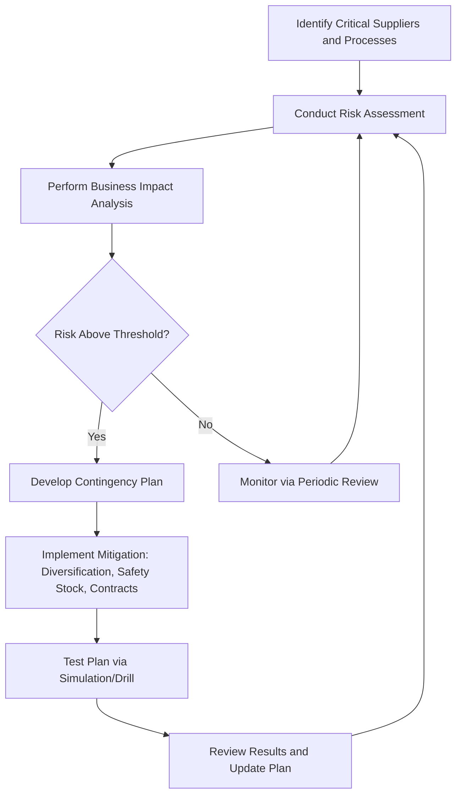

## Supply Chain and Organizational Resilience Planning

### Overview

Supply chain and organizational resilience planning within a Quality Management System (QMS) addresses the identification, evaluation, and mitigation of risks that threaten the continuity of supplier inputs, production processes, and organizational operations. This subject sits at the intersection of ISO 9001:2015 Clause 6.1 (Actions to Address Risks and Opportunities), ISO 22301 (Business Continuity Management Systems), and ISO 28000 (Supply Chain Security Management Systems). Effective resilience planning ensures that quality objectives remain achievable even under disruption conditions such as supplier failure, geopolitical instability, natural disasters, or systemic shocks.

### Regulatory and Standards Context

**Key Points**

- ISO 9001:2015 Clause 8.4 governs control of externally provided processes, products, and services — the primary QMS touchpoint for supply chain risk.
- ISO 22301:2019 provides the formal framework for Business Continuity Management Systems (BCMS), including Business Impact Analysis (BIA) and Business Continuity Plans (BCP).
- ISO 28000:2022 specifies requirements for a security management system for the supply chain, covering financing, manufacturing, and delivery through to end use.
- ISO 31000:2018 provides the overarching risk management principles and guidelines that supply chain resilience planning should be built upon.
- ISO/TS 22318 gives specific guidance for supply chain continuity, complementing ISO 22301.

These standards are not mutually exclusive; a mature QMS integrates elements of each rather than treating supply chain resilience as a standalone bolt-on.

### Core Components of Supply Chain Resilience Planning

#### 1. Supplier Risk Assessment

Organizations must classify suppliers by criticality, typically using a tiered model:

- **Tier 1 (Critical):** Single-source suppliers or those providing components with no viable substitute in the required timeframe.
- **Tier 2 (Important):** Suppliers with moderate switching costs or lead times.
- **Tier 3 (Standard):** Commodity suppliers with multiple viable alternatives.

A common quantitative approach uses a risk score combining probability of disruption ($P$) and impact severity ($I$):

$RiskScore = P \times I$

Where $P$ and $I$ are typically scored on a 1–5 scale, yielding a 1–25 risk matrix. Suppliers scoring above an organization-defined threshold (commonly $\geq 15$) require mandatory contingency plans.

#### 2. Business Impact Analysis (BIA)

BIA determines the operational and financial consequences of a supply chain disruption over time. Two critical metrics anchor this analysis:

- **Recovery Time Objective (RTO):** Maximum tolerable duration a process can be disrupted before unacceptable consequences occur.
- **Recovery Point Objective (RPO):** Maximum acceptable data or production loss measured in time.

The relationship between disruption duration and cumulative impact is often modeled as a non-linear escalation, since early-stage disruption costs (buffer stock depletion) differ structurally from late-stage costs (contract penalties, customer attrition, reputational damage).

#### 3. Supplier Diversification and Redundancy Strategies

**Key Points**

- **Geographic diversification:** Sourcing from suppliers across different regions to reduce correlated risk exposure (e.g., a single earthquake zone or single-country political risk).
- **Dual/multi-sourcing:** Maintaining qualified alternate suppliers for critical inputs, even at a cost premium, to preserve continuity.
- **Safety stock optimization:** Calculated buffer inventory based on demand variability and supplier lead-time variability, commonly using:

$$SS = Z \times \sigma_{LT} \times \bar{D}$$

Where $Z$ is the service-level factor (from the standard normal distribution), $\sigma_{LT}$ is the standard deviation of lead time, and $\bar{D}$ is average demand. [Inference: exact formula selection depends on whether demand, lead time, or both are treated as variable; organizations should validate against their specific demand-variability model.]

- **Vertical integration consideration:** For extremely critical inputs, organizations may evaluate bringing supply in-house, weighed against capital cost and loss of specialization benefits.

#### 4. Organizational Resilience Planning

Organizational resilience extends beyond supply inputs to encompass workforce continuity, IT/infrastructure resilience, and decision-making agility under stress.

- **Crisis governance structure:** Predefined roles (Incident Commander, Communications Lead, Operations Lead) activated during disruption events, avoiding ad hoc decision-making under pressure.
- **Cross-training and knowledge redundancy:** Reducing single-person-dependency risk (bus factor) for critical operational knowledge.
- **Scenario planning and stress testing:** Simulated disruption exercises (tabletop exercises, red-teaming) to validate BCP effectiveness before a real event.

### Process Flow: Supply Chain Resilience Planning Cycle

### Integration with QMS Documentation

**Example**

A conforming QMS typically documents supply chain resilience through:

1. **Supplier Evaluation Records** (ISO 9001 Clause 8.4.1) — criteria, scoring, and periodic reassessment evidence.
2. **Risk Register** (ISO 9001 Clause 6.1) — linking identified supply chain risks to specific mitigation actions and owners.
3. **Business Continuity Plan** (ISO 22301 Clause 8.4) — documented recovery strategies, RTO/RPO targets, and activation criteria.
4. **Management Review Inputs** (ISO 9001 Clause 9.3.2) — supply chain risk status reported to top management at defined intervals.

### Resilience Maturity Model (Illustrative)

<svg xmlns="http://www.w3.org/2000/svg" viewBox="0 0 760 320" font-family="sans-serif">
<text x="380" y="24" text-anchor="middle" font-size="16" font-weight="bold">Supply Chain Resilience Maturity Levels (svg_diagram)</text>
<rect x="40" y="60" width="150" height="200" fill="#f4d7d7" stroke="#333" />
<text x="115" y="90" text-anchor="middle" font-size="13" font-weight="bold">Level 1</text>
<text x="115" y="110" text-anchor="middle" font-size="11">Reactive</text>
<text x="115" y="140" text-anchor="middle" font-size="10">No formal risk</text>
<text x="115" y="155" text-anchor="middle" font-size="10">assessment;</text>
<text x="115" y="170" text-anchor="middle" font-size="10">crisis-driven</text>
<text x="115" y="185" text-anchor="middle" font-size="10">response only</text>
<rect x="205" y="60" width="150" height="200" fill="#f4e7c7" stroke="#333" />
<text x="280" y="90" text-anchor="middle" font-size="13" font-weight="bold">Level 2</text>
<text x="280" y="110" text-anchor="middle" font-size="11">Aware</text>
<text x="280" y="140" text-anchor="middle" font-size="10">Risk register</text>
<text x="280" y="155" text-anchor="middle" font-size="10">exists; limited</text>
<text x="280" y="170" text-anchor="middle" font-size="10">supplier</text>
<text x="280" y="185" text-anchor="middle" font-size="10">diversification</text>
<rect x="370" y="60" width="150" height="200" fill="#e2f0c7" stroke="#333" />
<text x="445" y="90" text-anchor="middle" font-size="13" font-weight="bold">Level 3</text>
<text x="445" y="110" text-anchor="middle" font-size="11">Managed</text>
<text x="445" y="140" text-anchor="middle" font-size="10">Formal BIA;</text>
<text x="445" y="155" text-anchor="middle" font-size="10">documented</text>
<text x="445" y="170" text-anchor="middle" font-size="10">BCP; periodic</text>
<text x="445" y="185" text-anchor="middle" font-size="10">review cycle</text>
<rect x="535" y="60" width="150" height="200" fill="#c7e8d5" stroke="#333" />
<text x="610" y="90" text-anchor="middle" font-size="13" font-weight="bold">Level 4</text>
<text x="610" y="110" text-anchor="middle" font-size="11">Resilient</text>
<text x="610" y="140" text-anchor="middle" font-size="10">Tested plans;</text>
<text x="610" y="155" text-anchor="middle" font-size="10">multi-sourcing;</text>
<text x="610" y="170" text-anchor="middle" font-size="10">integrated</text>
<text x="610" y="185" text-anchor="middle" font-size="10">crisis governance</text>
<line x1="40" y1="280" x2="685" y2="280" stroke="#333" stroke-width="2" marker-end="url(#arrow)" />
<text x="360" y="300" text-anchor="middle" font-size="11">Increasing Maturity →</text>
</svg>

### Common Pitfalls

- **Treating supplier audits as a checkbox exercise** rather than a genuine risk-discovery mechanism — audits conducted without follow-through on findings provide limited resilience value.
- **Ignoring Nth-tier suppliers:** Focusing only on direct (Tier 1) suppliers while ignoring their upstream dependencies (Tier 2/3), which is where many real-world disruptions (e.g., semiconductor shortages) actually originate.
- **Static risk registers:** Failing to update risk assessments as geopolitical, economic, or environmental conditions change; resilience planning is a continuous cycle, not a one-time exercise (Clause 6.1 requires ongoing review).
- **Cost-only sourcing decisions:** Optimizing purely for unit cost without factoring in disruption probability, which understates true total cost of ownership. [Inference: the magnitude of this understatement is context-dependent and varies significantly by industry and geography.]

### Audit Evidence Checklist

- Documented risk assessment methodology and criteria for supplier criticality classification
- Evidence of BIA completion for critical processes, including RTO/RPO definitions
- Business continuity/contingency plans for high-risk suppliers or processes
- Records of BCP testing (tabletop exercises, simulations) and corrective actions from test results
- Management review minutes referencing supply chain risk status
- Evidence of periodic reassessment (not a single static exercise)

**Next Steps**

- Business Continuity Management Systems (ISO 22301) — detailed clause structure
- Business Impact Analysis methodology and quantitative modeling
- Supplier Qualification and Auditing under ISO 9001 Clause 8.4
- Risk Assessment Techniques under ISO 31000
- Crisis Communication Planning
- Multi-Tier Supply Chain Mapping Techniques