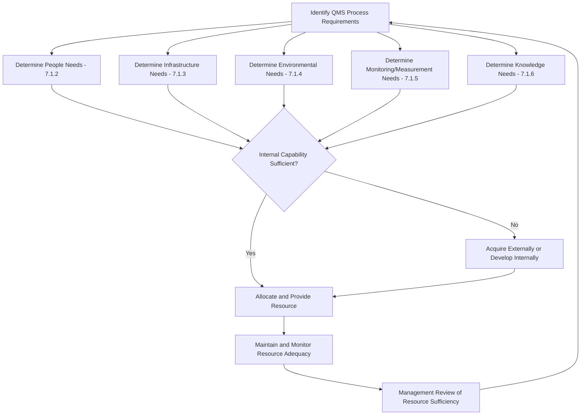

## Resource Management Overview

### Overview

Resource Management within a Quality Management System (QMS) is governed primarily by ISO 9001:2015 Clause 7 (Support), which mandates that organizations determine and provide the resources needed to establish, implement, maintain, and continually improve the QMS. Resources encompass people, infrastructure, environment for process operation, monitoring and measurement resources, and organizational knowledge. This is a foundational "support" clause — it underpins every other process in the standard, since inadequate resourcing is one of the most common root causes cited in nonconformity investigations.

### Standards Context

**Key Points**

- ISO 9001:2015 Clause 7.1 (Resources) is the core reference, subdivided into 7.1.1 through 7.1.6.
- ISO 9004:2018 provides supplementary guidance on sustained organizational success, including a broader resource-management philosophy beyond minimum compliance.
- ISO 10018:2020 addresses people engagement, relevant to Clause 7.1.2 (People) and 7.2 (Competence).
- ISO 30401:2018 (Knowledge Management Systems) provides detailed guidance relevant to Clause 7.1.6 (Organizational Knowledge).

### Clause 7.1 Subclauses

#### 7.1.1 General

The organization must determine and provide resources needed for the QMS, considering:

- The capabilities of, and constraints on, existing internal resources
- What needs to be obtained from external providers

This subclause establishes the "make vs. buy" decision framework for resourcing — an organization is not required to own every resource internally, provided external provision is controlled (linking to Clause 8.4).

#### 7.1.2 People

The organization must determine the persons necessary for effective implementation of the QMS and for operation and control of its processes. This is a headcount-and-role-sufficiency requirement, distinct from Clause 7.2 (Competence), which addresses whether those people are qualified — 7.1.2 asks "do we have enough people," 7.2 asks "are they capable."

#### 7.1.3 Infrastructure

Infrastructure includes:

- **Buildings and associated utilities** (workspace, power, HVAC)
- **Equipment**, including hardware and software
- **Transportation resources**
- **Information and communication technology**

**Example**

A manufacturing QMS audit trail for 7.1.3 typically includes an equipment maintenance schedule, calibration records, and IT infrastructure uptime/backup logs demonstrating the infrastructure is fit for maintaining product/service conformity.

#### 7.1.4 Environment for the Operation of Processes

This covers the combination of human and physical factors needed for process operation, such as:

- **Social factors:** non-discriminatory, calm, non-confrontational workplace culture
- **Psychological factors:** stress reduction, burnout prevention, emotional protection
- **Physical factors:** temperature, humidity, light, airflow, hygiene, noise

The inclusion of psychological and social factors in the 2015 revision represents a notable expansion over ISO 9001:2008, reflecting the recognition that a hostile or high-stress work environment can directly degrade process/output quality.

#### 7.1.5 Monitoring and Measuring Resources

Subdivided into two requirements:

- **7.1.5.1 General:** Resources must be suitable for the specific type of monitoring/measurement activity and maintained to ensure continuing fitness for purpose.
- **7.1.5.2 Measurement Traceability:** Where traceability is a requirement, measuring equipment shall be:
  - Calibrated/verified at specified intervals against measurement standards traceable to international or national standards (or the basis documented if no such standard exists)
  - Identified to determine calibration status
  - Safeguarded from adjustments, damage, or deterioration that would invalidate calibration status

This is the clause most frequently linked to physical calibration programs and metrology traceability chains in manufacturing and laboratory contexts.

#### 7.1.6 Organizational Knowledge

The organization must determine the knowledge necessary for process operation and to achieve conformity of products/services, and this knowledge must be maintained and made available as needed. When addressing changing needs, the organization must consider current knowledge and determine how to acquire/access necessary additional knowledge.

Organizational knowledge sources typically include:

- **Internal sources:** intellectual property, lessons learned, experience gained from successes/failures, undocumented knowledge/expertise of individuals ("tacit knowledge")
- **External sources:** standards, academia, conferences, customer/supplier knowledge

**Key Points**

- This is the clause most directly exposed to "key person risk" — where critical knowledge exists only in one individual's head with no documentation or transfer mechanism.
- A common audit finding is inadequate transfer mechanisms during staff turnover, retirement, or role transitions.

### Process Flow: Resource Determination and Provision

### Interfaces with Other QMS Clauses

Resource Management does not operate in isolation; it directly feeds into:

- **Clause 6 (Planning):** Resource needs identified during risk/opportunity planning and quality objective setting.
- **Clause 7.2 (Competence):** Once people resources are allocated, their competence must be established and evidenced.
- **Clause 8 (Operation):** Infrastructure and monitoring resources directly enable operational control (8.5.1) and control of monitoring/measuring resources (8.5.1(g), 8.6).
- **Clause 9.3 (Management Review):** Resource adequacy is an explicit management review input requirement (Clause 9.3.2(c)).

### Resource Category Relationship Diagram

<svg xmlns="http://www.w3.org/2000/svg" viewBox="0 0 700 380" font-family="sans-serif">
<text x="350" y="24" text-anchor="middle" font-size="16" font-weight="bold">Clause 7.1 Resource Categories (svg_diagram)</text>
<rect x="270" y="50" width="160" height="50" rx="8" fill="#d7e8f4" stroke="#333" />
<text x="350" y="80" text-anchor="middle" font-size="12" font-weight="bold">7.1 Resources</text>
<rect x="30" y="150" width="130" height="50" rx="6" fill="#f4e7c7" stroke="#333" />
<text x="95" y="180" text-anchor="middle" font-size="11">7.1.2 People</text>
<rect x="175" y="150" width="130" height="50" rx="6" fill="#f4e7c7" stroke="#333" />
<text x="240" y="175" text-anchor="middle" font-size="11">7.1.3</text>
<text x="240" y="190" text-anchor="middle" font-size="11">Infrastructure</text>
<rect x="320" y="150" width="130" height="50" rx="6" fill="#f4e7c7" stroke="#333" />
<text x="385" y="175" text-anchor="middle" font-size="11">7.1.4</text>
<text x="385" y="190" text-anchor="middle" font-size="11">Environment</text>
<rect x="465" y="150" width="130" height="50" rx="6" fill="#f4e7c7" stroke="#333" />
<text x="530" y="170" text-anchor="middle" font-size="11">7.1.5 Monitoring</text>
<text x="530" y="185" text-anchor="middle" font-size="11">and Measuring</text>
<rect x="240" y="250" width="220" height="50" rx="6" fill="#e2c7f4" stroke="#333" />
<text x="350" y="280" text-anchor="middle" font-size="11">7.1.6 Organizational Knowledge</text>
<line x1="350" y1="100" x2="95" y2="150" stroke="#333" />
<line x1="350" y1="100" x2="240" y2="150" stroke="#333" />
<line x1="350" y1="100" x2="385" y2="150" stroke="#333" />
<line x1="350" y1="100" x2="530" y2="150" stroke="#333" />
<line x1="350" y1="100" x2="350" y2="250" stroke="#333" stroke-dasharray="4,3" />

<text x="350" y="340" text-anchor="middle" font-size="10" fill="#555">Dashed line: knowledge underpins all other resource categories</text>

</svg>

### Common Pitfalls

- **Conflating 7.1.2 (adequate headcount) with 7.2 (competence):** Auditors will probe both separately — having enough people is not the same as having the right people.
- **Neglecting psychological/social environment factors:** Many organizations document physical environment controls (temperature, cleanliness) but overlook the explicit 7.1.4 requirement to address workplace stress and social climate.
- **Calibration gaps:** Failing to maintain traceable calibration records, or using measuring equipment past its calibration due date, is among the most common Clause 7.1.5 nonconformities in certification audits.
- **Undocumented tacit knowledge:** Relying on informal, undocumented expertise without a knowledge-capture or succession mechanism, creating vulnerability when key personnel depart.

### Audit Evidence Checklist

- Staffing plans or organizational charts demonstrating role coverage against process needs
- Infrastructure maintenance records, IT asset inventories, equipment logs
- Evidence addressing workplace environment (climate surveys, ergonomic assessments, policies on workplace conduct)
- Calibration certificates and traceability records for measuring equipment
- Documented knowledge repositories, lessons-learned logs, or knowledge-transfer procedures (e.g., mentorship, exit interviews, documentation standards)
- Management review records showing resource adequacy was discussed as an input

**Next Steps**

- Clause 7.2 Competence and Clause 7.3 Awareness
- Clause 7.4 Communication requirements
- Clause 7.5 Documented Information
- Calibration and Measurement Traceability Systems (ISO 17025 linkage)
- Organizational Knowledge Management (ISO 30401)
- Succession Planning and Key-Person Risk Mitigation