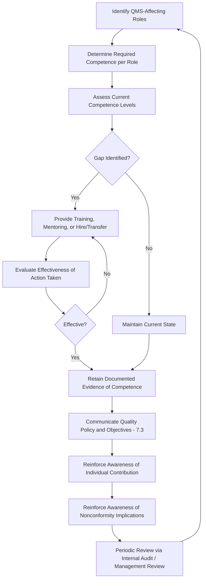

## People Competence and Awareness

### Overview

Competence and Awareness are governed by ISO 9001:2015 Clauses 7.2 (Competence) and 7.3 (Awareness), positioned within the Support (Clause 7) section of the standard. While Clause 7.1.2 establishes that the organization has *enough* people, Clauses 7.2 and 7.3 establish that those people are *capable* and *conscious* of their role in the QMS. These two clauses are conceptually distinct but operationally intertwined: competence concerns demonstrated ability, while awareness concerns understanding of context, contribution, and consequences.

### Standards Context

**Key Points**

- ISO 9001:2015 Clause 7.2 (Competence) and Clause 7.3 (Awareness) are the primary references.
- ISO 10015:2019 (Quality Management — Guidelines for Competence Management and People Development) provides detailed methodology for competence needs analysis, development, and evaluation.
- ISO 10018:2020 (Quality Management — People Engagement) supplements awareness requirements with engagement-focused guidance.

### Clause 7.2: Competence

The organization must:

1. **Determine necessary competence** of persons doing work under its control that affects QMS performance and effectiveness.
2. **Ensure competence** on the basis of appropriate education, training, or experience.
3. **Take actions** to acquire necessary competence, and evaluate the effectiveness of those actions.
4. **Retain documented information** as evidence of competence.

#### Competence Determination Approaches

- **Role-based competence matrices:** Mapping required skills/qualifications against each job role or process ownership.
- **Gap analysis:** Comparing current demonstrated competence against required competence to identify training needs.
- **Competence acquisition routes:** Formal education, on-the-job training, mentoring, certification programs, or hiring/transfer of already-competent personnel.

**Example**

A typical competence record set includes: job descriptions with defined competency requirements, training records (attendance, completion, assessment scores), certifications/licenses on file, and performance evaluation records tied to process outcomes.

#### Evaluating Effectiveness of Competence Actions

A common audit gap is that organizations conduct training but never evaluate whether it *worked*. Effectiveness evaluation can include:

- Post-training assessments or competency tests
- On-the-job performance observation
- Reduction in process nonconformities attributable to the trained skill area
- Supervisor sign-off against defined competency criteria

[Inference: the specific effectiveness-evaluation method chosen is context-dependent, and ISO 9001 does not mandate a specific technique — only that effectiveness be evaluated in some documented, defensible way.]

### Clause 7.3: Awareness

Persons doing work under the organization's control must be aware of:

- (a) **The quality policy**
- (b) **Relevant quality objectives**
- (c) **Their contribution to the effectiveness of the QMS**, including the benefits of improved performance
- (d) **The implications of not conforming** with QMS requirements

Awareness is broader than competence — it does not require deep technical skill, but requires that personnel understand *why* their work matters and what happens when it goes wrong. A machine operator, for instance, may be fully competent at operating equipment (7.2) but still lack awareness (7.3) of how a defect they produce could ultimately compromise customer safety or contractual conformity.

#### Distinguishing Competence from Awareness

| Aspect | Competence (7.2) | Awareness (7.3) |
| --- | --- | --- |
| Focus | Ability to perform | Understanding of context and consequence |
| Evidence | Certifications, training records, skill assessments | Communication records, induction records, interview evidence during audits |
| Failure mode | Cannot perform the task correctly | Performs the task but doesn't understand its significance |
| Typical verification method | Skills test, performance review | Interview/observation during audit, policy acknowledgment records |

### Process Flow: Competence and Awareness Management Cycle

### Competence-Awareness Interaction Model

<svg xmlns="http://www.w3.org/2000/svg" viewBox="0 0 700 340" font-family="sans-serif">
<text x="350" y="24" text-anchor="middle" font-size="16" font-weight="bold">Competence vs Awareness Quadrant (svg_diagram)</text>
<line x1="80" y1="280" x2="620" y2="280" stroke="#333" stroke-width="1.5" />
<line x1="80" y1="280" x2="80" y2="60" stroke="#333" stroke-width="1.5" />
<text x="350" y="310" text-anchor="middle" font-size="12">Competence →</text>
<text x="40" y="170" text-anchor="middle" font-size="12" transform="rotate(-90 40 170)">Awareness →</text>
<rect x="90" y="180" width="240" height="90" fill="#f4d7d7" stroke="#333" opacity="0.8" />
<text x="210" y="215" text-anchor="middle" font-size="11" font-weight="bold">Low Competence</text>
<text x="210" y="230" text-anchor="middle" font-size="11" font-weight="bold">Low Awareness</text>
<text x="210" y="250" text-anchor="middle" font-size="10">Highest risk zone —</text>
<text x="210" y="263" text-anchor="middle" font-size="10">priority for intervention</text>
<rect x="340" y="180" width="270" height="90" fill="#f4e7c7" stroke="#333" opacity="0.8" />
<text x="475" y="215" text-anchor="middle" font-size="11" font-weight="bold">High Competence</text>
<text x="475" y="230" text-anchor="middle" font-size="11" font-weight="bold">Low Awareness</text>
<text x="475" y="250" text-anchor="middle" font-size="10">Skilled but disengaged —</text>
<text x="475" y="263" text-anchor="middle" font-size="10">address via 7.3 communication</text>
<rect x="90" y="80" width="240" height="90" fill="#f4e7c7" stroke="#333" opacity="0.8" />
<text x="210" y="115" text-anchor="middle" font-size="11" font-weight="bold">Low Competence</text>
<text x="210" y="130" text-anchor="middle" font-size="11" font-weight="bold">High Awareness</text>
<text x="210" y="150" text-anchor="middle" font-size="10">Engaged but under-skilled —</text>
<text x="210" y="163" text-anchor="middle" font-size="10">address via 7.2 training</text>
<rect x="340" y="80" width="270" height="90" fill="#c7e8d5" stroke="#333" opacity="0.8" />
<text x="475" y="115" text-anchor="middle" font-size="11" font-weight="bold">High Competence</text>
<text x="475" y="130" text-anchor="middle" font-size="11" font-weight="bold">High Awareness</text>
<text x="475" y="150" text-anchor="middle" font-size="10">Target state —</text>
<text x="475" y="163" text-anchor="middle" font-size="10">maintain via periodic reinforcement</text>
</svg>

### Interfaces with Other QMS Clauses

- **Clause 5.1/5.2 (Leadership, Policy):** The quality policy that must be communicated for awareness (7.3(a)) originates from top management's leadership commitment.
- **Clause 6.2 (Quality Objectives):** Objectives that personnel must be aware of (7.3(b)) are established under this clause.
- **Clause 7.1.2 (People):** Establishes sufficiency of headcount; 7.2 builds on this by establishing capability of that headcount.
- **Clause 9.2 (Internal Audit):** Auditors routinely verify awareness through direct interview — asking shop-floor personnel to state the quality policy or explain the consequence of a specific nonconformity in their process.
- **Clause 10.2 (Nonconformity and Corrective Action):** A recurring nonconformity's root cause frequently traces back to a 7.2 (competence) or 7.3 (awareness) gap.

### Common Pitfalls

- **Training without effectiveness evaluation:** Delivering training and filing an attendance sheet without verifying the training actually produced competence — a frequent audit finding.
- **Confusing awareness with training:** Treating a policy poster on the wall or a one-time induction session as sufficient evidence of ongoing awareness, when auditors typically probe current, active understanding via interview.
- **Static competence matrices:** Failing to update required competencies when processes, technology, or regulatory requirements change, leaving the competence framework misaligned with actual job demands.
- **Overlooking experience as a valid competence basis:** Clause 7.2 explicitly allows education, training, *or* experience — some organizations mistakenly require formal certification for every role, over-documenting relative to standard requirements.

### Audit Evidence Checklist

- Competence matrices or role-based skill requirement documents
- Training records (plans, attendance, assessment results, certifications)
- Evidence of effectiveness evaluation following training interventions
- Quality policy communication records (postings, briefings, induction materials, intranet distribution)
- Objective-setting cascade documentation linking organizational objectives to role-level awareness
- Internal audit interview notes demonstrating personnel could articulate policy, objectives, their contribution, and nonconformity consequences

**Next Steps**

- Clause 7.4 Communication Requirements
- Clause 7.5 Documented Information
- Training Needs Analysis Methodology (ISO 10015)
- Internal Audit Techniques for Verifying Awareness
- Root Cause Analysis Linking Nonconformities to Competence Gaps
- Employee Engagement Frameworks (ISO 10018)