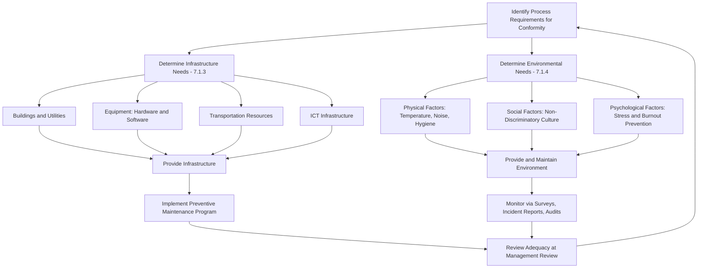

## Infrastructure and Work Environment

### Overview

Infrastructure and Work Environment are governed by ISO 9001:2015 Clauses 7.1.3 (Infrastructure) and 7.1.4 (Environment for the Operation of Processes), both nested within the Resources subclause of Support (Clause 7). While these two subclauses were touched on briefly under Resource Management, this item treats them as a dedicated deep-dive: infrastructure concerns the physical and technological assets required to achieve conformity, while work environment concerns the human and physical conditions surrounding those assets that influence process performance.

### Standards Context

**Key Points**

- ISO 9001:2015 Clause 7.1.3 (Infrastructure) and Clause 7.1.4 (Environment for the Operation of Processes) are the primary references.
- ISO 45001:2018 (Occupational Health and Safety Management Systems) intersects heavily with 7.1.4's physical and psychological factors, though it is a separate management system standard.
- ISO 14001:2015 (Environmental Management Systems) intersects with infrastructure decisions where facilities/equipment have environmental impact.
- ISO/IEC 27001 becomes relevant where "information and communication technology" infrastructure (7.1.3) carries information security implications.

### Clause 7.1.3: Infrastructure

The organization must determine, provide, and maintain the infrastructure necessary for the operation of its processes and to achieve conformity of products and services.

#### Infrastructure Categories (per ISO 9001:2015, Note to 7.1.3)

- **(a) Buildings and associated utilities** — facility structures, power supply, water, HVAC systems.
- **(b) Equipment, including hardware and software** — production machinery, testing equipment, IT hardware, and the software that runs on it.
- **(c) Transportation resources** — vehicles or logistics assets used for internal movement or delivery of product/materials.
- **(d) Information and communication technology (ICT)** — networks, servers, communication systems supporting process operation.

**Example**

For a software development organization, infrastructure evidence typically includes: version control systems, CI/CD pipeline uptime records, development/staging/production environment specifications, and IT asset management records — a markedly different profile from a manufacturing plant's machinery calibration logs, but conceptually the same clause requirement.

#### Infrastructure Maintenance Obligations

The clause requires not just *provision* but *maintenance* of infrastructure — meaning a preventive maintenance program, not merely reactive repair, is generally expected to demonstrate sustained fitness for purpose. This links directly to Clause 8.5.1(e) (control of production and service provision), which requires implementation of actions to prevent human error, and to Clause 7.1.5 for measurement-specific equipment.

### Clause 7.1.4: Environment for the Operation of Processes

The organization must determine, provide, and maintain the environment necessary for the operation of its processes and to achieve conformity of products and services. The standard explicitly notes this can be a combination of human and physical factors.

#### Human Factors

- **Social:** non-discriminatory, calm, non-confrontational workplace culture
- **Psychological:** stress-reducing, burnout-prevention, emotionally protective conditions, and preventive measures against psychological exhaustion
- **Physical:** temperature, heat, humidity, light, airflow, hygiene, noise

#### Physical Factors (facility/process-oriented)

- Cleanroom classifications for pharmaceutical/electronics manufacturing
- Static-control environments for electronics assembly
- Ambient conditions affecting product stability (temperature-controlled storage, humidity-controlled processes)

**Key Points**

- The 2015 revision of ISO 9001 explicitly added psychological and social factors — this was a deliberate expansion beyond the 2008 version's narrower physical-environment focus, reflecting evidence that workplace stress and toxic culture measurably degrade process outcomes and error rates.
- The applicability of specific environmental factors is process-dependent: a call center's environmental needs (noise control, ergonomic seating, psychological factors around customer-facing stress) differ substantially from a semiconductor fabrication facility's needs (particulate control, static discharge prevention, temperature/humidity precision).

### Process Flow: Infrastructure and Environment Determination

### Infrastructure and Environment Category Map

<svg xmlns="http://www.w3.org/2000/svg" viewBox="0 0 720 360" font-family="sans-serif">
<text x="360" y="24" text-anchor="middle" font-size="16" font-weight="bold">Clause 7.1.3 / 7.1.4 Category Map (svg_diagram)</text>
<rect x="60" y="55" width="260" height="30" rx="6" fill="#d7e8f4" stroke="#333" />
<text x="190" y="75" text-anchor="middle" font-size="12" font-weight="bold">7.1.3 Infrastructure</text>
<rect x="400" y="55" width="260" height="30" rx="6" fill="#f4d7e8" stroke="#333" />
<text x="530" y="75" text-anchor="middle" font-size="12" font-weight="bold">7.1.4 Work Environment</text>
<rect x="40" y="110" width="120" height="45" rx="4" fill="#eaf3fb" stroke="#333" />
<text x="100" y="130" text-anchor="middle" font-size="10">Buildings and</text>
<text x="100" y="143" text-anchor="middle" font-size="10">Utilities</text>
<rect x="170" y="110" width="120" height="45" rx="4" fill="#eaf3fb" stroke="#333" />
<text x="230" y="130" text-anchor="middle" font-size="10">Equipment</text>
<text x="230" y="143" text-anchor="middle" font-size="10">(HW / SW)</text>
<rect x="40" y="165" width="120" height="45" rx="4" fill="#eaf3fb" stroke="#333" />
<text x="100" y="185" text-anchor="middle" font-size="10">Transportation</text>
<text x="100" y="198" text-anchor="middle" font-size="10">Resources</text>
<rect x="170" y="165" width="120" height="45" rx="4" fill="#eaf3fb" stroke="#333" />
<text x="230" y="185" text-anchor="middle" font-size="10">ICT</text>
<text x="230" y="198" text-anchor="middle" font-size="10">Infrastructure</text>
<rect x="400" y="110" width="120" height="45" rx="4" fill="#fbeaf3" stroke="#333" />
<text x="460" y="130" text-anchor="middle" font-size="10">Physical</text>
<text x="460" y="143" text-anchor="middle" font-size="10">(temp, noise, light)</text>
<rect x="530" y="110" width="120" height="45" rx="4" fill="#fbeaf3" stroke="#333" />
<text x="590" y="130" text-anchor="middle" font-size="10">Social</text>
<text x="590" y="143" text-anchor="middle" font-size="10">(culture, conduct)</text>
<rect x="465" y="165" width="120" height="45" rx="4" fill="#fbeaf3" stroke="#333" />
<text x="525" y="185" text-anchor="middle" font-size="10">Psychological</text>
<text x="525" y="198" text-anchor="middle" font-size="10">(stress, burnout)</text>
<line x1="190" y1="85" x2="100" y2="110" stroke="#333" />
<line x1="190" y1="85" x2="230" y2="110" stroke="#333" />
<line x1="190" y1="85" x2="100" y2="165" stroke="#333" />
<line x1="190" y1="85" x2="230" y2="165" stroke="#333" />
<line x1="530" y1="85" x2="460" y2="110" stroke="#333" />
<line x1="530" y1="85" x2="590" y2="110" stroke="#333" />
<line x1="530" y1="85" x2="525" y2="165" stroke="#333" />
<rect x="220" y="250" width="280" height="70" rx="6" fill="#f4f0c7" stroke="#333" />
<text x="360" y="275" text-anchor="middle" font-size="11" font-weight="bold">Shared Outcome</text>
<text x="360" y="295" text-anchor="middle" font-size="10">Conditions enabling conformity of</text>
<text x="360" y="308" text-anchor="middle" font-size="10">products/services and QMS effectiveness</text>
<line x1="190" y1="210" x2="330" y2="250" stroke="#333" stroke-dasharray="4,3" />
<line x1="530" y1="210" x2="400" y2="250" stroke="#333" stroke-dasharray="4,3" />
</svg>

### Interfaces with Other QMS Clauses

- **Clause 7.1.5 (Monitoring and Measuring Resources):** Overlaps with infrastructure where measuring equipment is itself classified as infrastructure requiring maintenance and calibration.
- **Clause 8.1 (Operational Planning and Control):** Determines the infrastructure and environment needed for specific product/service realization processes.
- **Clause 8.5.1 (Control of Production and Service Provision):** Requires availability of suitable infrastructure and environment for operational control.
- **Clause 6.1 (Risk and Opportunities):** Infrastructure failure modes (equipment breakdown, IT outage) are often addressed as risks requiring contingency planning, linking to resilience planning.
- **Clause 9.1.3 / 9.3 (Analysis and Management Review):** Infrastructure adequacy and environmental incidents are typical inputs to management review.

### Common Pitfalls

- **Treating 7.1.4 as physical-only:** Documenting HVAC and lighting specifications while omitting any evidence addressing psychological or social environment factors, which auditors increasingly probe given the explicit 2015 wording.
- **Reactive-only maintenance:** Maintaining infrastructure only after failure rather than operating a preventive maintenance schedule, undermining the "maintain" obligation in 7.1.3.
- **Software/ICT blind spot:** Focusing infrastructure documentation on physical equipment while neglecting that ICT and software explicitly fall within scope — version control, system uptime, and cybersecurity posture are legitimate 7.1.3 evidence.
- **No linkage between environment and process outcome data:** Failing to correlate environmental conditions (e.g., temperature excursions, high-stress periods) with quality incident spikes, missing an opportunity for data-driven environment control decisions.

### Audit Evidence Checklist

- Facility maintenance schedules and completion records (preventive and corrective)
- Equipment inventories with maintenance/calibration status
- IT infrastructure documentation: network diagrams, backup/recovery procedures, uptime logs
- Environmental monitoring records (temperature/humidity logs where process-relevant)
- Workplace culture/climate evidence: employee surveys, grievance/incident logs, anti-discrimination policies
- Psychological safety initiatives: workload management policies, burnout-prevention programs, stress-related incident tracking
- Management review records addressing infrastructure and environment adequacy

**Next Steps**

- Clause 7.1.5 Monitoring and Measuring Resources (Calibration Deep-Dive)
- Preventive Maintenance Program Design
- Occupational Health and Safety Integration (ISO 45001)
- Environmental Management Integration (ISO 14001)
- Workplace Psychological Safety Frameworks
- IT Infrastructure Controls and Information Security (ISO/IEC 27001)