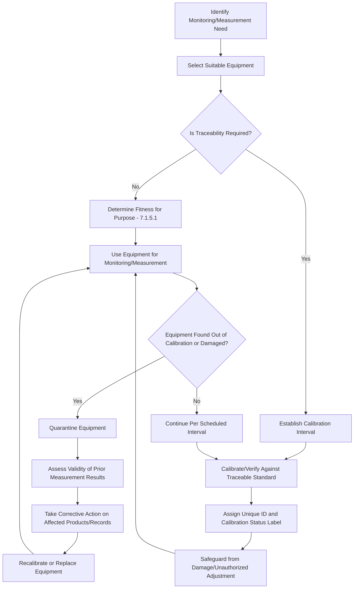

## Monitoring and Measuring Resources

### Overview

Monitoring and Measuring Resources are governed by ISO 9001:2015 Clause 7.1.5, comprising two subclauses: 7.1.5.1 (General) and 7.1.5.2 (Measurement Traceability). This clause establishes the requirements for the tools, instruments, and equipment used to verify conformity of products and services, and forms the metrological backbone connecting the QMS to objective, defensible evidence. While previously introduced under Resource Management as one of several resource categories, this item provides the dedicated technical depth this subclause warrants, particularly around calibration and traceability.

### Standards Context

**Key Points**

- ISO 9001:2015 Clause 7.1.5.1 and 7.1.5.2 are the primary references.
- ISO/IEC 17025:2017 (General Requirements for the Competence of Testing and Calibration Laboratories) is the authoritative reference for calibration laboratory competence, frequently invoked when an organization uses external calibration providers.
- ISO 10012:2003 (Measurement Management Systems) provides detailed requirements for measurement processes and measuring equipment, often used as supplementary guidance for organizations with extensive metrology needs.
- The International Vocabulary of Metrology (VIM, JCGM 200:2012) defines the formal terminology (traceability, calibration, measurement uncertainty) referenced across these standards.

### Clause 7.1.5.1: General

The organization must determine and provide the resources needed to ensure valid and reliable results when monitoring or measuring is used to verify conformity of products and services. Two core obligations follow:

1. **Suitability:** Resources provided must be suitable for the specific type of monitoring and measurement activities being undertaken.
2. **Maintenance:** Resources must be maintained to ensure their continuing fitness for their purpose.

The organization must retain appropriate documented information as evidence of fitness for purpose of the monitoring and measurement resources.

**Example**

A suitability determination might involve confirming that a caliper with $\pm 0.01\text{mm}$ resolution is adequate for a tolerance specification of $\pm 0.1\text{mm}$ — the measurement resource's resolution and accuracy must be appropriate relative to the tolerance being verified, not merely "present."

### Clause 7.1.5.2: Measurement Traceability

This subclause applies specifically **where measurement traceability is a requirement**, whether that requirement comes from a customer, regulator, or the organization's own determination that it is an essential part of providing confidence in the validity of measurement results.

When applicable, measuring equipment shall be:

- **(a) Calibrated or verified, or both, at specified intervals, or prior to use**, against measurement standards traceable to international or national measurement standards. Where no such standards exist, the basis used for calibration or verification shall be retained as documented information.
- **(b) Identified** in order to determine their calibration status.
- **(c) Safeguarded from adjustments, damage, or deterioration** that would invalidate the calibration status and subsequent measurement results.

The standard further requires that the organization determine if the validity of previous measurement results has been adversely affected when equipment is found to be unfit for its intended purpose, and take appropriate action as necessary.

#### Traceability Chain Concept

Measurement traceability refers to the property of a measurement result whereby it can be related to a reference through a documented, unbroken chain of calibrations, each contributing to measurement uncertainty. This typically flows:

$$\text{Working Instrument} \rightarrow \text{Reference Standard} \rightarrow \text{National Metrology Institute} \rightarrow \text{International (SI) Standard}$$

Each link in the chain carries an associated **measurement uncertainty**, and the cumulative uncertainty compounds up the chain — meaning a working instrument's stated accuracy is only as reliable as the weakest link in its traceability chain.

### Calibration vs. Verification: A Key Distinction

**Key Points**

- **Calibration** establishes the relationship between the values indicated by an instrument and the corresponding values realized by standards, typically producing a calibration certificate with measured deviations and associated uncertainty — it does not by itself adjust or "correct" the instrument.
- **Verification** confirms that a given item fulfills specified requirements (e.g., checking a scale against a known reference mass to confirm it reads within tolerance), often simpler and faster than full calibration.
- Clause 7.1.5.2(a) explicitly allows "calibrated or verified, or both" — the organization determines which is appropriate based on risk and criticality, provided the rationale is defensible.

### Process Flow: Measuring Equipment Control Cycle

### Traceability Chain Diagram

<svg xmlns="http://www.w3.org/2000/svg" viewBox="0 0 700 360" font-family="sans-serif">
<text x="350" y="24" text-anchor="middle" font-size="16" font-weight="bold">Measurement Traceability Chain (svg_diagram)</text>
<rect x="270" y="50" width="160" height="45" rx="6" fill="#c7e8d5" stroke="#333" />
<text x="350" y="78" text-anchor="middle" font-size="11" font-weight="bold">SI / International Standard</text>
<line x1="350" y1="95" x2="350" y2="130" stroke="#333" marker-end="url(#arr)" />
<rect x="245" y="130" width="210" height="45" rx="6" fill="#d7e8f4" stroke="#333" />
<text x="350" y="158" text-anchor="middle" font-size="11" font-weight="bold">National Metrology Institute</text>
<line x1="350" y1="175" x2="350" y2="210" stroke="#333" marker-end="url(#arr)" />
<rect x="230" y="210" width="240" height="45" rx="6" fill="#f4e7c7" stroke="#333" />
<text x="350" y="238" text-anchor="middle" font-size="11" font-weight="bold">Reference/Secondary Standard</text>
<line x1="350" y1="255" x2="350" y2="290" stroke="#333" marker-end="url(#arr)" />
<rect x="215" y="290" width="270" height="45" rx="6" fill="#f4d7e8" stroke="#333" />
<text x="350" y="318" text-anchor="middle" font-size="11" font-weight="bold">Working Instrument (Shop Floor)</text>

<text x="500" y="105" font-size="9" fill="#555">Uncertainty accumulates</text>

<text x="500" y="120" font-size="9" fill="#555">at each link downward</text>

<line x1="490" y1="100" x2="490" y2="320" stroke="#999" stroke-dasharray="3,3" />

</svg>

### Interfaces with Other QMS Clauses

- **Clause 7.1.3 (Infrastructure):** Measuring equipment is itself infrastructure, and 7.1.5 provides the specific control regime applicable to that subset of infrastructure.
- **Clause 8.5.1(g) (Control of Production and Service Provision):** Requires implementation of monitoring and measurement resources at appropriate stages to verify criteria for control of processes/outputs have been met.
- **Clause 8.6 (Release of Products and Services):** Verification that product/service requirements have been met typically relies directly on calibrated measurement resources.
- **Clause 8.7 / 10.2 (Nonconforming Outputs / Corrective Action):** When equipment is found out of calibration, the required assessment of "previous measurement results" validity directly feeds nonconformity and corrective action processes.
- **Clause 9.1.1 (Monitoring, Measurement, Analysis, and Evaluation):** Broader process performance monitoring depends on the validity of the underlying measurement resources established here.

### Common Pitfalls

- **Treating all equipment as requiring formal calibration:** Applying calibration overhead uniformly regardless of whether measurement traceability is actually a stated requirement, resulting in wasted resources on immaterial measurements.
- **No retroactive impact assessment:** Recalibrating an out-of-tolerance instrument without assessing whether prior measurements/products released using that instrument are still valid — this is an explicit, often-missed obligation.
- **Inadequate identification/status labeling:** Failing to visibly indicate calibration status (e.g., color-coded labels, due-date stickers) on physical instruments, making it difficult to verify compliance during spot audits.
- **Unsafeguarded equipment:** Allowing unauthorized personnel to adjust calibrated instruments, invalidating calibration status without any formal record of the change.
- **Confusing "verified" with "calibrated" in documentation:** Using the terms interchangeably in records when the distinction matters for demonstrating an appropriate, risk-based rationale.

### Audit Evidence Checklist

- Equipment master list/register identifying all monitoring and measuring resources
- Calibration certificates showing traceability to national/international standards, or documented basis where no such standard exists
- Calibration status identification system (labels, tags, or equivalent) on physical equipment
- Calibration interval justification (risk-based or manufacturer-recommended)
- Records of out-of-tolerance findings and resulting impact assessments/corrective actions
- Procedures governing handling, storage, and protection of measuring equipment from damage or unauthorized adjustment
- Evidence of "fitness for purpose" determination for non-traceability-required monitoring resources (7.1.5.1)

**Next Steps**

- ISO/IEC 17025 Calibration Laboratory Requirements
- Measurement Uncertainty Calculation Methods
- Gauge Repeatability and Reproducibility (Gage R&R) Studies
- Clause 8.6 Release of Products and Services
- Clause 8.7 Control of Nonconforming Outputs
- Measurement Systems Analysis (MSA) Methodology