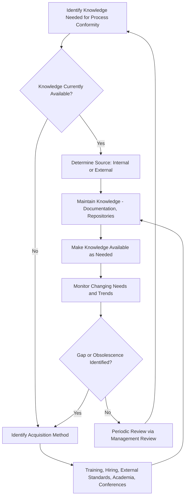

## Organizational Knowledge Management

### Overview

Organizational Knowledge Management is governed by ISO 9001:2015 Clause 7.1.6, the final subclause within Resources (Clause 7.1). It was one of the genuinely new additions in the 2015 revision — no direct equivalent existed in ISO 9001:2008 — reflecting growing recognition that an organization's accumulated experience, intellectual property, and lessons learned constitute a critical resource that, left unmanaged, represents significant operational risk. This item provides dedicated depth beyond the brief treatment given under the general Resource Management overview.

### Standards Context

**Key Points**

- ISO 9001:2015 Clause 7.1.6 (Organizational Knowledge) is the primary reference.
- ISO 30401:2018 (Knowledge Management Systems — Requirements) is the dedicated management-system standard for knowledge management and provides substantially more implementation detail than the brief ISO 9001 clause.
- ISO 9004:2018 discusses knowledge as an element of sustained organizational success in its broader guidance on self-assessment and improvement.

### Clause 7.1.6: Requirements

The organization must determine the knowledge necessary for the operation of its processes and to achieve conformity of products and services. This knowledge shall be maintained and made available to the extent necessary.

When addressing changing needs and trends, the organization must consider its current knowledge and determine how to acquire or access any necessary additional knowledge and required updates.

**Notes to the clause** (informative, not mandatory requirements themselves) identify two knowledge source categories:

#### Internal Sources

- Intellectual property
- Knowledge gained from experience
- Lessons learned from failures and successful projects
- Capturing and sharing undocumented knowledge and expertise ("tacit knowledge")
- Results of improvements in processes, products, and services

#### External Sources

- Standards
- Academia
- Conferences
- Gathering knowledge from customers or external providers

### Tacit vs. Explicit Knowledge

**Key Points**

- **Explicit knowledge** is documented, codified, and readily transferable — procedures, specifications, drawings, databases, recorded lessons-learned logs.
- **Tacit knowledge** is experiential, contextual, and held informally by individuals — the "feel" an experienced operator has for when a machine is about to fail, or a project manager's intuition for which suppliers are reliable under pressure.
- Clause 7.1.6 explicitly calls out capturing tacit knowledge as a named internal source, acknowledging that a significant portion of organizational capability is not written down anywhere.

**Example**

A common knowledge-capture mechanism for tacit knowledge is structured exit interviews combined with shadowing/handover periods before a critical role transition, paired with a lessons-learned repository that captures not just *what* happened on a project but *why* certain decisions were made.

### Knowledge Risk: The "Key Person" Problem

Organizational knowledge concentrated in a single individual, with no documentation or transfer mechanism, creates a severe single point of failure. This risk manifests when:

- A subject-matter expert retires, resigns, or is unexpectedly unavailable
- Institutional knowledge about *why* a process was designed a certain way is lost, leading to future "reinventing the wheel" or repeating past mistakes
- Undocumented workarounds or tribal knowledge become invisible dependencies in critical processes

[Inference: the severity of key-person risk is organization-specific and depends on role criticality, documentation culture, and workforce turnover rates; ISO 9001 does not prescribe a specific risk threshold.]

### Process Flow: Organizational Knowledge Management Cycle

### Knowledge Source and Flow Map

<svg xmlns="http://www.w3.org/2000/svg" viewBox="0 0 720 380" font-family="sans-serif">
<text x="360" y="24" text-anchor="middle" font-size="16" font-weight="bold">Organizational Knowledge Sources (svg_diagram)</text>
<rect x="260" y="50" width="200" height="45" rx="8" fill="#e2c7f4" stroke="#333" />
<text x="360" y="78" text-anchor="middle" font-size="12" font-weight="bold">7.1.6 Knowledge Base</text>
<rect x="40" y="140" width="280" height="30" rx="4" fill="#d7e8f4" stroke="#333" />
<text x="180" y="160" text-anchor="middle" font-size="11" font-weight="bold">Internal Sources</text>
<rect x="400" y="140" width="280" height="30" rx="4" fill="#f4e7c7" stroke="#333" />
<text x="540" y="160" text-anchor="middle" font-size="11" font-weight="bold">External Sources</text>
<rect x="40" y="185" width="130" height="40" rx="3" fill="#eaf3fb" stroke="#333" />
<text x="105" y="203" text-anchor="middle" font-size="9">Intellectual</text>
<text x="105" y="215" text-anchor="middle" font-size="9">Property</text>
<rect x="190" y="185" width="130" height="40" rx="3" fill="#eaf3fb" stroke="#333" />
<text x="255" y="203" text-anchor="middle" font-size="9">Lessons Learned</text>
<text x="255" y="215" text-anchor="middle" font-size="9">(Success/Failure)</text>
<rect x="40" y="235" width="130" height="40" rx="3" fill="#eaf3fb" stroke="#333" />
<text x="105" y="253" text-anchor="middle" font-size="9">Tacit Knowledge</text>
<text x="105" y="265" text-anchor="middle" font-size="9">(Individual Expertise)</text>
<rect x="190" y="235" width="130" height="40" rx="3" fill="#eaf3fb" stroke="#333" />
<text x="255" y="253" text-anchor="middle" font-size="9">Process</text>
<text x="255" y="265" text-anchor="middle" font-size="9">Improvement Results</text>
<rect x="400" y="185" width="130" height="40" rx="3" fill="#fbf3d7" stroke="#333" />
<text x="465" y="203" text-anchor="middle" font-size="9">Standards</text>
<rect x="550" y="185" width="130" height="40" rx="3" fill="#fbf3d7" stroke="#333" />
<text x="615" y="203" text-anchor="middle" font-size="9">Academia /</text>
<text x="615" y="215" text-anchor="middle" font-size="9">Conferences</text>
<rect x="475" y="235" width="130" height="40" rx="3" fill="#fbf3d7" stroke="#333" />
<text x="540" y="253" text-anchor="middle" font-size="9">Customers /</text>
<text x="540" y="265" text-anchor="middle" font-size="9">External Providers</text>
<line x1="360" y1="95" x2="180" y2="140" stroke="#333" />
<line x1="360" y1="95" x2="540" y2="140" stroke="#333" />
<rect x="200" y="310" width="320" height="50" rx="6" fill="#c7e8d5" stroke="#333" />
<text x="360" y="330" text-anchor="middle" font-size="10" font-weight="bold">Maintained and Made Available</text>
<text x="360" y="346" text-anchor="middle" font-size="9">to processes as needed</text>
<line x1="180" y1="275" x2="300" y2="310" stroke="#333" stroke-dasharray="4,3" />
<line x1="540" y1="275" x2="420" y2="310" stroke="#333" stroke-dasharray="4,3" />
</svg>

### Knowledge Management Techniques

- **Knowledge repositories/wikis:** Centralized, searchable documentation systems capturing procedures, decisions, and lessons learned.
- **Communities of practice:** Structured forums where practitioners share domain expertise across organizational silos.
- **Mentorship and shadowing programs:** Direct transfer mechanisms for tacit knowledge before role transitions.
- **After-action reviews / post-project reviews:** Structured capture of lessons learned immediately following project completion or incident resolution, while details are still fresh.
- **Succession planning:** Proactive identification of critical roles and knowledge-transfer plans ahead of anticipated departures (retirement, promotion, attrition).

### Interfaces with Other QMS Clauses

- **Clause 7.2 (Competence):** Knowledge acquisition often directly feeds competence development — training programs are a primary vehicle for transferring organizational knowledge to individuals.
- **Clause 6.3 (Planning of Changes):** Changes to processes must consider what knowledge is required to execute them successfully, linking directly to 7.1.6's "changing needs and trends" requirement.
- **Clause 10.2 (Nonconformity and Corrective Action):** Root cause analysis frequently surfaces knowledge gaps as underlying causes, and corrective actions often include knowledge-capture or documentation updates.
- **Clause 10.3 (Continual Improvement):** Lessons learned and process improvement results are explicit internal knowledge sources feeding the improvement cycle.
- **Clause 8.4 (Control of Externally Provided Processes):** External knowledge gained from suppliers is an explicit external source requiring management.

### Common Pitfalls

- **Treating 7.1.6 as a documentation-only exercise:** Focusing solely on explicit knowledge (procedures, manuals) while ignoring the clause's explicit call-out of tacit knowledge capture.
- **No mechanism for knowledge currency:** Failing to review and update knowledge repositories as processes, technology, or external standards evolve, leading to organizational knowledge that is stale or actively misleading.
- **Absence of succession planning:** No proactive identification of key-person risk or transfer plan ahead of anticipated personnel changes.
- **Siloed knowledge:** Knowledge captured within one department or team with no cross-functional accessibility, undermining the "made available as needed" requirement.
- **Confusing training records with knowledge management:** Treating Clause 7.2 competence records as satisfying 7.1.6 — competence is about individual capability; 7.1.6 is about the organization's knowledge asset independent of any single individual.

### Audit Evidence Checklist

- Documented knowledge repositories, wikis, or knowledge management systems
- Lessons-learned logs from completed projects, including both successes and failures
- Evidence of tacit knowledge capture mechanisms (mentorship programs, exit interview records, shadowing schedules)
- Records of external knowledge acquisition (standards subscriptions, conference attendance, academic partnerships)
- Succession planning documentation for critical/high-risk roles
- Change management records demonstrating knowledge needs were considered when processes changed
- Evidence that knowledge is actively made available to personnel who need it (not merely archived)

**Next Steps**

- ISO 30401 Knowledge Management Systems Requirements
- Succession Planning and Key-Person Risk Mitigation
- Clause 6.3 Planning of Changes
- Clause 10.3 Continual Improvement
- Communities of Practice Design
- Lessons-Learned Repository Architecture