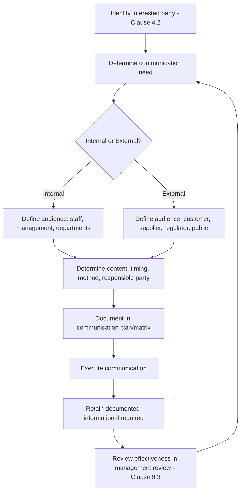

## Internal and External Communication

### Overview

Internal and external communication is a mandatory support process under **ISO 9001:2015 Clause 7.4**, requiring organizations to determine the communications relevant to the quality management system (QMS), including what is communicated, when, with whom, how, and who communicates. Effective communication ensures QMS awareness, supports process consistency, and enables timely response to nonconformities, customer needs, and regulatory obligations.

### Key Points

- **Clause reference**: ISO 9001:2015, Clause 7.4 "Communication," sits under Clause 7 "Support."
- **Scope**: Applies to communication that is relevant to the QMS — not all organizational communication generically.
- **Five determination criteria** the standard requires the organization to define:
  - **On what** it will communicate (content/subject matter)
  - **When** to communicate (timing, frequency, triggers)
  - **With whom** to communicate (audience — internal or external)
  - **How** to communicate (method/channel)
  - **Who** communicates (responsibility/authority)
- **Internal communication**: flows between levels and functions within the organization (e.g., management to staff, cross-departmental).
- **External communication**: flows to/from interested parties outside the organization (customers, suppliers, regulators, the public).
- Communication planning must align with the organization's **context (Clause 4.1)**, **interested party requirements (Clause 4.2)**, and **QMS scope (Clause 4.3)**.

### Internal Communication

Internal communication ensures QMS policies, objectives, roles, risks, and performance are understood across the organization.

**Typical content:**

- Quality policy and quality objectives (Clause 5.2, 6.2)
- Roles, responsibilities, and authorities (Clause 5.3)
- Process performance and KPI results
- Nonconformities, corrective actions, and audit findings (Clause 10.2, 9.2)
- Changes to the QMS (Clause 6.3)
- Risks and opportunities (Clause 6.1)
- Management review outcomes (Clause 9.3)

**Typical channels:**

- Team briefings, town halls, toolbox talks
- Intranet portals, internal newsletters, bulletin boards
- Email distribution lists, instant messaging platforms
- Visual management boards (e.g., andon boards, KPI dashboards)
- Training sessions and onboarding materials

**Common responsibility model:**

- Top management communicates policy, strategic direction, and organizational commitment.
- Process owners/department heads communicate operational performance and process-level changes.
- Quality/QMS manager communicates audit results, nonconformity trends, and system-wide updates.

### External Communication

External communication manages the organization's interface with customers, suppliers, regulators, and other interested parties, and must be consistent with commitments made in the quality policy.

**Typical content:**

- Product/service specifications and changes
- Customer complaint handling and feedback (Clause 9.1.2, 8.2.1)
- Regulatory and statutory reporting
- Supplier/contractor quality requirements (Clause 8.4)
- Public statements regarding certification status, recalls, or incidents
- Marketing and sales communications that must not misrepresent certified scope

**Typical channels:**

- Contracts, purchase orders, and technical specifications
- Customer service channels (call centers, portals, email)
- Regulatory submission systems
- Public-facing website, press releases
- Supplier scorecards and audits

**Constraints and considerations:**

- External claims about certification (e.g., ISO 9001 logo use) must comply with certification body branding rules — organizations may not imply product certification when only the QMS is certified.
- Confidentiality and information security requirements may restrict what is shared externally (linkage to ISO/IEC 27001 where applicable).
- Regulatory communication timelines (e.g., adverse event reporting in medical devices under ISO 13485) may impose legally mandated deadlines distinct from general QMS practice.

### Communication Planning Matrix

A common implementation tool is a communication matrix mapping the five determination criteria.

| What | Who (Audience) | When | How | Who Communicates |
| --- | --- | --- | --- | --- |
| Quality policy update | All employees | Upon revision | Intranet + team meeting | Top management |
| Nonconformity trend | Department heads | Monthly | Management review meeting | Quality manager |
| Customer complaint status | Customer | Upon resolution | Email/portal | Customer service lead |
| Supplier quality requirement change | Approved suppliers | Upon contract renewal | Formal letter/contract addendum | Procurement lead |
| Regulatory incident | Regulatory authority | Within mandated timeframe | Formal regulatory submission | Compliance officer |

### Diagram: Communication Flow (svg_diagram)

<svg xmlns="http://www.w3.org/2000/svg" viewBox="0 0 760 420">
\<style\>
.box { fill: #f5f7fa; stroke: #33475b; stroke-width: 1.5; rx: 6; }
.center { fill: #2f6f4f; stroke: #1c4a34; stroke-width: 1.5; rx: 8; }
.txt { font-family: Arial, sans-serif; font-size: 13px; fill: #1a1a1a; text-anchor: middle; }
.ctxt { font-family: Arial, sans-serif; font-size: 13px; fill: #ffffff; font-weight: bold; text-anchor: middle; }
.lbl { font-family: Arial, sans-serif; font-size: 11px; fill: #444444; text-anchor: middle; }
.arrow { stroke: #33475b; stroke-width: 1.5; fill: none; marker-end: url(#arrowhead); }
\</style\>
<text x="380" y="24" class="lbl" font-size="14" font-weight="bold">Communication Flow (svg_diagram)</text>
<rect x="300" y="180" width="160" height="60" class="center" />
<text x="380" y="205" class="ctxt">QMS</text>
<text x="380" y="222" class="ctxt">Clause 7.4</text>
<rect x="40" y="40" width="150" height="50" class="box" />
<text x="115" y="60" class="txt">Top Management</text>
<text x="115" y="76" class="txt">(Policy, Direction)</text>
<rect x="40" y="330" width="150" height="50" class="box" />
<text x="115" y="350" class="txt">Process Owners</text>
<text x="115" y="366" class="txt">(Operational Data)</text>
<rect x="570" y="40" width="150" height="50" class="box" />
<text x="645" y="60" class="txt">Customers</text>
<text x="645" y="76" class="txt">(Feedback, Complaints)</text>
<rect x="570" y="330" width="150" height="50" class="box" />
<text x="645" y="350" class="txt">Regulators/</text>
<text x="645" y="366" class="txt">Suppliers</text>
<path class="arrow" d="M190,70 C260,90 300,150 320,180" />
<path class="arrow" d="M320,240 C300,270 260,310 190,340" />
<path class="arrow" d="M570,70 C500,90 460,150 440,180" />
<path class="arrow" d="M440,240 C460,270 500,310 570,340" />

<text x="255" y="120" class="lbl">Internal</text>

<text x="255" y="300" class="lbl">Internal</text>

<text x="505" y="120" class="lbl">External</text>

<text x="505" y="300" class="lbl">External</text>

</svg>

### Process Flow: Determining Communication Requirements

### Example

A mid-sized manufacturer determines the following for a new product recall scenario:

- **What**: Product defect details and corrective action
- **When**: Within 24 hours of confirmed defect (internal), within regulatory-mandated window (external)
- **With whom**: Internal — production, quality, and executive teams; external — affected customers and regulatory body
- **How**: Internal — emergency meeting and intranet alert; external — formal recall notice and regulatory filing
- **Who**: Quality manager initiates internal escalation; compliance officer manages external regulatory submission; customer service manages customer-facing notices

This demonstrates how a single triggering event requires distinctly planned internal and external communication streams, each with different audiences, urgency, and channels.

### Common Nonconformities (Audit Findings)

- No documented determination of the "what/when/who/how/who" criteria for Clause 7.4 — often cited as a minor nonconformity when organizations rely on informal or ad hoc communication.
- Inconsistent communication of quality policy to all levels (conflicts with Clause 5.2.2 requirement that policy be communicated and understood within the organization).
- External communications (marketing material, website) implying broader certification scope than what is actually certified. [Inference: this is a frequently cited real-world audit observation across certification bodies, though exact frequency varies by industry and auditor.]
- Lack of retained evidence (records) of communication having occurred, when the organization's own procedures require it.

### Integration with Other Clauses

- **Clause 5.2.2** (Communicating the quality policy) — directly dependent on 7.4 mechanisms.
- **Clause 9.1.2** (Customer satisfaction) — relies on external communication channels to gather feedback.
- **Clause 10.2** (Nonconformity and corrective action) — requires communication of corrective actions to relevant parties.
- **Clause 6.3** (Planning of changes) — changes to the QMS must be communicated per 7.4 mechanisms.
- **Clause 4.2** (Understanding needs and expectations of interested parties) — informs who external communication targets should be.

### Related Topics

- Clause 7.4 Communication requirements in full ISO 9001:2015 text
- Document control and retention of communication records (Clause 7.5)
- Customer communication requirements under Clause 8.2.1
- Management review inputs/outputs (Clause 9.3)
- Certification mark and logo usage rules (certification body-specific)
- Crisis and recall communication procedures
- Stakeholder communication in ISO 14001 and ISO 45001 integrated management systems