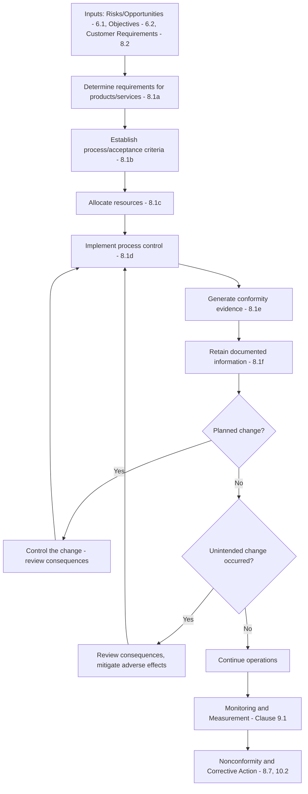

## Operational Planning and Control Requirements

### Overview

Operational planning and control is addressed in **ISO 9001:2015 Clause 8.1**, sitting under Clause 8 "Operation." It requires organizations to plan, implement, and control the processes needed to meet requirements for the provision of products and services, and to implement the actions determined in Clause 6 (Planning). This clause is the operational bridge between strategic QMS planning and day-to-day process execution.

### Key Points

- **Clause reference**: ISO 9001:2015, Clause 8.1 "Operational planning and control."
- **Purpose**: Ensures products/services are delivered under controlled conditions consistent with quality objectives, risk treatment, and customer requirements.
- **Six planning elements** the organization must determine, as applicable:
  - **(a)** Requirements for the products and services
  - **(b)** Criteria for the processes and the acceptance of products and services
  - **(c)** Resources needed to achieve conformity
  - **(d)** Implementation of process control in accordance with criteria
  - **(e)** Documented information needed to demonstrate conformity and to provide evidence of results
  - **(f)** Documented information retained as necessary
- **Output form**: The output of planning must be "suitable for the organization's operations" — the standard does not prescribe a specific format (procedures, work instructions, flowcharts, etc.).
- **Change control**: The organization must control planned changes and review the consequences of unintended changes, taking action to mitigate adverse effects (Clause 8.1).
- **Outsourced processes**: Controlled per Clause 8.4, but referenced here as part of overall operational control scope.

### Detailed Breakdown of the Six Elements

**(a) Requirements for products and services**

- Derived from customer requirements (Clause 8.2.2), statutory/regulatory requirements, and internal specifications.
- Must be reviewed before commitment (contract review) to ensure feasibility.

**(b) Criteria for processes and acceptance**

- Defines pass/fail thresholds, tolerances, inspection criteria.
- Often documented in control plans, inspection and test plans (ITPs), or quality plans.

**(c) Resources needed**

- Personnel competence (Clause 7.2), infrastructure (Clause 7.1.3), process environment (Clause 7.1.4), monitoring/measuring resources (Clause 7.1.5), and organizational knowledge (Clause 7.1.6).

**(d) Implementation of process control**

- Includes in-process inspections, statistical process control (SPC), standard operating procedures (SOPs), and automated control systems.
- Control activities must correspond to the risk level of the process (higher-risk processes typically warrant tighter controls).

**(e) Documented information for conformity evidence**

- Examples: inspection records, test reports, calibration certificates, batch/lot records.

**(f) Documented information retained**

- Retention periods, storage, and disposition rules — links to Clause 7.5 (Documented Information) for control of records.

### Relationship to Other Clauses

Operational planning and control does not exist in isolation — it operationalizes upstream planning and feeds downstream verification.

| Upstream Input | Clause | Downstream Output | Clause |
| --- | --- | --- | --- |
| Actions to address risks and opportunities | 6.1 | Process control criteria | 8.1(b) |
| Quality objectives and planning to achieve them | 6.2 | Resource allocation | 8.1(c) |
| Planning of changes | 6.3 | Change control in operations | 8.1 |
| Customer requirements review | 8.2.2–8.2.4 | Product/service requirements | 8.1(a) |
| — | — | Monitoring and measurement | 9.1 |
| — | — | Nonconformity handling | 8.7, 10.2 |

### Process Flow: Operational Planning and Control Cycle

### Diagram: Operational Control Architecture (svg_diagram)

<svg xmlns="http://www.w3.org/2000/svg" viewBox="0 0 760 380">
\<style\>
.box { fill: #f5f7fa; stroke: #33475b; stroke-width: 1.5; rx: 6; }
.hl { fill: #2f6f4f; stroke: #1c4a34; stroke-width: 1.5; rx: 8; }
.txt { font-family: Arial, sans-serif; font-size: 12.5px; fill: #1a1a1a; text-anchor: middle; }
.htxt { font-family: Arial, sans-serif; font-size: 13px; fill: #ffffff; font-weight: bold; text-anchor: middle; }
.lbl { font-family: Arial, sans-serif; font-size: 12px; fill: #333333; }
.arrow { stroke: #33475b; stroke-width: 1.5; fill: none; marker-end: url(#ah); }
\</style\>
<text x="380" y="22" class="lbl" font-size="14" font-weight="bold">Operational Control Architecture (svg_diagram)</text>
<rect x="30" y="60" width="150" height="50" class="box" />
<text x="105" y="80" class="txt">Requirements</text>
<text x="105" y="96" class="txt">(8.1a)</text>
<rect x="220" y="60" width="150" height="50" class="box" />
<text x="295" y="80" class="txt">Criteria</text>
<text x="295" y="96" class="txt">(8.1b)</text>
<rect x="410" y="60" width="150" height="50" class="box" />
<text x="485" y="80" class="txt">Resources</text>
<text x="485" y="96" class="txt">(8.1c)</text>
<rect x="600" y="60" width="130" height="50" class="box" />
<text x="665" y="80" class="txt">Process</text>
<text x="665" y="96" class="txt">Control (8.1d)</text>
<rect x="220" y="180" width="320" height="55" class="hl" />
<text x="380" y="203" class="htxt">Documented Information</text>
<text x="380" y="220" class="htxt">Evidence (8.1e) + Retention (8.1f)</text>
<rect x="30" y="290" width="330" height="55" class="box" />
<text x="195" y="313" class="txt">Change Control</text>
<text x="195" y="330" class="txt">(Planned + Unintended)</text>
<rect x="410" y="290" width="320" height="55" class="box" />
<text x="570" y="313" class="txt">Monitoring &amp; Measurement</text>
<text x="570" y="330" class="txt">(Clause 9.1)</text>
<path class="arrow" d="M105,110 L105,150 L380,150 L380,180" />
<path class="arrow" d="M295,110 L295,150 L380,150 L380,180" />
<path class="arrow" d="M485,110 L485,150 L380,150 L380,180" />
<path class="arrow" d="M665,110 L665,150 L380,150 L380,180" />
<path class="arrow" d="M300,235 L195,290" />
<path class="arrow" d="M460,235 L570,290" />
</svg>

### Practical Example: Manufacturing Context

A precision parts manufacturer implements Clause 8.1 as follows:

- **(a) Requirements**: Customer drawing specifications, tolerance ranges (±0.02mm), material certifications.
- **(b) Criteria**: Control plan defining critical-to-quality (CTQ) dimensions and sampling plan (e.g., AQL 1.0 per ANSI/ASQ Z1.4).
- **(c) Resources**: CNC machines calibrated per Clause 7.1.5, operators certified per internal competency matrix.
- **(d) Process control**: In-process SPC charts on CTQ dimensions, automated stop for out-of-tolerance parts.
- **(e) Evidence**: SPC charts, first-article inspection reports, calibration certificates.
- **(f) Retention**: Records retained for 7 years per customer contract requirement.

**Change scenario**: A supplier substitutes a raw material batch (unintended change). Per 8.1, the organization must review the consequences of this change and take action to mitigate any adverse effect — such as additional incoming inspection or re-qualification testing — before production continues. [Inference: the specific mitigation steps are illustrative; actual required actions depend on the organization's risk assessment and the material's criticality.]

### Practical Example: Service Context

A software-as-a-service (SaaS) provider implements Clause 8.1 as follows:

- **(a) Requirements**: Service level agreement (SLA) terms, uptime commitments, data security requirements.
- **(b) Criteria**: Acceptance criteria for release builds (e.g., zero critical-severity defects, passing automated test suite).
- **(c) Resources**: DevOps staff competency, CI/CD infrastructure, monitoring tools.
- **(d) Process control**: Automated deployment pipelines with staged rollout and rollback triggers.
- **(e) Evidence**: Test execution logs, deployment logs, incident reports.
- **(f) Retention**: Logs retained per data governance policy and applicable regulatory requirements (e.g., SOC 2 evidence retention).

### Common Nonconformities (Audit Findings)

- Operational criteria for process acceptance exist informally (in an employee's head) rather than as documented information where the organization's own system requires documentation.
- No evidence that unintended changes (e.g., supplier substitutions, unplanned process deviations) were reviewed for consequences before continued operation.
- Resource planning gaps — e.g., process implemented without verified competency records for operators (linkage to Clause 7.2 nonconformity).
- Retained records do not match the retention periods stated in the organization's own procedures.

### Related Topics

- Clause 8.2 Requirements for products and services (customer communication, contract review)
- Clause 8.3 Design and development planning and controls
- Clause 8.4 Control of externally provided processes, products, and services
- Clause 8.5 Production and service provision (identification/traceability, preservation)
- Clause 8.7 Control of nonconforming outputs
- Statistical Process Control (SPC) methods and control charts
- Risk-based thinking application in operational contexts (Clause 6.1 linkage)