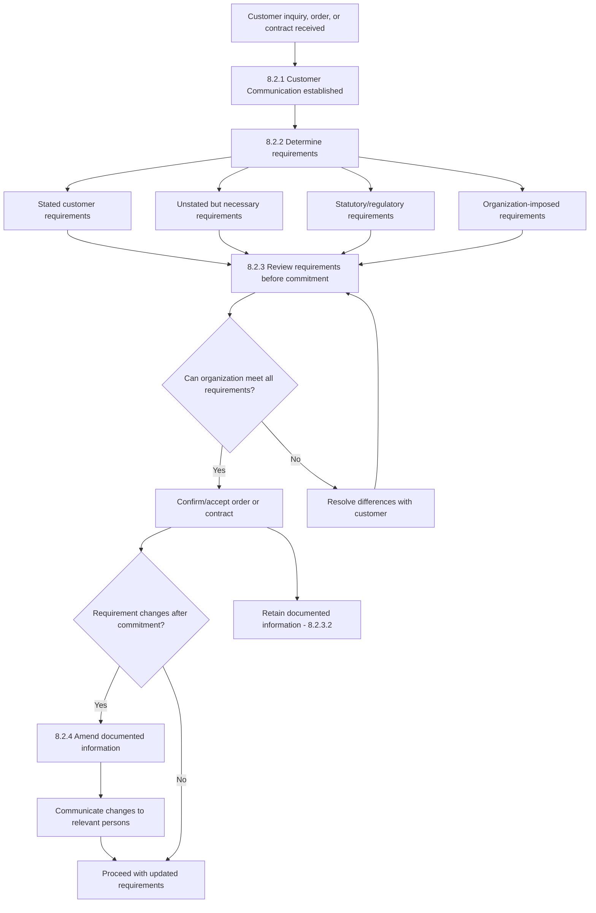

## Determining Requirements for Products and Services

### Overview

Determining requirements for products and services is addressed in **ISO 9001:2015 Clause 8.2**, under Clause 8 "Operation." This sub-clause governs how an organization communicates with customers, determines applicable requirements before committing to supply a product or service, and reviews those requirements to ensure it can meet them. It comprises four sub-clauses: 8.2.1 (Customer communication), 8.2.2 (Determining requirements), 8.2.3 (Review of requirements), and 8.2.4 (Changes to requirements).

### Key Points

- **Clause reference**: ISO 9001:2015, Clause 8.2 "Requirements for products and services."
- **Purpose**: Ensures the organization understands and can meet what the customer actually needs — including requirements the customer has not stated but which are necessary for intended or specified use.
- **Four sub-clauses**:
  - **8.2.1** Customer communication
  - **8.2.2** Determining the requirements for products and services
  - **8.2.3** Review of the requirements for products and services
  - **8.2.4** Changes to requirements for products and services
- **Timing**: Review under 8.2.3 must occur **before** the organization commits to supply (e.g., before accepting an order, contract, or amendment).
- **Traceability**: Any changed requirements must be communicated to relevant persons, and relevant documented information must be amended (8.2.4).

### 8.2.1 Customer Communication

The organization must determine and implement arrangements for communicating with customers relating to:

- **(a)** Product and service information
- **(b)** Enquiries, contracts, or orders, including changes
- **(c)** Obtaining customer feedback relating to products and services, including customer complaints
- **(d)** Handling or controlling customer property (if applicable)
- **(e)** Specific requirements for contingency actions, when relevant

This sub-clause is a specific application of the broader Clause 7.4 (Communication) requirements, scoped to the customer interface.

### 8.2.2 Determining Requirements

When determining requirements for products and services, the organization must ensure:

- **(a)** Requirements are defined, including:
  - Any applicable statutory and regulatory requirements
  - Those considered necessary by the organization, even if not stated by the customer
- **(b)** The organization can meet the claims for the products and services it offers (marketing claims, advertised performance, etc.)

**Sources of requirements to consider:**

- Explicit customer specifications (drawings, contracts, purchase orders)
- Implied requirements (fitness for intended use, even if unstated)
- Statutory/regulatory requirements applicable to the product/service and its jurisdiction
- Organization-imposed requirements (internal quality standards exceeding customer specification)
- Industry standards and codes of practice

### 8.2.3 Review of Requirements

The organization must review, before committing to supply, requirements including:

- **(a)** Requirements specified by the customer, including delivery and requirements for delivery and post-delivery activities
- **(b)** Requirements not stated by the customer but necessary for specified or intended use
- **(c)** Requirements specified by the organization itself
- **(d)** Statutory and regulatory requirements applicable to the products and services
- **(e)** Contract or order requirements differing from those previously expressed

**Key conditions:**

- The organization must ensure contract or order requirements differing from those previously defined are resolved.
- Where customer requirements are not documented (e.g., verbal orders), the organization must confirm them before acceptance.
- **8.2.3.2** requires the organization to retain documented information on the results of the review and on any new requirements for the products and services, **where applicable**.

**Practical application:** This is commonly implemented as a formal **contract review** or **order review** process, which may be waived or abbreviated for standardized, low-risk, catalog-type products where the review was effectively performed in advance (e.g., at product design stage).

### 8.2.4 Changes to Requirements

When requirements for products and services are changed, the organization must ensure that:

- Relevant documented information is amended
- Relevant persons are made aware of the changed requirements

This closes the loop with Clause 7.4 (Communication) and Clause 7.5 (Documented Information).

### Process Flow: Requirements Determination and Review

### Diagram: Requirements Sources Map (svg_diagram)

<svg xmlns="http://www.w3.org/2000/svg" viewBox="0 0 760 400">
\<style\>
.center { fill: #2f6f4f; stroke: #1c4a34; stroke-width: 1.5; rx: 10; }
.box { fill: #f5f7fa; stroke: #33475b; stroke-width: 1.5; rx: 6; }
.ctxt { font-family: Arial, sans-serif; font-size: 13px; fill: #ffffff; font-weight: bold; text-anchor: middle; }
.txt { font-family: Arial, sans-serif; font-size: 12px; fill: #1a1a1a; text-anchor: middle; }
.lbl { font-family: Arial, sans-serif; font-size: 14px; fill: #222222; font-weight: bold; }
.arrow { stroke: #33475b; stroke-width: 1.5; fill: none; marker-end: url(#ah2); }
\</style\>
<text x="380" y="24" class="lbl">Requirements Sources Map (svg_diagram)</text>
<rect x="290" y="170" width="180" height="60" class="center" />
<text x="380" y="195" class="ctxt">Product/Service</text>
<text x="380" y="212" class="ctxt">Requirements (8.2.2)</text>
<rect x="30" y="40" width="170" height="55" class="box" />
<text x="115" y="62" class="txt">Stated Customer</text>
<text x="115" y="78" class="txt">Requirements</text>
<rect x="560" y="40" width="170" height="55" class="box" />
<text x="645" y="62" class="txt">Unstated but</text>
<text x="645" y="78" class="txt">Necessary Requirements</text>
<rect x="30" y="310" width="170" height="55" class="box" />
<text x="115" y="332" class="txt">Statutory/Regulatory</text>
<text x="115" y="348" class="txt">Requirements</text>
<rect x="560" y="310" width="170" height="55" class="box" />
<text x="645" y="332" class="txt">Organization-Imposed</text>
<text x="645" y="348" class="txt">Requirements</text>
<path class="arrow" d="M180,95 C260,120 320,150 340,170" />
<path class="arrow" d="M580,95 C500,120 440,150 420,170" />
<path class="arrow" d="M180,310 C260,280 320,250 340,230" />
<path class="arrow" d="M580,310 C500,280 440,250 420,230" />
</svg>

### Practical Example: Manufacturing Order Review

A metal fabrication shop receives a purchase order for custom brackets:

- **Stated requirement**: Customer drawing specifies material grade AISI 304, quantity 500, delivery in 4 weeks.
- **Unstated but necessary**: Parts must be free of sharp burrs for safe handling (implied fitness for use), even though not explicitly stated on the drawing.
- **Statutory requirement**: If the brackets are for export, compliance with destination-country import material certifications may apply.
- **Organization-imposed**: Internal standard requires 100% dimensional inspection on first-run orders regardless of customer sampling plan.
- **Review outcome**: Contract review confirms capacity, material lead time, and tooling availability before order acceptance; documented in an order acknowledgment record retained per 8.2.3.2.
- **Change scenario**: Customer later requests quantity increase to 750 units — this triggers 8.2.4, requiring the amended purchase order to be reissued and production planning/scheduling documentation updated, with the change communicated to production and quality teams.

### Practical Example: Service Context (Software Implementation)

A software consultancy receives a statement of work (SOW) request:

- **Stated requirement**: Client specifies feature set, integration endpoints, and go-live date.
- **Unstated but necessary**: Data security and access control measures appropriate for the client's industry, even if not explicitly detailed in the SOW.
- **Statutory requirement**: If handling personal data, applicable data protection regulation (e.g., GDPR, Data Privacy Act depending on jurisdiction) compliance is necessary.
- **Organization-imposed**: Internal policy requires code review and security testing before deployment regardless of client request.
- **Review outcome**: Pre-sales review confirms technical feasibility and resource availability before SOW signature.

### Common Nonconformities (Audit Findings)

- Orders accepted and production/service delivery commenced without evidence of a review being performed beforehand (violates the "before commitment" timing requirement).
- Verbal customer orders processed without confirmation of requirements, where the organization's procedure requires written confirmation.
- Changed customer requirements not communicated to affected departments (e.g., production proceeding on outdated specifications).
- No retained documented information on review results where the organization's own quality manual states records will be kept. [Inference: retention is only mandatory "where applicable," so this becomes a nonconformity specifically when the organization's own documented procedure commits to retaining such records.]

### Related Topics

- Clause 7.4 Internal and external communication (parent communication framework)
- Clause 8.1 Operational planning and control
- Clause 8.3 Design and development of products and services
- Clause 9.1.2 Customer satisfaction monitoring
- Contract review procedures and order acknowledgment systems
- Statutory and regulatory requirement mapping by industry/jurisdiction