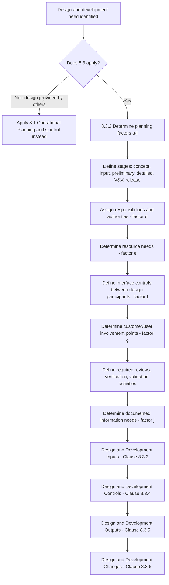

## Design and Development Planning

### Overview

Design and development planning is addressed in **ISO 9001:2015 Clause 8.3.1 and 8.3.2**, under Clause 8 "Operation." This sub-clause requires organizations to establish, implement, and maintain a design and development process appropriate to ensure the subsequent provision of products and services. It applies where design and development activities are performed by the organization itself — not universally, since some organizations only supply products/services designed by others.

### Key Points

- **Clause reference**: ISO 9001:2015, Clause 8.3 "Design and development of products and services," specifically 8.3.1 (General) and 8.3.2 (Design and development planning).
- **Applicability**: If the detailed requirements for products and services are already established by others (e.g., customer-supplied designs, off-the-shelf products), Clause 8.3 may not apply — but the organization must still confirm this in its QMS scope justification.
- **Purpose**: Ensures a structured, controlled approach to converting requirements into a specified design output, reducing risk of design errors reaching production or service delivery.
- **Structure of Clause 8.3**: 8.3.1 (General), 8.3.2 (Planning), 8.3.3 (Inputs), 8.3.4 (Controls), 8.3.5 (Outputs), 8.3.6 (Changes).

### 8.3.2 Design and Development Planning — Determination Factors

When determining the stages and controls for design and development, the organization must consider:

- **(a)** The nature, duration, and complexity of the design and development activities
- **(b)** The required process stages, including applicable design and development reviews
- **(c)** The required design and development verification and validation activities
- **(d)** The responsibilities and authorities involved in the design and development process
- **(e)** The internal and external resource needs for the design and development of products and services
- **(f)** The need to control interfaces between persons involved in the design and development process
- **(g)** The need for involvement of customers and users in the design and development process
- **(h)** The requirements for subsequent provision of products and services
- **(i)** The level of control expected for the design and development process by customers and other relevant interested parties
- **(j)** The documented information needed to demonstrate that design and development requirements have been met

### Design and Development Stage Model

A typical design and development plan organizes activities into sequential (or overlapping, in concurrent engineering) stages, each gated by reviews.

| Stage | Typical Activities | Gate/Review |
| --- | --- | --- |
| Concept/Feasibility | Requirements gathering, feasibility study | Feasibility review |
| Design Input | Specifications, standards, regulatory requirements consolidated | Input review |
| Preliminary Design | Concept design, architecture, initial risk analysis | Design review 1 |
| Detailed Design | Detailed drawings/specifications, prototyping | Design review 2 |
| Verification | Testing against design inputs (does it meet spec?) | Verification review |
| Validation | Testing against user needs (does it work as intended in use?) | Validation review |
| Transfer/Release | Handover to production/service delivery | Release approval |

**Note**: Verification and validation are distinct: verification confirms the design output meets the design input specification; validation confirms the resulting product/service meets the needs for its intended use. [Inference: this distinction is standard practice across quality engineering disciplines, though exact terminology and gate names vary by industry (e.g., automotive APQP, medical device design controls under ISO 13485/21 CFR 820.30).]

### Process Flow: Design and Development Planning

### Diagram: Design Stage Gate Model (svg_diagram)

<svg xmlns="http://www.w3.org/2000/svg" viewBox="0 0 780 300">
\<style\>
.box { fill: #f5f7fa; stroke: #33475b; stroke-width: 1.5; rx: 6; }
.gate { fill: #2f6f4f; stroke: #1c4a34; stroke-width: 1.5; }
.txt { font-family: Arial, sans-serif; font-size: 11.5px; fill: #1a1a1a; text-anchor: middle; }
.gtxt { font-family: Arial, sans-serif; font-size: 10.5px; fill: #ffffff; text-anchor: middle; font-weight: bold; }
.lbl { font-family: Arial, sans-serif; font-size: 14px; fill: #222222; font-weight: bold; }
.arrow { stroke: #33475b; stroke-width: 1.5; fill: none; marker-end: url(#ah3); }
\</style\>
<text x="390" y="22" class="lbl">Design Stage Gate Model (svg_diagram)</text>
<rect x="20" y="110" width="110" height="55" class="box" />
<text x="75" y="132" class="txt">Design</text>
<text x="75" y="148" class="txt">Input</text>
<polygon points="150,110 175,137 150,165 145,165 145,110" class="gate" />
<text x="158" y="140" class="gtxt" font-size="9">R1</text>
<rect x="190" y="110" width="110" height="55" class="box" />
<text x="245" y="132" class="txt">Preliminary</text>
<text x="245" y="148" class="txt">Design</text>
<polygon points="320,110 345,137 320,165 315,165 315,110" class="gate" />
<text x="328" y="140" class="gtxt" font-size="9">R2</text>
<rect x="360" y="110" width="110" height="55" class="box" />
<text x="415" y="132" class="txt">Detailed</text>
<text x="415" y="148" class="txt">Design</text>
<polygon points="490,110 515,137 490,165 485,165 485,110" class="gate" />
<text x="498" y="140" class="gtxt" font-size="9">V</text>
<rect x="530" y="110" width="110" height="55" class="box" />
<text x="585" y="132" class="txt">Verification</text>
<text x="585" y="148" class="txt">&amp; Validation</text>
<polygon points="660,110 685,137 660,165 655,165 655,110" class="gate" />
<text x="668" y="140" class="gtxt" font-size="9">V</text>
<rect x="700" y="110" width="70" height="55" class="box" />
<text x="735" y="132" class="txt">Release</text>
<text x="735" y="148" class="txt">/ Transfer</text>
<path class="arrow" d="M130,137 L145,137" />
<path class="arrow" d="M175,137 L190,137" />
<path class="arrow" d="M300,137 L315,137" />
<path class="arrow" d="M345,137 L360,137" />
<path class="arrow" d="M470,137 L485,137" />
<path class="arrow" d="M515,137 L530,137" />
<path class="arrow" d="M640,137 L655,137" />
<path class="arrow" d="M685,137 L700,137" />

<text x="390" y="200" class="txt" font-size="11">R1/R2 = Design Reviews | V = Verification/Validation Gate</text>

<text x="390" y="220" class="txt" font-size="11">Each gate requires documented review outcome before proceeding (Clause 8.3.4)</text>

</svg>

### Practical Example: New Product Development (Manufacturing)

An electronics manufacturer plans the design of a new sensor module:

- **(a) Nature/complexity**: Medium complexity, 6-month development cycle, involves firmware and hardware co-design.
- **(b) Stages**: Concept → schematic design → PCB layout → prototype build → EMC/safety testing → pilot production.
- **(c) Verification/validation**: Verification via bench testing against electrical specification; validation via field trial with pilot customer.
- **(d) Responsibilities**: Design lead owns technical decisions; project manager owns schedule; quality engineer owns V&V sign-off.
- **(e) Resources**: In-house electrical engineers, outsourced EMC test lab.
- **(f) Interfaces**: Weekly design review meetings between hardware, firmware, and mechanical engineering teams.
- **(g) Customer involvement**: Pilot customer participates in field validation phase.
- **(h) Downstream requirements**: Design for manufacturability reviewed with production engineering before release.
- **(i) Interested party control level**: Regulatory certification body requires design history file per applicable safety standard.
- **(j) Documented information**: Design review minutes, test reports, design history file maintained throughout.

### Practical Example: Service Design (Financial Product)

A financial services firm plans the design of a new loan product:

- **(a) Nature/complexity**: Moderate complexity involving regulatory, actuarial, and IT system considerations.
- **(b) Stages**: Concept → regulatory compliance review → pricing model design → system configuration → pilot launch.
- **(c) Verification/validation**: Verification that pricing model matches regulatory and risk parameters; validation via limited pilot rollout with customer feedback.
- **(g) Customer involvement**: Customer advisory panel consulted during concept stage.
- **(j) Documented information**: Compliance sign-off records, pricing model documentation, pilot results report.

### Common Nonconformities (Audit Findings)

- Design and development planning applied inconsistently — some projects have documented stage-gate plans while others proceed informally with no evidence of planning.
- Reviews, verification, and validation activities are combined or skipped without justification, despite being distinct requirements the organization's own procedure describes separately.
- No defined responsibility and authority for design decisions, leading to unclear accountability during design reviews.
- Customer or user involvement points determined but not actually implemented or evidenced.
- Scope exclusion of Clause 8.3 claimed, but the organization is found to be performing actual design activities (e.g., customizing a "standard" product beyond simple configuration). [Inference: whether customization constitutes "design" is a judgment call frequently scrutinized by auditors and depends on the specific nature of the modification.]

### Related Topics

- Clause 8.3.3 Design and development inputs
- Clause 8.3.4 Design and development controls
- Clause 8.3.5 Design and development outputs
- Clause 8.3.6 Design and development changes
- Clause 7.1.6 Organizational knowledge (feeding into design input)
- Advanced Product Quality Planning (APQP) — automotive sector design planning framework
- Design controls under ISO 13485 / 21 CFR 820.30 — medical device sector analog
- Failure Mode and Effects Analysis (FMEA) as a design risk tool