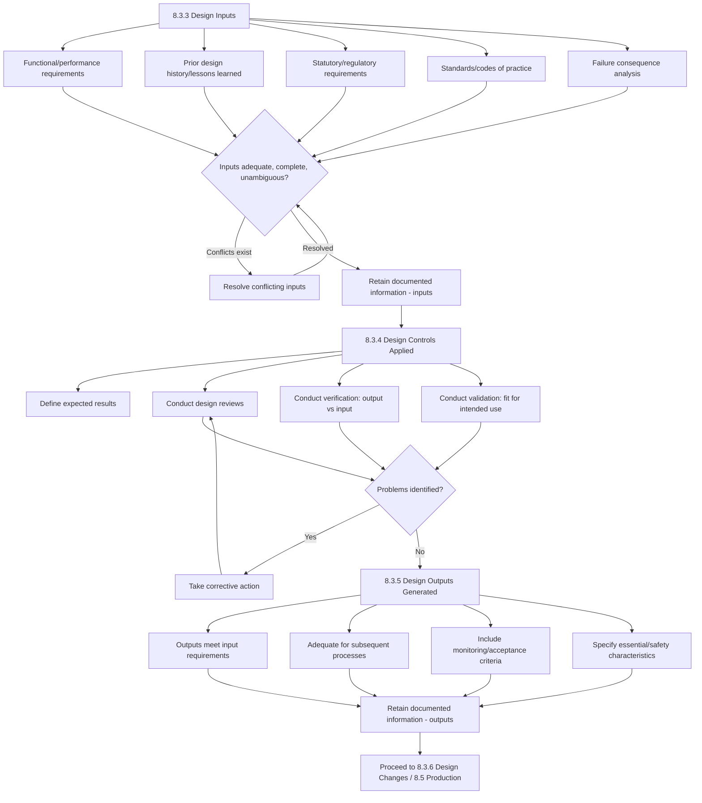

## Design and Development Inputs Outputs and Controls

### Overview

This topic covers three interconnected sub-clauses of **ISO 9001:2015 Clause 8.3**: 8.3.3 (Design and development inputs), 8.3.4 (Design and development controls), and 8.3.5 (Design and development outputs). Together they define what goes into the design process, how the process itself is controlled, and what must come out of it before a product or service specification is released.

### Key Points

- **Clause references**: ISO 9001:2015, Clauses 8.3.3, 8.3.4, and 8.3.5.
- **Logical sequence**: Inputs → Controlled design process → Outputs → (feeding into 8.3.6 Changes and eventually 8.5 Production/Service Provision).
- **Core principle**: Outputs must be verifiable against inputs, and the design process must include reviews, verification, and validation as planned in 8.3.2.
- **Documented information** is required at each stage to demonstrate that requirements have been met and to provide traceability.

### 8.3.3 Design and Development Inputs

The organization must determine requirements essential for the specific types of products and services to be designed and developed, and must consider:

- **(a)** Functional and performance requirements
- **(b)** Information derived from previous similar design and development activities
- **(c)** Statutory and regulatory requirements
- **(d)** Standards or codes of practice that the organization has committed to implement
- **(e)** Potential consequences of failure due to the nature of the products and services

**Additional requirements:**

- Inputs must be adequate for the purpose, complete, and unambiguous.
- Conflicting design and development inputs must be resolved.
- The organization must retain documented information on design and development inputs.

### 8.3.4 Design and Development Controls

The organization must apply controls to the design and development process to ensure:

- **(a)** The results to be achieved are defined
- **(b)** Reviews are conducted to evaluate the ability of the results to meet requirements
- **(c)** Verification activities are conducted to ensure outputs meet input requirements
- **(d)** Validation activities are conducted to ensure resulting products/services meet requirements for intended use or application
- **(e)** Necessary actions are taken on problems determined during reviews, verification, or validation
- **(f)** Documented information of these activities is retained

**Distinguishing the three control activities:**

| Activity | Question Answered | Typical Method |
| --- | --- | --- |
| Review | Is the design progressing as planned and able to meet requirements? | Design review meetings, checklist evaluation |
| Verification | Does the output match the input specification? | Inspection, testing, calculations, comparison to spec, peer review |
| Validation | Does the product/service meet the needs for its intended use? | Field trials, user acceptance testing, simulated use conditions |

Reviews, verification, and validation are distinct activities but can be combined and conducted at any stage, as suitable, provided the requirements for each are met.

### 8.3.5 Design and Development Outputs

The organization must ensure design and development outputs:

- **(a)** Meet the input requirements
- **(b)** Are adequate for subsequent processes for the provision of products and services
- **(c)** Include or reference monitoring and measuring requirements, as appropriate, and acceptance criteria
- **(d)** Specify the characteristics of products and services essential for their intended purpose and safe and proper provision

**Documented information** on design and development outputs must be retained.

### Process Flow: Inputs-Controls-Outputs Chain

### Diagram: Verification vs Validation Loop (svg_diagram)

<svg xmlns="http://www.w3.org/2000/svg" viewBox="0 0 760 340">
\<style\>
.box { fill: #f5f7fa; stroke: #33475b; stroke-width: 1.5; rx: 6; }
.hl { fill: #2f6f4f; stroke: #1c4a34; stroke-width: 1.5; rx: 8; }
.txt { font-family: Arial, sans-serif; font-size: 12.5px; fill: #1a1a1a; text-anchor: middle; }
.htxt { font-family: Arial, sans-serif; font-size: 13px; fill: #ffffff; font-weight: bold; text-anchor: middle; }
.lbl { font-family: Arial, sans-serif; font-size: 14px; fill: #222222; font-weight: bold; }
.arrow { stroke: #33475b; stroke-width: 1.5; fill: none; marker-end: url(#ah4); }
.darrow { stroke: #33475b; stroke-width: 1.5; fill: none; stroke-dasharray: 5,3; marker-end: url(#ah4); }
\</style\>
<text x="380" y="22" class="lbl">Verification vs Validation Loop (svg_diagram)</text>
<rect x="40" y="80" width="180" height="60" class="box" />
<text x="130" y="105" class="txt">Design Input</text>
<text x="130" y="122" class="txt">(Requirements/Spec)</text>
<rect x="300" y="80" width="180" height="60" class="box" />
<text x="390" y="105" class="txt">Design Output</text>
<text x="390" y="122" class="txt">(Drawings/Code/Spec)</text>
<rect x="560" y="80" width="160" height="60" class="box" />
<text x="640" y="105" class="txt">Realized Product/</text>
<text x="640" y="122" class="txt">Service</text>
<rect x="150" y="220" width="200" height="55" class="hl" />
<text x="250" y="242" class="htxt">VERIFICATION</text>
<text x="250" y="260" class="htxt">Output meets Input?</text>
<rect x="420" y="220" width="230" height="55" class="hl" />
<text x="535" y="242" class="htxt">VALIDATION</text>
<text x="535" y="260" class="htxt">Meets intended use?</text>
<path class="arrow" d="M220,110 L300,110" />
<path class="arrow" d="M480,110 L560,110" />
<path class="darrow" d="M130,140 L250,220" />
<path class="darrow" d="M390,140 L250,220" />
<path class="darrow" d="M640,140 L535,220" />
</svg>

### Practical Example: Mechanical Component Design

A pump manufacturer designs a new impeller:

**Inputs (8.3.3):**

- (a) Functional: flow rate 500 L/min at 2900 RPM, max pressure 8 bar
- (b) Prior data: cavitation issues from a previous impeller generation used as lessons learned
- (c) Regulatory: pressure equipment directive compliance
- (d) Standards: ISO 9906 for pump testing acceptance
- (e) Failure consequence: impeller failure could cause pump seizure — drives selection of higher safety factor in material design

**Controls (8.3.4):**

- Design review conducted at 50% design completion with cross-functional team (mechanical, materials, manufacturing)
- Verification: CFD (computational fluid dynamics) simulation compared against target flow curve
- Validation: physical prototype tested on test rig under simulated field operating conditions
- Problem found during validation (cavitation at low-flow condition) → corrective redesign of blade angle → re-verification

**Outputs (8.3.5):**

- Finalized manufacturing drawings with tolerances
- Acceptance criteria: flow curve within ±5% of target, no cavitation below 15% of rated flow
- Material specification and safety-critical dimensional callouts
- Monitoring requirement: 100% flow test on first production batch

### Practical Example: Digital Service/Software Design

A fintech company designs a new payment API:

**Inputs (8.3.3):**

- (a) Functional: transaction processing under 200ms, support for three currencies
- (c) Regulatory: PCI-DSS compliance, applicable data protection law
- (e) Failure consequence: transaction failure could cause financial loss or double-billing — drives idempotency design requirement

**Controls (8.3.4):**

- Architecture review board evaluates design before implementation
- Verification: unit and integration tests confirm API responses match specification
- Validation: user acceptance testing with pilot merchant confirms real-world transaction flows work as intended
- Security penetration test findings addressed before release

**Outputs (8.3.5):**

- API specification document (e.g., OpenAPI/Swagger definition)
- Acceptance criteria: 99.9% success rate under load testing, response time SLA
- Error-handling and rollback specifications as safety-critical characteristics

### Common Nonconformities (Audit Findings)

- Design inputs are incomplete or ambiguous, with no evidence of resolution before design proceeded (violates 8.3.3 requirement for adequacy and completeness).
- Verification and validation activities are conflated or one is omitted entirely without documented justification, despite the plan (8.3.2) calling for both.
- Design outputs lack acceptance criteria or monitoring/measurement requirements, making downstream inspection criteria unclear.
- No retained documented information linking specific outputs back to the inputs they were meant to satisfy — breaking traceability.
- Problems identified during reviews are documented but corrective action closure is not evidenced (violates 8.3.4(e)).

### Related Topics

- Clause 8.3.2 Design and development planning
- Clause 8.3.6 Design and development changes
- Clause 8.5 Production and service provision
- Clause 8.7 Control of nonconforming outputs
- Design Failure Mode and Effects Analysis (DFMEA)
- Design history file / design dossier concepts (medical device sector analog under ISO 13485)
- Traceability matrices for requirements-to-verification mapping