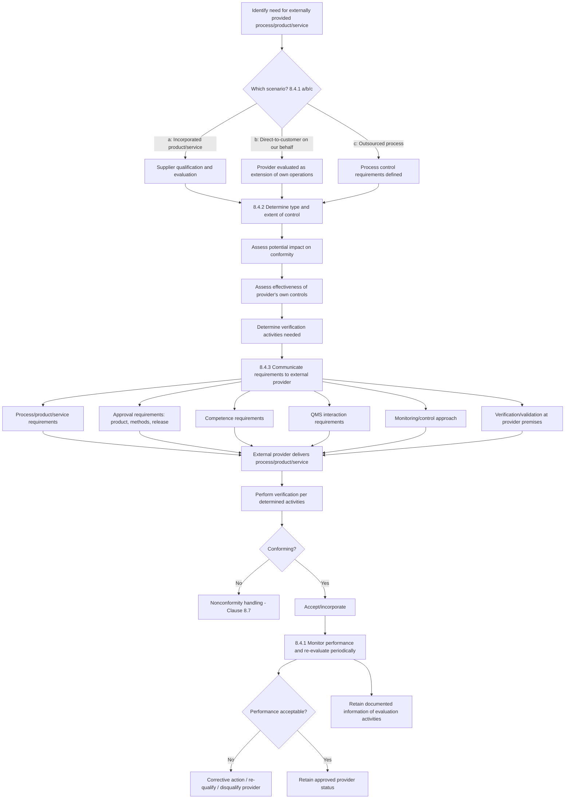

## Control of Externally Provided Processes Products and Services

### Overview

Control of externally provided processes, products, and services is addressed in **ISO 9001:2015 Clause 8.4**, under Clause 8 "Operation." This clause requires organizations to ensure that externally provided processes, products, and services conform to requirements, covering three distinct sourcing scenarios: purchased products/services, outsourced processes, and products/services provided directly to the customer by an external provider on the organization's behalf.

### Key Points

- **Clause reference**: ISO 9001:2015, Clause 8.4 "Control of externally provided processes, products and services."
- **Structure**: 8.4.1 (General), 8.4.2 (Type and extent of control), 8.4.3 (Information for external providers).
- **Three applicability scenarios** explicitly identified in 8.4.1:
  - **(a)** Products and services from external providers intended for incorporation into the organization's own products/services
  - **(b)** Products and services provided directly to customer(s) by external providers on behalf of the organization
  - **(c)** A process, or part of a process, provided by an external provider as a result of a decision by the organization to outsource
- **Risk-based approach**: The type and extent of control applied to external providers must be dependent on their potential impact on the organization's ability to consistently meet customer and applicable statutory/regulatory requirements.

### 8.4.1 General Requirements

The organization must:

- Ensure externally provided processes, products, and services conform to requirements
- Determine controls to apply when a process, or part of a process, is provided by an external provider (outsourcing)
- Determine and apply criteria for the **evaluation, selection, monitoring of performance, and re-evaluation** of external providers, based on their ability to provide processes/products/services in accordance with requirements
- Retain documented information of these activities and any necessary actions arising from evaluations

### 8.4.2 Type and Extent of Control

The organization must ensure that externally provided processes, products, and services do not adversely affect its ability to consistently deliver conforming products/services to customers. This requires the organization to:

- **(a)** Ensure externally provided processes remain within the control of its QMS
- **(b)** Define both the controls it intends to apply to an external provider and those it intends to apply to the resulting output
- **(c)** Take into consideration:
  - The potential impact of the externally provided processes/products/services on the organization's ability to consistently meet requirements
  - The effectiveness of controls applied by the external provider
- **(d)** Determine verification or other activities necessary to ensure externally provided processes/products/services meet requirements

### 8.4.3 Information for External Providers

The organization must ensure the adequacy of requirements before communicating them to external providers. Communication must address, as applicable:

- **(a)** The processes, products, and services to be provided
- **(b)** The approval of: products and services; methods, processes, and equipment; the release of products and services
- **(c)** Competence, including any required qualification of persons
- **(d)** The external providers' interactions with the organization's QMS
- **(e)** Control and monitoring of the external provider's performance to be applied by the organization
- **(f)** Verification or validation activities that the organization, or its customer, intends to perform at the external provider's premises

### Control Determination Matrix (Risk-Based Approach)

| Scenario | Impact if Nonconforming | Typical Controls |
| --- | --- | --- |
| Raw material for critical component | High — safety/regulatory risk | Incoming inspection, supplier audits, material certificates, second-source qualification |
| Standard off-the-shelf hardware (e.g., fasteners) | Low — commodity, easily replaced | Certificate of conformance, periodic receiving checks |
| Outsourced heat treatment process | High — affects product integrity, invisible after processing | Process qualification, supplier process audits, documented special process approval |
| Outsourced customer call center (direct customer contact) | High — direct customer experience impact | Service level monitoring, call quality audits, script/script compliance review |
| Outsourced calibration service | Medium — affects measurement integrity | Accreditation verification (e.g., ISO/IEC 17025), certificate review |

### Process Flow: External Provider Control Lifecycle

### Diagram: Three Scenarios of External Provision (svg_diagram)

<svg xmlns="http://www.w3.org/2000/svg" viewBox="0 0 760 340">
\<style\>
.box { fill: #f5f7fa; stroke: #33475b; stroke-width: 1.5; rx: 6; }
.center { fill: #2f6f4f; stroke: #1c4a34; stroke-width: 1.5; rx: 10; }
.txt { font-family: Arial, sans-serif; font-size: 12px; fill: #1a1a1a; text-anchor: middle; }
.ctxt { font-family: Arial, sans-serif; font-size: 13px; fill: #ffffff; font-weight: bold; text-anchor: middle; }
.lbl { font-family: Arial, sans-serif; font-size: 14px; fill: #222222; font-weight: bold; }
.arrow { stroke: #33475b; stroke-width: 1.5; fill: none; marker-end: url(#ah5); }
\</style\>
<text x="380" y="24" class="lbl">Three Scenarios of External Provision (svg_diagram)</text>
<rect x="290" y="150" width="180" height="60" class="center" />
<text x="380" y="175" class="ctxt">Organization's</text>
<text x="380" y="192" class="ctxt">QMS Control</text>
<rect x="30" y="40" width="190" height="60" class="box" />
<text x="125" y="62" class="txt">(a) Incorporated Products/</text>
<text x="125" y="78" class="txt">Services (e.g., components)</text>
<rect x="290" y="270" width="180" height="55" class="box" />
<text x="380" y="292" class="txt">(c) Outsourced Process</text>
<text x="380" y="308" class="txt">(e.g., heat treatment)</text>
<rect x="540" y="40" width="190" height="60" class="box" />
<text x="635" y="62" class="txt">(b) Direct-to-Customer</text>
<text x="635" y="78" class="txt">(e.g., call center)</text>
<path class="arrow" d="M180,100 C240,120 300,140 330,150" />
<path class="arrow" d="M380,270 L380,210" />
<path class="arrow" d="M580,100 C500,120 460,140 430,150" />
</svg>

### Practical Example: Manufacturing Supply Chain

An automotive parts manufacturer applies Clause 8.4 as follows:

- **Scenario (a)**: Purchases forged steel blanks incorporated into finished components.
  - **Evaluation**: Initial supplier audit against IATF 16949-aligned criteria; material certification review.
  - **Control type**: Incoming inspection with dimensional and hardness sampling; supplier scorecards tracking defect PPM.
  - **Monitoring**: Quarterly performance review; re-evaluation triggered by two consecutive nonconforming lots.
- **Scenario (c)**: Outsources anodizing (a special process) to a certified processor.
  - **Control type**: Process qualification review, verification of processor's accreditation, periodic process audits (since output quality cannot be fully verified by inspection alone — a "special process" characteristic).
  - **Information communicated (8.4.3)**: Coating thickness specification, salt-spray test requirements, approval required before process changes at the processor.

### Practical Example: Service Sector — Outsourced Customer Support

A telecommunications company outsources its Tier-1 customer support call center (Scenario b):

- **Evaluation criteria**: Call quality benchmarks, language support capability, data security certification (e.g., ISO/IEC 27001).
- **Type and extent of control**: Real-time call monitoring, customer satisfaction (CSAT) score tracking, monthly service level agreement (SLA) reviews.
- **Information for provider (8.4.3)**: Approved call scripts, escalation procedures, competence requirements for agents (e.g., minimum training hours), and QMS interaction points (how complaints feed into the company's own corrective action system).
- **Verification at provider's premises**: Periodic on-site audits of call center operations.

### Common Nonconformities (Audit Findings)

- No documented criteria for evaluation, selection, monitoring, or re-evaluation of external providers — organization simply uses providers without a defined qualification process.
- Outsourced processes (scenario c) treated as "out of scope" of the QMS with no controls applied, when the standard explicitly requires such processes to remain within QMS control.
- Verification activities not actually performed as determined (e.g., incoming inspection skipped due to schedule pressure).
- Approved supplier list not reflecting actual re-evaluation activity — suppliers remain "approved" indefinitely without periodic performance review.
- Information communicated to external providers (8.4.3) is incomplete — e.g., competence or approval requirements omitted from purchase orders or contracts.

### Related Topics

- Clause 8.1 Operational planning and control
- Clause 8.5.1 Control of production and service provision (special process controls)
- Clause 8.7 Control of nonconforming outputs
- Clause 9.1.3 Analysis and evaluation (supplier performance data)
- Supplier audit programs and second-party audits
- Approved Supplier List (ASL) / Approved Vendor List (AVL) management systems
- IATF 16949 supplier quality management (automotive sector extension)