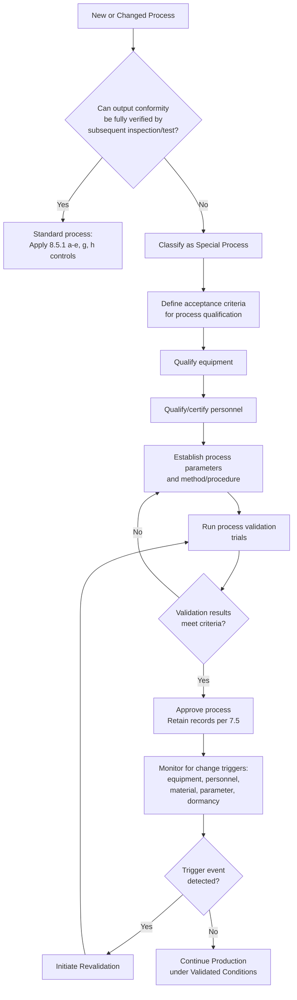

## Production and Service Provision Controls

### Overview

Production and Service Provision Controls constitute the requirements of ISO 9001:2015 Clause 8.5, governing how an organization plans, executes, and controls the conditions under which products are manufactured or services are delivered. This clause operationalizes the outputs of Clause 8.1 (Operational Planning and Control) by defining the specific mechanisms — documented information, monitoring, competent personnel, suitable infrastructure, and validated processes — that ensure conformity of outputs at the point of creation or delivery.

The clause sits within the "Operation" pillar (Clause 8) of the ISO 9001 High-Level Structure (Annex SL) and is directly downstream of design and development controls (8.3) and control of externally provided processes/products/services (8.4).

### Structure of Clause 8.5 (ISO 9001:2015)

The clause is composed of five sub-clauses:

| Sub-clause | Title | Core Requirement |
| --- | --- | --- |
| 8.5.1 | Control of production and service provision | Implementation under controlled conditions |
| 8.5.2 | Identification and traceability | Unique identification of outputs across the process |
| 8.5.3 | Property belonging to customers or external providers | Care, identification, protection of external property |
| 8.5.4 | Preservation | Preservation of outputs during processing/delivery |
| 8.5.5 | Post-delivery activities | Requirements applicable after delivery (warranty, maintenance) |
| 8.5.6 | Control of changes | Review and control of changes for production/service provision |

### 8.5.1 — Control of Production and Service Provision

**Key Points**

The organization must implement production and service provision under controlled conditions. ISO 9001:2015 enumerates specific elements that constitute "controlled conditions," applicable as relevant to the organization's context:

1. **Availability of documented information** defining:
   - Characteristics of the products to be produced, services to be provided, or activities to be performed
   - Results to be achieved
2. **Availability and use of suitable monitoring and measuring resources** (linked to Clause 7.1.5)
3. **Implementation of monitoring and measurement activities** at appropriate stages to verify that criteria for control of processes/outputs, and acceptance criteria for products/services, have been met
4. **Use of suitable infrastructure and environment** for the operation of processes (linked to Clauses 7.1.3 and 7.1.4)
5. **Appointment of competent persons**, including required qualification (linked to Clause 7.2)
6. **Validation and periodic revalidation** of the ability to achieve planned results of any production/service provision processes where the resulting output cannot be verified by subsequent monitoring or measurement — i.e., **special processes**
7. **Implementation of actions to prevent human error**
8. **Implementation of release, delivery, and post-delivery activities**

**Special Processes: A Detailed Treatment**

A "special process" is one whose output cannot be fully verified after the fact through inspection or testing; deficiencies become apparent only once the product is in use or has failed. This is a frequently examined and misunderstood concept.

*Classic examples:*

- Welding (destructive testing required to verify penetration and strength)
- Heat treatment (metallurgical structure only verifiable via destructive sectioning)
- Sterilization processes (medical devices — sterility cannot be verified without destroying the sample)
- Adhesive bonding / curing
- Plastic injection molding (certain critical dimensional/structural properties)
- Software deployment to embedded systems where full-path testing is impractical

*Validation requirements for special processes:*

- Defined criteria for review and approval of the processes
- Approval of equipment and qualification of personnel
- Use of specific methods and procedures
- Requirements for records (retained documented information per 8.5.1(a) and 7.5)
- Revalidation, triggered by:
  - Process parameter changes
  - Equipment changes
  - Personnel changes (where qualification is process-specific)
  - Extended periods of non-use
  - Nonconformity trends suggesting process drift

**[Inference]** In practice, auditors commonly probe special-process validation records by asking for the *re-qualification trigger matrix* — a document mapping specific change events to mandatory revalidation actions — because its absence is a frequent finding even when initial validation exists.

**Actions to Prevent Human Error**

This is a 2015-revision addition, reflecting the standard's increased emphasis on risk-based thinking. Typical mechanisms include:

- Poka-yoke (error-proofing) devices — mechanical or electronic fixtures preventing incorrect assembly
- Checklists and verification steps (double sign-off)
- Visual management (kanban, shadow boards, color-coding)
- Automation of high-risk manual steps
- Training and competency verification prior to task assignment
- Standardized work instructions with pictorial aids

### 8.5.2 — Identification and Traceability

**Key Points**

- The organization must use suitable means to identify outputs when necessary to ensure conformity.
- The organization must identify the **status of outputs** with respect to monitoring and measurement requirements throughout production and service provision (e.g., "inspected — pass," "quarantine," "awaiting test").
- Where traceability is a requirement, the organization must **control the unique identification of outputs** and retain the documented information necessary to enable traceability.

**Traceability Depth Models**

Traceability requirements vary by sector and risk. Three common models:

1. **Batch/Lot traceability** — traces a group of units sharing common raw material/process history (common in food, chemicals, general manufacturing)
2. **Unit-level (serialized) traceability** — traces each individual item uniquely (common in aerospace, medical devices, automotive safety-critical components)
3. **Full genealogy/pedigree traceability** — traces not only the unit but every input material's own upstream traceability chain (common in pharmaceuticals, IATF 16949-regulated automotive)

**Example**

A medical device manufacturer assigns a unique device identifier (UDI) to each unit. The traceability record links:

- Raw material lot numbers → Component supplier certificates of conformance → Manufacturing work order → Operator ID and shift → Sterilization batch number → Final inspection record → Shipping carton and customer.

This enables a full backward trace (identify affected units in a recall) and forward trace (identify which customers received units from a suspect lot).

### 8.5.3 — Property Belonging to Customers or External Providers

**Key Points**

The organization must exercise care with property belonging to customers or external providers while it is under the organization's control or being used by the organization. This includes:

- Materials, components, tools, equipment, premises, intellectual property, and personal data provided for use or incorporation into products/services

Required actions:

- **Identify, verify, protect, and safeguard** customer/external provider property provided for use or incorporation
- If such property is **lost, damaged, or otherwise found to be unsuitable for use**, the organization must **report this to the customer or external provider** and **retain documented information** on what occurred

**[Unverified]** — Note: intellectual property and personal data were explicitly added to the scope of "customer property" in the 2015 revision guidance notes (relative to ISO 9001:2008), reflecting increased attention to data protection; organizations handling customer data under this clause often cross-reference ISO/IEC 27001 controls, though ISO 9001 itself does not mandate a specific data-protection framework.

**Example**

A contract electronics manufacturer (CEM) receives customer-supplied components (CSC) for a build. Controls include:

- Incoming verification against the packing list (quantity, part number, visual damage)
- Segregated, labeled storage ("Customer Property — Do Not Use for Other Orders")
- Inventory reconciliation at job completion
- A formal Customer Property Loss/Damage Report procedure triggering customer notification within a defined SLA (e.g., 24 hours)

### 8.5.4 — Preservation

**Key Points**

The organization must preserve outputs during production and service provision, to the extent necessary to ensure conformity to requirements. Preservation applies to outputs and constituent parts throughout the process, including during identification, handling, contamination control, packaging, storage, transmission/transportation, and protection.

**The PHIPP Framework (mnemonic used in practitioner training)**

| Element | Description |
| --- | --- |
| **Identification** | Marking/labeling to prevent mix-up or misuse |
| **Handling** | Procedures preventing damage during movement (lifting, fixtures, ESD precautions) |
| **Contamination Control** | Preventing ingress of foreign material, cross-contamination (cleanrooms, FOD programs) |
| **Packaging** | Protective packaging appropriate to the hazard profile (moisture, shock, static) |
| **Storage** | Environmental controls (temperature, humidity, FIFO/FEFO stock rotation, shelf-life management) |
| **Transmission/Transportation** | Controls during physical movement or, for services/digital outputs, data transmission integrity |

**[Inference]** For service organizations, "preservation" is frequently reinterpreted as **information/data integrity** — e.g., preserving the integrity of a legal case file, a diagnostic report, or a financial record during processing — since physical preservation concepts (packaging, storage) do not directly map onto intangible service outputs.

### 8.5.5 — Post-Delivery Activities

**Key Points**

The organization must meet requirements for post-delivery activities associated with the products and services, where applicable. In determining the extent of post-delivery activities required, the organization must consider:

- Statutory and regulatory requirements
- Potential undesired consequences associated with its products and services
- Nature, use, and intended lifetime of products and services
- Customer requirements
- Customer feedback

**Typical Post-Delivery Activities**

- Warranty provisions and claims handling
- Maintenance services and scheduled servicing
- Recycling or final disposal instructions
- Technical support / help desk
- Spare parts availability commitments
- Recall procedures

### 8.5.6 — Control of Changes

**Key Points**

This sub-clause requires the organization to review and control changes for production or service provision, to the extent necessary to ensure continuing conformity with requirements.

The organization must retain documented information describing:

- The results of the review of changes
- The person(s) authorizing the change
- Any necessary actions arising from the review

**Change Control Triggers (typical)**

- Engineering change requests (ECRs) / engineering change orders (ECOs)
- Equipment or tooling replacement
- Process parameter modifications
- Supplier or material substitutions
- Software/firmware updates in production equipment
- Personnel changes in special-process roles

**[Inference]** Change control under 8.5.6 is frequently linked operationally to Clause 6.3 (Planning of Changes) and Clause 8.3.6 (Control of Design and Development Changes); a mature QMS typically consolidates these into a single change-management procedure with differentiated approval matrices by change risk class, since maintaining three fully separate change procedures tends to create audit and process-overlap inefficiencies.

### Process Flow Diagram (svg_diagram)

<svg xmlns="http://www.w3.org/2000/svg" viewBox="0 0 900 560">
<title>Clause 8.5 Production and Service Provision Controls Flow (svg_diagram)</title>
\<style\>
.box { fill: #eef4fb; stroke: #2b5b84; stroke-width: 2; }
.box2 { fill: #fef6e8; stroke: #a1731f; stroke-width: 2; }
.lbl { font-family: Arial, sans-serif; font-size: 13px; fill: #1a1a1a; }
.hdr { font-family: Arial, sans-serif; font-size: 15px; font-weight: bold; fill: #1a1a1a; }
.edge { stroke: #333; stroke-width: 1.5; fill: none; marker-end: url(#arrow); }
\</style\>
<rect x="20" y="20" width="860" height="40" class="box2" />
<text x="450" y="45" text-anchor="middle" class="hdr">8.5.1 Controlled Conditions (Input: Docs, Monitoring, Infra, Competence)</text>
<rect x="40" y="100" width="180" height="70" class="box" />
<text x="130" y="125" text-anchor="middle" class="lbl">Special Process?</text>
<text x="130" y="145" text-anchor="middle" class="lbl">(output not fully</text>
<text x="130" y="160" text-anchor="middle" class="lbl">verifiable later)</text>
<rect x="260" y="100" width="180" height="70" class="box" />
<text x="350" y="130" text-anchor="middle" class="lbl">8.5.1(f)</text>
<text x="350" y="150" text-anchor="middle" class="lbl">Validation &amp;</text>
<text x="350" y="167" text-anchor="middle" class="lbl">Revalidation</text>
<rect x="480" y="100" width="180" height="70" class="box" />
<text x="570" y="130" text-anchor="middle" class="lbl">Standard Process</text>
<text x="570" y="150" text-anchor="middle" class="lbl">Verification via</text>
<text x="570" y="167" text-anchor="middle" class="lbl">Monitoring/Measurement</text>
<rect x="700" y="100" width="160" height="70" class="box" />
<text x="780" y="130" text-anchor="middle" class="lbl">8.5.1(g)</text>
<text x="780" y="150" text-anchor="middle" class="lbl">Error-Proofing</text>
<text x="780" y="167" text-anchor="middle" class="lbl">Actions</text>
<rect x="60" y="220" width="360" height="60" class="box" />
<text x="240" y="245" text-anchor="middle" class="lbl">8.5.2 Identification &amp; Traceability</text>
<text x="240" y="263" text-anchor="middle" class="lbl">(unique ID, status of outputs)</text>
<rect x="480" y="220" width="360" height="60" class="box" />
<text x="660" y="245" text-anchor="middle" class="lbl">8.5.3 Customer / External Provider Property</text>
<text x="660" y="263" text-anchor="middle" class="lbl">(identify, protect, report loss/damage)</text>
<rect x="60" y="320" width="360" height="60" class="box" />
<text x="240" y="345" text-anchor="middle" class="lbl">8.5.4 Preservation</text>
<text x="240" y="363" text-anchor="middle" class="lbl">(ID, handling, contamination, packaging, storage, transport)</text>
<rect x="480" y="320" width="360" height="60" class="box" />
<text x="660" y="345" text-anchor="middle" class="lbl">8.5.5 Post-Delivery Activities</text>
<text x="660" y="363" text-anchor="middle" class="lbl">(warranty, maintenance, support, recall)</text>
<rect x="260" y="420" width="380" height="60" class="box2" />
<text x="450" y="445" text-anchor="middle" class="lbl">8.5.6 Control of Changes</text>
<text x="450" y="463" text-anchor="middle" class="lbl">(review, authorize, retain documented information)</text>
<rect x="260" y="510" width="380" height="40" class="box" />
<text x="450" y="535" text-anchor="middle" class="lbl">Conforming Product/Service Delivered</text>
<path d="M450,60 L130,100" class="edge" />
<path d="M450,60 L570,100" class="edge" />
<path d="M450,60 L780,100" class="edge" />
<path d="M220,135 L260,135" class="edge" />
<path d="M350,170 L240,220" class="edge" />
<path d="M570,170 L240,220" class="edge" />
<path d="M240,280 L240,320" class="edge" />
<path d="M660,280 L660,320" class="edge" />
<path d="M420,250 L480,250" class="edge" />
<path d="M420,350 L480,350" class="edge" />
<path d="M240,380 L450,420" class="edge" />
<path d="M660,380 L450,420" class="edge" />
<path d="M450,480 L450,510" class="edge" />
</svg>

### Special-Process Validation Decision Logic (Mermaid)

### Integration with Other ISO 9001 Clauses

| Related Clause | Relationship to 8.5 |
| --- | --- |
| 7.1.3 Infrastructure | Supplies the infrastructure referenced in 8.5.1(d) |
| 7.1.4 Environment for Operation of Processes | Supplies the environmental conditions referenced in 8.5.1(d) |
| 7.1.5 Monitoring and Measuring Resources | Supplies calibrated/verified equipment referenced in 8.5.1(b) |
| 7.2 Competence | Supplies the competent persons referenced in 8.5.1(e) |
| 6.3 Planning of Changes | Upstream general change-planning requirement; 8.5.6 is the operational-level application |
| 8.3 Design and Development | Provides the specifications that become the "documented information" of 8.5.1(a) |
| 8.4 Control of Externally Provided Processes | Interfaces where outsourced processes fall under production/service provision scope |
| 9.1 Monitoring, Measurement, Analysis, Evaluation | Consumes monitoring data generated under 8.5.1(c) |
| 10.2 Nonconformity and Corrective Action | Triggered when 8.5 controls fail to prevent nonconforming output |

### Sector-Specific Extensions

**[Unverified — verify against current sector-specific standard editions]**

- **IATF 16949 (Automotive)**: Substantially expands 8.5 with requirements for production control plans, standardized work, total productive maintenance (TPM), tool management, and verification of job setups.
- **AS9100 (Aerospace)**: Adds foreign object debris (FOD) prevention programs, production documentation control, and first article inspection (FAI) requirements under production control.
- **ISO 13485 (Medical Devices)**: Adds explicit requirements for cleanliness of product, installation activities, servicing activities, and particular requirements for sterile medical devices.
- **ISO 22000 (Food Safety)**: Interfaces production control with HACCP-based hazard control points (though structured under a food-safety-specific clause set rather than 8.5 directly).

### Common Audit Findings

1. Special processes not formally identified/documented as such, with no distinct validation record set
2. Revalidation not triggered following equipment relocation or supplier material change
3. Status identification (e.g., inspection tags) missing or ambiguous at in-process stages
4. Customer property loss/damage not reported per defined timeline, or no retained record of the incident
5. Preservation requirements (e.g., ESD control, shelf-life/FEFO) not defined for specific product families
6. Change control records lacking evidence of authorization prior to implementation (retrospective approval)
7. Post-delivery activity scope not linked back to a documented risk-based determination (regulatory, customer, product-lifetime factors)

### Example — Consolidated Control Matrix (Contract Manufacturer, Electronics)

| 8.5 Sub-clause | Control Implemented | Record Generated |
| --- | --- | --- |
| 8.5.1 | Work instructions per part number; wave-solder process validated (special process) | WI revision log; solder profile validation report |
| 8.5.2 | Serial number + traveler card per unit | Traceability database entry |
| 8.5.3 | Customer-supplied PCB assemblies logged at receiving | Customer property register |
| 8.5.4 | ESD-safe packaging, humidity-controlled dry storage for moisture-sensitive devices (MSD per J-STD-033) | MSD floor-life log |
| 8.5.5 | 12-month warranty; RMA process | Warranty claim log |
| 8.5.6 | ECO process with engineering + quality sign-off before implementation | ECO approval record |

**Next Steps**

- Clause 8.5.1: Deep-dive into special process validation protocols (IQ/OQ/PQ methodology)
- Clause 8.5.2: Traceability system design (barcode/RFID architectures, database schema for genealogy tracking)
- Clause 8.5.3: Customer-supplied material (CSM) management procedures
- Clause 8.5.4: Preservation for moisture/static-sensitive electronic components (J-STD-033, ANSI/ESD S20.20)
- Clause 8.5.6 vs Clause 6.3: Comparative analysis of change management scope and integration architecture
- Clause 8.6: Release of Products and Services (natural downstream topic)
- Clause 8.7: Control of Nonconforming Outputs (failure-mode counterpart to 8.5)