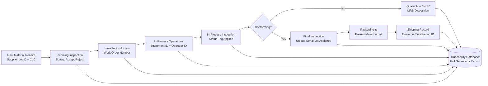

## Identification and Traceability

### Overview

Identification and Traceability corresponds to ISO 9001:2015 Clause 8.5.2. It addresses the mechanisms by which an organization distinguishes outputs from one another, tracks their status through monitoring and measurement stages, and — where required — maintains the ability to trace an output's history, application, or location. This clause functions as an enabler for effective nonconformity management, recall response, and root-cause analysis, and interfaces heavily with Clause 8.5.1 (Control of Production and Service Provision) and Clause 8.7 (Control of Nonconforming Outputs).

### Clause 8.5.2 Text — Structural Breakdown

ISO 9001:2015, 8.5.2 states that the organization shall use suitable means to identify outputs when it is necessary to ensure the conformity of products and services. This decomposes into three distinct sub-requirements:

1. **Identification of outputs** — using suitable means, where necessary to ensure conformity
2. **Identification of status** — with respect to monitoring and measurement requirements, throughout production and service provision
3. **Traceability control** — where traceability is a requirement, the organization shall control the unique identification of outputs and shall retain the documented information necessary to enable traceability

**Key Points**

- The clause is conditional: identification is required only "when necessary to ensure conformity," and traceability is required only "where traceability is a requirement" (contractual, regulatory, or risk-driven).
- The standard does not mandate a specific identification technology or method — it requires "suitable means," giving organizations latitude to select an approach proportionate to risk.

### Identification of Outputs

**Purpose:** Prevent mix-up, misapplication, or confusion between similar-looking or similar-numbered items at any stage of production or service delivery.

**Common Identification Means**

| Method | Typical Application |
| --- | --- |
| Part number / model number labeling | Discrete manufacturing |
| Serial number | High-value or safety-critical individual units |
| Batch/lot number | Bulk or continuous-process outputs (chemicals, food, pharma) |
| Barcode (1D) | High-volume, low-cost scanning applications |
| 2D matrix code (Data Matrix, QR) | Small parts, high data density, direct part marking (DPM) |
| RFID tag | Asset tracking, work-in-progress (WIP) tracking without line-of-sight |
| Physical tagging/color-coding | Visual status differentiation on the shop floor |
| Document/case reference number | Service industries (legal files, medical records, tickets) |
| Digital record ID / database key | Software, digital service outputs |

**[Inference]** Selection among these methods is typically risk-based rather than prescribed; a low-risk commodity item may need only a batch stamp, while a flight-critical aerospace component typically warrants a unique, permanent, and traceable serial identifier — the standard leaves this proportionality judgment to the organization's own risk assessment rather than specifying thresholds.

### Identification of Status

Status identification communicates where an item stands relative to required monitoring and measurement activities. This is distinct from product identification (what the item *is*) — status identification indicates what has (or has not yet) been *done to verify* the item.

**Typical Status States**

- Awaiting inspection / incoming inspection pending
- In-process / work-in-progress
- Quarantine / hold
- Inspected — conforming (pass)
- Inspected — nonconforming (fail/reject)
- Rework / repair in progress
- Released for shipment

**Common Physical/Digital Mechanisms**

- Color-coded tags or labels (e.g., green = pass, red = reject, yellow = hold)
- Physical location segregation (quarantine cage, hold area)
- Stamped or signed inspection travelers
- Electronic status flags in an MES (Manufacturing Execution System) or ERP system
- Barcode/RFID scan events updating a status field in a database

**Example**

A precision machining shop uses a traveler card attached to each work order. At each operation, the operator stamps and initials a checkbox corresponding to that step. Upon final inspection, the quality inspector affixes either a green "Accepted" tag or a red "Reject — Hold for MRB" (Material Review Board) tag. Only green-tagged parts are permitted to proceed to the packaging station, which is physically segregated from work-in-process areas.

### Traceability

**Definition (per ISO 9000:2015, 3.6.13):** Traceability is the ability to trace the history, application, or location of an object.

**[Inference]** In a QMS context this is typically operationalized along three possible traceability vectors, though ISO 9000 does not name them as a fixed taxonomy:

- **Origin traceability** — tracing raw materials, components, and their suppliers
- **Process traceability** — tracing which process parameters, equipment, and personnel were involved
- **Destination/distribution traceability** — tracing where the output was shipped or applied after leaving the organization

**When Traceability Is "a Requirement"**

Traceability becomes mandatory under 8.5.2 when triggered by:

- Regulatory/statutory obligation (e.g., medical device UDI regulations, food safety law, pharmaceutical serialization mandates)
- Customer contractual requirement (common in aerospace, defense, automotive)
- Sector-specific standard requirements (IATF 16949, AS9100, ISO 13485)
- Organizational risk assessment (e.g., safety-critical components even absent external mandate)

**Traceability Depth Models**

1. **Batch/Lot-Level Traceability** — a group of units manufactured from common inputs under common conditions shares one identifier. Lower granularity, lower cost, coarser recall scope.
2. **Unit-Level (Serialized) Traceability** — each individual unit carries a unique identifier. Higher granularity, higher cost, precise recall scope.
3. **Full Genealogy / Pedigree Traceability** — the unit's own identifier is linked to the traceability records of every input material and sub-component, forming a multi-tier tree.

**Traceability Record Content (Typical)**

For a manufactured unit, a traceability record set typically links:

- Unique output identifier (serial/lot number)
- Raw material lot numbers and supplier certificates of conformance
- Manufacturing work order / batch record number
- Process parameters used (where relevant to conformity)
- Equipment identifiers used
- Operator/personnel identifiers (particularly for special processes)
- Inspection and test records with disposition
- Packaging and shipping records
- Customer/destination reference

### Traceability Data Flow (Mermaid)

### Traceability System Architecture (svg_diagram)

<svg xmlns="http://www.w3.org/2000/svg" viewBox="0 0 900 460">
<title>Traceability System Data Architecture (svg_diagram)</title>
\<style\>
.n { fill: #eef4fb; stroke: #2b5b84; stroke-width: 2; }
.db { fill: #fef6e8; stroke: #a1731f; stroke-width: 2; }
.t { font-family: Arial, sans-serif; font-size: 13px; fill: #1a1a1a; }
.th { font-family: Arial, sans-serif; font-size: 14px; font-weight: bold; fill: #1a1a1a; }
.e { stroke: #333; stroke-width: 1.5; fill: none; marker-end: url(#arr2); }
\</style\>
<rect x="30" y="30" width="200" height="60" class="n" />
<text x="130" y="55" text-anchor="middle" class="th">Supplier CoC</text>
<text x="130" y="73" text-anchor="middle" class="t">Material Lot Data</text>
<rect x="30" y="130" width="200" height="60" class="n" />
<text x="130" y="155" text-anchor="middle" class="th">Receiving/Incoming QC</text>
<text x="130" y="173" text-anchor="middle" class="t">Accept/Reject Status</text>
<rect x="30" y="230" width="200" height="60" class="n" />
<text x="130" y="255" text-anchor="middle" class="th">Production/MES</text>
<text x="130" y="273" text-anchor="middle" class="t">Equipment + Operator ID</text>
<rect x="30" y="330" width="200" height="60" class="n" />
<text x="130" y="355" text-anchor="middle" class="th">In-Process / Final QC</text>
<text x="130" y="373" text-anchor="middle" class="t">Inspection Records</text>
<rect x="350" y="180" width="220" height="100" class="db" />
<text x="460" y="210" text-anchor="middle" class="th">Central Traceability</text>
<text x="460" y="228" text-anchor="middle" class="th">Database</text>
<text x="460" y="248" text-anchor="middle" class="t">(unique ID as primary key,</text>
<text x="460" y="264" text-anchor="middle" class="t">linked genealogy tree)</text>
<rect x="670" y="80" width="200" height="60" class="n" />
<text x="770" y="105" text-anchor="middle" class="th">Packaging/Shipping</text>
<text x="770" y="123" text-anchor="middle" class="t">Carton + Destination</text>
<rect x="670" y="180" width="200" height="60" class="n" />
<text x="770" y="205" text-anchor="middle" class="th">Customer/Field Data</text>
<text x="770" y="223" text-anchor="middle" class="t">Warranty/Complaint Link</text>
<rect x="670" y="280" width="200" height="60" class="n" />
<text x="770" y="305" text-anchor="middle" class="th">Recall Query Engine</text>
<text x="770" y="323" text-anchor="middle" class="t">Forward/Backward Trace</text>
<path d="M230,60 L350,200" class="e" />
<path d="M230,160 L350,215" class="e" />
<path d="M230,260 L350,235" class="e" />
<path d="M230,360 L350,260" class="e" />
<path d="M570,215 L670,110" class="e" />
<path d="M570,230 L670,210" class="e" />
<path d="M570,250 L670,310" class="e" />
</svg>

### Traceability in Recall Scenarios

**Backward Trace (Root Cause Investigation)**

Given a defective unit found in the field, trace backward: unit serial → manufacturing batch → raw material lots → supplier → other units sharing the same suspect input.

**Forward Trace (Containment/Recall)**

Given a suspect raw material lot, trace forward: material lot → all work orders that consumed it → all units produced → all shipments and customers who received affected units.

**[Inference]** The efficiency of a recall — specifically, how narrowly the affected population can be defined — is generally a direct function of the granularity chosen at the traceability-depth-model decision point; batch-level traceability with a large batch size typically forces a wider (and costlier) recall scope than unit-level serialization would, even when only a small fraction of units within the batch are actually defective.

### Digital and Automated Identification Technologies

| Technology | Read Range | Data Capacity | Typical Use Case |
| --- | --- | --- | --- |
| 1D Barcode | Line-of-sight, contact-near | Low (numeric/alphanumeric string) | Cartons, low-cost items |
| 2D Data Matrix (Direct Part Marking) | Line-of-sight | Medium | Small metal/plastic parts, aerospace hardware |
| QR Code | Line-of-sight | Medium-high | Service records, consumer-facing traceability |
| Passive RFID | Short-medium, non-line-of-sight | Medium | WIP tracking, asset management |
| Active RFID / RTLS | Long, non-line-of-sight | Medium-high | Real-time location tracking of high-value assets |
| Blockchain-based ledger | N/A (data integrity layer) | High (immutable chain-of-custody) | Multi-tier supply chain traceability (e.g., pharma, food) |

**[Unverified]** Blockchain-based traceability implementations are an emerging practice in some regulated supply chains (notably pharmaceutical serialization under DSCSA-type regimes and certain food-safety pilots); ISO 9001 itself is technology-agnostic and does not reference or require any specific digital ledger technology — this remains an organizational implementation choice rather than a standard requirement.

### Service Sector Application

Identification and traceability concepts apply equally to intangible outputs, reinterpreted as follows:

| Manufacturing Concept | Service Sector Equivalent |
| --- | --- |
| Serial number | Case reference number, ticket ID, patient/client file number |
| Batch record | Session log, transaction batch, cohort record |
| Status tag (pass/hold) | Case status field (open/pending review/closed) |
| Material genealogy | Chain of custody for evidence, document version history |
| Recall (forward trace) | Identifying all clients affected by an erroneous advisory or defective service delivery |

**Example**

A clinical laboratory assigns a unique accession number to each specimen upon receipt. The accession number links: patient identifier, specimen collection details, chain-of-custody log, testing equipment ID and calibration status at time of test, technologist ID, result record, and report release timestamp. If a calibration deviation is later discovered on a specific instrument, the laboratory queries all accession numbers processed on that instrument during the affected window to determine which patient results require re-verification.

### Integration with Other Clauses

| Related Clause | Interface |
| --- | --- |
| 8.5.1 Control of Production and Service Provision | Identification/status marking is one of the controlled conditions enabling conformity |
| 8.5.3 Customer/External Provider Property | Identification requirement extends to property not owned by the organization |
| 8.5.4 Preservation | Identification labeling often physically co-located with preservation packaging |
| 8.6 Release of Products and Services | Status identification ("released"/"not released") is the direct trigger for release authorization |
| 8.7 Control of Nonconforming Outputs | Status identification (quarantine/hold tags) is the front-line mechanism preventing unintended use of nonconforming output |
| 7.5 Documented Information | Traceability records must be retained and controlled as documented information |
| 10.2 Nonconformity and Corrective Action | Traceability data is the primary tool for scoping corrective action and containment |

### Common Audit Findings

1. Identification labels present but illegible, degraded, or not permanently affixed for the required retention period
2. Status tags absent or ambiguous at intermediate process stages (only final inspection status marked)
3. Traceability record retention period shorter than regulatory or contractual requirement
4. Unique identifiers reused or duplicated across different batches/lots (identifier collision)
5. Traceability chain broken at a subcontracted or outsourced process step
6. Electronic traceability database lacking backup/version control, risking record loss
7. Customer-required traceability depth (e.g., unit-level) not matched by actual practice (batch-level only)

**Next Steps**

- Direct Part Marking (DPM) standards for aerospace/defense (e.g., ATA Spec 2000, MIL-STD-130)
- Design of a relational database schema for multi-tier genealogy traceability
- UDI (Unique Device Identification) regulatory frameworks for medical devices
- Serialization and track-and-trace regulations in pharmaceuticals (e.g., DSCSA-type frameworks)
- Clause 8.6: Release of Products and Services
- Clause 8.7: Control of Nonconforming Outputs
- Material Review Board (MRB) process design