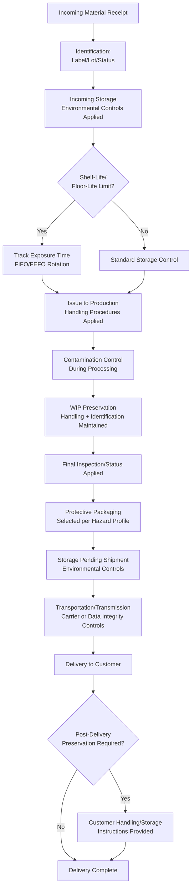

## Preservation of Products and Outputs

### Overview

Preservation of Products and Outputs corresponds to ISO 9001:2015 Clause 8.5.4. It requires the organization to preserve outputs during production and service provision, to the extent necessary to ensure ongoing conformity to requirements. Preservation is process-wide in scope: it applies from the point of receipt of inputs through every intermediate stage, up to and including delivery to the intended destination — not solely to finished-goods storage.

ISO 9001:2015 explicitly notes that preservation may include identification, handling, contamination control, packaging, storage, transmission or transportation, and protection.

### Clause 8.5.4 — Structural Breakdown

**Key Points**

- Preservation applies to **outputs**, which the standard defines broadly enough to include constituent parts of an output during internal processing — not only the final finished product.
- The requirement is qualified by necessity ("to the extent necessary to ensure conformity"), meaning the depth of preservation controls should be proportionate to the risk of degradation or damage for that specific output.
- Preservation is explicitly linked to 8.5.2 (Identification and Traceability), since identification is listed as one of the constituent preservation activities.

### The PHIPP Framework

A commonly used practitioner mnemonic decomposing the six preservation elements named in the standard's guidance:

| Element | Description | Typical Controls |
| --- | --- | --- |
| **P — Identification** | Marking/labeling to prevent mix-up, misuse, or use of expired/superseded material | Lot tags, status labels, shelf-life date coding |
| **H — Handling** | Procedures and equipment preventing damage during movement | Lifting fixtures, ESD wrist straps, material handling SOPs |
| **I — Contamination Control** | Preventing ingress of foreign material or cross-contamination between products | Cleanroom classifications, FOD (foreign object debris) programs, allergen segregation |
| **P — Packaging** | Protective packaging matched to the hazard profile of the item | Anti-static bags, desiccant, shock-indicator labels, custom foam inserts |
| **P — Storage** | Environmental and inventory controls during holding periods | Temperature/humidity-controlled warehousing, FIFO/FEFO rotation, shelf-life management |
| **(implicit) — Transmission/Transportation** | Controls during physical movement between sites or to the customer | Carrier qualification, vibration/shock testing, cold-chain logistics |

**[Inference]** "Transmission" in the clause's language is generally interpreted by practitioners as extending beyond physical transport to include the integrity of data or information transmission for service/digital outputs — though the standard itself does not elaborate a separate definition, this reading follows from the deliberate inclusion of "transmission" as distinct from "transportation" in the same list.

### Preservation Across the Process Lifecycle

Preservation is not a single checkpoint but a continuum. It must be considered at each of the following stages:

1. **Incoming materials** — preservation begins at receipt, before the organization's own processing adds value
2. **In-process work-in-progress (WIP)** — semi-finished items are frequently at highest risk (unprotected surfaces, exposed connectors, uncured materials)
3. **Finished goods, pre-shipment** — storage conditions and shelf-life tracking
4. **Transportation/delivery** — carrier handling, environmental exposure in transit
5. **Post-delivery, pre-installation or pre-use** (where applicable) — e.g., a customer's own warehousing before the product is placed into service

### Contamination Control — Detailed Treatment

Contamination control spans several distinct hazard categories, and appropriate controls differ significantly by industry:

| Contamination Type | Example Industry | Typical Control |
| --- | --- | --- |
| Particulate/dust | Semiconductor, optics | Cleanroom classification (ISO 14644 classes) |
| Foreign object debris (FOD) | Aerospace | FOD prevention program, tool accountability, shadow boards |
| Cross-contamination (allergens) | Food manufacturing | Dedicated lines, allergen changeover procedures |
| Cross-contamination (chemical) | Pharmaceuticals | Dedicated equipment or validated cleaning between batches |
| Electrostatic discharge (ESD) | Electronics | ESD-protected areas (EPAs) per ANSI/ESD S20.20 |
| Moisture ingress | Moisture-sensitive electronic devices | Dry storage, desiccant packs, floor-life tracking per J-STD-033 |
| Microbial contamination | Medical devices, pharma | Sterile barrier packaging, bioburden control |

### Shelf-Life and Time-Sensitive Material Management

**Key Points**

Where outputs (or the materials consumed to produce them) have a finite usable life, preservation controls must include mechanisms to prevent use beyond that life.

**Common mechanisms:**

- **FIFO (First-In, First-Out)** — stock rotation based on receipt/production sequence
- **FEFO (First-Expired, First-Out)** — stock rotation based on expiration date, which may differ from receipt order
- **Floor-life / out-time tracking** — cumulative tracking of time a material has been exposed to ambient conditions once removed from controlled storage (common for moisture-sensitive devices and certain adhesives/prepregs)
- **Shelf-life extension/requalification testing** — periodic retesting to justify extending usable life beyond the originally stated date, where technically and contractually permissible

**Example**

An electronics assembler handles moisture-sensitive devices (MSDs) classified per J-STD-020/J-STD-033. Each reel is labeled with its MSD level, bake-date (if applicable), and calculated floor-life expiration timestamp based on ambient humidity exposure since the moisture-barrier bag was opened. A digital floor-life tracking system flags any reel approaching its exposure limit, triggering either immediate use, re-bake (per defined bake profile), or re-bagging with desiccant and a humidity indicator card.

### Preservation Flow (Mermaid)

### Preservation Control Zones (svg_diagram)

<svg xmlns="http://www.w3.org/2000/svg" viewBox="0 0 900 420">
<title>Preservation Control Zones Across the Process Lifecycle (svg_diagram)</title>
\<style\>
.z { fill: #eef4fb; stroke: #2b5b84; stroke-width: 2; }
.z2 { fill: #fef6e8; stroke: #a1731f; stroke-width: 2; }
.t { font-family: Arial, sans-serif; font-size: 12px; fill: #1a1a1a; }
.th { font-family: Arial, sans-serif; font-size: 14px; font-weight: bold; fill: #1a1a1a; }
.e { stroke: #333; stroke-width: 1.5; fill: none; marker-end: url(#arr3); }
\</style\>
<rect x="20" y="160" width="140" height="100" class="z" />
<text x="90" y="185" text-anchor="middle" class="th">Receiving</text>
<text x="90" y="205" text-anchor="middle" class="t">ID + Verify</text>
<text x="90" y="223" text-anchor="middle" class="t">Env. Storage</text>
<rect x="190" y="160" width="140" height="100" class="z" />
<text x="260" y="185" text-anchor="middle" class="th">WIP</text>
<text x="260" y="205" text-anchor="middle" class="t">Handling SOPs</text>
<text x="260" y="223" text-anchor="middle" class="t">Contamination Ctrl</text>
<rect x="360" y="160" width="140" height="100" class="z" />
<text x="430" y="185" text-anchor="middle" class="th">Final Inspection</text>
<text x="430" y="205" text-anchor="middle" class="t">Status ID Applied</text>
<text x="430" y="223" text-anchor="middle" class="t">Pass/Hold Tag</text>
<rect x="530" y="160" width="140" height="100" class="z" />
<text x="600" y="185" text-anchor="middle" class="th">Packaging</text>
<text x="600" y="205" text-anchor="middle" class="t">Hazard-Matched</text>
<text x="600" y="223" text-anchor="middle" class="t">Protective Materials</text>
<rect x="700" y="160" width="180" height="100" class="z" />
<text x="790" y="185" text-anchor="middle" class="th">Storage/Transport</text>
<text x="790" y="205" text-anchor="middle" class="t">FIFO/FEFO</text>
<text x="790" y="223" text-anchor="middle" class="t">Carrier Qualification</text>
<rect x="300" y="300" width="300" height="70" class="z2" />
<text x="450" y="325" text-anchor="middle" class="th">Shelf-Life / Floor-Life</text>
<text x="450" y="345" text-anchor="middle" class="t">Monitoring Overlay (applies across all zones</text>
<text x="450" y="360" text-anchor="middle" class="t">where time-sensitive material is present)</text>
<path d="M160,210 L190,210" class="e" />
<path d="M330,210 L360,210" class="e" />
<path d="M500,210 L530,210" class="e" />
<path d="M670,210 L700,210" class="e" />
<path d="M450,300 L450,260" class="e" />
</svg>

### Preservation in the Service Sector

For intangible outputs, "preservation" is generally reinterpreted around information integrity rather than physical protection:

| Manufacturing Concept | Service Sector Equivalent |
| --- | --- |
| Packaging | Secure formatting/encryption of a deliverable document |
| Storage environmental control | Data backup, redundant storage, access-controlled archiving |
| Contamination control | Version control, preventing unauthorized edits to a case file |
| Shelf-life management | Retention schedules, document validity periods |
| Transportation/transmission | Secure data transfer protocols, chain-of-custody for physical case files |

**[Inference]** This reinterpretation is a practitioner convention rather than explicit standard text; auditors of service organizations typically probe how the organization prevents "damage" to an intangible output (e.g., data corruption, loss of a case file, unauthorized alteration) as the functional equivalent of physical preservation.

### Example — Preservation Procedure Excerpt (Pharmaceutical Cold-Chain Distribution)

A pharmaceutical distributor's preservation procedure specifies:

- **Identification:** Each pallet labeled with batch number, expiration date, and required storage temperature range
- **Handling:** Forklift operators trained on minimum-handling-time protocol for cold-chain product to limit ambient exposure
- **Contamination control:** Segregated storage for products requiring different temperature bands; no co-mingling with non-pharmaceutical goods
- **Packaging:** Insulated shippers with validated thermal performance, phase-change material packs sized per season
- **Storage:** Continuous temperature monitoring with automated excursion alarms; calibrated data loggers
- **Transportation:** Qualified cold-chain carriers only; real-time temperature logger shipped with each consignment, reviewed against acceptance criteria upon receipt confirmation

### Common Audit Findings

1. Preservation requirements defined for finished goods but not addressed for work-in-progress
2. Shelf-life or floor-life tracking absent or manually maintained with no verification against the master specification
3. Packaging specifications not linked to a documented hazard/risk assessment (packaging selected informally)
4. Storage environmental monitoring records show excursions with no evidence of disposition or investigation
5. FIFO/FEFO rotation not enforced in practice despite being documented in procedure (physical stock does not match documented method)
6. Transportation/carrier qualification not evidenced for outsourced logistics providers
7. Contamination control procedures not updated following a product line change or new material introduction

### Integration with Other Clauses

| Related Clause | Interface |
| --- | --- |
| 8.5.1 Control of Production and Service Provision | Preservation is one of the controlled conditions ensuring output conformity |
| 8.5.2 Identification and Traceability | Identification is explicitly listed as a constituent preservation activity |
| 8.5.3 Customer/External Provider Property | Preservation obligations extend to property not owned by the organization while in its custody |
| 7.1.3 Infrastructure / 7.1.4 Environment | Physical infrastructure (climate-controlled warehousing, cleanrooms) enables preservation controls |
| 8.6 Release of Products and Services | Preservation status may be a release precondition (e.g., no release if cold-chain excursion occurred) |
| 8.7 Control of Nonconforming Outputs | Preservation failures (contamination, damage, expiry) are a common nonconformity source |
| 10.2 Nonconformity and Corrective Action | Root-cause analysis of preservation-related nonconformities feeds corrective action |

**Next Steps**

- ANSI/ESD S20.20 — Electrostatic Discharge Control Program design
- J-STD-033 — Moisture-Sensitive Device handling and floor-life calculation methodology
- ISO 14644 — Cleanroom classification standards
- Cold-chain logistics qualification and validation (temperature-mapping studies)
- FOD (Foreign Object Debris) prevention program design for aerospace manufacturing
- Clause 8.5.3: Property Belonging to Customers or External Providers
- Clause 8.6: Release of Products and Services