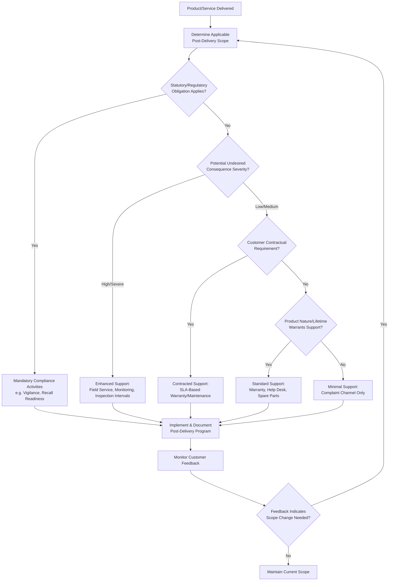

## Post Delivery Activities and Customer Support

### Overview

Post Delivery Activities and Customer Support corresponds to ISO 9001:2015 Clause 8.5.5. It requires the organization to meet requirements for activities that occur after a product has been delivered or a service has been completed, where such activities are applicable to that product or service. The clause is deliberately scoped by a risk-based determination process rather than a fixed list of mandatory activities — the organization must first determine *whether and to what extent* post-delivery activities apply, then implement accordingly.

### Clause 8.5.5 — Structural Breakdown

**Key Points**

ISO 9001:2015, 8.5.5 requires the organization to meet requirements for post-delivery activities associated with products and services. In determining the extent of post-delivery activities required, the organization must consider:

1. **Statutory and regulatory requirements**
2. **Potential undesired consequences** associated with its products and services
3. **Nature, use, and intended lifetime** of its products and services
4. **Customer requirements**
5. **Customer feedback**

This is a determination clause: the standard does not mandate that every organization provide warranty, maintenance, or support services — it mandates that the organization *think through* these five factors and document/implement whatever post-delivery scope that analysis yields.

### The Five Determination Factors — Detailed Treatment

**1. Statutory and Regulatory Requirements**

Certain sectors carry legally mandated post-delivery obligations independent of customer request:

- Medical device vigilance/adverse event reporting obligations
- Automotive recall obligations under national transport safety law
- Consumer product safety recall frameworks
- Pharmaceutical pharmacovigilance requirements
- Environmental take-back/end-of-life disposal obligations (e.g., WEEE-type extended producer responsibility regimes)

**[Unverified]** Specific regulatory citations vary substantially by jurisdiction and sector; organizations typically maintain a regulatory-requirements register cross-referenced to applicable markets rather than relying on ISO 9001 to specify obligations, since the standard itself is jurisdiction-agnostic.

**2. Potential Undesired Consequences**

This factor drives risk-based scoping: products/services with higher potential severity of failure consequence generally warrant more extensive post-delivery activity.

| Consequence Severity | Example | Typical Post-Delivery Response |
| --- | --- | --- |
| Low (inconvenience) | Consumer electronics accessory | Standard warranty, help desk |
| Medium (functional loss) | Home appliance | Warranty, scheduled maintenance program |
| High (safety-critical) | Automotive braking component, medical device | Field service, mandatory inspection intervals, recall infrastructure |
| Severe (life-safety) | Aircraft structural component | Continuing airworthiness support, mandatory service bulletins |

**3. Nature, Use, and Intended Lifetime**

- A single-use consumable product typically requires minimal post-delivery activity beyond a complaint-handling channel.
- A long-life capital asset (industrial machinery, aircraft, medical imaging equipment) typically requires a structured lifecycle support program spanning years or decades.

**4. Customer Requirements**

Contractually specified obligations, e.g.:

- Guaranteed spare parts availability for a defined period
- Response-time SLAs for field service
- Scheduled preventive maintenance visits
- Software update/patch support commitments

**5. Customer Feedback**

Post-delivery scope is not static; feedback (complaints, satisfaction surveys, field failure reports) is an input that can trigger expansion or revision of the post-delivery activity scope — linking 8.5.5 forward to Clause 9.1.2 (Customer Satisfaction).

### Determination Logic (Mermaid)

### Typical Post-Delivery Activity Categories

| Category | Description | Example Elements |
| --- | --- | --- |
| **Warranty** | Contractual/implied commitment to remedy defects within a defined period | Warranty terms, claim intake process, repair/replace/refund decision matrix |
| **Maintenance Services** | Scheduled or on-demand servicing to sustain performance | Preventive maintenance schedules, service contracts, field technician dispatch |
| **Technical Support / Help Desk** | Channel for customer inquiries and troubleshooting | Tiered support structure, knowledge base, ticketing system, SLA response times |
| **Spare Parts Provision** | Commitment to part availability over product lifetime | Minimum stocking periods, obsolescence management plans |
| **Recall / Field Corrective Action** | Structured process for removing or correcting defective units already in the field | Recall notification protocol, traceability-driven affected-unit identification (linked to 8.5.2) |
| **Recycling / Disposal Instructions** | End-of-life guidance, particularly where regulated | Take-back programs, disposal labeling, material declaration documentation |
| **Installation/Commissioning Support** | Assistance at the point of first use, where the product requires setup | Installation manuals, on-site commissioning services, training |

### Post-Delivery Program Architecture (svg_diagram)

<svg xmlns="http://www.w3.org/2000/svg" viewBox="0 0 900 480">
<title>Post-Delivery Activities and Customer Support Program Architecture (svg_diagram)</title>
\<style\>
.c { fill: #eef4fb; stroke: #2b5b84; stroke-width: 2; }
.c2 { fill: #fef6e8; stroke: #a1731f; stroke-width: 2; }
.t { font-family: Arial, sans-serif; font-size: 12px; fill: #1a1a1a; }
.th { font-family: Arial, sans-serif; font-size: 14px; font-weight: bold; fill: #1a1a1a; }
.e { stroke: #333; stroke-width: 1.5; fill: none; marker-end: url(#arr4); }
\</style\>
<rect x="340" y="20" width="220" height="50" class="c2" />
<text x="450" y="50" text-anchor="middle" class="th">Delivered Product/Service</text>
<rect x="40" y="120" width="160" height="70" class="c" />
<text x="120" y="150" text-anchor="middle" class="th">Warranty</text>
<text x="120" y="170" text-anchor="middle" class="t">Claim Intake &amp; Disposition</text>
<rect x="220" y="120" width="160" height="70" class="c" />
<text x="300" y="150" text-anchor="middle" class="th">Maintenance</text>
<text x="300" y="170" text-anchor="middle" class="t">Scheduled/On-Demand</text>
<rect x="400" y="120" width="160" height="70" class="c" />
<text x="480" y="150" text-anchor="middle" class="th">Help Desk</text>
<text x="480" y="170" text-anchor="middle" class="t">Tiered Support/SLA</text>
<rect x="580" y="120" width="160" height="70" class="c" />
<text x="660" y="150" text-anchor="middle" class="th">Spare Parts</text>
<text x="660" y="170" text-anchor="middle" class="t">Availability Commitment</text>
<rect x="130" y="250" width="200" height="70" class="c" />
<text x="230" y="280" text-anchor="middle" class="th">Recall / Field</text>
<text x="230" y="300" text-anchor="middle" class="t">Corrective Action</text>
<rect x="360" y="250" width="200" height="70" class="c" />
<text x="460" y="280" text-anchor="middle" class="th">Recycling / Disposal</text>
<text x="460" y="300" text-anchor="middle" class="t">End-of-Life Instructions</text>
<rect x="590" y="250" width="200" height="70" class="c" />
<text x="690" y="280" text-anchor="middle" class="th">Installation/Commissioning</text>
<text x="690" y="300" text-anchor="middle" class="t">Setup Support/Training</text>
<rect x="270" y="380" width="360" height="70" class="c2" />
<text x="450" y="405" text-anchor="middle" class="th">Customer Feedback Loop</text>
<text x="450" y="425" text-anchor="middle" class="t">(9.1.2 Customer Satisfaction)</text>
<text x="450" y="440" text-anchor="middle" class="t">feeds back into scope determination</text>
<path d="M450,70 L120,120" class="e" />
<path d="M450,70 L300,120" class="e" />
<path d="M450,70 L480,120" class="e" />
<path d="M450,70 L660,120" class="e" />
<path d="M120,190 L230,250" class="e" />
<path d="M480,190 L460,250" class="e" />
<path d="M660,190 L690,250" class="e" />
<path d="M230,320 L400,380" class="e" />
<path d="M460,320 L450,380" class="e" />
<path d="M690,320 L500,380" class="e" />
<path d="M270,415 L200,120" class="e" stroke-dasharray="4,3" />
</svg>

### Warranty Management — Process Detail

**Key Points**

A warranty process is one of the most commonly implemented post-delivery activities and typically includes:

1. **Claim intake** — structured capture of failure description, date of failure, proof of purchase, unit identifier (traceability linkage)
2. **Eligibility verification** — confirmation the claim falls within warranty period and covered failure modes
3. **Disposition decision** — repair, replace, refund, or deny, per a defined decision matrix
4. **Root-cause capture** — warranty claims are a primary field-failure data source feeding corrective action (10.2) and design improvement (8.3)
5. **Closure and customer communication**
6. **Warranty cost/trend analysis** — aggregated claim data reviewed as an input to management review (9.3)

**Example**

An appliance manufacturer's warranty procedure requires every claim to be logged with the unit's serial number, which the customer service system cross-references against the traceability database (per 8.5.2) to pull the original manufacturing batch, component lot numbers, and final inspection record. If three or more claims within a rolling 30-day window trace back to the same component lot, an automatic nonconformity report is triggered for investigation, potentially escalating to a field corrective action assessment under 8.5.5's recall provisions.

### Field Service and Maintenance Program Design

**Elements typically included:**

- **Preventive maintenance (PM) schedule** — defined intervals (time-based, usage-based, or condition-based) for inspection and servicing
- **Service level agreements (SLAs)** — response time and resolution time commitments, often tiered by criticality
- **Field technician competency management** — linked to Clause 7.2, ensuring personnel performing post-delivery service are qualified, particularly where the service touches special processes
- **Service parts logistics** — ensuring availability of correct spare parts at point of need
- **Service record retention** — documented information demonstrating maintenance was performed per schedule, particularly critical for regulated/safety-critical equipment

**[Inference]** Where field service work involves re-performing a special process (e.g., field welding repair, recalibration of a measurement device), the validation requirements of 8.5.1(f) generally extend to that field activity as well — the process does not cease to be "special" merely because it occurs post-delivery rather than in the original production environment.

### Recall and Field Corrective Action Process

A structured recall process typically comprises:

1. **Trigger identification** — field failure pattern, regulatory notification, internal quality escalation
2. **Scope determination** — using traceability data (8.5.2) to identify the affected population (forward trace from suspect lot/batch/component)
3. **Risk assessment** — severity and likelihood of the identified failure mode
4. **Regulatory notification** (where statutorily required)
5. **Customer notification** — communication protocol, timeline commitments
6. **Corrective action execution** — repair, replacement, retrofit, or retrieval
7. **Effectiveness verification** — confirming the corrective action resolved the issue and reached the full affected population
8. **Closure documentation**

### Customer Support Channel Architecture

| Support Tier | Typical Scope | Escalation Trigger |
| --- | --- | --- |
| Tier 1 (Front-line) | General inquiries, basic troubleshooting, order/warranty status | Unresolved after defined time/attempt threshold |
| Tier 2 (Technical) | Product-specific technical troubleshooting, field service dispatch | Suspected defect requiring engineering input |
| Tier 3 (Engineering/Quality) | Root-cause investigation, nonconformity determination | Confirmed defect trend, potential recall scope |

### Common Audit Findings

1. No documented determination of post-delivery activity scope — organization has a warranty program "by default" without evidence the five factors (8.5.5 a–e) were actually considered
2. Warranty claim records not linked to traceability data, preventing effective trend analysis
3. Field service records for regulated/safety-critical equipment incomplete or not retained per required retention period
4. Recall/field corrective action procedure exists but has never been tested via simulation/drill
5. Spare parts availability commitments in customer contracts not matched by actual inventory or obsolescence management practice
6. Customer feedback from support channels not systematically fed into Clause 9.1.2 customer satisfaction monitoring or 10.2 corrective action

### Integration with Other Clauses

| Related Clause | Interface |
| --- | --- |
| 8.5.2 Identification and Traceability | Enables scoping of affected population in recall/field corrective action scenarios |
| 8.2.1 Customer Communication | Provides the channel infrastructure for post-delivery customer interaction |
| 7.2 Competence | Applies to field service/support personnel qualification |
| 9.1.2 Customer Satisfaction | Consumes post-delivery feedback (complaints, warranty data, support tickets) |
| 10.2 Nonconformity and Corrective Action | Warranty/field failure data is a primary corrective-action trigger source |
| 9.3 Management Review | Warranty cost, recall frequency, and support metrics are typical management review inputs |
| 8.3 Design and Development | Field failure data feeds back into design improvement and design validation criteria |

**Next Steps**

- Warranty cost analysis and trend-based early-warning system design
- Field corrective action (recall) simulation/drill program design
- Service level agreement (SLA) structuring for tiered technical support
- Spare parts obsolescence management and lifecycle planning
- Clause 9.1.2: Customer Satisfaction
- Clause 10.2: Nonconformity and Corrective Action