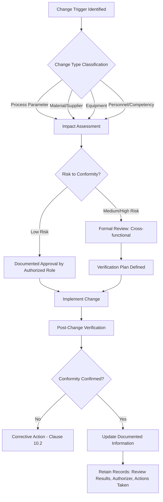
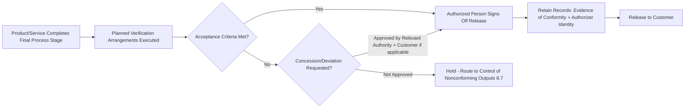
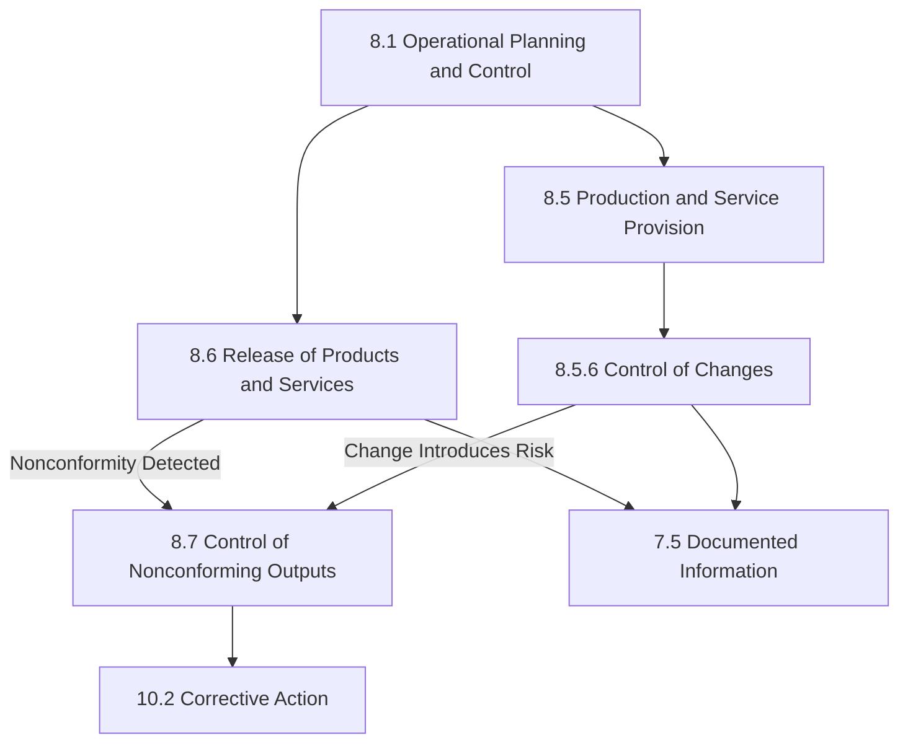

## Control of Changes and Release of Products and Services

### Overview

This clause addresses two related but distinct operational control requirements within ISO 9001: the systematic management of changes affecting conformity to requirements (Clause 8.5.6 - Control of Changes), and the verification gate that must be passed before products and services reach the customer (Clause 8.6 - Release of Products and Services). Both clauses function as control points embedded within operational planning and control (Clause 8.1), ensuring that variability introduced by changes does not compromise conformity, and that nonconforming outputs are prevented from unintended delivery.

### Control of Changes (Clause 8.5.6)

#### Purpose and Scope

Clause 8.5.6 requires organizations to review and control changes for production or service provision, to the extent necessary to ensure continuing conformity with requirements. This clause applies specifically to changes occurring *during* ongoing production or service delivery — distinct from:

- **Clause 6.3** (Planning of Changes) — changes to the QMS itself
- **Clause 8.3.6** (Design and Development Changes) — changes during the design phase
- **Clause 8.4** (Control of Externally Provided Processes) — supplier-side changes

**Key Points**

- Applies to changes in process parameters, equipment, materials, personnel competency assignments, work instructions, or environmental conditions that could affect output conformity
- The organization must retain documented information describing the results of the review of changes, the person(s) authorizing the change, and any necessary actions arising from the review
- Change control must occur *before* implementation where feasible, to allow risk assessment

#### Change Control Process Flow

#### Documented Information Requirements

| Element | Requirement | Typical Evidence |
| --- | --- | --- |
| Change description | What changed, why, and scope of impact | Change request form, engineering change notice (ECN) |
| Review results | Assessment of conformity risk | Risk assessment matrix, FMEA update |
| Authorization | Named individual(s) with authority | Approval signature/digital sign-off, defined authority matrix |
| Resulting actions | Any corrective/preventive measures triggered by the review | Action log, updated work instructions |

#### Practical Example

A manufacturing line switches a raw material supplier due to a supply chain disruption. Under 8.5.6, the organization must:

1. Log the change request with justification (supply continuity)
2. Assess whether the new material's specifications match required tolerances (dimensional, chemical, mechanical properties as applicable)
3. Determine if requalification testing or a pilot run is needed before full-scale substitution
4. Assign an authorized quality engineer to approve the change based on test results
5. Retain the requalification report, approval record, and any updated control plan or FMEA as documented information

[Inference] In practice, many organizations integrate 8.5.6 change control into their existing Engineering Change Management (ECM) or Management of Change (MOC) systems rather than maintaining a separate QMS-only process, since auditors generally accept an integrated system provided traceability to conformity impact is demonstrable.

### Release of Products and Services (Clause 8.6)

#### Purpose and Scope

Clause 8.6 requires that planned arrangements be implemented at appropriate stages to verify that product and service requirements have been met, **before** release to the customer, unless otherwise approved by a relevant authority and, where applicable, the customer.

This is the final (or staged) verification gate distinguishing this clause from:

- **Clause 8.5.1** (general production/service provision controls, which occur *during* the process)
- **Clause 9.1** (monitoring and measurement of the QMS as a whole, which is broader and includes customer satisfaction)

#### Core Requirements

**Key Points**

- Release **shall not proceed** until all planned arrangements have been satisfactorily completed, unless approved by a relevant authority and, where applicable, the customer
- Documented information must provide traceability to the person(s) authorizing release
- Documented information must include evidence of conformity with acceptance criteria

#### Release Authorization Flow

#### Distinguishing Concession-Based Release

A critical nuance in 8.6 is the escape clause: release may proceed **without** full satisfaction of planned arrangements only if:

1. A relevant authority (internal, e.g., Quality Manager or designated role) approves the deviation, **and**
2. Where applicable, the customer also approves (this is typically required when contractual or regulatory acceptance criteria are affected)

This is functionally a **concession** and should be cross-referenced with **Clause 8.7** (Control of Nonconforming Outputs), since product not meeting full acceptance criteria is, by definition, a nonconforming output being released under documented concession — not a bypass of the nonconformity process.

#### Documented Information Requirements

| Element | Requirement | Typical Evidence |
| --- | --- | --- |
| Conformity evidence | Objective evidence acceptance criteria were met | Inspection reports, test certificates, Certificate of Analysis (CoA), final inspection checklist |
| Traceability to authorizer | Identity of the person(s) authorizing release | Signed release note, electronic sign-off with user ID/timestamp |
| Concession records (if applicable) | Approval trail for any deviation-based release | Concession/deviation form, customer waiver letter |

#### Practical Example

A precision parts manufacturer completes a batch of machined components. Before shipment:

1. **Planned arrangement**: 100% dimensional inspection using CMM (coordinate measuring machine) per the control plan
2. **Verification**: Inspector records measurements against drawing tolerances
3. **Acceptance criteria met**: Quality inspector signs the release record, referencing the inspection report number
4. **Documented information retained**: Inspection report + release authorization with inspector ID and date, linked to the batch/lot number for traceability

If one dimension is marginally out of tolerance but functionally acceptable, and the customer has a documented waiver process:

1. Nonconformity is logged (8.7)
2. A concession request is routed to the Quality Manager (relevant authority)
3. Customer approval is obtained and documented (waiver reference number)
4. Release proceeds with the concession record retained alongside standard release documentation

### Interrelationship with Other Clauses

- **8.5.6 → 8.6**: A change implemented mid-process may necessitate additional or modified release verification arrangements (e.g., a material substitution may trigger supplementary testing before release)
- **8.6 → 8.7**: Any release proceeding under concession is inherently linked to nonconforming output control
- **Both → 7.5**: Documented information requirements in both clauses draw on the general documented information controls (creation, retention, protection)

### Common Audit Findings

- **Key Points**
  - Missing documented authority matrix defining who may approve changes or authorize release (auditors frequently cite ambiguity in "who can sign off")
  - Release records lacking traceability to specific inspection/test evidence (e.g., a signature with no reference to which report or dataset was reviewed)
  - Changes implemented without prior review when the organization's own procedure requires pre-implementation approval (procedure vs. practice gap)
  - Concession-based releases proceeding without documented customer approval where the customer contract requires it

[Unverified] The specific frequency of these findings varies by certification body and industry sector; the patterns described reflect commonly reported nonconformities in ISO 9001 audit literature rather than a universal statistic.

**Next Steps**

- Control of Nonconforming Outputs (Clause 8.7)
- Corrective Action (Clause 10.2)
- Design and Development Changes (Clause 8.3.6)
- Planning of Changes (Clause 6.3)
- Monitoring and Measurement Resources (Clause 7.1.5)
- Control of Documented Information (Clause 7.5)
- Management of Change (MOC) system integration with QMS