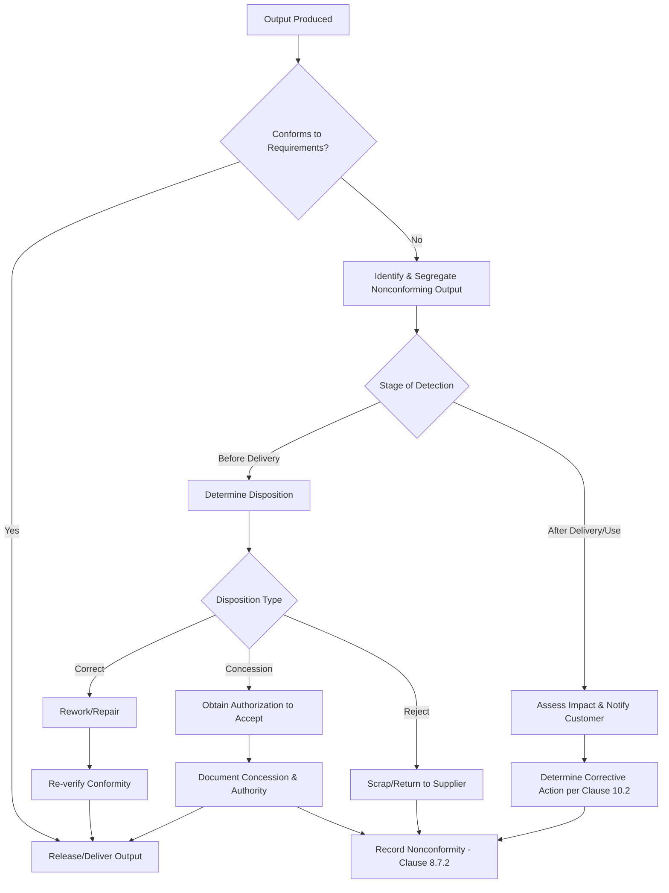

## Control of Nonconforming Outputs

### Overview

Control of Nonconforming Outputs refers to the requirements under ISO 9001:2015 Clause 8.7 that govern how an organization identifies, controls, and disposes of outputs (products, services, or process results) that do not conform to specified requirements. The objective is to prevent unintended use or delivery of nonconforming outputs to the customer.

This clause replaces the ISO 9001:2008 concept of "Control of Nonconforming Product" (Clause 8.3) with a broader scope that explicitly includes services and process outputs, not just physical products.

### Key Points

- Nonconforming outputs must be identified and controlled to prevent unintended use or delivery
- The organization must take action based on the nature of the nonconformity and its effect on conformity of products/services
- This applies to nonconforming outputs detected at any stage: during production/service provision, after delivery, or after the start of use
- Corrective action (Clause 10.2) is a related but distinct requirement — 8.7 governs the *immediate* disposition, while 10.2 governs *root cause elimination*

### Scope of Application

Clause 8.7 applies wherever an output fails to meet:

- Specified product/service requirements
- Regulatory or statutory requirements
- Customer requirements
- Internal quality criteria defined by the organization's QMS

### Required Actions Under 8.7.1

The standard requires the organization to deal with nonconforming outputs in one or more of the following ways:

1. **Correction** — Fixing the nonconformity so the output becomes conforming
2. **Segregation** — Physically or procedurally isolating the nonconforming output to prevent its use
3. **Containment** — Limiting the spread or impact of the nonconformity (e.g., halting a batch)
4. **Return or suspension** — Returning the output or suspending provision of the product/service
5. **Informing the customer** — Notifying the customer when nonconforming output has already been delivered
6. **Obtaining authorization for acceptance** — Securing formal concession, under **concession**, by a relevant authority and, where applicable, the customer, to accept the output "as is" or via rework

Verification of conformity must be re-performed after correction, before the output is released.

### Handling Nonconformity Detected After Delivery

If nonconformity is discovered after delivery or after the customer has begun using the product/service, the organization must take action appropriate to the effects, or potential effects, of the nonconformity. This may include:

- Product recall
- Service correction/re-performance
- Customer notification and remediation
- Field action or advisory notices

### Documented Information Requirements (Clause 8.7.2)

The organization must retain documented information that:

- Describes the nonconformity
- Describes the actions taken
- Describes any concessions obtained
- Identifies the authority deciding the action in respect of the nonconformity

**Example**

A typical Nonconforming Output Record includes the following fields:

| Field | Description |
| --- | --- |
| NCR ID | Unique nonconformity record identifier |
| Date detected | When the nonconformity was found |
| Stage detected | Incoming, in-process, final inspection, post-delivery |
| Description | Nature of the nonconformity |
| Disposition | Correction / segregation / scrap / concession / return |
| Authorized by | Role/person approving disposition |
| Customer notified | Yes/No, with date if applicable |
| Verification of correction | Re-inspection/re-test results |
| Link to CAPA | Reference to corrective action record, if root cause investigation is triggered |

### Process Flow

### Relationship to Other Clauses

<svg xmlns="http://www.w3.org/2000/svg" viewBox="0 0 700 320">
<text x="350" y="25" text-anchor="middle" font-size="16" font-weight="bold" fill="#1a1a1a">Clause 8.7 Interfaces (svg_diagram)</text>
<rect x="270" y="50" width="160" height="60" rx="6" fill="#e8f0fe" stroke="#4285f4" stroke-width="1.5" />
<text x="350" y="75" text-anchor="middle" font-size="13" font-weight="bold" fill="#1a1a1a">Clause 8.7</text>
<text x="350" y="93" text-anchor="middle" font-size="11" fill="#1a1a1a">Nonconforming Outputs</text>
<rect x="30" y="160" width="160" height="60" rx="6" fill="#fef7e0" stroke="#f9ab00" stroke-width="1.5" />
<text x="110" y="185" text-anchor="middle" font-size="13" font-weight="bold" fill="#1a1a1a">Clause 8.6</text>
<text x="110" y="203" text-anchor="middle" font-size="11" fill="#1a1a1a">Release of Products/Services</text>
<rect x="270" y="160" width="160" height="60" rx="6" fill="#fce8e6" stroke="#ea4335" stroke-width="1.5" />
<text x="350" y="185" text-anchor="middle" font-size="13" font-weight="bold" fill="#1a1a1a">Clause 10.2</text>
<text x="350" y="203" text-anchor="middle" font-size="11" fill="#1a1a1a">Nonconformity &amp; Corrective Action</text>
<rect x="510" y="160" width="160" height="60" rx="6" fill="#e6f4ea" stroke="#34a853" stroke-width="1.5" />
<text x="590" y="185" text-anchor="middle" font-size="13" font-weight="bold" fill="#1a1a1a">Clause 9.1</text>
<text x="590" y="203" text-anchor="middle" font-size="11" fill="#1a1a1a">Monitoring &amp; Measurement</text>
<rect x="270" y="260" width="160" height="50" rx="6" fill="#f3e8fd" stroke="#a142f4" stroke-width="1.5" />
<text x="350" y="282" text-anchor="middle" font-size="13" font-weight="bold" fill="#1a1a1a">Clause 7.5</text>
<text x="350" y="298" text-anchor="middle" font-size="11" fill="#1a1a1a">Documented Information</text>
<line x1="270" y1="80" x2="190" y2="180" stroke="#666" stroke-width="1.5" />
<line x1="350" y1="110" x2="350" y2="160" stroke="#666" stroke-width="1.5" />
<line x1="430" y1="80" x2="510" y2="180" stroke="#666" stroke-width="1.5" />
<line x1="350" y1="220" x2="350" y2="260" stroke="#666" stroke-width="1.5" />
</svg>

### Concession and Authorization

A **concession** is a formal approval to release an output that does not meet specified requirements, typically restricted to a specific quantity, batch, or time period. Key considerations:

- Must be authorized by a role with defined authority (per Clause 5.3, Organizational Roles)
- Where contractually required, customer concession/waiver approval is also needed
- Concessions must not become a substitute for systemic correction — a recurring reliance on concessions is typically a nonconformity finding during audits (indicating the underlying process is not capable)

### Common Audit Findings Related to 8.7

- Nonconforming output records exist but lack evidence of disposition authorization
- Segregation areas (quarantine, "hold" bins/labels) are not physically or procedurally maintained
- No linkage between recurring nonconformities and Clause 10.2 corrective action triggers
- Concessions granted without documented authority level defined in the QMS
- Nonconformities detected post-delivery lack evidence of customer notification or impact assessment

### Integration with Risk-Based Thinking

Under the ISO 9001:2015 risk-based approach (Clause 6.1), organizations are expected to:

- Use nonconformity trend data as input into risk assessment
- Adjust process controls proactively where recurring nonconformity patterns emerge
- Treat high-severity/high-frequency nonconformities with escalated disposition authority requirements

### Standards Cross-Reference

| Standard | Clause | Notes |
| --- | --- | --- |
| ISO 9001:2015 | 8.7 | Primary requirement source |
| ISO 9001:2008 | 8.3 | Predecessor clause, narrower scope ("nonconforming product" only) |
| ISO 13485:2016 | 8.7 | Medical device-specific; adds requirements for post-delivery nonconformities affecting safety/performance |
| IATF 16949:2016 | 8.7 | Automotive sector; adds specific controls for suspect/reworked product and customer notification timelines |
| AS9100D | 8.7 | Aerospace sector; adds requirements for disposition of nonconforming product beyond the organization's control (e.g., at sub-tier suppliers) |

[Inference] Sector-specific standards generally impose stricter documentation and notification timelines than the base ISO 9001 requirement, though exact thresholds vary by certification body interpretation and contractual agreements.

**Related Topics**

- Clause 10.2 — Nonconformity and Corrective Action
- Clause 8.6 — Release of Products and Services
- Clause 9.1.3 — Analysis and Evaluation (nonconformity trend data)
- Root Cause Analysis Methods (5 Whys, Fishbone/Ishikawa)
- Failure Mode and Effects Analysis (FMEA)
- Supplier Nonconformity Management (Clause 8.4)
- Risk-Based Thinking (Clause 6.1)