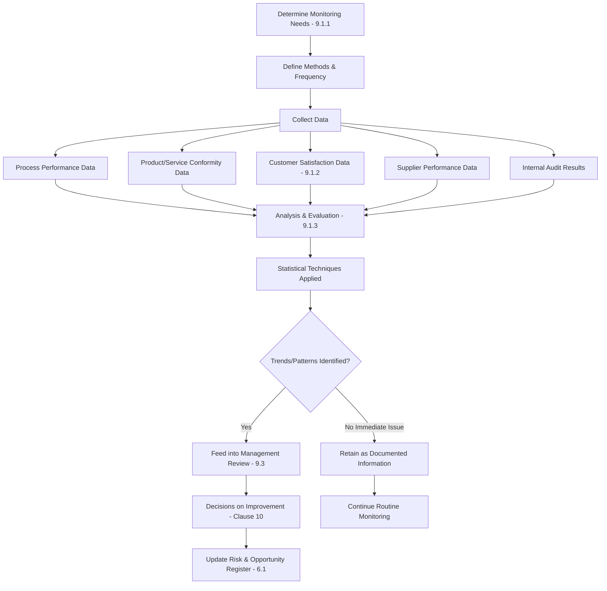

## Monitoring, Measurement, Analysis and Evaluation

### Overview

Monitoring, Measurement, Analysis and Evaluation corresponds to ISO 9001:2015 Clause 9.1, which establishes requirements for determining what needs to be monitored and measured within a Quality Management System, the methods used, and how the resulting data is analyzed and evaluated to judge QMS performance and effectiveness.

This clause forms the foundation of the "Check" phase in the Plan-Do-Check-Act (PDCA) cycle applied to the QMS as a whole.

### Key Points

- The organization must determine **what** to monitor/measure, **when**, and **the methods** to use
- Monitoring and measurement must produce valid, reliable results
- Results must be analyzed and evaluated, not merely collected
- Clause 9.1 has three sub-clauses: 9.1.1 (General), 9.1.2 (Customer Satisfaction), 9.1.3 (Analysis and Evaluation)
- Data-driven decision-making is a core QMS principle underpinning this clause

### Clause 9.1.1 — General Requirements

The organization must determine:

1. **What needs to be monitored and measured** — process performance, product/service conformity, customer satisfaction, supplier performance, QMS effectiveness
2. **The methods** for monitoring, measurement, analysis, and evaluation needed to ensure valid results
3. **When** the monitoring and measuring shall be performed
4. **When** the results shall be analyzed and evaluated

The organization must evaluate the performance and effectiveness of the QMS, and retain appropriate documented information as evidence of the results.

### Clause 9.1.2 — Customer Satisfaction

The organization must monitor customer perceptions of the degree to which their needs and expectations have been fulfilled. Methods for obtaining this information must be determined.

**Example methods:**

| Method | Description | Typical Use Case |
| --- | --- | --- |
| Customer surveys | Structured questionnaires (CSAT, NPS) | Post-delivery or periodic feedback |
| Complaint data | Frequency, severity, resolution time | Ongoing operational monitoring |
| Warranty claims | Field failure rates | Product-based industries |
| Market share analysis | Competitive positioning trends | Strategic-level review |
| Compliments/testimonials | Unsolicited positive feedback | Qualitative supplementary input |
| Repeat business/retention rate | Customer loyalty indicator | Long-term relationship tracking |
| Direct communication/interviews | Structured or informal dialogue | Key account management |

### Clause 9.1.3 — Analysis and Evaluation

The organization must analyze and evaluate appropriate data and information arising from monitoring and measurement. Analysis results must be used to evaluate:

- Conformity of products and services
- The degree of customer satisfaction
- The performance and effectiveness of the QMS
- Whether planning has been implemented effectively
- The effectiveness of actions taken to address risks and opportunities
- Performance of external providers (suppliers)
- The need for improvements to the QMS

### Data Flow Architecture

### Common Monitoring Metrics by Category

**Process Performance**

- Cycle time
- First-pass yield
- Defect rate per process step
- Resource utilization

**Product/Service Conformity**

- Inspection/test pass rate
- Nonconformity rate (linked to Clause 8.7)
- Rework/scrap rate

**QMS Effectiveness**

- Internal audit findings closure rate
- Corrective action closure time
- Management review action completion rate
- Objective achievement rate (linked to Clause 6.2)

**Supplier Performance**

- On-time delivery rate
- Incoming inspection reject rate
- Supplier corrective action response time

### Statistical Techniques Commonly Applied

$$\bar{x} = \frac{1}{n}\sum_{i=1}^{n} x_i$$

Where $\bar{x}$ is the process mean used in control charting, and $n$ is the sample size.

Common tools include:

- **Control charts (SPC)** — Monitor process stability over time using upper/lower control limits
- **Pareto analysis** — Identify the vital few contributors to nonconformity (80/20 principle)
- **Histogram analysis** — Visualize distribution of process data
- **Trend analysis** — Identify directional shifts in KPIs over reporting periods
- **Correlation analysis** — Determine relationships between variables (e.g., training hours vs. defect rate)
- **Capability indices** ($C_p$, $C_{pk}$) — Quantify process capability against specification limits

$$C_{pk} = \min\left(\frac{USL - \bar{x}}{3\sigma}, \frac{\bar{x} - LSL}{3\sigma}\right)$$

### Documented Information Requirements

Per Clause 9.1.1, the organization must retain appropriate documented information as evidence of results. Typical artifacts include:

- Monitoring and measurement plans/matrices
- Calibration records for measuring equipment (linked to Clause 7.1.5)
- Customer satisfaction survey results and summaries
- KPI dashboards and trend reports
- Data analysis reports feeding into management review

### Relationship to Other Clauses

<svg xmlns="http://www.w3.org/2000/svg" viewBox="0 0 700 300">
<text x="350" y="25" text-anchor="middle" font-size="16" font-weight="bold" fill="#1a1a1a">Clause 9.1 Interfaces (svg_diagram)</text>
<rect x="270" y="50" width="160" height="55" rx="6" fill="#e8f0fe" stroke="#4285f4" stroke-width="1.5" />
<text x="350" y="73" text-anchor="middle" font-size="13" font-weight="bold" fill="#1a1a1a">Clause 9.1</text>
<text x="350" y="90" text-anchor="middle" font-size="11" fill="#1a1a1a">Monitoring &amp; Measurement</text>
<rect x="30" y="150" width="150" height="55" rx="6" fill="#fef7e0" stroke="#f9ab00" stroke-width="1.5" />
<text x="105" y="173" text-anchor="middle" font-size="12" font-weight="bold" fill="#1a1a1a">Clause 6.1/6.2</text>
<text x="105" y="190" text-anchor="middle" font-size="11" fill="#1a1a1a">Risk &amp; Objectives</text>
<rect x="200" y="150" width="150" height="55" rx="6" fill="#fce8e6" stroke="#ea4335" stroke-width="1.5" />
<text x="275" y="173" text-anchor="middle" font-size="12" font-weight="bold" fill="#1a1a1a">Clause 8.7</text>
<text x="275" y="190" text-anchor="middle" font-size="11" fill="#1a1a1a">Nonconforming Outputs</text>
<rect x="370" y="150" width="150" height="55" rx="6" fill="#e6f4ea" stroke="#34a853" stroke-width="1.5" />
<text x="445" y="173" text-anchor="middle" font-size="12" font-weight="bold" fill="#1a1a1a">Clause 9.2</text>
<text x="445" y="190" text-anchor="middle" font-size="11" fill="#1a1a1a">Internal Audit</text>
<rect x="540" y="150" width="150" height="55" rx="6" fill="#f3e8fd" stroke="#a142f4" stroke-width="1.5" />
<text x="615" y="173" text-anchor="middle" font-size="12" font-weight="bold" fill="#1a1a1a">Clause 9.3</text>
<text x="615" y="190" text-anchor="middle" font-size="11" fill="#1a1a1a">Management Review</text>
<rect x="270" y="240" width="160" height="50" rx="6" fill="#fde8ef" stroke="#d5006d" stroke-width="1.5" />
<text x="350" y="262" text-anchor="middle" font-size="12" font-weight="bold" fill="#1a1a1a">Clause 10</text>
<text x="350" y="279" text-anchor="middle" font-size="11" fill="#1a1a1a">Improvement</text>
<line x1="270" y1="80" x2="180" y2="150" stroke="#666" stroke-width="1.5" />
<line x1="310" y1="105" x2="290" y2="150" stroke="#666" stroke-width="1.5" />
<line x1="390" y1="105" x2="440" y2="150" stroke="#666" stroke-width="1.5" />
<line x1="430" y1="80" x2="570" y2="150" stroke="#666" stroke-width="1.5" />
<line x1="350" y1="205" x2="350" y2="240" stroke="#666" stroke-width="1.5" />
</svg>

### Common Audit Findings

- Monitoring performed but results never formally analyzed or evaluated (data collected without decisions made)
- Customer satisfaction method defined but not consistently executed (e.g., surveys not sent)
- No documented linkage between analysis results and management review inputs
- Measuring equipment used without calibration records (affects validity of results per Clause 7.1.5)
- KPIs tracked without defined targets or triggers for corrective action

### Validity and Reliability of Results

[Inference] "Valid and reliable results" is generally interpreted by certification bodies to require both measurement system suitability (e.g., calibrated equipment, defined sampling methods) and methodological consistency (repeatable, unbiased data collection); the precise evidentiary threshold varies by auditor and industry sector.

Considerations for ensuring validity:

- Calibrated/verified measuring equipment (Clause 7.1.5)
- Documented sampling plans and statistically sound sample sizes
- Trained personnel performing measurement/data collection
- Consistent measurement methods across time periods for trend comparability

**Related Topics**

- Clause 9.2 — Internal Audit
- Clause 9.3 — Management Review
- Clause 7.1.5 — Monitoring and Measuring Resources (calibration)
- Clause 6.2 — Quality Objectives and Planning to Achieve Them
- Statistical Process Control (SPC) fundamentals
- Net Promoter Score (NPS) and CSAT methodologies
- Clause 10.2 — Nonconformity and Corrective Action (linkage from analysis findings)