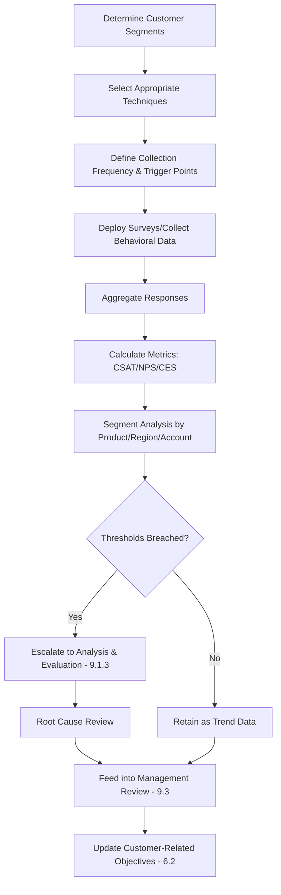

## Customer Satisfaction Measurement Techniques

### Overview

Customer Satisfaction Measurement Techniques encompass the methods an organization uses to fulfill ISO 9001:2015 Clause 9.1.2, which requires monitoring customer perceptions of the degree to which their needs and expectations have been fulfilled. The clause does not prescribe specific methods, leaving the organization to determine techniques appropriate to its products, services, and customer base.

### Key Points

- Clause 9.1.2 requires monitoring, not just measurement — implying ongoing, systematic collection
- Methods should be selected based on relevance to the business context and customer accessibility
- Both quantitative (scored) and qualitative (narrative) techniques are valid and often complementary
- Results must feed into Clause 9.1.3 (Analysis and Evaluation) and Clause 9.3 (Management Review)

### Primary Measurement Techniques

#### 1. Customer Satisfaction Score (CSAT)

A direct rating scale (typically 1–5 or 1–10) asking customers to rate satisfaction with a specific interaction, product, or service.

$$CSAT = \frac{\text{Number of satisfied responses}}{\text{Total responses}} \times 100$$

Satisfied responses are typically defined as scores of 4–5 on a 5-point scale.

**Example**

A software company sends a post-support-ticket survey: "How satisfied were you with this support interaction?" (1 = Very Dissatisfied, 5 = Very Satisfied). Out of 200 responses, 160 scored 4 or 5.

$$CSAT = \frac{160}{200} \times 100 = 80\%$$

#### 2. Net Promoter Score (NPS)

Measures customer loyalty and likelihood to recommend, using a single question: "On a scale of 0–10, how likely are you to recommend us to a friend or colleague?"

Respondents are categorized as:

| Category | Score Range |
| --- | --- |
| Promoters | 9–10 |
| Passives | 7–8 |
| Detractors | 0–6 |

$$NPS = \%\text{Promoters} - \%\text{Detractors}$$

NPS ranges from $-100$ to $+100$.

#### 3. Customer Effort Score (CES)

Measures how much effort a customer had to exert to get an issue resolved or complete a transaction: "How easy was it to resolve your issue today?" (1 = Very Difficult, 7 = Very Easy). Lower effort scores correlate strongly with retention in service-based industries.

#### 4. Structured Surveys and Questionnaires

Multi-item surveys covering various satisfaction dimensions (product quality, delivery timeliness, communication, support responsiveness). Often distributed periodically (quarterly/annually) rather than transactionally.

**Common dimensions assessed:**

- Product/service quality conformance
- On-time delivery performance
- Responsiveness of communication
- Value for price
- Ease of doing business

#### 5. Complaint and Feedback Analysis

Systematic tracking and categorization of unsolicited complaints, treated as an indirect but valuable satisfaction indicator.

- Complaint frequency (normalized per unit shipped/transaction)
- Time-to-resolution
- Recurrence rate of same complaint category
- Severity classification (linked to Clause 8.7 nonconformity handling where applicable)

#### 6. Warranty and Field Return Data

For product-based organizations, warranty claim rates and field failure data serve as objective, behavior-based satisfaction proxies (as opposed to perception-based surveys).

#### 7. Retention and Repeat Business Rate

$$\text{Retention Rate} = \frac{\text{Customers at end of period} - \text{New customers acquired}}{\text{Customers at start of period}} \times 100$$

A behavioral indicator that complements perception-based scores — customers may report moderate satisfaction yet still churn, or vice versa.

#### 8. Direct Interviews and Account Reviews

Qualitative, in-depth conversations — particularly valuable for B2B relationships or key accounts where quantitative survey response rates are low or insufficiently granular.

#### 9. Social Listening and Online Reviews

Monitoring of public reviews, social media sentiment, and third-party rating platforms as an unsolicited, real-time satisfaction signal.

### Technique Selection Matrix

| Technique | Best Suited For | Data Type | Frequency |
| --- | --- | --- | --- |
| CSAT | Transactional interactions | Quantitative | Per-transaction |
| NPS | Overall relationship loyalty | Quantitative | Periodic (quarterly/annual) |
| CES | Support/service ease | Quantitative | Per-transaction |
| Structured surveys | Comprehensive relationship health | Mixed | Periodic |
| Complaint analysis | Ongoing operational monitoring | Qualitative/Quantitative | Continuous |
| Warranty/returns data | Product-based industries | Quantitative | Continuous |
| Retention rate | Long-term relationship health | Quantitative | Periodic |
| Direct interviews | Key accounts, B2B | Qualitative | Ad hoc/Scheduled |
| Social listening | Brand-wide sentiment | Qualitative | Continuous |

### Measurement Process Flow

### Sampling and Data Quality Considerations

- Response rate bias: low survey response rates may over-represent extreme (very satisfied/dissatisfied) customers
- Sample size adequacy for statistically meaningful segment-level analysis
- Timing bias: surveys sent immediately after resolution may not capture longer-term satisfaction
- Question wording neutrality to avoid leading responses

[Inference] Industry benchmark NPS and CSAT values vary significantly by sector (e.g., SaaS vs. manufacturing vs. public service), so absolute score comparisons across industries are generally not meaningful; trend direction within the same organization and method is typically the more defensible analytical basis.

### Documented Information Requirements

Under Clause 7.5 (linked via 9.1.2), the organization should retain:

- Survey instruments and question sets used
- Raw response data and calculated aggregate scores
- Trend reports over reporting periods
- Analysis linking satisfaction data to corrective/improvement actions

### Common Audit Findings

- Customer satisfaction method defined in the QMS manual but not actually executed on schedule
- Data collected but never aggregated into a trackable metric or trend
- No evidence that satisfaction data was reviewed in management review inputs
- Reliance solely on complaint data (a negative-only indicator) without any positive/neutral satisfaction signal
- Survey questions not reviewed for bias or clarity prior to deployment

**Related Topics**

- Clause 9.1.1 — General Monitoring and Measurement Requirements
- Clause 9.1.3 — Analysis and Evaluation
- Clause 9.3 — Management Review
- Clause 6.2 — Quality Objectives and Planning to Achieve Them
- Clause 8.2.1 — Customer Communication
- Complaint Handling Procedures (ISO 10002 reference)
- Voice of the Customer (VoC) Programs