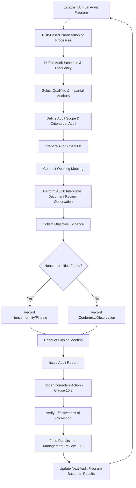

## Internal Audit Program Planning and Execution

### Overview

Internal Audit Program Planning and Execution corresponds to ISO 9001:2015 Clause 9.2, which requires organizations to conduct internal audits at planned intervals to determine whether the QMS conforms to both the organization's own requirements and the requirements of ISO 9001, and whether the QMS is effectively implemented and maintained.

### Key Points

- Internal audits are a management tool, not a punitive inspection mechanism
- Auditors must be objective and impartial — auditors cannot audit their own work
- The audit program must be planned considering process importance, changes, and results of previous audits
- Clause 9.2 has two sub-clauses: 9.2.1 (General) and 9.2.2 (Audit Program Requirements)

### Clause 9.2.1 — General Requirements

The organization must conduct internal audits to verify that the QMS:

1. Conforms to the organization's own requirements for its QMS
2. Conforms to the requirements of ISO 9001:2015
3. Is effectively implemented and maintained

### Clause 9.2.2 — Audit Program Requirements

The organization must:

- Plan, establish, implement, and maintain an audit program including frequency, methods, responsibilities, planning requirements, and reporting
- Consider the importance of the processes concerned, changes affecting the organization, and results of previous audits when defining audit criteria and scope
- Define audit criteria and scope for each audit
- Select auditors and conduct audits ensuring objectivity and impartiality
- Ensure audit results are reported to relevant management
- Take appropriate correction and corrective action without undue delay
- Retain documented information as evidence of audit program implementation and audit results

### Audit Program Lifecycle

### Audit Program Planning Considerations

| Factor | Description |
| --- | --- |
| Process importance | Higher-risk or customer-critical processes audited more frequently |
| Changes | New processes, organizational changes, or regulatory updates trigger audit scope adjustments |
| Previous audit results | Areas with prior nonconformities receive increased audit attention |
| Complexity | Complex, multi-site, or high-variability processes may need extended audit time |
| Customer/regulatory requirements | Contractual or statutory audit frequency requirements |
| Statistical significance | Sampling of records/transactions must be representative |

### Auditor Competence and Impartiality

Auditors must be selected to ensure objectivity and impartiality of the audit process:

- **Independence** — Auditors must not audit their own work or department they directly manage
- **Competence** — Trained in audit techniques, QMS requirements, and the technical domain being audited
- **Certification** (optional but common) — ISO 19011 or lead auditor training (e.g., IRCA, Exemplar Global)

**Example**

A quality manager who oversees the production department cannot serve as the lead auditor for an internal audit of that same production process, but may audit an unrelated department (e.g., procurement) without conflict of interest.

### Audit Methods

- **Document review** — Verifying procedures, records, and work instructions against requirements
- **Interviews** — Speaking with process owners and operators to verify understanding and practice
- **Observation** — Direct observation of process execution against documented procedures
- **Sampling** — Statistical or judgmental sampling of records/transactions
- **Traceability/trail audits** — Following a single product/service/transaction end-to-end through the process

### Audit Finding Classification

| Classification | Definition |
| --- | --- |
| Major Nonconformity | Systemic failure or absence of a required process/control; significant risk to product/service conformity |
| Minor Nonconformity | Isolated lapse in an otherwise functioning process/control |
| Observation | Potential future risk not yet resulting in nonconformity |
| Opportunity for Improvement (OFI) | Suggestion for enhancement, not a nonconformity |

### Audit Report Structure

A typical internal audit report includes:

1. Audit scope, criteria, and objectives
2. Date, auditors, and auditee(s)
3. Processes/areas audited
4. Findings (nonconformities, observations, OFIs) with objective evidence
5. Overall conclusion on QMS conformity and effectiveness
6. Follow-up requirements and due dates

### Documented Information Requirements

Per Clause 9.2.2(f) and 9.2.2(g), the organization must retain:

- The audit program itself (schedule, scope, methods, criteria)
- Evidence of audit results (audit reports, checklists, findings, objective evidence)

### Relationship to Other Clauses

<svg xmlns="http://www.w3.org/2000/svg" viewBox="0 0 700 280">
<text x="350" y="25" text-anchor="middle" font-size="16" font-weight="bold" fill="#1a1a1a">Clause 9.2 Interfaces (svg_diagram)</text>
<rect x="270" y="50" width="160" height="55" rx="6" fill="#e8f0fe" stroke="#4285f4" stroke-width="1.5" />
<text x="350" y="73" text-anchor="middle" font-size="13" font-weight="bold" fill="#1a1a1a">Clause 9.2</text>
<text x="350" y="90" text-anchor="middle" font-size="11" fill="#1a1a1a">Internal Audit</text>
<rect x="60" y="150" width="150" height="55" rx="6" fill="#fef7e0" stroke="#f9ab00" stroke-width="1.5" />
<text x="135" y="173" text-anchor="middle" font-size="12" font-weight="bold" fill="#1a1a1a">Clause 6.1</text>
<text x="135" y="190" text-anchor="middle" font-size="11" fill="#1a1a1a">Risk-Based Planning</text>
<rect x="250" y="150" width="150" height="55" rx="6" fill="#fce8e6" stroke="#ea4335" stroke-width="1.5" />
<text x="325" y="173" text-anchor="middle" font-size="12" font-weight="bold" fill="#1a1a1a">Clause 10.2</text>
<text x="325" y="190" text-anchor="middle" font-size="11" fill="#1a1a1a">Corrective Action</text>
<rect x="440" y="150" width="150" height="55" rx="6" fill="#e6f4ea" stroke="#34a853" stroke-width="1.5" />
<text x="515" y="173" text-anchor="middle" font-size="12" font-weight="bold" fill="#1a1a1a">Clause 9.3</text>
<text x="515" y="190" text-anchor="middle" font-size="11" fill="#1a1a1a">Management Review</text>
<rect x="270" y="230" width="160" height="40" rx="6" fill="#f3e8fd" stroke="#a142f4" stroke-width="1.5" />
<text x="350" y="254" text-anchor="middle" font-size="12" font-weight="bold" fill="#1a1a1a">Clause 7.5 — Records</text>
<line x1="270" y1="80" x2="210" y2="150" stroke="#666" stroke-width="1.5" />
<line x1="320" y1="105" x2="325" y2="150" stroke="#666" stroke-width="1.5" />
<line x1="410" y1="90" x2="510" y2="150" stroke="#666" stroke-width="1.5" />
<line x1="350" y1="205" x2="350" y2="230" stroke="#666" stroke-width="1.5" />
</svg>

### Common Audit Program Findings (Meta-Audit / Certification Body Review)

- Audit program exists but does not consider risk or process importance in frequency determination
- Auditors lack documented competence records or training evidence
- Audit criteria not defined prior to audit execution (ad hoc scope)
- Nonconformities found but not linked to formal corrective action tracking
- Repeat findings across multiple audit cycles with no evidence of systemic corrective action
- Audit program not adjusted based on prior audit results or organizational changes

### Third-Party vs. Internal Audit Distinction

| Aspect | Internal Audit (9.2) | External/Certification Audit |
| --- | --- | --- |
| Performed by | Organization's own trained personnel (or contracted auditor acting on their behalf) | Accredited certification body auditor |
| Purpose | Self-verification of conformity and effectiveness | Certification/surveillance decision |
| Frequency | Organization-defined, risk-based | Typically annual (surveillance) / 3-year (recertification) cycle |
| Outcome | Internal corrective action | Certification maintenance, suspension, or withdrawal |

[Inference] While ISO 19011 (Guidelines for Auditing Management Systems) is not a certifiable requirement of ISO 9001, it is commonly referenced by organizations and certification bodies as the de facto best-practice methodology for planning and conducting internal audits.

**Related Topics**

- Clause 10.2 — Nonconformity and Corrective Action
- Clause 9.3 — Management Review
- Clause 6.1 — Actions to Address Risks and Opportunities
- ISO 19011 — Guidelines for Auditing Management Systems
- Auditor Competence and Training Frameworks (IRCA, Exemplar Global)
- Root Cause Analysis Techniques