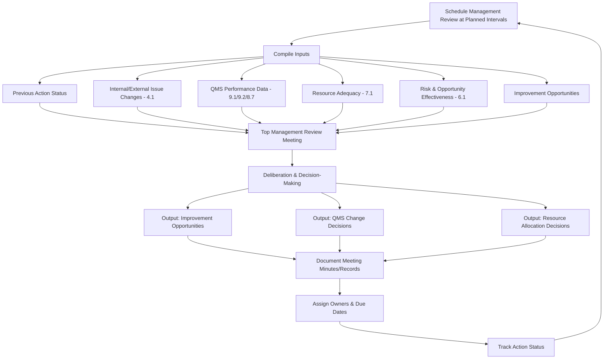

## Management Review Process Inputs and Outputs

### Overview

Management Review Process Inputs and Outputs corresponds to ISO 9001:2015 Clause 9.3, which requires top management to review the organization's QMS at planned intervals to ensure its continuing suitability, adequacy, effectiveness, and alignment with the strategic direction of the organization. Clause 9.3 is divided into three sub-clauses: 9.3.1 (General), 9.3.2 (Management Review Inputs), and 9.3.3 (Management Review Outputs).

### Key Points

- Management review is a **top management** responsibility — it cannot be delegated entirely to the quality manager
- The review must be planned (scheduled at planned intervals), not ad hoc
- Both inputs and outputs are explicitly and exhaustively defined by the standard
- Outputs must include decisions and actions, not merely discussion

### Clause 9.3.1 — General

Top management must review the QMS at planned intervals to ensure its continuing suitability, adequacy, effectiveness, and alignment with the strategic direction of the organization.

### Clause 9.3.2 — Management Review Inputs

The management review must be planned and carried out taking into consideration the following mandatory inputs:

1. **Status of actions from previous management reviews**
2. **Changes in external and internal issues** relevant to the QMS (linked to Clause 4.1)
3. **Information on the performance and effectiveness of the QMS**, including trends in:
   - Customer satisfaction and feedback from relevant interested parties
   - The extent to which quality objectives have been met (Clause 6.2)
   - Process performance and conformity of products and services
   - Nonconformities and corrective actions (Clause 8.7, 10.2)
   - Monitoring and measurement results (Clause 9.1)
   - Audit results (Clause 9.2)
   - The performance of external providers/suppliers (Clause 8.4)
4. **Adequacy of resources** (Clause 7.1)
5. **The effectiveness of actions taken to address risks and opportunities** (Clause 6.1)
6. **Opportunities for improvement**

### Clause 9.3.3 — Management Review Outputs

The outputs of the management review must include decisions and actions related to:

1. **Opportunities for improvement**
2. **Any need for changes to the QMS**
3. **Resource needs**

### Management Review Cycle



### Inputs-to-Outputs Traceability Table

| Input Category | Typical Data Source | Possible Output Decision |
| --- | --- | --- |
| Customer satisfaction trends | CSAT/NPS reports (Clause 9.1.2) | Revise service delivery process |
| Quality objective achievement | Objective tracking dashboard (Clause 6.2) | Set new/revised objectives |
| Nonconformity trends | NCR log, CAPA register (Clause 8.7/10.2) | Allocate resources to root cause elimination |
| Audit results | Internal audit reports (Clause 9.2) | Schedule targeted re-audit or training |
| Resource adequacy | Staffing/equipment reviews (Clause 7.1) | Approve capital expenditure or hiring |
| Risk/opportunity effectiveness | Risk register review (Clause 6.1) | Update risk treatment plans |
| External provider performance | Supplier scorecards (Clause 8.4) | Change or requalify suppliers |

### Documented Information Requirements

The organization must retain documented information as evidence of the results of management reviews (Clause 9.3.3, closing statement). Typical retained records:

- Management review meeting agenda
- Attendance list (must include top management)
- Minutes documenting each input discussed
- Decisions and actions with assigned owners and target dates
- Follow-up status tracking from the prior review

### Example Management Review Minutes Structure

**Example**



```
1. Review of Previous Action Items — Status: 4 closed, 1 open (extended to Q3)
2. Internal/External Issues — New regulatory requirement identified (data privacy law)
3. QMS Performance Review:
   - Customer Satisfaction: NPS improved from 32 to 41
   - Quality Objectives: 3 of 4 objectives met; on-time delivery objective missed
   - Nonconformities: 12 NCRs this period, 3 linked to same root cause (supplier material variation)
   - Audit Results: 2 minor NCRs from internal audit, both closed
   - Supplier Performance: Supplier A on-time delivery dropped to 78%
4. Resource Adequacy: Additional QA inspector approved for Line 2
5. Risk/Opportunity Review: Supply chain risk elevated; treatment plan updated
6. Decisions/Actions:
   - Action 1: Root cause investigation into supplier material variation — Owner: QA Manager — Due: [date]
   - Action 2: Revise on-time delivery target methodology — Owner: Ops Director — Due: [date]
   - Action 3: Approve budget for supplier requalification — Owner: Procurement — Due: [date]
```

### Frequency and Planning Considerations

- No fixed frequency is mandated by ISO 9001:2015; the organization defines "planned intervals" based on its context
- Common practice: quarterly operational reviews supplemented by a comprehensive annual review
- High-risk, rapidly changing, or newly certified organizations often conduct reviews more frequently
- Review frequency itself may be adjusted as an output of a prior review if effectiveness is found lacking

### Relationship to Other Clauses

<svg xmlns="http://www.w3.org/2000/svg" viewBox="0 0 700 300">
<text x="350" y="25" text-anchor="middle" font-size="16" font-weight="bold" fill="#1a1a1a">Clause 9.3 Interfaces (svg_diagram)</text>
<rect x="270" y="50" width="160" height="55" rx="6" fill="#e8f0fe" stroke="#4285f4" stroke-width="1.5" />
<text x="350" y="73" text-anchor="middle" font-size="13" font-weight="bold" fill="#1a1a1a">Clause 9.3</text>
<text x="350" y="90" text-anchor="middle" font-size="11" fill="#1a1a1a">Management Review</text>
<rect x="30" y="150" width="140" height="55" rx="6" fill="#fef7e0" stroke="#f9ab00" stroke-width="1.5" />
<text x="100" y="173" text-anchor="middle" font-size="12" font-weight="bold" fill="#1a1a1a">Clause 9.1/9.2</text>
<text x="100" y="190" text-anchor="middle" font-size="11" fill="#1a1a1a">Monitoring &amp; Audit</text>
<rect x="190" y="150" width="140" height="55" rx="6" fill="#fce8e6" stroke="#ea4335" stroke-width="1.5" />
<text x="260" y="173" text-anchor="middle" font-size="12" font-weight="bold" fill="#1a1a1a">Clause 6.1</text>
<text x="260" y="190" text-anchor="middle" font-size="11" fill="#1a1a1a">Risk &amp; Opportunity</text>
<rect x="350" y="150" width="140" height="55" rx="6" fill="#e6f4ea" stroke="#34a853" stroke-width="1.5" />
<text x="420" y="173" text-anchor="middle" font-size="12" font-weight="bold" fill="#1a1a1a">Clause 7.1</text>
<text x="420" y="190" text-anchor="middle" font-size="11" fill="#1a1a1a">Resources</text>
<rect x="510" y="150" width="140" height="55" rx="6" fill="#f3e8fd" stroke="#a142f4" stroke-width="1.5" />
<text x="580" y="173" text-anchor="middle" font-size="12" font-weight="bold" fill="#1a1a1a">Clause 10.3</text>
<text x="580" y="190" text-anchor="middle" font-size="11" fill="#1a1a1a">Continual Improvement</text>
<rect x="270" y="240" width="160" height="40" rx="6" fill="#fde8ef" stroke="#d5006d" stroke-width="1.5" />
<text x="350" y="264" text-anchor="middle" font-size="12" font-weight="bold" fill="#1a1a1a">Clause 5.1 — Leadership</text>
<line x1="270" y1="80" x2="100" y2="150" stroke="#666" stroke-width="1.5" />
<line x1="300" y1="105" x2="260" y2="150" stroke="#666" stroke-width="1.5" />
<line x1="400" y1="105" x2="420" y2="150" stroke="#666" stroke-width="1.5" />
<line x1="430" y1="80" x2="580" y2="150" stroke="#666" stroke-width="1.5" />
<line x1="350" y1="205" x2="350" y2="240" stroke="#666" stroke-width="1.5" />
</svg>

### Common Audit Findings

- Management review conducted without top management present or actively participating
- One or more of the seven mandatory inputs (Clause 9.3.2) omitted from the review agenda
- Outputs recorded as general discussion notes without specific decisions, owners, or due dates
- No evidence of follow-up tracking on actions from the previous review
- Review frequency defined in procedure but not adhered to in practice
- Review treated as a compliance formality disconnected from actual strategic or operational decision-making

### Distinguishing Management Review from Other Review Activities

| Activity | Scope | Frequency | Participants |
| --- | --- | --- | --- |
| Management Review (9.3) | Entire QMS suitability/adequacy/effectiveness | Planned intervals (often quarterly/annual) | Top management |
| Internal Audit (9.2) | Conformity to specific process/clause requirements | Per audit program schedule | Trained auditors |
| Daily/Weekly Operations Review | Day-to-day operational metrics | Daily/weekly | Operational management |
| Process Owner Review | Single process performance | Varies | Process owner/team |

[Inference] Certification bodies generally expect to see a clear line of sight from raw QMS data through to management review outputs and subsequent action; a management review lacking documented decisions is a frequently cited minor nonconformity during surveillance audits, though the exact severity classification depends on the certification body's audit methodology.

**Related Topics**

- Clause 5.1 — Leadership and Commitment
- Clause 6.1 — Actions to Address Risks and Opportunities
- Clause 6.2 — Quality Objectives and Planning
- Clause 9.1 — Monitoring, Measurement, Analysis and Evaluation
- Clause 9.2 — Internal Audit
- Clause 10.3 — Continual Improvement
- Strategic Planning Integration with QMS