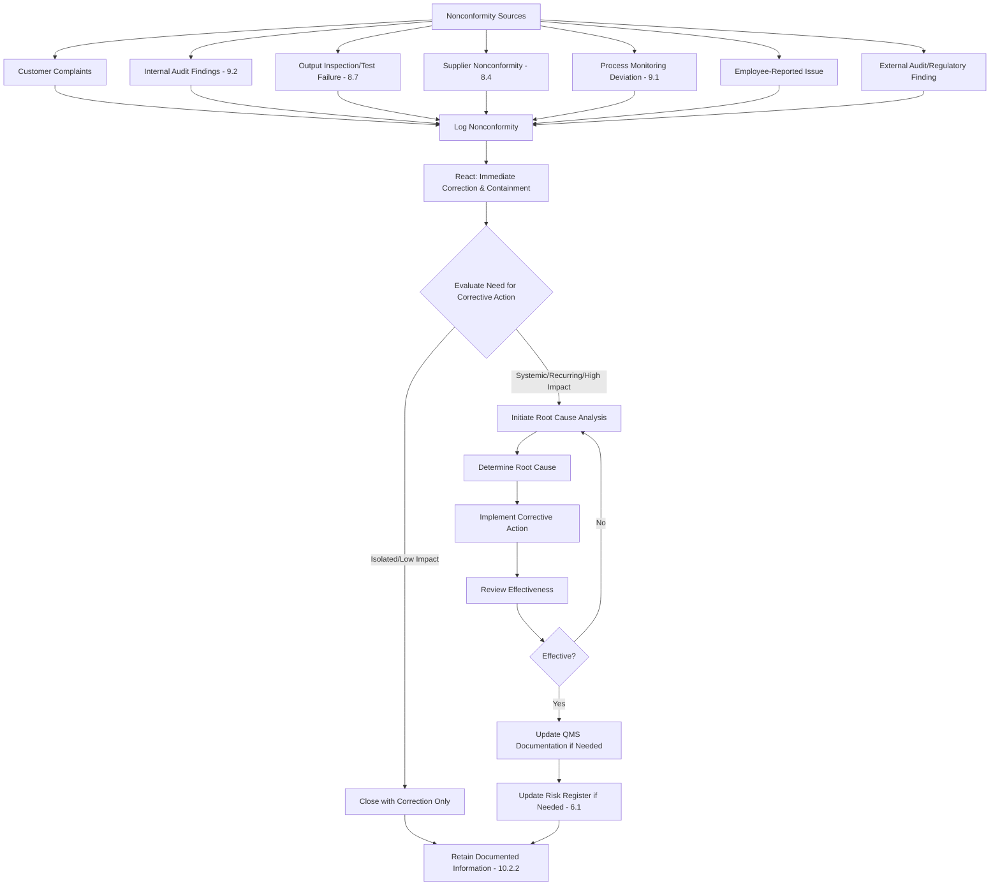

## Nonconformity Identification and Correction

### Overview

Nonconformity Identification and Correction corresponds to the initial reactive requirements under ISO 9001:2015 Clause 10.2 (Nonconformity and Corrective Action), specifically the requirement to react to a nonconformity by taking action to control and correct it. This is distinct from — and precedes — root cause elimination, which falls under corrective action proper.

### Key Points

- Clause 10.2.1(a) requires reaction and correction; Clause 10.2.1(b) requires evaluating the need for corrective action to eliminate root causes
- Not every nonconformity requires a formal corrective action process — the organization must evaluate this
- "Correction" (fixing the immediate problem) is distinct from "Corrective Action" (eliminating the cause so it does not recur)
- Nonconformities can originate from a complaint, an audit finding, a process deviation, or output failing to meet requirements (linked to Clause 8.7)

### Clause 10.2.1 — Requirements

When a nonconformity occurs, including any arising from a complaint, the organization shall:

**(a) React to the nonconformity:**

- Take action to control and correct it
- Deal with the consequences

**(b) Evaluate the need for action to eliminate the cause(s), by:**

- Reviewing and analyzing the nonconformity
- Determining the causes of the nonconformity
- Determining if similar nonconformities exist, or could potentially occur

**(c) Implement any action needed**

**(d) Review the effectiveness of any corrective action taken**

**(e) Update risks and opportunities determined during planning, if necessary** (linked to Clause 6.1)

**(f) Make changes to the QMS, if necessary**

### Correction vs. Corrective Action — Critical Distinction

| Aspect | Correction | Corrective Action |
| --- | --- | --- |
| Definition | Action to eliminate a detected nonconformity | Action to eliminate the cause(s) of a nonconformity to prevent recurrence |
| Scope | Immediate, single instance | Systemic, addresses root cause |
| Example | Reworking a defective part | Retraining operators + updating work instruction that caused the defect |
| Governing sub-clause | 10.2.1(a) | 10.2.1(b)–(f) |
| Timing | Immediate | Follows investigation |

**Example**

A batch of printed circuit boards fails solder joint inspection.

- **Correction**: The defective batch is reworked/re-soldered and re-inspected before release (immediate fix).
- **Corrective Action**: Investigation reveals the reflow oven temperature profile drifted out of specification; the profile is recalibrated, and a periodic verification check is added to prevent recurrence (root cause elimination).

### Nonconformity Identification Sources

### Evaluation Criteria for Escalating to Corrective Action

Not all nonconformities warrant a full corrective action investigation. Typical escalation triggers:

- Recurrence of the same or similar nonconformity
- High severity or safety/regulatory impact
- Customer-facing nonconformity (delivered defective product/service)
- Cost or resource impact exceeding a defined threshold
- Trend identified through Clause 9.1.3 analysis

**Example decision matrix**

| Severity | Frequency | Action |
| --- | --- | --- |
| Low | First occurrence | Correction only; log for trend monitoring |
| Low | Recurring | Escalate to corrective action |
| High | First occurrence | Escalate to corrective action |
| High | Recurring | Escalate to corrective action + management review input |

### Documented Information Requirements (Clause 10.2.2)

The organization must retain documented information as evidence of:

- The nature of the nonconformities and any subsequent actions taken
- The results of any corrective action

**Example Nonconformity/Correction Record Fields**

| Field | Description |
| --- | --- |
| Nonconformity ID | Unique identifier |
| Date identified | Detection date |
| Source | Complaint, audit, inspection, etc. |
| Description | What failed and against which requirement |
| Immediate correction | Action taken to fix/contain |
| Consequence management | How affected parties/outputs were handled |
| Corrective action needed? | Yes/No with justification |
| Root cause (if applicable) | Determined cause |
| Corrective action taken | Description |
| Effectiveness review date/result | Verification outcome |
| QMS/risk register updated? | Yes/No |

### Common Audit Findings

- Correction applied but no evaluation performed on whether corrective action was needed
- Corrective action taken without a documented root cause analysis
- Effectiveness of corrective action never reviewed or reviewed without objective evidence
- Recurring nonconformities treated repeatedly with correction only, never escalated
- No linkage shown between nonconformity records and updates to risk register (Clause 6.1) or QMS documentation

### Relationship to Other Clauses

<svg xmlns="http://www.w3.org/2000/svg" viewBox="0 0 700 280">
<text x="350" y="25" text-anchor="middle" font-size="16" font-weight="bold" fill="#1a1a1a">Clause 10.2 Interfaces (svg_diagram)</text>
<rect x="270" y="50" width="160" height="55" rx="6" fill="#e8f0fe" stroke="#4285f4" stroke-width="1.5" />
<text x="350" y="73" text-anchor="middle" font-size="13" font-weight="bold" fill="#1a1a1a">Clause 10.2</text>
<text x="350" y="90" text-anchor="middle" font-size="11" fill="#1a1a1a">Nonconformity &amp; CA</text>
<rect x="60" y="150" width="150" height="55" rx="6" fill="#fef7e0" stroke="#f9ab00" stroke-width="1.5" />
<text x="135" y="173" text-anchor="middle" font-size="12" font-weight="bold" fill="#1a1a1a">Clause 8.7</text>
<text x="135" y="190" text-anchor="middle" font-size="11" fill="#1a1a1a">Nonconforming Outputs</text>
<rect x="250" y="150" width="150" height="55" rx="6" fill="#fce8e6" stroke="#ea4335" stroke-width="1.5" />
<text x="325" y="173" text-anchor="middle" font-size="12" font-weight="bold" fill="#1a1a1a">Clause 9.2</text>
<text x="325" y="190" text-anchor="middle" font-size="11" fill="#1a1a1a">Internal Audit</text>
<rect x="440" y="150" width="150" height="55" rx="6" fill="#e6f4ea" stroke="#34a853" stroke-width="1.5" />
<text x="515" y="173" text-anchor="middle" font-size="12" font-weight="bold" fill="#1a1a1a">Clause 6.1</text>
<text x="515" y="190" text-anchor="middle" font-size="11" fill="#1a1a1a">Risk &amp; Opportunity</text>
<rect x="270" y="230" width="160" height="40" rx="6" fill="#f3e8fd" stroke="#a142f4" stroke-width="1.5" />
<text x="350" y="254" text-anchor="middle" font-size="12" font-weight="bold" fill="#1a1a1a">Clause 10.3 — Continual Improvement</text>
<line x1="270" y1="80" x2="210" y2="150" stroke="#666" stroke-width="1.5" />
<line x1="320" y1="105" x2="325" y2="150" stroke="#666" stroke-width="1.5" />
<line x1="410" y1="90" x2="510" y2="150" stroke="#666" stroke-width="1.5" />
<line x1="350" y1="205" x2="350" y2="230" stroke="#666" stroke-width="1.5" />
</svg>

[Inference] Auditors generally place particular scrutiny on whether an organization can demonstrate a clear distinction between correction and corrective action in its records, since conflating the two is one of the most commonly cited weaknesses in QMS implementation during certification and surveillance audits; the specific finding classification (minor vs. major) depends on the certification body's methodology and the severity/pervasiveness observed.

**Related Topics**

- Clause 8.7 — Control of Nonconforming Outputs
- Root Cause Analysis Techniques (5 Whys, Fishbone/Ishikawa, Fault Tree Analysis)
- Clause 6.1 — Actions to Address Risks and Opportunities
- Clause 9.1.3 — Analysis and Evaluation
- Corrective Action Request (CAR) / CAPA Systems
- Clause 10.3 — Continual Improvement