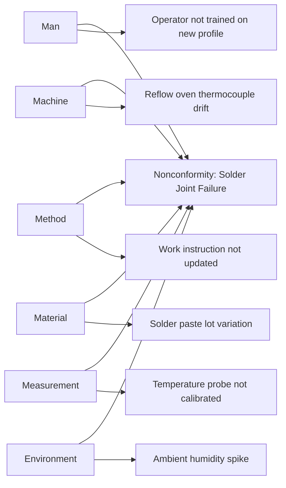
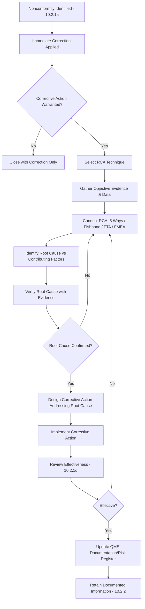

## Root Cause Analysis for Corrective Action

### Overview

Root Cause Analysis (RCA) for Corrective Action encompasses the structured investigative techniques used to fulfill ISO 9001:2015 Clause 10.2.1(b), which requires the organization to determine the causes of a nonconformity as part of evaluating and implementing corrective action. RCA is the analytical bridge between "correction" (fixing the symptom) and "corrective action" (eliminating the cause).

### Key Points

- The standard does not mandate a specific RCA technique — the organization selects methods appropriate to the nonconformity's complexity and impact
- RCA should distinguish between root cause, contributing factors, and symptoms
- A superficial or incomplete RCA is one of the most common causes of recurring nonconformities and repeat audit findings
- RCA output must be documented and traceable to the corrective action implemented (Clause 10.2.2)

### Common RCA Techniques

#### 1. 5 Whys

An iterative technique asking "why" repeatedly (typically five times) to drill from a symptom to its underlying cause.

**Example**

- Problem: A shipment was delivered late.
- Why 1: The order was not processed on time. Why?
- Why 2: The production schedule was not updated. Why?
- Why 3: The scheduler was not notified of a rush order. Why?
- Why 4: There is no defined process for flagging rush orders. Why?
- Why 5: The order intake procedure does not include a rush-order classification step.
- **Root cause**: Missing rush-order classification step in the order intake procedure.

#### 2. Fishbone / Ishikawa Diagram (Cause-and-Effect Diagram)

Categorizes potential causes into standard branches, commonly the "6M" framework:

- **Man** (People) — training, skill, fatigue
- **Machine** — equipment malfunction, calibration
- **Method** — procedure, work instruction adequacy
- **Material** — raw material variation, supplier quality
- **Measurement** — instrument accuracy, inspection method
- **Mother Nature (Environment)** — temperature, humidity, contamination

#### 3. Fault Tree Analysis (FTA)

A top-down, deductive approach using Boolean logic (AND/OR gates) to map how combinations of lower-level failures lead to a top-level undesired event. Commonly used for safety-critical or complex system failures.

#### 4. Failure Mode and Effects Analysis (FMEA)

A proactive/reactive technique that systematically evaluates potential failure modes, their effects, and assigns a **Risk Priority Number (RPN)**:

$$RPN = S \times O \times D$$

Where:

- $S$ = Severity (1–10)
- $O$ = Occurrence (1–10)
- $D$ = Detection (1–10)

Higher RPN values indicate higher priority for corrective/preventive action.

#### 5. Pareto Analysis

Applies the 80/20 principle to identify the "vital few" contributing causes among the "trivial many," using frequency/impact data.

$$\text{Cumulative \%} = \frac{\sum \text{Frequency of top } n \text{ causes}}{\text{Total Frequency}} \times 100$$

#### 6. Is/Is-Not Analysis

Compares characteristics of where/when the problem **does** occur versus where/when it **does not**, to narrow the causal field by process of elimination.

| Dimension | Is | Is Not |
| --- | --- | --- |
| What | Solder joint cracking | Component misalignment |
| Where | Line 2 only | Line 1, Line 3 |
| When | Afternoon shift | Morning shift |
| Extent | 3% of units | Isolated single units |

### RCA Technique Selection Guide

| Technique | Best Suited For | Complexity |
| --- | --- | --- |
| 5 Whys | Simple, single-cause-chain problems | Low |
| Fishbone/Ishikawa | Multi-factor problems needing categorized brainstorming | Medium |
| Fault Tree Analysis | Safety-critical, complex system failures | High |
| FMEA | Proactive risk prioritization across multiple failure modes | High |
| Pareto Analysis | High-volume recurring issues needing prioritization | Medium |
| Is/Is-Not Analysis | Narrowing cause when pattern boundaries are unclear | Medium |

### RCA-to-Corrective-Action Process Flow

### Distinguishing Root Cause from Contributing Factors and Symptoms

| Level | Definition | Example |
| --- | --- | --- |
| Symptom | Observable effect of the problem | Solder joint fails inspection |
| Contributing Factor | Condition that increases likelihood but is not the sole cause | Ambient humidity was elevated that day |
| Root Cause | The fundamental condition that, if eliminated, prevents recurrence | Reflow oven temperature profile was never validated after a component change |

A common analytical error is stopping at a contributing factor or symptom and implementing a corrective action that does not prevent recurrence.

### Verification of Root Cause

Before implementing corrective action, the identified root cause should be verified against evidence, not merely accepted on the basis of plausibility:

- Does removing/addressing the proposed cause demonstrably prevent the nonconformity when tested?
- Is the proposed cause consistent with all instances of the nonconformity (not contradicted by any occurrence)?
- Is there objective evidence (data, test results, observation) supporting the causal link, rather than assumption alone?

### Documented Information Requirements

Linked to Clause 10.2.2, RCA documentation should include:

- The technique(s) used
- Evidence and data gathered during investigation
- The identified root cause(s) and any contributing factors
- Justification for the corrective action selected based on the RCA outcome

### Common Audit Findings

- RCA stops at a symptom or contributing factor rather than the true root cause
- No objective evidence provided to support the stated root cause (opinion-based conclusion)
- Same RCA technique applied uniformly regardless of problem complexity, producing superficial analysis for complex, multi-causal failures
- Corrective action implemented does not logically address the root cause identified in the RCA
- No verification step confirming the root cause before resources committed to corrective action
- Repeat nonconformities with the same underlying cause across multiple unrelated RCA investigations, suggesting systemic analytical shortcomings

### Relationship to Other Clauses

<svg xmlns="http://www.w3.org/2000/svg" viewBox="0 0 700 260">
<text x="350" y="25" text-anchor="middle" font-size="16" font-weight="bold" fill="#1a1a1a">RCA Interfaces within Clause 10.2 (svg_diagram)</text>
<rect x="270" y="50" width="160" height="55" rx="6" fill="#e8f0fe" stroke="#4285f4" stroke-width="1.5" />
<text x="350" y="73" text-anchor="middle" font-size="13" font-weight="bold" fill="#1a1a1a">10.2.1(b)</text>
<text x="350" y="90" text-anchor="middle" font-size="11" fill="#1a1a1a">Root Cause Analysis</text>
<rect x="60" y="150" width="150" height="55" rx="6" fill="#fef7e0" stroke="#f9ab00" stroke-width="1.5" />
<text x="135" y="173" text-anchor="middle" font-size="12" font-weight="bold" fill="#1a1a1a">10.2.1(a)</text>
<text x="135" y="190" text-anchor="middle" font-size="11" fill="#1a1a1a">Correction</text>
<rect x="250" y="150" width="150" height="55" rx="6" fill="#fce8e6" stroke="#ea4335" stroke-width="1.5" />
<text x="325" y="173" text-anchor="middle" font-size="12" font-weight="bold" fill="#1a1a1a">10.2.1(c)-(d)</text>
<text x="325" y="190" text-anchor="middle" font-size="11" fill="#1a1a1a">Implement &amp; Verify</text>
<rect x="440" y="150" width="150" height="55" rx="6" fill="#e6f4ea" stroke="#34a853" stroke-width="1.5" />
<text x="515" y="173" text-anchor="middle" font-size="12" font-weight="bold" fill="#1a1a1a">Clause 6.1</text>
<text x="515" y="190" text-anchor="middle" font-size="11" fill="#1a1a1a">Risk Register Update</text>
<line x1="270" y1="80" x2="210" y2="150" stroke="#666" stroke-width="1.5" />
<line x1="410" y1="80" x2="325" y2="150" stroke="#666" stroke-width="1.5" />
<line x1="430" y1="90" x2="510" y2="150" stroke="#666" stroke-width="1.5" />
</svg>

[Inference] While the depth of RCA investigation is generally expected to scale with the severity and recurrence of a nonconformity, certification bodies typically do not prescribe a specific technique; the adequacy determination rests on whether the resulting corrective action demonstrably prevents recurrence, which can only be confirmed through subsequent effectiveness review.

**Related Topics**

- Clause 10.2 — Nonconformity Identification and Correction
- Clause 10.2.1(d) — Effectiveness Review of Corrective Action
- Clause 6.1 — Actions to Address Risks and Opportunities
- Statistical Techniques for Data-Driven RCA (control charts, correlation analysis)
- FMEA Methodology (Design FMEA vs. Process FMEA)
- Clause 8.4 — Supplier-Related Root Causes