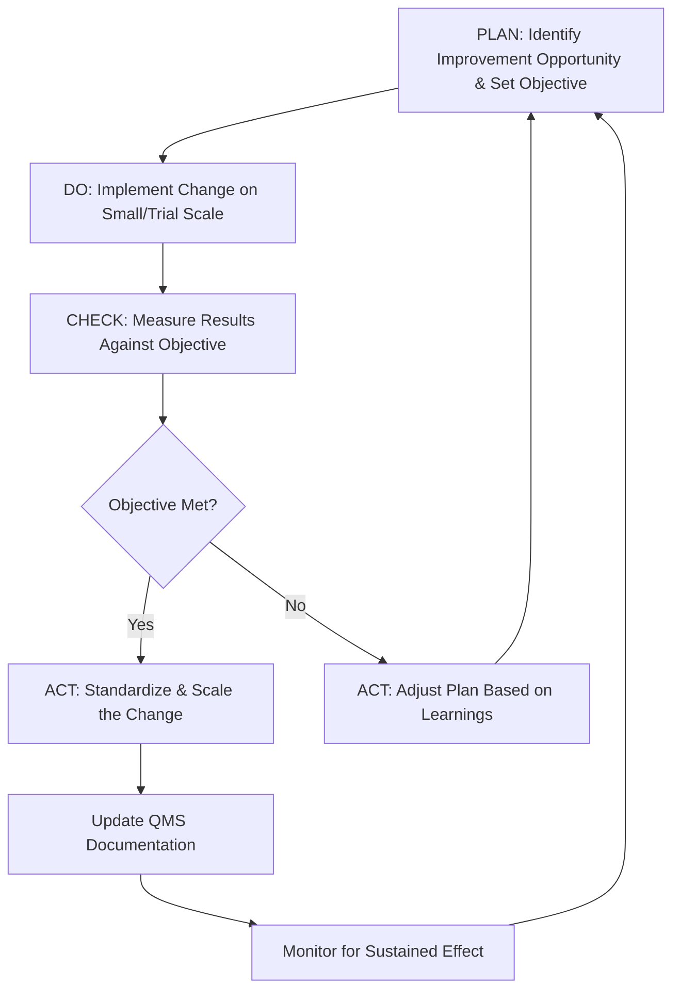
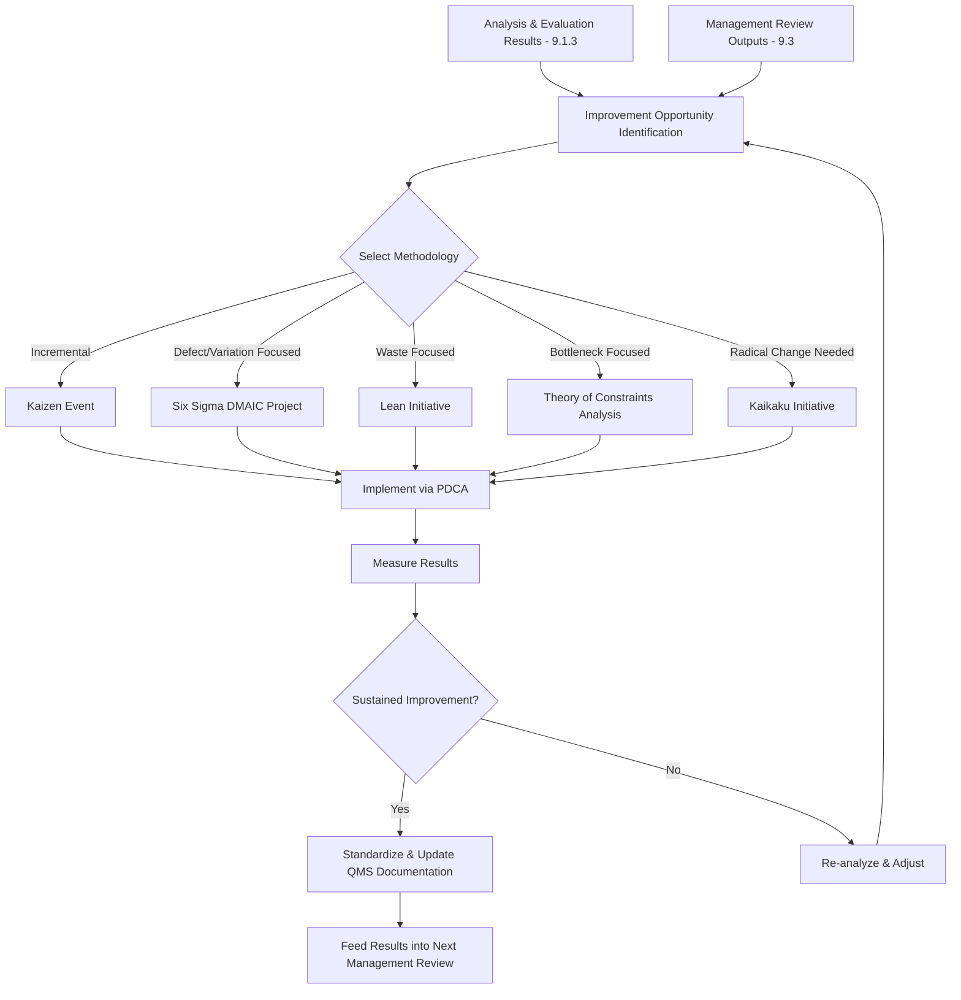

## Continual Improvement Methodologies

### Overview

Continual Improvement Methodologies encompasses the structured frameworks and techniques organizations use to satisfy ISO 9001:2015 Clause 10.3, which requires continual improvement of the suitability, adequacy, and effectiveness of the QMS. Unlike Clause 10.2 (reactive correction of nonconformities), Clause 10.3 addresses the proactive, ongoing pursuit of enhanced performance, often implemented through recognized management methodologies.

### Key Points

- Clause 10.3 requires the organization to consider the results of analysis and evaluation (9.1.3) and management review outputs (9.3) when determining improvement needs/opportunities
- Continual improvement is broader than corrective action — it includes innovation, breakthrough change, and incremental refinement, not just defect elimination
- ISO 9001:2015 does not mandate any specific methodology (e.g., Six Sigma, Lean) — organizations select approaches appropriate to their context
- Improvement can target products, services, processes, or the QMS itself

### Clause 10.3 — Requirements

The organization shall continually improve the suitability, adequacy, and effectiveness of the QMS. The organization shall consider the results of analysis and evaluation, and the outputs from management review, to determine if there are needs or opportunities that must be addressed as part of continual improvement.

### PDCA Cycle (Plan-Do-Check-Act)

The foundational model underpinning ISO 9001's overall structure and most continual improvement methodologies.

### Major Continual Improvement Methodologies

#### 1. Kaizen (Continuous Incremental Improvement)

A Japanese philosophy emphasizing small, incremental, frequent improvements driven by all employees rather than large, infrequent breakthrough projects.

- **Kaizen events/blitzes** — Short, focused, cross-functional improvement workshops (typically 3–5 days)
- Emphasizes employee empowerment and gemba (the actual workplace) observation
- Low-cost, high-frequency change over capital-intensive overhaul

#### 2. Six Sigma (DMAIC)

A data-driven methodology targeting defect reduction and variation control, structured around the **DMAIC** cycle:

| Phase | Activity |
| --- | --- |
| Define | Define the problem, scope, and customer requirements |
| Measure | Establish baseline performance and data collection systems |
| Analyze | Identify root causes of variation/defects |
| Improve | Implement and validate solutions |
| Control | Sustain gains through control plans and monitoring |

Six Sigma targets a defect rate of 3.4 defects per million opportunities (DPMO), corresponding to a process capability of approximately $6\sigma$:

$$DPMO = \frac{\text{Number of Defects}}{\text{Number of Units} \times \text{Opportunities per Unit}} \times 1{,}000{,}000$$

#### 3. Lean Management

Focuses on eliminating waste (muda) while maximizing customer value. Classic wastes are categorized under **TIMWOODS**:

- **T**ransportation
- **I**nventory
- **M**otion
- **W**aiting
- **O**verproduction
- **O**ver-processing
- **D**efects
- **S**kills (underutilized)

Key Lean tools: value stream mapping, 5S (Sort, Set in order, Shine, Standardize, Sustain), Kanban, single-minute exchange of die (SMED), poka-yoke (error-proofing).

#### 4. Lean Six Sigma

A hybrid methodology combining Lean's waste-elimination focus with Six Sigma's statistical rigor, using DMAIC as the overarching project structure while incorporating Lean tools within each phase.

#### 5. Total Quality Management (TQM)

A holistic, organization-wide management philosophy emphasizing customer focus, continuous improvement, employee involvement, and process-centered thinking as core cultural tenets rather than a discrete project methodology.

#### 6. Theory of Constraints (TOC)

Focuses improvement effort on the single greatest limiting factor (the "constraint" or "bottleneck") in a system, using the **Five Focusing Steps**:

1. Identify the constraint
2. Exploit the constraint (maximize its output without capital investment)
3. Subordinate all other processes to the constraint
4. Elevate the constraint (invest in capacity if needed)
5. Repeat the cycle as the constraint shifts

#### 7. Kaikaku (Breakthrough/Radical Improvement)

Contrasted with Kaizen, Kaikaku refers to radical, transformative change — often involving significant capital investment, process redesign, or organizational restructuring — used when incremental improvement is insufficient to close a performance gap.

### Methodology Selection Comparison

| Methodology | Improvement Style | Best Suited For | Statistical Rigor |
| --- | --- | --- | --- |
| Kaizen | Incremental, continuous | Culture-building, frontline engagement | Low |
| Six Sigma (DMAIC) | Project-based, data-driven | Defect/variation reduction | High |
| Lean | Incremental to moderate | Waste elimination, flow efficiency | Low–Medium |
| Lean Six Sigma | Project-based, hybrid | Complex problems needing both flow and variation control | High |
| TQM | Cultural, organization-wide | Long-term quality culture transformation | Medium |
| Theory of Constraints | Systemic, bottleneck-focused | Throughput-limited systems (manufacturing, project flow) | Medium |
| Kaikaku | Radical, breakthrough | Step-change performance gaps, obsolete processes | Varies |

### Continual Improvement Input-Output Flow

### Documented Information and Evidence

While Clause 10.3 does not mandate specific records, evidence of continual improvement activity typically includes:

- Improvement project charters (especially for Six Sigma/Lean projects)
- Kaizen event reports and before/after metrics
- Trend data showing sustained performance gains
- Updated procedures/work instructions reflecting standardized improvements
- Links from management review outputs (9.3.3) to specific improvement initiatives

### Common Audit Findings

- No evidence of proactive improvement activity beyond reactive corrective action (Clause 10.2)
- Improvement projects undertaken without connection to analysis/evaluation data (9.1.3) or management review outputs (9.3)
- Kaizen or Lean events conducted but gains not sustained (no standardization step, reverting to prior practice)
- Six Sigma projects lacking a Control phase, resulting in gradual regression to baseline
- Improvement methodology adopted as a label without underlying rigor (e.g., "Lean" branding applied without value stream analysis or waste categorization)

### Relationship to Other Clauses

<svg xmlns="http://www.w3.org/2000/svg" viewBox="0 0 700 280">
<text x="350" y="25" text-anchor="middle" font-size="16" font-weight="bold" fill="#1a1a1a">Clause 10.3 Interfaces (svg_diagram)</text>
<rect x="270" y="50" width="160" height="55" rx="6" fill="#e8f0fe" stroke="#4285f4" stroke-width="1.5" />
<text x="350" y="73" text-anchor="middle" font-size="13" font-weight="bold" fill="#1a1a1a">Clause 10.3</text>
<text x="350" y="90" text-anchor="middle" font-size="11" fill="#1a1a1a">Continual Improvement</text>
<rect x="60" y="150" width="150" height="55" rx="6" fill="#fef7e0" stroke="#f9ab00" stroke-width="1.5" />
<text x="135" y="173" text-anchor="middle" font-size="12" font-weight="bold" fill="#1a1a1a">Clause 9.1.3</text>
<text x="135" y="190" text-anchor="middle" font-size="11" fill="#1a1a1a">Analysis &amp; Evaluation</text>
<rect x="250" y="150" width="150" height="55" rx="6" fill="#fce8e6" stroke="#ea4335" stroke-width="1.5" />
<text x="325" y="173" text-anchor="middle" font-size="12" font-weight="bold" fill="#1a1a1a">Clause 9.3</text>
<text x="325" y="190" text-anchor="middle" font-size="11" fill="#1a1a1a">Management Review</text>
<rect x="440" y="150" width="150" height="55" rx="6" fill="#e6f4ea" stroke="#34a853" stroke-width="1.5" />
<text x="515" y="173" text-anchor="middle" font-size="12" font-weight="bold" fill="#1a1a1a">Clause 10.2</text>
<text x="515" y="190" text-anchor="middle" font-size="11" fill="#1a1a1a">Corrective Action</text>
<rect x="270" y="230" width="160" height="40" rx="6" fill="#f3e8fd" stroke="#a142f4" stroke-width="1.5" />
<text x="350" y="254" text-anchor="middle" font-size="12" font-weight="bold" fill="#1a1a1a">Clause 6.2 — Quality Objectives</text>
<line x1="270" y1="80" x2="210" y2="150" stroke="#666" stroke-width="1.5" />
<line x1="320" y1="105" x2="325" y2="150" stroke="#666" stroke-width="1.5" />
<line x1="430" y1="90" x2="510" y2="150" stroke="#666" stroke-width="1.5" />
<line x1="350" y1="205" x2="350" y2="230" stroke="#666" stroke-width="1.5" />
</svg>

[Inference] While ISO 9001:2015 explicitly avoids mandating any single methodology, certification bodies and quality practitioners commonly regard the PDCA cycle as the implicit unifying framework beneath all listed methodologies, since the clause structure of ISO 9001 itself is organized around PDCA; the practical rigor and record-keeping expectations for a given methodology tend to scale with the organization's sector and the criticality of the process being improved.

**Related Topics**

- Clause 10.2 — Nonconformity Identification and Correction
- Clause 9.1.3 — Analysis and Evaluation
- Clause 9.3 — Management Review Process Inputs and Outputs
- Clause 6.2 — Quality Objectives and Planning to Achieve Them
- Value Stream Mapping Techniques
- Six Sigma Belt Certification Structure (Yellow/Green/Black Belt)
- Change Management Frameworks for Sustaining Improvement