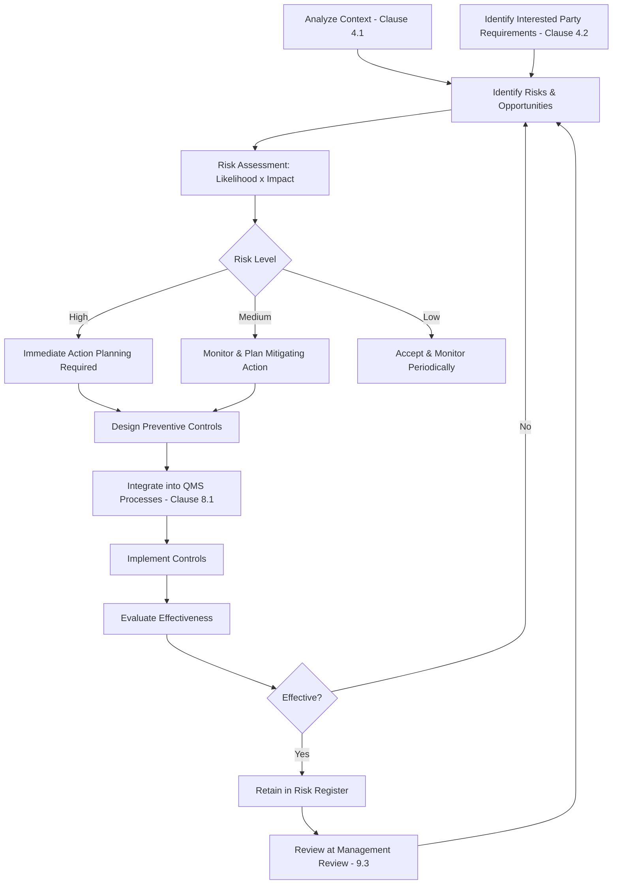

## Preventive Action and Proactive Risk Mitigation

### Overview

Preventive Action and Proactive Risk Mitigation refers to the forward-looking, anticipatory dimension of quality management that ISO 9001:2015 restructured significantly compared to its predecessor. Rather than retaining a standalone "Preventive Action" clause (as in ISO 9001:2008 Clause 8.5.3), the 2015 revision embeds preventive thinking directly into **Clause 6.1 — Actions to Address Risks and Opportunities**, treating risk-based thinking as a pervasive requirement across the entire QMS rather than a discrete reactive procedure.

### Key Points

- ISO 9001:2015 does not contain a clause titled "Preventive Action" — this function is fulfilled by Clause 6.1 (risk-based thinking) applied throughout planning
- The shift reflects a philosophy change: prevention should be built into process design from the outset, not treated as a separate corrective-style procedure triggered after-the-fact
- Clause 6.1 requires the organization to determine risks and opportunities that need to be addressed when planning the QMS
- Preventive thinking now permeates multiple clauses: 4.1 (context), 4.2 (interested parties), 5.1 (leadership commitment to risk-based thinking), 6.1 (risk/opportunity planning), 8.1 (operational risk-based planning)

### Historical Context: ISO 9001:2008 vs. 2015

| Aspect | ISO 9001:2008 (Clause 8.5.3) | ISO 9001:2015 (Clause 6.1) |
| --- | --- | --- |
| Structure | Standalone, discrete "Preventive Action" procedure | Embedded, pervasive risk-based thinking |
| Trigger | Typically reactive — potential nonconformity identified, often via a PAR (Preventive Action Request) form | Proactive — considered during all QMS planning, not tied to a specific trigger event |
| Documentation | Formal preventive action records/forms | Risk register, planning outputs, documented QMS changes |
| Scope | Narrower — focused on potential nonconformities | Broader — includes risks AND opportunities across the whole QMS |
| Integration | Isolated from core planning | Integrated into strategic and operational planning at every level |

### Clause 6.1 — Actions to Address Risks and Opportunities

When planning the QMS, the organization must consider the issues referred to in Clause 4.1 (context) and requirements referred to in Clause 4.2 (interested parties), and determine risks and opportunities that need to be addressed to:

- Give assurance that the QMS can achieve its intended results
- Enhance desirable effects
- Prevent or reduce undesired effects
- Achieve continual improvement

The organization must plan:

- Actions to address these risks and opportunities
- How to integrate and implement the actions into QMS processes
- How to evaluate the effectiveness of these actions

Actions taken must be proportionate to the potential impact on conformity of products and services.

### Proactive Risk Mitigation Process Flow

### Risk Identification Techniques for Prevention

| Technique | Application |
| --- | --- |
| SWOT Analysis | Strategic-level context assessment (Clause 4.1) |
| PESTLE Analysis | External issue identification (political, economic, social, technological, legal, environmental) |
| FMEA (Design/Process) | Proactive identification of potential failure modes before they occur |
| Bowtie Analysis | Visualizing preventive and mitigating barriers around a central risk event |
| Brainstorming/Nominal Group Technique | Cross-functional risk identification workshops |
| Historical data trend analysis | Using near-miss and minor nonconformity trends to predict future failure points |
| Scenario planning | Anticipating low-probability, high-impact disruptions |

### Risk Evaluation Approach

A common qualitative risk matrix approach:

$$\text{Risk Score} = \text{Likelihood} \times \text{Impact}$$

| Likelihood \ Impact | Low (1) | Medium (2) | High (3) |
| --- | --- | --- | --- |
| Low (1) | 1 | 2 | 3 |
| Medium (2) | 2 | 4 | 6 |
| High (3) | 3 | 6 | 9 |

Scores are typically banded into action tiers (e.g., 1–2 = Accept/Monitor, 3–4 = Mitigate, 6–9 = Immediate Action Required).

**Example**

A manufacturer identifies, through FMEA during process design, that a new supplier's raw material has higher variability than the prior supplier. Rather than waiting for nonconforming output to occur (which would trigger Clause 8.7/10.2), the organization proactively:

- Tightens incoming inspection sampling rate for the new supplier (preventive control)
- Adds a supplier performance monitoring KPI (Clause 8.4 linkage)
- Documents this as a risk treatment action under Clause 6.1

No nonconformity has occurred — this is prevention, not correction.

### Distinguishing Preventive Action (Risk-Based) from Corrective Action

| Aspect | Preventive Action (Clause 6.1) | Corrective Action (Clause 10.2) |
| --- | --- | --- |
| Trigger | Anticipated/potential risk, no failure has occurred | Actual nonconformity that has occurred |
| Timing | Before failure | After failure |
| Basis | Risk assessment, forecasting, trend analysis | Root cause analysis of an actual event |
| Governing clause | 6.1 | 10.2 |
| Documentation | Risk register, planning outputs | Nonconformity/CAPA records |

### Documented Information Requirements

Clause 6.1.3 (implicitly through 7.5 record-keeping expectations) suggests the organization retain, to the extent necessary to have confidence the actions were carried out as planned:

- Risk and opportunity register/log
- Risk assessment methodology and criteria used
- Planned actions and their integration point within QMS processes
- Effectiveness evaluation results
- Updates arising from management review (Clause 9.3.2(e))

### Common Audit Findings

- Organization treats Clause 6.1 as a paperwork exercise (a static risk register never updated) rather than an active planning input
- No evidence that identified risks were actually integrated into process controls (Clause 8.1)
- Confusion between preventive action (proactive) and correction (reactive) in documentation, effectively treating 6.1 as a rebranded 8.5.3 preventive action log
- Risk assessment criteria not defined or applied inconsistently across departments
- No evaluation of the effectiveness of risk mitigation actions taken
- Opportunities (the positive counterpart to risks) largely ignored in favor of only tracking negative risks

### Relationship to Other Clauses

<svg xmlns="http://www.w3.org/2000/svg" viewBox="0 0 700 300">
<text x="350" y="25" text-anchor="middle" font-size="16" font-weight="bold" fill="#1a1a1a">Clause 6.1 Interfaces (svg_diagram)</text>
<rect x="270" y="50" width="160" height="55" rx="6" fill="#e8f0fe" stroke="#4285f4" stroke-width="1.5" />
<text x="350" y="73" text-anchor="middle" font-size="13" font-weight="bold" fill="#1a1a1a">Clause 6.1</text>
<text x="350" y="90" text-anchor="middle" font-size="11" fill="#1a1a1a">Risk &amp; Opportunity</text>
<rect x="30" y="150" width="150" height="55" rx="6" fill="#fef7e0" stroke="#f9ab00" stroke-width="1.5" />
<text x="105" y="173" text-anchor="middle" font-size="12" font-weight="bold" fill="#1a1a1a">Clause 4.1/4.2</text>
<text x="105" y="190" text-anchor="middle" font-size="11" fill="#1a1a1a">Context &amp; Parties</text>
<rect x="200" y="150" width="150" height="55" rx="6" fill="#fce8e6" stroke="#ea4335" stroke-width="1.5" />
<text x="275" y="173" text-anchor="middle" font-size="12" font-weight="bold" fill="#1a1a1a">Clause 8.1</text>
<text x="275" y="190" text-anchor="middle" font-size="11" fill="#1a1a1a">Operational Planning</text>
<rect x="370" y="150" width="150" height="55" rx="6" fill="#e6f4ea" stroke="#34a853" stroke-width="1.5" />
<text x="445" y="173" text-anchor="middle" font-size="12" font-weight="bold" fill="#1a1a1a">Clause 9.3</text>
<text x="445" y="190" text-anchor="middle" font-size="11" fill="#1a1a1a">Management Review</text>
<rect x="540" y="150" width="150" height="55" rx="6" fill="#f3e8fd" stroke="#a142f4" stroke-width="1.5" />
<text x="615" y="173" text-anchor="middle" font-size="12" font-weight="bold" fill="#1a1a1a">Clause 10.2</text>
<text x="615" y="190" text-anchor="middle" font-size="11" fill="#1a1a1a">Corrective Action</text>
<rect x="270" y="240" width="160" height="40" rx="6" fill="#fde8ef" stroke="#d5006d" stroke-width="1.5" />
<text x="350" y="264" text-anchor="middle" font-size="12" font-weight="bold" fill="#1a1a1a">Clause 5.1 — Leadership</text>
<line x1="270" y1="80" x2="105" y2="150" stroke="#666" stroke-width="1.5" />
<line x1="320" y1="105" x2="275" y2="150" stroke="#666" stroke-width="1.5" />
<line x1="400" y1="90" x2="445" y2="150" stroke="#666" stroke-width="1.5" />
<line x1="430" y1="80" x2="615" y2="150" stroke="#666" stroke-width="1.5" />
<line x1="350" y1="205" x2="350" y2="240" stroke="#666" stroke-width="1.5" />
</svg>

[Inference] Because ISO 9001:2015 dissolved the standalone preventive action clause into pervasive risk-based thinking, certification bodies generally expect to see risk considerations distributed across multiple clauses (context, planning, operations, review) rather than concentrated in a single procedure; auditors commonly probe for this distribution specifically to verify the organization has not simply relabeled its old preventive-action form as a "risk register" without changing the underlying practice.

**Related Topics**

- Clause 4.1 — Understanding the Organization and its Context
- Clause 4.2 — Understanding the Needs and Expectations of Interested Parties
- Clause 8.1 — Operational Planning and Control
- Clause 9.3 — Management Review Process Inputs and Outputs
- Clause 10.2 — Nonconformity Identification and Correction
- FMEA Methodology (Design FMEA vs. Process FMEA)
- Bowtie Risk Analysis Technique