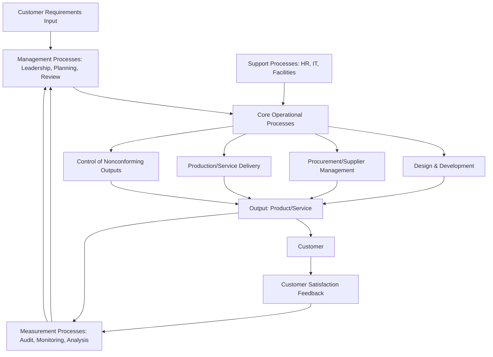
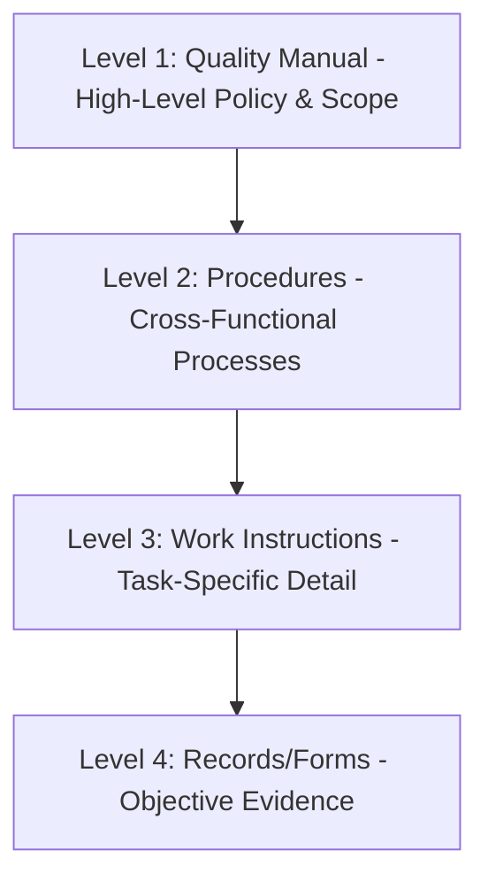

## Quality Manual Development and Structure

### Overview

Quality Manual Development and Structure covers the design, content, and organization of the Quality Manual — historically a mandatory documented requirement under ISO 9001:2008 (Clause 4.2.2), but no longer explicitly required as a named document under ISO 9001:2015. Despite its removal as a mandatory requirement, many organizations continue to develop a Quality Manual as a practical, high-level reference document describing the QMS structure, scope, and process interactions.

### Key Points

- ISO 9001:2015 does not use the term "Quality Manual" and does not mandate one; the standard instead requires "documented information" appropriate to the organization's context (Clause 7.5)
- Many organizations retain a Quality Manual voluntarily for onboarding, customer/auditor reference, and high-level QMS communication
- Where used, the Quality Manual typically summarizes scope, process interactions, and references to detailed procedures rather than containing full procedural detail
- The Quality Manual, if maintained, is itself documented information and subject to the control requirements of Clause 7.5.3

### Historical Context: 2008 vs. 2015 Requirements

| Aspect | ISO 9001:2008 | ISO 9001:2015 |
| --- | --- | --- |
| Quality Manual | Explicitly mandatory (Clause 4.2.2) | Not mandated; replaced by flexible "documented information" (Clause 7.5) |
| Required content (2008) | Scope, procedures/references, description of process interactions | No prescribed content — organization determines what documented information it needs |
| Documented procedures | Six mandatory procedures explicitly named | No mandatory procedures explicitly named; determined by what is "necessary for the effectiveness of the QMS" |
| Rationale for change | — | Reflects intent to make the standard applicable to organizations of all sizes/types without prescribing document architecture |

### Why Organizations Still Develop a Quality Manual

- Provides a single-source, high-level orientation document for new employees and auditors
- Satisfies customer or contractual expectations that predate or exceed ISO 9001:2015's own requirements
- Serves as an index/map to the broader documented information architecture
- Common practice in regulated or multi-certification environments (e.g., alongside ISO 13485, AS9100, IATF 16949, which may have their own manual expectations)

### Typical Quality Manual Structure

A voluntarily maintained Quality Manual commonly follows this structure:

1. **Introduction** — Purpose, organizational overview, history
2. **Scope of the QMS** — Products/services covered, any exclusions with justification (particularly relevant if any ISO 9001 clause is determined not applicable)
3. **Normative References** — Reference to ISO 9001:2015 and any sector-specific standards
4. **Terms and Definitions** — Organization-specific terminology beyond ISO 9000 vocabulary
5. **Context of the Organization** (Clause 4) — Summary of internal/external issues, interested parties, QMS scope statement
6. **Leadership** (Clause 5) — Quality policy statement, organizational roles/responsibilities/authorities summary
7. **Planning** (Clause 6) — Risk and opportunity approach summary, quality objectives framework
8. **Support** (Clause 7) — Resource management approach, competence/awareness framework, documented information control approach
9. **Operation** (Clause 8) — High-level process map/interaction diagram, references to detailed operational procedures
10. **Performance Evaluation** (Clause 9) — Monitoring/measurement approach summary, audit and management review framework
11. **Improvement** (Clause 10) — Continual improvement philosophy and corrective action framework reference
12. **Process Interaction Map** — Visual representation of how QMS processes interrelate
13. **Document Control Information** — Revision history, approval, distribution control

### Process Interaction Mapping

A core value-add of a Quality Manual is illustrating how processes interact — particularly useful for demonstrating the process approach required throughout ISO 9001:2015.

### Documentation Hierarchy

Where a Quality Manual is maintained, it typically sits at the top of a documentation pyramid:

| Level | Content Type | Example |
| --- | --- | --- |
| 1 | Quality Manual | Overall QMS scope and policy |
| 2 | Procedures | Document Control Procedure, Internal Audit Procedure |
| 3 | Work Instructions | Step-by-step machine operation, inspection instructions |
| 4 | Records | Completed inspection forms, audit reports, training records |

### Scope Statement and Exclusions

If any ISO 9001:2015 requirement is determined not applicable (most commonly within Clause 8 — Operation, e.g., a service-only organization excluding design and development activities under 8.3), the Quality Manual (or equivalent scope documentation) should:

- State the specific clause(s) excluded
- Provide justification for why the exclusion does not affect the organization's ability/responsibility to ensure conformity

**Example**

A software-as-a-service company may state: "Clause 8.3 (Design and Development of Products and Services) exclusions do not apply to internal software development, which is fully covered; however, Clause 8.5.2 (Identification and Traceability) is determined not applicable due to the intangible, non-lot-based nature of the service delivered."

### Documented Information Control (Clause 7.5.3) Applied to the Quality Manual

If maintained, the Quality Manual must be controlled per Clause 7.5.3:

- Approved for adequacy prior to issue
- Reviewed and updated as necessary, with re-approval
- Changes and current revision status identified
- Relevant versions available at points of use
- Protected from unintended alteration
- Legible and readily identifiable
- Controlled for distribution, access, retrieval, and use

### Common Approaches in Practice

| Approach | Description | Best Suited For |
| --- | --- | --- |
| Comprehensive Manual | Full narrative covering all clauses in detail | Organizations wanting a self-contained reference; common in regulated industries |
| Skeletal/Index Manual | Brief scope and policy statement with heavy cross-referencing to procedures | Lean documentation approach; smaller organizations |
| Integrated Management System (IMS) Manual | Single manual covering ISO 9001 alongside ISO 14001, ISO 45001, etc. | Multi-standard certified organizations |
| No Standalone Manual | QMS documented information distributed across a document management system without a single "manual" artifact | Organizations fully leveraging the 2015 flexibility |

### Common Audit Findings

- Quality Manual references procedures or clause numbers from ISO 9001:2008 that no longer align with the 2015 structure
- Manual claims exclusions without documented justification
- Manual not updated following organizational changes (e.g., new sites, changed scope) — version control lapse
- Manual duplicates procedural detail verbatim, creating maintenance burden and version-control risk across two document layers
- Process interaction diagram in the manual does not reflect actual current operational reality

### Relationship to Other Clauses

<svg xmlns="http://www.w3.org/2000/svg" viewBox="0 0 700 260">
<text x="350" y="25" text-anchor="middle" font-size="16" font-weight="bold" fill="#1a1a1a">Quality Manual Interfaces (svg_diagram)</text>
<rect x="270" y="50" width="160" height="55" rx="6" fill="#e8f0fe" stroke="#4285f4" stroke-width="1.5" />
<text x="350" y="73" text-anchor="middle" font-size="13" font-weight="bold" fill="#1a1a1a">Quality Manual</text>
<text x="350" y="90" text-anchor="middle" font-size="11" fill="#1a1a1a">(Voluntary Document)</text>
<rect x="60" y="150" width="150" height="55" rx="6" fill="#fef7e0" stroke="#f9ab00" stroke-width="1.5" />
<text x="135" y="173" text-anchor="middle" font-size="12" font-weight="bold" fill="#1a1a1a">Clause 4.3</text>
<text x="135" y="190" text-anchor="middle" font-size="11" fill="#1a1a1a">QMS Scope</text>
<rect x="250" y="150" width="150" height="55" rx="6" fill="#fce8e6" stroke="#ea4335" stroke-width="1.5" />
<text x="325" y="173" text-anchor="middle" font-size="12" font-weight="bold" fill="#1a1a1a">Clause 5.2</text>
<text x="325" y="190" text-anchor="middle" font-size="11" fill="#1a1a1a">Quality Policy</text>
<rect x="440" y="150" width="150" height="55" rx="6" fill="#e6f4ea" stroke="#34a853" stroke-width="1.5" />
<text x="515" y="173" text-anchor="middle" font-size="12" font-weight="bold" fill="#1a1a1a">Clause 7.5</text>
<text x="515" y="190" text-anchor="middle" font-size="11" fill="#1a1a1a">Documented Information</text>
<line x1="270" y1="80" x2="210" y2="150" stroke="#666" stroke-width="1.5" />
<line x1="320" y1="105" x2="325" y2="150" stroke="#666" stroke-width="1.5" />
<line x1="430" y1="90" x2="510" y2="150" stroke="#666" stroke-width="1.5" />
</svg>

[Inference] Because ISO 9001:2015 deliberately removed the mandatory Quality Manual requirement to increase flexibility for organizations of varying size and complexity, certification body auditors generally do not penalize the absence of a manual; however, where an organization chooses to maintain one, auditors commonly cross-check it against actual practice, since an outdated or aspirational manual that misrepresents operational reality is frequently flagged as a documentation control weakness under Clause 7.5.

**Related Topics**

- Clause 7.5 — Control of Documented Information
- Clause 4.3 — Determining the Scope of the QMS
- Clause 5.2 — Quality Policy
- Integrated Management System (IMS) Documentation Approaches
- Process Approach and Process Mapping Techniques
- Clause 8.3 — Design and Development Exclusion Justification