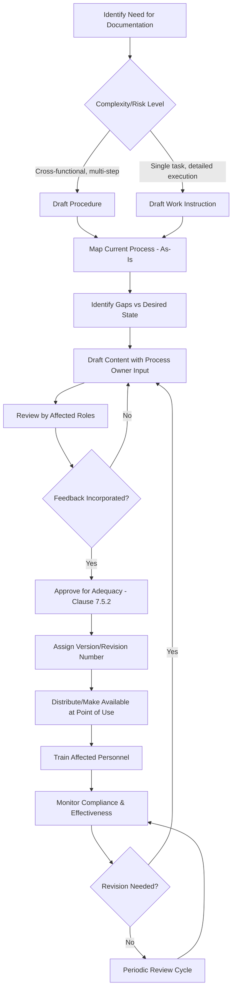

## Writing Procedures and Work Instructions

### Overview

Writing Procedures and Work Instructions covers the practical authorship of Level 2 (procedures) and Level 3 (work instructions) documented information within a QMS documentation hierarchy. While ISO 9001:2015 no longer mandates specific named procedures, Clause 4.4.2 and Clause 7.5 require the organization to maintain documented information "to the extent necessary" to support process operation and to have confidence that processes are carried out as planned.

### Key Points

- ISO 9001:2015 does not prescribe document titles, formats, or a mandatory list of procedures — the organization determines what is "necessary" (Clause 4.4.2(a))
- A **procedure** describes *what* happens across a process, typically cross-functional and higher-level
- A **work instruction** describes *how* a specific task is performed, typically single-role and highly detailed
- Good procedures/work instructions balance completeness against usability — over-documentation creates maintenance burden and reduces compliance

### Procedure vs. Work Instruction — Key Distinction

| Aspect | Procedure | Work Instruction |
| --- | --- | --- |
| Level of detail | Process-level (what, who, when) | Task-level (exact how-to steps) |
| Scope | Often cross-functional | Single role/workstation |
| Audience | Process owners, multiple roles | Individual operator/technician |
| Typical length | 2–5 pages | 1 page or less, often visual |
| Example | "Purchasing Procedure" | "How to Calibrate Torque Wrench Model X" |

### When a Procedure/Work Instruction Is "Necessary"

Per Clause 4.4.2(b), documented information is needed to the extent necessary to have confidence that processes are being carried out as planned. Factors indicating the need for documentation:

- Process complexity or number of steps
- Consequence of process failure (safety, regulatory, customer impact)
- Competence level and turnover rate of personnel performing the task
- Legal/regulatory/customer contractual requirement for documented evidence
- Historical evidence of process variability or recurring nonconformity without documentation

### Standard Procedure Structure

A well-formed procedure typically includes:

1. **Purpose** — Why the procedure exists
2. **Scope** — What is/is not covered
3. **Definitions/Abbreviations** — Terms specific to the procedure
4. **Responsibilities** — Roles and their duties within the process (often a RACI table)
5. **Procedure/Process Description** — Sequential steps, often with a flowchart
6. **References** — Related procedures, standards, forms
7. **Records Generated** — What documented information results from this process
8. **Revision History** — Version control table

### RACI Matrix Example for a Procedure

| Activity | Process Owner | Quality Manager | Operator | Purchasing |
| --- | --- | --- | --- | --- |
| Approve supplier | A | R | I | C |
| Perform incoming inspection | I | C | R | I |
| Issue nonconformance report | I | A | R | I |
| Close corrective action | C | A | I | R |

*(R = Responsible, A = Accountable, C = Consulted, I = Informed)*

### Standard Work Instruction Structure

A work instruction is typically leaner and more visual:

1. **Task Title and Identifier**
2. **Purpose/Scope** (one line)
3. **Required Tools/Materials/PPE**
4. **Step-by-Step Instructions** — Numbered, action-oriented, often with images/diagrams
5. **Acceptance Criteria** — What "correct" looks like
6. **Safety Warnings/Cautions** (if applicable)
7. **Reference to Parent Procedure**

### Procedure Development Process Flow

### Writing Style Best Practices

- **Active voice, imperative mood** — "Inspect the weld" not "The weld should be inspected"
- **One action per step** — Avoid compound steps combining multiple actions
- **Consistent terminology** — Match terms used in training and forms exactly; avoid synonyms for the same concept
- **Avoid ambiguous qualifiers** — Replace "periodically" or "as needed" with specific frequency/criteria where feasible
- **Visual aids** — Photos, diagrams, and flowcharts reduce misinterpretation, particularly valuable for multilingual workforces
- **Numbered steps with clear acceptance criteria** — Especially critical for inspection/test work instructions

**Example**

Poor: "Check the part periodically for defects and take appropriate action if needed."

Improved: "Inspect each part visually under the workstation light every 10 units produced. Reject any part exhibiting surface cracks greater than 0.5mm per the defect reference photos posted at the station. Place rejected parts in the red quarantine bin and complete Form QF-014."

### Common Document Control Elements

| Element | Purpose |
| --- | --- |
| Document ID/Number | Unique identifier for traceability |
| Revision number/letter | Tracks version history |
| Effective date | When the current version becomes active |
| Author/Owner | Accountable role for content accuracy |
| Approver | Role authorizing release (Clause 7.5.2) |
| Review cycle | Defined interval for periodic re-validation |

### Level of Detail Calibration

| Risk/Complexity | Recommended Documentation Depth |
| --- | --- |
| High risk, high complexity, novice workforce | Detailed work instruction with visuals, mandatory sign-off |
| High risk, low complexity, experienced workforce | Concise work instruction with acceptance criteria only |
| Low risk, high complexity | Procedure with process flow; work instruction optional |
| Low risk, low complexity | Procedure reference may suffice; work instruction often unnecessary |

### Common Audit Findings

- Procedures describe an idealized process that does not match actual practice observed during the audit (a classic "say-do gap")
- Work instructions lack acceptance criteria, leaving pass/fail judgment subjective
- Outdated revision in use at the point of work due to poor distribution control (Clause 7.5.3)
- Excessive procedural detail duplicated across multiple documents, creating conflicting instructions after a partial update
- No evidence that affected personnel were trained on a procedure following a revision
- Procedures written by quality department in isolation without process owner or operator input, resulting in impractical or ignored steps

### Relationship to Other Clauses

<svg xmlns="http://www.w3.org/2000/svg" viewBox="0 0 700 260">
<text x="350" y="25" text-anchor="middle" font-size="16" font-weight="bold" fill="#1a1a1a">Procedures &amp; Work Instructions Interfaces (svg_diagram)</text>
<rect x="270" y="50" width="160" height="55" rx="6" fill="#e8f0fe" stroke="#4285f4" stroke-width="1.5" />
<text x="350" y="73" text-anchor="middle" font-size="13" font-weight="bold" fill="#1a1a1a">Clause 4.4.2</text>
<text x="350" y="90" text-anchor="middle" font-size="11" fill="#1a1a1a">Documented Information Need</text>
<rect x="60" y="150" width="150" height="55" rx="6" fill="#fef7e0" stroke="#f9ab00" stroke-width="1.5" />
<text x="135" y="173" text-anchor="middle" font-size="12" font-weight="bold" fill="#1a1a1a">Clause 7.2</text>
<text x="135" y="190" text-anchor="middle" font-size="11" fill="#1a1a1a">Competence</text>
<rect x="250" y="150" width="150" height="55" rx="6" fill="#fce8e6" stroke="#ea4335" stroke-width="1.5" />
<text x="325" y="173" text-anchor="middle" font-size="12" font-weight="bold" fill="#1a1a1a">Clause 7.5</text>
<text x="325" y="190" text-anchor="middle" font-size="11" fill="#1a1a1a">Documented Information Control</text>
<rect x="440" y="150" width="150" height="55" rx="6" fill="#e6f4ea" stroke="#34a853" stroke-width="1.5" />
<text x="515" y="173" text-anchor="middle" font-size="12" font-weight="bold" fill="#1a1a1a">Clause 8.5.1</text>
<text x="515" y="190" text-anchor="middle" font-size="11" fill="#1a1a1a">Control of Production/Service Provision</text>
<line x1="270" y1="80" x2="210" y2="150" stroke="#666" stroke-width="1.5" />
<line x1="320" y1="105" x2="325" y2="150" stroke="#666" stroke-width="1.5" />
<line x1="430" y1="90" x2="510" y2="150" stroke="#666" stroke-width="1.5" />
</svg>

[Inference] While ISO 9001:2015 grants organizations wide latitude in determining which processes require documented procedures versus work instructions, auditors generally infer the appropriate level of documentation from observed process variability and nonconformity history during the audit; a process with a documented, low-detail instruction that nonetheless produces consistent, conforming results is typically viewed as adequately controlled, whereas an undocumented but highly variable process is more likely to draw a finding regardless of the standard's flexibility.

**Related Topics**

- Clause 7.5 — Control of Documented Information
- Clause 4.4.2 — Documented Information Requirements for QMS Processes
- Clause 7.2 — Competence
- Clause 8.5.1 — Control of Production and Service Provision
- Visual Management and Standard Work Techniques (Lean)
- Document Control Software and Version Management Systems