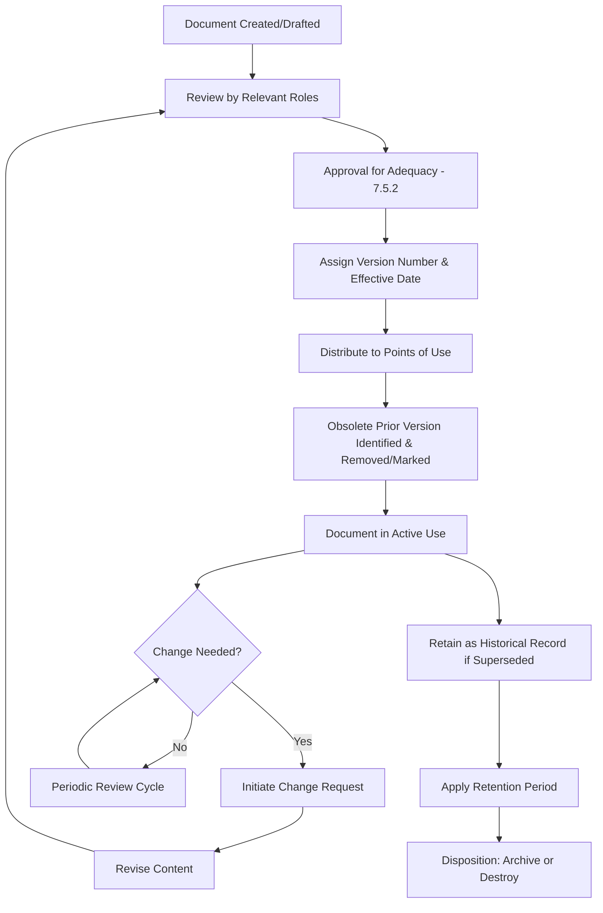

## Document Control Processes

### Overview

Document Control Processes cover the requirements of ISO 9001:2015 Clause 7.5.3, which governs how documented information is controlled to ensure it is available, suitable for use, and adequately protected. Document control is the operational discipline that keeps the documentation hierarchy (Quality Manual, procedures, work instructions, records) trustworthy, current, and accessible at the point of need.

### Key Points

- Clause 7.5.3 is split into two sub-clauses: 7.5.3.1 (general control objectives) and 7.5.3.2 (specific control activities)
- Document control applies to both **documents** (instructions, procedures — subject to revision) and **records** (evidence of results — generally not revised after creation)
- Poor document control is one of the most frequently cited nonconformities in ISO 9001 audits because it is easy to observe directly (e.g., finding an obsolete revision in use)
- Document control can be paper-based, but is increasingly implemented via electronic Document Management Systems (DMS)

### Clause 7.5.3.1 — General Control Objectives

Documented information required by the QMS must be controlled to ensure:

(a) It is available and suitable for use, where and when needed

(b) It is adequately protected (from loss of confidentiality, improper use, or loss of integrity)

### Clause 7.5.3.2 — Specific Control Activities

For the control of documented information, the organization shall address, as applicable:

- **Distribution, access, retrieval, and use**
- **Storage and preservation**, including preservation of legibility
- **Control of changes** (e.g., version control)
- **Retention and disposition**

Documented information of external origin (e.g., customer specifications, regulatory standards) determined to be necessary for QMS planning and operation must be identified and controlled.

Documented information retained as evidence of conformity must be protected from unintended alterations.

### Document vs. Record — Distinct Control Needs

| Aspect | Document (e.g., procedure) | Record (e.g., inspection report) |
| --- | --- | --- |
| Nature | Living, subject to revision | Static evidence of a past event |
| Control focus | Version control, approval before reissue | Retention period, protection from alteration |
| Change process | Formal revision/approval cycle | Generally not revised; corrections are annotated, not rewritten |
| Example control | "Only the current revision is available at workstations" | "Records retained for 7 years per contractual requirement" |

### Document Control Lifecycle

### Version Control Conventions

| Convention | Example | Typical Use |
| --- | --- | --- |
| Sequential numeric | Rev. 1, Rev. 2, Rev. 3 | Simple, linear revision tracking |
| Major.Minor | v2.1, v2.2, v3.0 | Distinguishing minor edits from substantive rewrites |
| Date-based | 2026-03-15 | Systems where chronological currency is the primary concern |
| Letter-based | Rev. A, Rev. B, Rev. C | Common in aerospace/engineering drawing control |

**Example**

A document control table entry:

| Document ID | Title | Revision | Effective Date | Approved By | Next Review Due |
| --- | --- | --- | --- | --- | --- |
| PRC-QA-014 | Incoming Inspection Procedure | Rev. C | 2026-06-01 | QA Manager | 2027-06-01 |

### External Origin Documents

Documents originating outside the organization but necessary for QMS operation must also be identified and controlled:

- Customer specifications and drawings
- Regulatory standards (e.g., ISO standards themselves, industry codes)
- Supplier certificates of conformance/analysis
- Applicable statutory/legal texts

**Example**

An organization maintains a controlled register of external documents including the current edition of a referenced ASTM material standard, with a defined process for monitoring standard revisions and updating internal specifications accordingly.

### Electronic Document Management System (EDMS) Considerations

Modern QMS implementations frequently use electronic systems to enforce document control automatically:

- Automated version control preventing use of superseded documents
- Role-based access control for approval workflows
- Audit trail of who accessed, changed, or approved a document
- Automatic obsolescence/archival triggers upon new version approval
- Electronic signatures for approval (subject to applicable regulatory acceptance, e.g., 21 CFR Part 11 in regulated industries)

| Feature | Manual/Paper-Based Control | Electronic DMS |
| --- | --- | --- |
| Version enforcement | Relies on manual distribution discipline | System-enforced; old versions inaccessible or watermarked |
| Approval tracking | Physical signature sheets | Digital workflow with timestamped audit trail |
| Retrieval speed | Slower, location-dependent | Immediate, searchable |
| Risk of obsolete copies in use | Higher | Lower, if properly configured |
| Access control | Physical/procedural | Role-based permissions |

### Retention and Disposition

The organization must define retention periods for documented information, particularly records, based on:

- Regulatory/statutory minimum retention requirements
- Contractual customer requirements
- Internal risk tolerance (e.g., product liability exposure period)
- Traceability needs for the product/service lifecycle

**Example retention schedule excerpt**

| Record Type | Retention Period | Basis |
| --- | --- | --- |
| Calibration records | 3 years after equipment retirement | Internal policy |
| Internal audit reports | 5 years | Certification body expectation |
| Customer complaint records | 7 years | Contractual requirement |
| Training records | Duration of employment + 3 years | Internal policy |

### Protecting Records from Unintended Alteration

Common mechanisms:

- Read-only file permissions or PDF locking for finalized records
- Physical records stored in access-controlled locations
- Audit trails in electronic systems logging any edit attempt
- Single-entry, error-correction protocols for paper records (single line-through, initialed, dated — never erased or obscured)

### Common Audit Findings

- Obsolete document revisions found in active use at a workstation (classic, frequently cited finding)
- No defined retention period for a record type, or retention period not followed in practice
- External documents (e.g., referenced standards) not tracked for revision currency
- Approval evidence missing for a document currently in use (no record of who approved the current revision)
- Electronic DMS access controls not actually restricting edit rights as configured/claimed
- Records altered without an auditable correction trail (information erased/whited-out rather than struck through and initialed)

### Relationship to Other Clauses

<svg xmlns="http://www.w3.org/2000/svg" viewBox="0 0 700 260">
<text x="350" y="25" text-anchor="middle" font-size="16" font-weight="bold" fill="#1a1a1a">Clause 7.5.3 Interfaces (svg_diagram)</text>
<rect x="270" y="50" width="160" height="55" rx="6" fill="#e8f0fe" stroke="#4285f4" stroke-width="1.5" />
<text x="350" y="73" text-anchor="middle" font-size="13" font-weight="bold" fill="#1a1a1a">Clause 7.5.3</text>
<text x="350" y="90" text-anchor="middle" font-size="11" fill="#1a1a1a">Control of Documented Info</text>
<rect x="60" y="150" width="150" height="55" rx="6" fill="#fef7e0" stroke="#f9ab00" stroke-width="1.5" />
<text x="135" y="173" text-anchor="middle" font-size="12" font-weight="bold" fill="#1a1a1a">Clause 7.5.1/7.5.2</text>
<text x="135" y="190" text-anchor="middle" font-size="11" fill="#1a1a1a">Creating &amp; Updating</text>
<rect x="250" y="150" width="150" height="55" rx="6" fill="#fce8e6" stroke="#ea4335" stroke-width="1.5" />
<text x="325" y="173" text-anchor="middle" font-size="12" font-weight="bold" fill="#1a1a1a">Clause 8.4.3</text>
<text x="325" y="190" text-anchor="middle" font-size="11" fill="#1a1a1a">External Provider Info</text>
<rect x="440" y="150" width="150" height="55" rx="6" fill="#e6f4ea" stroke="#34a853" stroke-width="1.5" />
<text x="515" y="173" text-anchor="middle" font-size="12" font-weight="bold" fill="#1a1a1a">Clause 9.2</text>
<text x="515" y="190" text-anchor="middle" font-size="11" fill="#1a1a1a">Internal Audit Evidence</text>
<line x1="270" y1="80" x2="210" y2="150" stroke="#666" stroke-width="1.5" />
<line x1="320" y1="105" x2="325" y2="150" stroke="#666" stroke-width="1.5" />
<line x1="430" y1="90" x2="510" y2="150" stroke="#666" stroke-width="1.5" />
</svg>

[Inference] Document control weaknesses are generally regarded by certification bodies as an early-warning indicator of broader QMS discipline gaps, since they are among the easiest nonconformities to detect through direct observation; the severity classification assigned (observation vs. minor vs. major) typically depends on whether the finding is isolated or reflects a systemic breakdown across multiple documents or sites.

**Related Topics**

- Clause 7.5.1 — Creating and Updating Documented Information
- Clause 7.5.2 — Format and Review/Approval of Documented Information
- Clause 8.4.3 — Information for External Providers
- Records Retention Schedule Development
- Electronic Signature Compliance (21 CFR Part 11 where applicable)
- Configuration Management in Regulated Industries