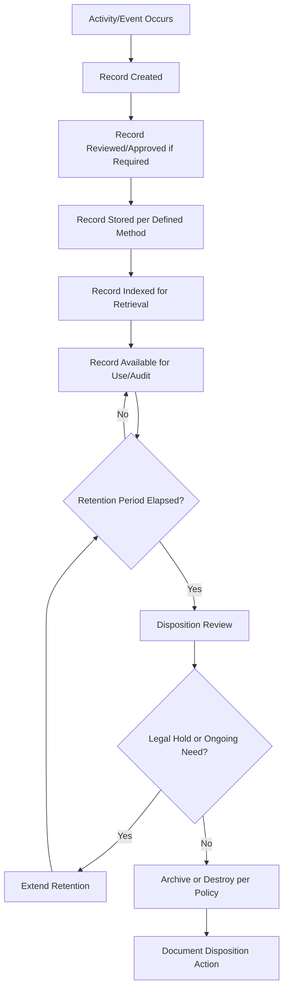

## Records Management and Retention

### Overview

Records Management and Retention addresses the specific requirements within ISO 9001:2015 Clause 7.5.3 that apply to **records** — a distinct category of documented information retained as evidence of conformity and results achieved, as opposed to living documents like procedures. While ISO 9001:2015 no longer uses the term "quality record" explicitly (having unified "document" and "record" under "documented information"), the practical distinction and its control implications remain operationally significant.

### Key Points

- A record is documented information stating results achieved or providing evidence of activities performed — it is retrospective and, once created, generally not revised
- Clause 7.5.3.2 requires records to be protected from unintended alterations
- Retention periods must be defined based on regulatory, contractual, and risk-based considerations — ISO 9001:2015 does not specify durations
- Records provide the objective evidence auditors rely on to verify actual QMS performance, distinct from the aspirational statements found in procedures

### Records vs. Documents — Recap of the Distinction

| Aspect | Document | Record |
| --- | --- | --- |
| Temporal orientation | Forward-looking (how things should be done) | Backward-looking (what was done) |
| Subject to revision | Yes | No — corrections are annotated, not rewritten |
| Primary control concern | Version currency | Integrity, retention, retrievability |
| Example | Inspection Procedure | Completed Inspection Report |

### Categories of QMS Records

| Category | Examples |
| --- | --- |
| Conformity evidence | Inspection/test records, calibration certificates |
| Process performance | Monitoring/measurement logs, KPI dashboards |
| Personnel | Training records, competence evaluations |
| Management system | Internal audit reports, management review minutes |
| Nonconformity/improvement | NCR logs, CAPA records, RCA reports |
| Supplier-related | Supplier evaluation records, incoming inspection results |
| Customer-related | Complaint logs, satisfaction survey data, contract review records |

### Records Lifecycle

### Defining Retention Periods

Retention period determination should consider multiple, sometimes competing, factors:

$$\text{Retention Period} = \max(\text{Regulatory Minimum}, \text{Contractual Requirement}, \text{Internal Risk-Based Need})$$

| Driver | Description | Example |
| --- | --- | --- |
| Regulatory/statutory | Minimum legally mandated retention | Tax records, safety records under labor law |
| Contractual/customer | Customer-imposed retention clauses in supply agreements | Aerospace/automotive customer-specific requirements (often 10+ years) |
| Product lifecycle | Retention tied to expected product service life or warranty period | Records retained through warranty period plus buffer |
| Litigation/liability exposure | Statute of limitations for product liability claims | Jurisdiction-dependent |
| Certification body expectation | Common practice even absent explicit ISO requirement | Internal audit records typically 3–5 years |

### Storage and Preservation

Clause 7.5.3.2(b) requires consideration of storage and preservation, including preservation of legibility:

- **Physical records**: Fire-resistant storage, humidity/temperature control, protection from pest/water damage, indexed filing systems
- **Electronic records**: Backup and disaster recovery procedures, file format longevity (avoiding obsolete formats), access logging
- **Legibility preservation**: For physical records, protection against fading (e.g., avoiding thermal paper for long-retention records without archival copying); for electronic records, format migration planning as software/hardware evolves

### Protection from Unintended Alteration

| Method | Application |
| --- | --- |
| Read-only/locked file formats | Finalized digital records (e.g., signed PDF) |
| Audit trail logging | Electronic systems recording all access/edit attempts |
| Physical access control | Locked archive rooms, controlled key/badge access |
| Single-entry correction protocol | Paper records: single strike-through, initialed, dated (never obscured/erased) |
| Digital signatures/hashing | Tamper-evidence for critical regulated records |

### Records Retrieval and Accessibility

Records must be retrievable within a timeframe appropriate to their use:

- Audit-support records: retrievable promptly during scheduled or surprise audits
- Customer complaint investigation records: retrievable quickly to support timely customer response
- Long-term archived records: retrieval time may reasonably be longer, provided a documented process exists

**Example**

An organization's records management procedure specifies: "Active records (current calendar year) are retrievable within 1 business hour. Archived records up to 5 years old are retrievable within 2 business days via the offsite archive request process. Records beyond 5 years follow the disposition schedule in Appendix C."

### Disposition and Destruction

At the end of a defined retention period, disposition activities should be documented:

- Confirmation no legal hold, ongoing investigation, or contractual extension applies
- Secure destruction method appropriate to record sensitivity (shredding for paper, secure wipe/degaussing for electronic media)
- Disposition log recording what was destroyed, when, and under whose authorization

### Records Management Roles and Responsibilities

| Role | Responsibility |
| --- | --- |
| Record owner/process owner | Ensures records are created and accurate at point of origin |
| Document/records controller | Maintains indexing, storage, and retrieval systems |
| Quality Manager | Oversees compliance with retention schedule and audit readiness |
| IT/System Administrator | Maintains electronic storage infrastructure, backups, access controls |

### Common Audit Findings

- Retention period not defined for a record type, or defined but not followed in practice
- Records requested during audit could not be retrieved within a reasonable time, undermining confidence in the system
- Electronic records lack an audit trail showing who created or modified them
- Records altered without a visible correction trail (erasure rather than strike-through/initial/date)
- Disposition/destruction of records occurred without documented authorization or verification that no legal hold applied
- Records retained in a deprecated file format no longer readable by current systems

### Relationship to Other Clauses

<svg xmlns="http://www.w3.org/2000/svg" viewBox="0 0 700 260">
<text x="350" y="25" text-anchor="middle" font-size="16" font-weight="bold" fill="#1a1a1a">Records Management Interfaces (svg_diagram)</text>
<rect x="270" y="50" width="160" height="55" rx="6" fill="#e8f0fe" stroke="#4285f4" stroke-width="1.5" />
<text x="350" y="73" text-anchor="middle" font-size="13" font-weight="bold" fill="#1a1a1a">Clause 7.5.3</text>
<text x="350" y="90" text-anchor="middle" font-size="11" fill="#1a1a1a">Records Control</text>
<rect x="60" y="150" width="150" height="55" rx="6" fill="#fef7e0" stroke="#f9ab00" stroke-width="1.5" />
<text x="135" y="173" text-anchor="middle" font-size="12" font-weight="bold" fill="#1a1a1a">Clause 9.2</text>
<text x="135" y="190" text-anchor="middle" font-size="11" fill="#1a1a1a">Internal Audit Evidence</text>
<rect x="250" y="150" width="150" height="55" rx="6" fill="#fce8e6" stroke="#ea4335" stroke-width="1.5" />
<text x="325" y="173" text-anchor="middle" font-size="12" font-weight="bold" fill="#1a1a1a">Clause 8.5.2</text>
<text x="325" y="190" text-anchor="middle" font-size="11" fill="#1a1a1a">Traceability</text>
<rect x="440" y="150" width="150" height="55" rx="6" fill="#e6f4ea" stroke="#34a853" stroke-width="1.5" />
<text x="515" y="173" text-anchor="middle" font-size="12" font-weight="bold" fill="#1a1a1a">Clause 10.2</text>
<text x="515" y="190" text-anchor="middle" font-size="11" fill="#1a1a1a">Corrective Action Evidence</text>
<line x1="270" y1="80" x2="210" y2="150" stroke="#666" stroke-width="1.5" />
<line x1="320" y1="105" x2="325" y2="150" stroke="#666" stroke-width="1.5" />
<line x1="430" y1="90" x2="510" y2="150" stroke="#666" stroke-width="1.5" />
</svg>

[Inference] Because records serve as the primary objective evidence auditors examine to verify actual practice against documented procedure, certification bodies generally treat records integrity and retrievability failures more severely than equivalent gaps in procedural documents, since a missing or unreliable record can undermine confidence in an otherwise well-designed process; the specific classification (minor vs. major nonconformity) typically depends on whether the gap is isolated or indicative of a systemic records management weakness.

**Related Topics**

- Clause 7.5.3 — Control of Documented Information (records-specific application)
- Clause 8.5.2 — Identification and Traceability
- Clause 9.2 — Internal Audit Program Planning and Execution
- Clause 10.2 — Nonconformity Identification and Correction
- Electronic Records Compliance (21 CFR Part 11, where applicable)
- Records Retention Schedule Development Methodology