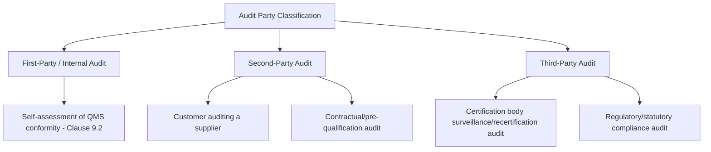
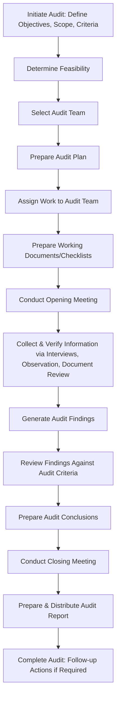

## Audit Principles and Types of Audits

### Overview

Audit Principles and Types of Audits establishes the foundational concepts underlying management system auditing, primarily as codified in ISO 19011 (Guidelines for Auditing Management Systems). While ISO 9001:2015 itself only mandates internal auditing (Clause 9.2), understanding the broader universe of audit types and the principles governing objective, evidence-based auditing is essential context for implementing an effective internal audit program and for engaging with external certification and customer audits.

### Key Points

- ISO 19011 defines seven audit principles that underpin the credibility and reliability of audit conclusions
- Audits are classified along two primary axes: **who performs them** (first/second/third-party) and **what they assess** (system, process, product)
- An audit is fundamentally a **systematic, independent, and documented process** for obtaining objective evidence and evaluating it against audit criteria
- Audit conclusions must be traceable to objective evidence, not opinion or assumption

### The Seven Audit Principles (ISO 19011)

1. **Integrity** — The foundation of professionalism; auditors perform work with honesty, diligence, and responsibility
2. **Fair presentation** — Obligation to report truthfully and accurately; findings and conclusions reflect audit activities truthfully
3. **Due professional care** — Auditors exercise diligence and judgment commensurate with the importance of the task
4. **Confidentiality** — Security of information; auditors exercise discretion in the use and protection of information acquired
5. **Independence** — Basis for impartiality and objectivity of audit conclusions; auditors are independent of the activity being audited wherever possible
6. **Evidence-based approach** — Rational method for reaching reliable, reproducible conclusions in a systematic audit process
7. **Risk-based approach** — An audit approach that considers risks and opportunities; this principle substantively influences the planning, conducting, and reporting of audits

### Classification by Party (Who Performs the Audit)

| Type | Performed By | Purpose | Independence Level |
| --- | --- | --- | --- |
| First-party (Internal) | Organization's own personnel (or contracted on its behalf) | Self-verification of conformity/effectiveness | Internal impartiality — auditor independent of the area audited, but still organization-employed |
| Second-party | Customers, or parties with an interest in the organization (e.g., regulators without certification authority) | Verify a supplier/contractor meets requirements before or during a business relationship | External to organization, but interested party |
| Third-party | Independent certification/accreditation bodies | Certification, accreditation, or regulatory compliance verification | Fully independent, accredited |

### Classification by Scope/Subject

| Type | Focus | Example |
| --- | --- | --- |
| System audit | Evaluates the entire management system against a standard (e.g., ISO 9001) | Full QMS certification audit |
| Process audit | Evaluates a specific process's conformity and effectiveness | Purchasing process audit, welding process audit |
| Product audit | Evaluates a specific product/service against its own specifications | End-of-line product verification audit |
| Compliance audit | Verifies conformity to legal/regulatory requirements specifically | Environmental regulatory compliance audit |
| Integrated audit | Combines multiple management system standards in one audit event | Combined ISO 9001/14001/45001 audit |
| Combined audit | Two or more organizations audited together (e.g., joint venture) | Multi-site combined audit |

### Certification Audit Stages (Third-Party Context)

| Stage | Purpose |
| --- | --- |
| Stage 1 (Documentation Review) | Certification body reviews QMS documentation and readiness for Stage 2; identifies areas of concern |
| Stage 2 (Certification Audit) | On-site evaluation of implementation and effectiveness; determines certification recommendation |
| Surveillance Audits | Periodic (typically annual) audits during the certification cycle to confirm continued conformity |
| Recertification Audit | Comprehensive re-audit at the end of the certification cycle (typically every 3 years) |

### Generic Audit Process Flow

### Audit Criteria, Scope, and Evidence — Core Terminology

| Term | Definition |
| --- | --- |
| Audit criteria | The set of requirements used as a reference (e.g., ISO 9001 clauses, internal procedures) |
| Audit scope | The extent and boundaries of the audit (physical locations, processes, time period) |
| Audit evidence | Records, statements of fact, or other verifiable information relevant to audit criteria |
| Audit findings | Results of evaluating collected evidence against audit criteria (conformity or nonconformity) |
| Audit conclusion | The overall outcome of an audit after considering all findings |

### Evidence-Based Approach in Practice

Audit conclusions must rest on a sample of available information, since auditing occurs within finite time and resources. This makes sampling method and confidence in findings central concerns:

$$\text{Sampling Confidence} \propto \text{Sample Size, Sample Method Rigor, and Risk-Based Selection}$$

Common sampling approaches:

- **Judgmental sampling** — Auditor selects based on experience/risk judgment (common in most management system audits)
- **Statistical sampling** — Formal statistical methods determining sample size for a defined confidence level (more common in product/compliance audits)

### Distinguishing Audit from Related Activities

| Activity | Distinguishing Characteristic |
| --- | --- |
| Audit | Systematic, evidence-based, against defined criteria, results in findings/conclusions |
| Inspection | Verification of conformity of a specific item against specification (narrower, often product-focused) |
| Surveillance | Ongoing monitoring activity, not necessarily systematic/periodic in the audit sense |
| Management review | Evaluative but strategic/decision-focused, not evidence-sampling in the audit sense |

### Common Misapplications and Pitfalls

- Conflating a "walkthrough" or informal observation with a formal audit (missing the systematic, criteria-based rigor)
- Auditors reaching conclusions based on assumption or reputation of a department rather than sampled objective evidence
- Confusing second-party audits (customer-driven) with third-party certification audits in contractual language
- Treating audit findings as opinions rather than evidence-referenced statements

### Relationship to Other Clauses/Standards

<svg xmlns="http://www.w3.org/2000/svg" viewBox="0 0 700 260">
<text x="350" y="25" text-anchor="middle" font-size="16" font-weight="bold" fill="#1a1a1a">Audit Principles Interfaces (svg_diagram)</text>
<rect x="270" y="50" width="160" height="55" rx="6" fill="#e8f0fe" stroke="#4285f4" stroke-width="1.5" />
<text x="350" y="73" text-anchor="middle" font-size="13" font-weight="bold" fill="#1a1a1a">ISO 19011</text>
<text x="350" y="90" text-anchor="middle" font-size="11" fill="#1a1a1a">Auditing Guidelines</text>
<rect x="60" y="150" width="150" height="55" rx="6" fill="#fef7e0" stroke="#f9ab00" stroke-width="1.5" />
<text x="135" y="173" text-anchor="middle" font-size="12" font-weight="bold" fill="#1a1a1a">ISO 9001 9.2</text>
<text x="135" y="190" text-anchor="middle" font-size="11" fill="#1a1a1a">Internal Audit</text>
<rect x="250" y="150" width="150" height="55" rx="6" fill="#fce8e6" stroke="#ea4335" stroke-width="1.5" />
<text x="325" y="173" text-anchor="middle" font-size="12" font-weight="bold" fill="#1a1a1a">ISO/IEC 17021-1</text>
<text x="325" y="190" text-anchor="middle" font-size="11" fill="#1a1a1a">Certification Body Requirements</text>
<rect x="440" y="150" width="150" height="55" rx="6" fill="#e6f4ea" stroke="#34a853" stroke-width="1.5" />
<text x="515" y="173" text-anchor="middle" font-size="12" font-weight="bold" fill="#1a1a1a">ISO/IEC 17024</text>
<text x="515" y="190" text-anchor="middle" font-size="11" fill="#1a1a1a">Auditor Certification Schemes</text>
<line x1="270" y1="80" x2="210" y2="150" stroke="#666" stroke-width="1.5" />
<line x1="320" y1="105" x2="325" y2="150" stroke="#666" stroke-width="1.5" />
<line x1="430" y1="90" x2="510" y2="150" stroke="#666" stroke-width="1.5" />
</svg>

[Inference] While ISO 19011 is a guideline document rather than a certifiable requirement, it is widely treated by certification bodies, accreditation bodies (which apply ISO/IEC 17021-1 to certification bodies themselves), and auditor training/certification schemes as the authoritative reference for audit methodology; the degree to which an internal audit program is expected to formally mirror ISO 19011's structure typically scales with organizational maturity and sector-specific expectations rather than being a strict pass/fail certification criterion.

**Related Topics**

- ISO 19011 — Full Guidelines for Auditing Management Systems
- Clause 9.2 — Internal Audit Program Planning and Execution
- ISO/IEC 17021-1 — Requirements for Certification Bodies
- Auditor Competence, Training, and Certification (IRCA, Exemplar Global)
- Audit Sampling Methodologies
- Integrated Management System (IMS) Audit Approaches