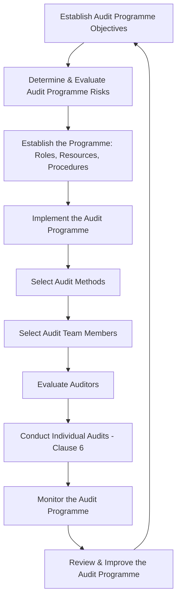
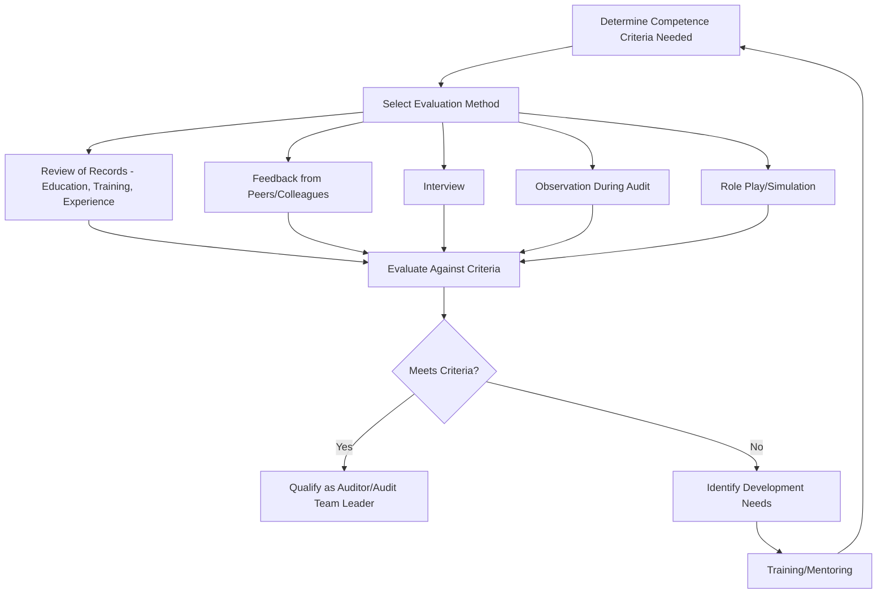

## ISO 19011 Guidelines for Auditing Management Systems

### Overview

ISO 19011 provides guidance on auditing management systems, including the principles of auditing, managing an audit programme, and conducting management system audits, as well as guidance on the evaluation of competence of individuals involved in the audit process. Unlike ISO 9001, ISO 19011 is not a certifiable standard — organizations cannot be certified "to" ISO 19011 — but it serves as the internationally recognized reference methodology underpinning both internal and external management system audits.

### Key Points

- Current edition is ISO 19011:2018, which broadened applicability beyond quality/environmental systems to any management system standard
- ISO 19011 is structured into clauses covering: Scope, Normative References, Terms and Definitions, Principles of Auditing, Managing an Audit Programme, Conducting an Audit, and Competence/Evaluation of Auditors
- ISO 19011:2018 strengthened emphasis on risk-based thinking, remote auditing methods, and auditing generic management system concepts (context, leadership) applicable across standards
- Applicable to first-, second-, and third-party audits, and to auditors and audit programme managers alike

### Standard Structure

| Clause | Title | Content Focus |
| --- | --- | --- |
| Clause 1 | Scope | Guidance applicability across audit types and management systems |
| Clause 2 | Normative References | (None currently listed as indispensable) |
| Clause 3 | Terms and Definitions | Core auditing vocabulary |
| Clause 4 | Principles of Auditing | Seven foundational principles |
| Clause 5 | Managing an Audit Programme | Programme-level planning, resourcing, monitoring |
| Clause 6 | Conducting an Audit | Individual audit execution, from initiation to follow-up |
| Clause 7 | Competence and Evaluation of Auditors | Auditor competence determination and evaluation methods |
| Annex A | Additional Guidance | Sector/topic-specific auditing considerations (e.g., risk-based thinking, supply chain, business continuity) |

### Clause 5 — Managing an Audit Programme

Establishes the audit programme lifecycle at the organizational level (distinct from a single audit):

Programme management includes:

- Determining programme objectives aligned with organizational priorities and risks
- Establishing the extent of the programme (number/duration/type of audits)
- Determining and allocating resources
- Establishing procedures for the programme
- Monitoring and reviewing the programme for continual improvement

### Clause 6 — Conducting an Audit

Details the process for an individual audit, from initiation through follow-up:

1. **Initiating the audit** — Establishing initial contact, determining feasibility
2. **Preparing audit activities** — Reviewing documented information, preparing the audit plan, assigning team work, preparing working documents
3. **Conducting the audit** — Opening meeting, communication during the audit, roles of guides/observers, collecting and verifying information, generating findings, preparing conclusions
4. **Preparing and distributing the audit report**
5. **Completing the audit**
6. **Conducting audit follow-up** — Verification of corrective actions where required

### Clause 7 — Competence and Evaluation of Auditors

ISO 19011:2018 places significant emphasis on auditor competence, defined through a combination of:

- **Personal behaviors** — Ethical, open-minded, diplomatic, observant, perceptive, versatile, tenacious, decisive, self-reliant, acting with fortitude, open to improvement, culturally sensitive, collaborative
- **Knowledge and skills** — Generic knowledge/skills applicable to all auditors, plus discipline- and sector-specific knowledge relevant to the management system standard being audited

**Auditor evaluation process:**

### Annex A Topics (Illustrative Guidance for Specific Contexts)

ISO 19011:2018's Annex A expanded significantly to address emerging audit contexts, including:

- Risk-based thinking in auditing
- Confidentiality and information security
- Auditing organizational context and culture
- Business continuity management systems
- Supply chain auditing
- Remote/virtual auditing methods and technology-assisted auditing

### 2018 Revision — Key Changes from ISO 19011:2011

| Area | 2011 Version | 2018 Revision |
| --- | --- | --- |
| Risk-based approach | Present but less central | Elevated to a distinct guiding principle |
| Remote auditing | Limited guidance | Expanded guidance on remote/technology-assisted methods |
| Scope of applicability | Primarily quality/environmental focus | Explicitly generic — applicable to any management system standard |
| Auditor competence | Present | Expanded personal behavior descriptors and evaluation guidance |
| Annex A | Present, narrower | Substantially expanded topic coverage |

### Application Across Audit Types

| Application | How ISO 19011 Applies |
| --- | --- |
| Internal audits (Clause 9.2 of ISO 9001) | Direct methodological reference for programme and individual audit design |
| Second-party audits | Guides customer/supplier audit structuring and auditor competence expectations |
| Third-party/certification audits | Certification bodies' own procedures are informed by, though governed more directly by, ISO/IEC 17021-1 |
| Integrated management system audits | Provides generic structure adaptable across ISO 9001, ISO 14001, ISO 45001, etc. |

### Common Misapplications

- Organizations claiming certification "to ISO 19011" — not possible, as it is a guidance standard, not a requirements standard for certification
- Auditor competence assessed only via training certificates without evaluating personal behaviors or demonstrated performance
- Audit programme managed as a static annual schedule without the continual monitor-review-improve cycle Clause 5 describes
- Remote audit guidance ignored, leading to inconsistent rigor when audits shift from on-site to virtual formats

### Relationship to Other Standards

<svg xmlns="http://www.w3.org/2000/svg" viewBox="0 0 700 240">
<text x="350" y="25" text-anchor="middle" font-size="16" font-weight="bold" fill="#1a1a1a">ISO 19011 Interfaces (svg_diagram)</text>
<rect x="270" y="50" width="160" height="55" rx="6" fill="#e8f0fe" stroke="#4285f4" stroke-width="1.5" />
<text x="350" y="73" text-anchor="middle" font-size="13" font-weight="bold" fill="#1a1a1a">ISO 19011:2018</text>
<text x="350" y="90" text-anchor="middle" font-size="11" fill="#1a1a1a">Auditing Guidelines</text>
<rect x="60" y="150" width="150" height="55" rx="6" fill="#fef7e0" stroke="#f9ab00" stroke-width="1.5" />
<text x="135" y="173" text-anchor="middle" font-size="12" font-weight="bold" fill="#1a1a1a">ISO 9001</text>
<text x="135" y="190" text-anchor="middle" font-size="11" fill="#1a1a1a">Clause 9.2 Internal Audit</text>
<rect x="250" y="150" width="150" height="55" rx="6" fill="#fce8e6" stroke="#ea4335" stroke-width="1.5" />
<text x="325" y="173" text-anchor="middle" font-size="12" font-weight="bold" fill="#1a1a1a">ISO/IEC 17021-1</text>
<text x="325" y="190" text-anchor="middle" font-size="11" fill="#1a1a1a">Certification Body Rules</text>
<rect x="440" y="150" width="150" height="55" rx="6" fill="#e6f4ea" stroke="#34a853" stroke-width="1.5" />
<text x="515" y="173" text-anchor="middle" font-size="12" font-weight="bold" fill="#1a1a1a">ISO 14001/45001</text>
<text x="515" y="190" text-anchor="middle" font-size="11" fill="#1a1a1a">Other MS Standards Audited</text>
<line x1="270" y1="80" x2="210" y2="150" stroke="#666" stroke-width="1.5" />
<line x1="320" y1="105" x2="325" y2="150" stroke="#666" stroke-width="1.5" />
<line x1="430" y1="90" x2="510" y2="150" stroke="#666" stroke-width="1.5" />
</svg>

[Inference] Although ISO 19011 is voluntary guidance, certification body auditors and accreditation bodies (through ISO/IEC 17021-1) generally expect internal audit programmes to reflect its core structure — risk-based planning, defined competence criteria, and a documented programme management cycle — since deviation from this widely accepted methodology without an equally rigorous alternative is commonly viewed as a weakness in audit programme maturity during certification assessments.

**Related Topics**

- Clause 9.2 — Internal Audit Program Planning and Execution
- Audit Principles and Types of Audits
- ISO/IEC 17021-1 — Conformity Assessment Requirements for Certification Bodies
- Auditor Competence Frameworks (IRCA, Exemplar Global)
- Remote and Technology-Assisted Auditing Techniques
- Integrated Management System (IMS) Audit Approaches