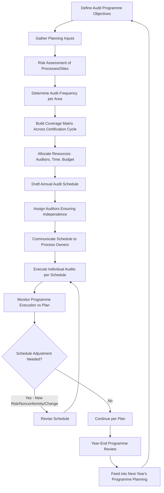

## Planning and Scheduling an Audit Program

### Overview

Planning and Scheduling an Audit Program addresses the practical, operational-level design of an audit programme — translating the requirements of ISO 9001 Clause 9.2.2 and the methodological guidance of ISO 19011 Clause 5 into a concrete, executable schedule of audits across an organization's processes, sites, and time horizon.

### Key Points

- An audit programme is the aggregate set of one or more audits planned for a specific timeframe, directed toward a specific purpose
- Scheduling must balance coverage completeness, resource availability, and risk-based prioritization
- A well-planned programme is dynamic — adjusted based on prior audit results, organizational changes, and emerging risks, not a static annual document
- Planning occurs at two levels: the **programme level** (the whole year's audits) and the **individual audit level** (each specific audit's plan)

### Programme-Level Planning Inputs

| Input | Description |
| --- | --- |
| Process criticality | Higher-risk, customer-critical, or safety-related processes require more frequent audit attention |
| Previous audit results | Areas with open or recent nonconformities receive increased scrutiny |
| Organizational changes | New sites, processes, products, or personnel changes affecting risk profile |
| Customer/regulatory requirements | Contractual or statutory-mandated audit frequency |
| 0**External context changes** | New regulations, market conditions, or interested party expectations (Clause 4.1/4.2) |
| Complaint/nonconformity trends | Areas showing degrading performance metrics (Clause 9.1.3 outputs) |
| Certification cycle requirements | Ensuring full QMS scope is covered across the 3-year certification cycle |

### Full-Cycle Coverage Planning

A common practice is ensuring every process/clause in the QMS scope is audited at least once within the certification cycle (typically 3 years), often achieved via a coverage matrix.

**Example Coverage Matrix (excerpt)**

| Process/Clause | Year 1 | Year 2 | Year 3 |
| --- | --- | --- | --- |
| Purchasing (8.4) | ✓ |  | ✓ |
| Design & Development (8.3) |  | ✓ |  |
| Internal Audit itself (9.2) | ✓ | ✓ | ✓ |
| Management Review (9.3) |  | ✓ |  |
| Nonconforming Output Control (8.7) | ✓ | ✓ | ✓ |
| Document Control (7.5) | ✓ |  | ✓ |

High-risk or frequently nonconforming processes appear more often; stable, low-risk processes may appear once per cycle.

### Audit Programme Planning Process Flow

### Frequency Determination Approaches

| Approach | Method | Best Suited For |
| --- | --- | --- |
| Fixed frequency | Every process audited once per year regardless of risk | Small, low-complexity organizations |
| Risk-weighted frequency | Higher-risk processes audited more often (e.g., quarterly vs. annually) | Most organizations; aligns with Clause 9.2.2 risk consideration requirement |
| Rolling/continuous auditing | Small audits conducted continuously throughout the year rather than batched | Large, complex, or multi-site organizations |
| Trigger-based auditing | Ad hoc audits triggered by specific events (major nonconformity, customer complaint spike, process change) | Supplementary to scheduled auditing |

### Resource Allocation Considerations

- **Auditor availability and independence** — Auditors must not audit their own work area; scheduling must account for rotation
- **Audit duration estimation** — Based on process complexity, site size, and number of applicable clauses
- **Multi-site considerations** — Sampling strategy for organizations with multiple locations under one certification (per ISO/IEC 17021-1 sampling rules for certification bodies, often mirrored internally)
- **Auditor training lead time** — New auditor qualification/shadowing before independent assignment

**Example Annual Schedule Excerpt**

| Month | Audit Area | Lead Auditor | Duration | Type |
| --- | --- | --- | --- | --- |
| January | Purchasing & Supplier Mgmt | J. Santos | 1 day | Process audit |
| March | Production Line 2 | M. Cruz | 2 days | Process audit |
| April | Document Control | J. Santos | 0.5 day | System element audit |
| June | Full QMS (pre-surveillance) | External + Internal team | 3 days | System audit |
| September | Customer Complaint Handling | M. Cruz | 1 day | Process audit |
| November | Management Review Effectiveness | Quality Manager | 0.5 day | System element audit |

### Individual Audit Planning (Within the Programme)

For each scheduled audit, a more granular audit plan is prepared, typically including:

- Specific audit objectives and criteria
- Scope boundaries (locations, processes, exclusions)
- Audit team assignments and roles
- Time allocation per audit activity
- Logistics (interview schedule, document access, site access)

### Monitoring and Adjusting the Programme

ISO 19011 Clause 5 explicitly frames programme management as a continual improvement cycle rather than a fixed schedule:

- **Monitoring** — Tracking whether scheduled audits are completed on time, resource utilization, and emerging issues
- **Reviewing** — Periodic (e.g., mid-year and year-end) assessment of whether the programme met its objectives
- **Improving** — Adjusting frequency, scope, or methods for the next cycle based on lessons learned

### Common Scheduling Conflicts and Mitigations

| Conflict | Mitigation |
| --- | --- |
| Auditor unavailability (leave, workload) | Maintain a pool of trained auditors; cross-train backup auditors |
| Process owner unavailability during scheduled window | Build flexibility/buffer weeks into the schedule |
| Overlapping certification body surveillance and internal audit windows | Sequence internal audits to complete shortly before external audits for readiness verification |
| Underestimated audit duration for complex processes | Use historical audit duration data to refine future estimates |

### Common Audit Findings Related to Programme Planning

- Audit schedule exists but does not demonstrate risk-based frequency differentiation (all processes audited identically regardless of risk)
- Full QMS scope not covered within the certification cycle, leaving gaps discovered only at recertification
- Schedule not adjusted despite significant organizational change (new site, new process) occurring mid-cycle
- Auditor assignments violate independence requirements (auditing own area)
- No evidence of year-end programme review or improvement based on the completed cycle's performance

### Relationship to Other Clauses/Standards

<svg xmlns="http://www.w3.org/2000/svg" viewBox="0 0 700 260">
<text x="350" y="25" text-anchor="middle" font-size="16" font-weight="bold" fill="#1a1a1a">Audit Programme Planning Interfaces (svg_diagram)</text>
<rect x="270" y="50" width="160" height="55" rx="6" fill="#e8f0fe" stroke="#4285f4" stroke-width="1.5" />
<text x="350" y="73" text-anchor="middle" font-size="13" font-weight="bold" fill="#1a1a1a">Clause 9.2.2</text>
<text x="350" y="90" text-anchor="middle" font-size="11" fill="#1a1a1a">Audit Programme Requirements</text>
<rect x="60" y="150" width="150" height="55" rx="6" fill="#fef7e0" stroke="#f9ab00" stroke-width="1.5" />
<text x="135" y="173" text-anchor="middle" font-size="12" font-weight="bold" fill="#1a1a1a">ISO 19011 Cl.5</text>
<text x="135" y="190" text-anchor="middle" font-size="11" fill="#1a1a1a">Managing the Programme</text>
<rect x="250" y="150" width="150" height="55" rx="6" fill="#fce8e6" stroke="#ea4335" stroke-width="1.5" />
<text x="325" y="173" text-anchor="middle" font-size="12" font-weight="bold" fill="#1a1a1a">Clause 6.1</text>
<text x="325" y="190" text-anchor="middle" font-size="11" fill="#1a1a1a">Risk-Based Prioritization</text>
<rect x="440" y="150" width="150" height="55" rx="6" fill="#e6f4ea" stroke="#34a853" stroke-width="1.5" />
<text x="515" y="173" text-anchor="middle" font-size="12" font-weight="bold" fill="#1a1a1a">Clause 9.3</text>
<text x="515" y="190" text-anchor="middle" font-size="11" fill="#1a1a1a">Management Review Input</text>
<line x1="270" y1="80" x2="210" y2="150" stroke="#666" stroke-width="1.5" />
<line x1="320" y1="105" x2="325" y2="150" stroke="#666" stroke-width="1.5" />
<line x1="430" y1="90" x2="510" y2="150" stroke="#666" stroke-width="1.5" />
</svg>

[Inference] While ISO 9001:2015 does not specify a minimum audit frequency or require a formal coverage matrix, certification bodies generally expect an organization to demonstrate, by the time of recertification, that its entire QMS scope has received audit attention at some point during the 3-year cycle; the granularity and formality of the scheduling tool used (spreadsheet vs. dedicated audit management software) is typically judged by whether it produces this demonstrable coverage rather than by its format.

**Related Topics**

- Clause 9.2 — Internal Audit Program Planning and Execution
- ISO 19011 — Guidelines for Auditing Management Systems
- Audit Principles and Types of Audits
- Clause 6.1 — Actions to Address Risks and Opportunities
- Multi-Site Sampling Strategies (ISO/IEC 17021-1)
- Auditor Competence and Rotation Planning