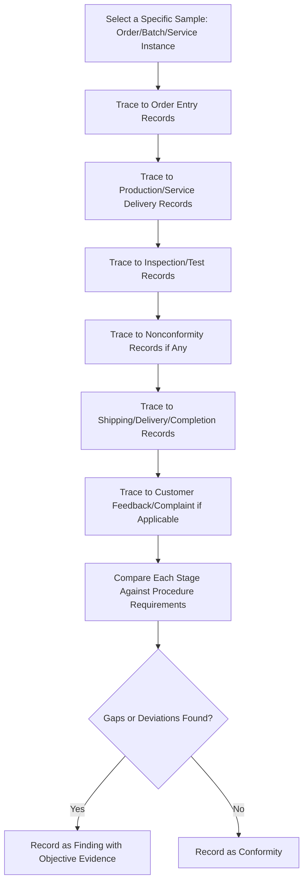
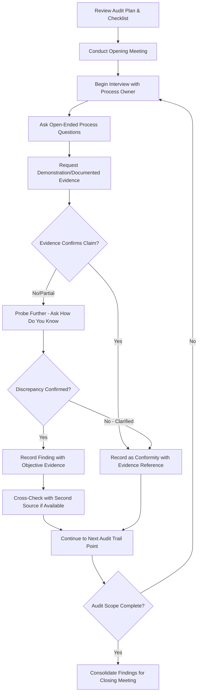

## Conducting Audit Interviews and Evidence Gathering

### Overview

Conducting Audit Interviews and Evidence Gathering covers the practical, on-site (or remote) techniques auditors use during the execution phase of an audit to collect objective evidence, as guided by ISO 19011 Clause 6.4 (Conducting the Audit). This is the operational core of any audit — where documented QMS claims are tested against actual practice through interviews, observation, and document sampling.

### Key Points

- Evidence must be **verifiable** — auditors should seek to corroborate statements through multiple sources (interview, document, observation) rather than relying on a single input
- Interview technique significantly affects evidence quality — leading questions produce unreliable findings
- The audit trail approach (tracing a single transaction/product/service end-to-end) is one of the most effective evidence-gathering techniques
- Auditors must distinguish between what an auditee says should happen and what objective evidence demonstrates actually happens

### Evidence-Gathering Methods

| Method | Description | Strength | Limitation |
| --- | --- | --- | --- |
| Interview | Structured/semi-structured questioning of personnel | Reveals understanding, culture, undocumented practice | Subject to memory bias, nervousness, coaching |
| Document review | Examining procedures, records, specifications | Objective, traceable | May not reflect actual practice if outdated or aspirational |
| Observation | Watching a process/task performed live | Direct evidence of actual practice | Observer effect (Hawthorne effect) — behavior may change when watched |
| Sampling | Selecting a subset of records/transactions for detailed review | Efficient coverage of large populations | Sample must be representative to support valid conclusions |
| Trace/trail audit | Following one specific item through the entire process | Reveals process interactions and gaps between departments | Time-intensive; covers only one instance in depth |

### The Audit Trail Technique

### Interview Technique Best Practices

- **Open-ended questions first** — "Walk me through how you handle a customer complaint" rather than "Do you log complaints?" (which invites a yes/no)
- **Avoid leading questions** — "You do calibrate this gauge daily, right?" presumes the answer; instead ask "How often is this gauge calibrated, and how do you know?"
- **Ask for demonstration, not just description** — "Can you show me the last entry you made?" tests actual practice versus stated practice
- **Triangulate** — Cross-check the same process point with multiple roles (operator, supervisor, quality) to identify inconsistencies
- **Maintain neutral body language and tone** — Avoid signaling approval/disapproval during the interview, which can bias subsequent responses
- **Use "show me" and "how do you know" prompts** — These consistently surface the gap between documented procedure and actual practice

### Common Interview Question Types

| Question Type | Purpose | Example |
| --- | --- | --- |
| Process understanding | Verify the interviewee understands their role in the process | "What happens if you find a defective part?" |
| Procedural compliance | Verify awareness of documented requirements | "Where would you find the current version of this work instruction?" |
| Evidence request | Test claims against objective evidence | "Can you show me the record for the last calibration?" |
| Competence verification | Confirm training/qualification | "How were you trained to perform this inspection?" |
| Nonconformity history | Surface undocumented issues | "Has this ever gone wrong? What did you do?" |

### Sampling Strategy for Document/Record Review

$$n \approx \frac{Z^2 \cdot p(1-p)}{E^2}$$

Where $n$ is sample size, $Z$ is the confidence level factor, $p$ is the estimated proportion (often 0.5 for maximum variance when unknown), and $E$ is the margin of error. In practice, most management system audits use **judgmental sampling** rather than formal statistical sampling, selecting records based on risk, recency, or areas of prior concern rather than a calculated $n$.

**Example judgmental sampling logic**

An auditor reviewing 500 incoming inspection records for the year might judgmentally select:

- The 3 most recent records (currency of practice)
- 2 records from a supplier with a recent quality issue (risk-targeted)
- 2 records spanning a period when a new inspector was onboarded (competence verification)
- 1 record involving a documented nonconformity (closure verification)

### Objective Evidence — Standard of Proof

Per ISO 19011, audit evidence must be **verifiable**. A finding should never rest solely on:

- An auditor's impression or assumption
- A single, uncorroborated verbal claim
- Reputation ("this department is always good")

Instead, findings should cite specific, traceable evidence: a document reference, a record ID, an observed action with date/time, or a corroborated statement from multiple independent sources.

### Evidence Gathering Process Flow

### Handling Difficult Interview Dynamics

| Scenario | Recommended Approach |
| --- | --- |
| Interviewee appears coached/rehearsed | Ask unscripted follow-up or scenario-based questions ("What would you do if...") |
| Interviewee is defensive/anxious | Reassure that the audit assesses the system, not the individual; maintain neutral tone |
| Interviewee cannot answer (knowledge gap) | Note as a potential training/competence finding, not a personal failing |
| Conflicting answers between roles | Investigate further rather than accepting either at face value; may indicate a communication or procedural gap |
| Management "shadowing" the interview | Where possible, request time alone with the interviewee to reduce response bias |

### Documenting Findings During Evidence Gathering

Effective finding statements link observation directly to criteria and evidence:

**Example finding statement structure**

> "During review of incoming inspection records for Supplier X (Records #4471–4480, dated [date range]), 3 of 10 sampled records lacked the required inspector signature specified in Procedure QP-07 Section 4.3. The Quality Inspector confirmed during interview that signatures are 'usually added later' but could not demonstrate a documented process ensuring this occurs before release."

This structure ties together: sample identification, criteria reference, quantified deviation, and corroborating interview evidence.

### Common Pitfalls in Evidence Gathering

- Accepting a verbal assurance without requesting supporting documentation ("we always do that")
- Asking exclusively closed yes/no questions, which auditees can answer correctly without demonstrating real understanding
- Failing to cross-check inconsistent statements between different interviewees at the same process point
- Sampling only "convenient" or readily available records rather than a risk-informed selection
- Recording findings as broad generalizations ("housekeeping is poor") rather than specific, evidenced observations

### Relationship to Other Clauses/Standards

<svg xmlns="http://www.w3.org/2000/svg" viewBox="0 0 700 240">
<text x="350" y="25" text-anchor="middle" font-size="16" font-weight="bold" fill="#1a1a1a">Evidence Gathering Interfaces (svg_diagram)</text>
<rect x="270" y="50" width="160" height="55" rx="6" fill="#e8f0fe" stroke="#4285f4" stroke-width="1.5" />
<text x="350" y="73" text-anchor="middle" font-size="13" font-weight="bold" fill="#1a1a1a">ISO 19011 Cl.6.4</text>
<text x="350" y="90" text-anchor="middle" font-size="11" fill="#1a1a1a">Conducting the Audit</text>
<rect x="60" y="150" width="150" height="55" rx="6" fill="#fef7e0" stroke="#f9ab00" stroke-width="1.5" />
<text x="135" y="173" text-anchor="middle" font-size="12" font-weight="bold" fill="#1a1a1a">Audit Principles</text>
<text x="135" y="190" text-anchor="middle" font-size="11" fill="#1a1a1a">Evidence-Based Approach</text>
<rect x="250" y="150" width="150" height="55" rx="6" fill="#fce8e6" stroke="#ea4335" stroke-width="1.5" />
<text x="325" y="173" text-anchor="middle" font-size="12" font-weight="bold" fill="#1a1a1a">Clause 9.2</text>
<text x="325" y="190" text-anchor="middle" font-size="11" fill="#1a1a1a">Internal Audit Findings</text>
<rect x="440" y="150" width="150" height="55" rx="6" fill="#e6f4ea" stroke="#34a853" stroke-width="1.5" />
<text x="515" y="173" text-anchor="middle" font-size="12" font-weight="bold" fill="#1a1a1a">Clause 7.5.3</text>
<text x="515" y="190" text-anchor="middle" font-size="11" fill="#1a1a1a">Records as Evidence Source</text>
<line x1="270" y1="80" x2="210" y2="150" stroke="#666" stroke-width="1.5" />
<line x1="320" y1="105" x2="325" y2="150" stroke="#666" stroke-width="1.5" />
<line x1="430" y1="90" x2="510" y2="150" stroke="#666" stroke-width="1.5" />
</svg>

[Inference] While no single evidence-gathering technique is prescribed as mandatory, experienced practitioners and auditor training bodies generally regard triangulation across interview, document, and observation as the practical benchmark for defensible audit conclusions, since reliance on any single evidence source is more susceptible to the specific limitations (bias, staging, or currency) associated with that source alone.

**Related Topics**

- ISO 19011 — Guidelines for Auditing Management Systems
- Clause 9.2 — Internal Audit Program Planning and Execution
- Audit Principles and Types of Audits
- Nonconformity Classification (Major/Minor/Observation)
- Root Cause Analysis for Corrective Action
- Remote and Technology-Assisted Auditing Techniques