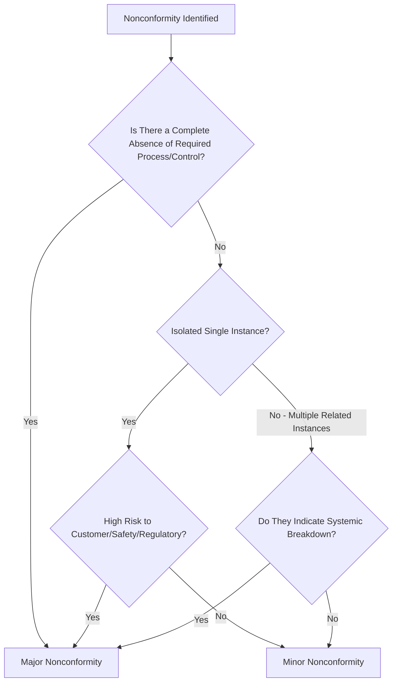
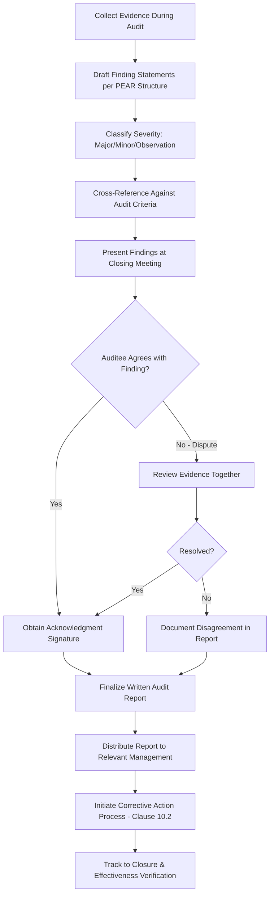

## Writing Audit Findings and Nonconformity Reports

### Overview

Writing Audit Findings and Nonconformity Reports covers the discipline of translating raw audit evidence into clear, defensible, actionable written findings — the output stage of ISO 19011 Clause 6.4.7 (Generating Audit Findings) and Clause 6.4.8 (Determining Audit Conclusions). A well-written finding is the difference between a report that drives genuine corrective action and one that generates confusion, disputes, or superficial compliance responses.

### Key Points

- A finding must state **what was observed**, **against what criteria**, and **with what evidence** — omitting any of the three weakens defensibility
- Findings are classified by severity (major, minor, observation, opportunity for improvement) to guide the urgency and scope of response
- Vague or generalized findings ("housekeeping needs improvement") produce ineffective corrective actions because the auditee cannot identify a specific root cause to address
- Findings should be written objectively, without blame language directed at individuals

### The Anatomy of a Well-Written Finding

Every finding statement should contain four core elements, often remembered via the **PEAR** or similar structured format:

| Element | Description |
| --- | --- |
| **P**roblem/Statement | What was observed to be nonconforming |
| **E**vidence | The specific, verifiable objective evidence supporting the observation |
| **A**udit Criteria | The specific requirement (clause, procedure section) that was not met |
| **R**eference | Sample identifiers, record numbers, locations, dates for traceability |

**Example — Poorly Written Finding**

> "Calibration records are not being maintained properly."

*Problems*: No specific evidence, no clear criteria reference, not traceable, not actionable.

**Example — Well-Written Finding**

> "Nonconformity: Calibration record for Torque Wrench TW-014 (Calibration Log #2026-0342, dated 2026-03-12) shows no evidence of calibration against Procedure QP-11 Section 5.2, which requires annual calibration. The instrument's calibration due date of 2025-11-01 had passed by 131 days at the time of audit (2026-03-12), and the tool remained in active use on the production floor during this period."

*Improvement*: Specific record ID, specific criteria clause, quantified deviation (131 days), and consequence noted (tool remained in use).

### Nonconformity Classification

| Classification | Definition | Typical Response Timeline |
| --- | --- | --- |
| Major Nonconformity | Systemic absence or complete breakdown of a required process/control; significant risk to product/service conformity or customer requirements; or an accumulation of multiple related minor nonconformities indicating systemic failure | Immediate corrective action plan required, often within 14–30 days |
| Minor Nonconformity | An isolated lapse in an otherwise implemented and effective process | Corrective action required, typically within 30–90 days |
| Observation | A condition that could lead to a future nonconformity if not addressed, but does not currently constitute one | Recommended for consideration, no mandatory response |
| Opportunity for Improvement (OFI) | A suggestion for enhanced effectiveness or efficiency beyond minimum compliance | Optional; auditee discretion |

### Distinguishing Major from Minor — Decision Factors

### Writing Style Principles for Findings

- **Objective, not subjective language** — "The record lacked a signature" not "The technician was careless"
- **Present factual sequence** — What was asked, what was shown, what was found — avoid interpretive leaps
- **Quantify where possible** — "3 of 10 sampled records" rather than "some records"
- **Avoid absolute or exaggerated language** — "Always," "never," and "completely" are rarely defensible from a limited sample; use precise, bounded statements instead
- **No blame attribution to individuals** — Findings assess the system/process, not personal performance; note "the process did not ensure X" rather than "Employee Y failed to X"
- **Separate observation from recommendation** — State what was found; recommendations (if included) should be clearly labeled as suggestions, not mandates, since the auditee determines the corrective action

### Nonconformity Report (NCR) Standard Structure

| Field | Purpose |
| --- | --- |
| NCR Number | Unique tracking identifier |
| Date Raised | When identified |
| Audit Reference | Which audit/programme cycle this originated from |
| Process/Area | Where the nonconformity was found |
| Classification | Major/Minor/Observation |
| Clause/Criteria Reference | Specific requirement not met |
| Finding Statement | Full PEAR-structured description |
| Auditee Acknowledgment | Signature/confirmation the auditee understands the finding |
| Corrective Action Due Date | Response deadline based on classification |
| Root Cause (completed later by auditee) | Filled in during corrective action process |
| Verification of Closure | Auditor sign-off after effectiveness review |

### Report Writing and Distribution Process Flow

### Handling Disputed Findings

When an auditee disagrees with a finding:

- Revisit the specific evidence collected, not general impressions
- Distinguish disagreement over **fact** (evidence interpretation) from disagreement over **significance** (severity classification)
- If unresolved, document the auditee's position alongside the finding in the report rather than omitting the finding or forcing agreement
- Escalate to audit programme manager or lead auditor for final determination where necessary

### Common Weaknesses in Finding Reports

| Weakness | Example | Fix |
| --- | --- | --- |
| Vagueness | "Documentation needs improvement" | Specify which document, which requirement, which instance |
| Missing evidence reference | "Records were incomplete" | Cite specific record IDs and dates sampled |
| Solution embedded in the finding | "Should implement a checklist" | Separate: state the gap; let auditee determine the corrective action |
| Overgeneralization from small sample | "This always happens" | "3 of 5 sampled instances showed..." |
| Blame language | "Operator did not follow procedure" | "The process did not ensure adherence to Procedure X Step 4" |

### Common Audit Findings (Meta — About the Reporting Process Itself)

- NCRs closed based on a written corrective action plan alone, without verifying implementation and effectiveness with objective evidence
- Findings inconsistently classified across auditors (no calibration/consistency check among audit team members)
- Report distributed to auditee only, without visibility to relevant management per Clause 9.2.2(e)
- Disputed findings resolved by simply deleting them from the report rather than documenting resolution or disagreement

### Relationship to Other Clauses/Standards

<svg xmlns="http://www.w3.org/2000/svg" viewBox="0 0 700 240">
<text x="350" y="25" text-anchor="middle" font-size="16" font-weight="bold" fill="#1a1a1a">Findings &amp; NCR Reporting Interfaces (svg_diagram)</text>
<rect x="270" y="50" width="160" height="55" rx="6" fill="#e8f0fe" stroke="#4285f4" stroke-width="1.5" />
<text x="350" y="73" text-anchor="middle" font-size="13" font-weight="bold" fill="#1a1a1a">ISO 19011 Cl.6.4.7-6.4.8</text>
<text x="350" y="90" text-anchor="middle" font-size="11" fill="#1a1a1a">Findings &amp; Conclusions</text>
<rect x="60" y="150" width="150" height="55" rx="6" fill="#fef7e0" stroke="#f9ab00" stroke-width="1.5" />
<text x="135" y="173" text-anchor="middle" font-size="12" font-weight="bold" fill="#1a1a1a">Clause 9.2.2(e)</text>
<text x="135" y="190" text-anchor="middle" font-size="11" fill="#1a1a1a">Reporting to Management</text>
<rect x="250" y="150" width="150" height="55" rx="6" fill="#fce8e6" stroke="#ea4335" stroke-width="1.5" />
<text x="325" y="173" text-anchor="middle" font-size="12" font-weight="bold" fill="#1a1a1a">Clause 10.2</text>
<text x="325" y="190" text-anchor="middle" font-size="11" fill="#1a1a1a">Corrective Action Trigger</text>
<rect x="440" y="150" width="150" height="55" rx="6" fill="#e6f4ea" stroke="#34a853" stroke-width="1.5" />
<text x="515" y="173" text-anchor="middle" font-size="12" font-weight="bold" fill="#1a1a1a">Clause 9.3</text>
<text x="515" y="190" text-anchor="middle" font-size="11" fill="#1a1a1a">Management Review Input</text>
<line x1="270" y1="80" x2="210" y2="150" stroke="#666" stroke-width="1.5" />
<line x1="320" y1="105" x2="325" y2="150" stroke="#666" stroke-width="1.5" />
<line x1="430" y1="90" x2="510" y2="150" stroke="#666" stroke-width="1.5" />
</svg>

[Inference] While no universal template governs finding statement structure across all certification bodies, the core requirement that a finding be traceable to specific, verifiable objective evidence is consistently applied; auditors and quality practitioners generally regard vague or evidence-light findings as a leading cause of ineffective or superficial corrective actions, since an auditee cannot perform meaningful root cause analysis against a finding that does not specify what, precisely, went wrong.

**Related Topics**

- ISO 19011 — Guidelines for Auditing Management Systems
- Conducting Audit Interviews and Evidence Gathering
- Clause 10.2 — Nonconformity Identification and Correction
- Root Cause Analysis for Corrective Action
- Clause 9.3 — Management Review Process Inputs and Outputs
- Auditor Calibration and Consistency Techniques