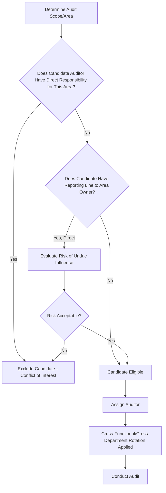
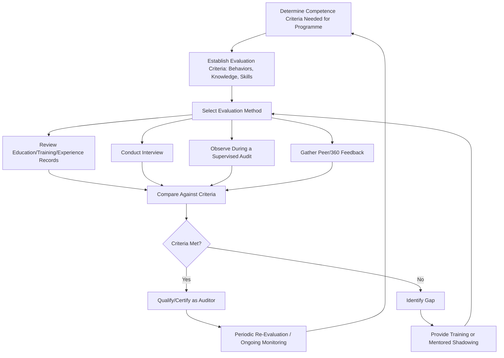

## Auditor Competence Selection and Impartiality

### Overview

Auditor Competence Selection and Impartiality addresses the requirements under ISO 9001:2015 Clause 9.2.2(c) and ISO 19011 Clause 7 governing how organizations select auditors, ensure they possess adequate competence, and guarantee the objectivity and impartiality of the audit process. This is a foundational credibility requirement — an audit conducted by an unqualified or conflicted auditor produces conclusions that cannot be relied upon regardless of how thorough the process otherwise appears.

### Key Points

- Clause 9.2.2(c) explicitly requires selecting auditors and conducting audits to ensure objectivity and the impartiality of the audit process
- Impartiality is structural (freedom from conflict of interest), while competence is capability-based (knowledge, skill, and behavior)
- The core impartiality rule: **auditors shall not audit their own work**
- ISO 19011:2018 Clause 7 significantly expanded guidance on both generic and discipline-specific auditor competence

### Impartiality — Core Requirements

| Requirement | Description |
| --- | --- |
| No self-audit | An auditor cannot audit a process/area for which they hold direct operational responsibility |
| Independence from outcome | Auditor should have no personal or financial stake in the audit's outcome |
| Freedom from undue influence | Audit findings should not be shaped by management pressure or fear of reprisal |
| Objectivity in judgment | Conclusions based on evidence, not personal relationships or assumptions about a department's reputation |

**Example of impartiality conflict**

A Production Supervisor who directly manages the assembly line cannot serve as auditor for an internal audit of that same assembly line's process, because they would effectively be evaluating their own work and decisions. They could, however, appropriately audit an unrelated area such as the warehouse or purchasing function.

### Structural Approaches to Ensuring Impartiality

Common structural mechanisms:

- **Cross-functional auditing** — Auditors drawn from departments other than the one being audited
- **Peer/reciprocal auditing** — Two departments audit each other on a rotating basis
- **Auditor rotation** — Same auditor does not repeatedly audit the same area, reducing familiarity bias over time
- **External/contracted auditors** — For small organizations lacking sufficient internal independence, a qualified external party conducts internal audits on the organization's behalf (still classified as first-party/internal per ISO 19011)
- **Reporting line separation** — Auditors report audit findings to a level of management independent of the audited area's direct chain

### Small Organization Considerations

Organizations too small to achieve full functional independence (e.g., a single quality manager overseeing all processes) may:

- Engage a qualified external contractor to perform internal audits
- Use reciprocal auditing arrangements with a sister site or partner organization
- Have a senior manager from an unrelated function (e.g., Finance Director auditing Production) serve as auditor after appropriate training

### Auditor Competence — ISO 19011 Clause 7 Framework

Competence is evaluated across two dimensions:

**1. Personal Behaviors**

| Behavior | Description |
| --- | --- |
| Ethical | Fair, truthful, sincere, honest, discreet |
| Open-minded | Willing to consider alternative ideas or points of view |
| Diplomatic | Tactful in dealing with people |
| Observant | Actively aware of physical surroundings and activities |
| Perceptive | Instinctively aware of and able to understand situations |
| Versatile | Adjusts readily to different situations |
| Tenacious | Persistent, focused on achieving objectives |
| Decisive | Reaches timely conclusions based on logical reasoning |
| Self-reliant | Acts and functions independently while interacting effectively |
| Acting with fortitude | Acts responsibly, even when facing resistance |
| Open to improvement | Willing to learn from situations |
| Culturally sensitive | Observant and respectful of the auditee's culture |
| Collaborative | Effectively interacts with audit team members and auditee personnel |

**2. Knowledge and Skills**

| Category | Content |
| --- | --- |
| Generic knowledge/skills | Audit principles, methods, and processes applicable to all audits; management system standard requirements; organizational context; applicable legal/regulatory requirements |
| Discipline/sector-specific knowledge | Technical knowledge relevant to the specific process or industry being audited (e.g., welding standards for a manufacturing audit, software development lifecycle for an IT audit) |

### Auditor Competence Determination Process

### Auditor Qualification Pathways

| Pathway | Description |
| --- | --- |
| Internal training + mentored shadowing | New auditor trained internally, shadows experienced auditor before leading audits independently |
| Formal lead auditor certification | External training course (e.g., IRCA or Exemplar Global-certified ISO 9001 Lead Auditor course), often required for external/second-party auditors |
| Technical specialist co-opted to audit team | Subject matter expert added to an audit team for specific technical competence, working alongside a competence-qualified lead auditor |
| Auditor certification schemes (ISO/IEC 17024) | Personnel certification bodies certify individual auditors against defined competence criteria |

### Audit Team Composition Considerations

| Factor | Consideration |
| --- | --- |
| Team size | Scaled to audit scope/complexity; single auditor common for small internal audits |
| Lead auditor designation | Responsible for overall audit conduct, team coordination, and final reporting |
| Technical experts | Non-auditing specialists included for specific technical knowledge (do not independently evaluate conformity) |
| Observers/trainees | May accompany audits for development purposes, with defined non-interference roles |
| Language/cultural fit | Particularly relevant for multi-site/multinational organizations |

### Ongoing Monitoring of Auditor Performance

Competence is not a one-time qualification event — ISO 19011 emphasizes periodic re-evaluation:

- Performance feedback from audit programme managers
- Auditee feedback on professionalism and effectiveness
- Consistency checks comparing findings/classifications across auditors (calibration exercises)
- Continuing education on standard updates and evolving audit techniques

### Common Audit Findings

- Auditor assigned to audit an area for which they hold direct operational responsibility (clear impartiality violation)
- No documented evidence of auditor competence evaluation (training certificates alone, without demonstrated performance assessment)
- Small organization with a single quality function performing all internal audits with no independence mechanism (external auditor, reciprocal arrangement) considered
- No periodic re-evaluation of auditor competence following initial qualification
- Audit team composition not documented, making it impossible to verify independence was maintained for a given audit

### Relationship to Other Clauses/Standards

<svg xmlns="http://www.w3.org/2000/svg" viewBox="0 0 700 240">
<text x="350" y="25" text-anchor="middle" font-size="16" font-weight="bold" fill="#1a1a1a">Auditor Competence &amp; Impartiality Interfaces (svg_diagram)</text>
<rect x="270" y="50" width="160" height="55" rx="6" fill="#e8f0fe" stroke="#4285f4" stroke-width="1.5" />
<text x="350" y="73" text-anchor="middle" font-size="13" font-weight="bold" fill="#1a1a1a">Clause 9.2.2(c)</text>
<text x="350" y="90" text-anchor="middle" font-size="11" fill="#1a1a1a">Auditor Selection</text>
<rect x="60" y="150" width="150" height="55" rx="6" fill="#fef7e0" stroke="#f9ab00" stroke-width="1.5" />
<text x="135" y="173" text-anchor="middle" font-size="12" font-weight="bold" fill="#1a1a1a">ISO 19011 Cl.7</text>
<text x="135" y="190" text-anchor="middle" font-size="11" fill="#1a1a1a">Auditor Competence</text>
<rect x="250" y="150" width="150" height="55" rx="6" fill="#fce8e6" stroke="#ea4335" stroke-width="1.5" />
<text x="325" y="173" text-anchor="middle" font-size="12" font-weight="bold" fill="#1a1a1a">Clause 7.2</text>
<text x="325" y="190" text-anchor="middle" font-size="11" fill="#1a1a1a">Competence (General QMS)</text>
<rect x="440" y="150" width="150" height="55" rx="6" fill="#e6f4ea" stroke="#34a853" stroke-width="1.5" />
<text x="515" y="173" text-anchor="middle" font-size="12" font-weight="bold" fill="#1a1a1a">ISO/IEC 17024</text>
<text x="515" y="190" text-anchor="middle" font-size="11" fill="#1a1a1a">Personnel Certification</text>
<line x1="270" y1="80" x2="210" y2="150" stroke="#666" stroke-width="1.5" />
<line x1="320" y1="105" x2="325" y2="150" stroke="#666" stroke-width="1.5" />
<line x1="430" y1="90" x2="510" y2="150" stroke="#666" stroke-width="1.5" />
</svg>

[Inference] While ISO 9001:2015 leaves the specific mechanism for ensuring auditor impartiality to the organization's discretion, certification bodies generally scrutinize small organizations most closely on this point, since limited headcount makes structural independence harder to achieve; an external or reciprocal auditing arrangement is commonly viewed as an acceptable and frequently expected mitigation in such cases, though the specific adequacy determination rests with the individual certification body's judgment.

**Related Topics**

- Clause 9.2 — Internal Audit Program Planning and Execution
- ISO 19011 — Guidelines for Auditing Management Systems
- Clause 7.2 — Competence (General QMS Personnel Requirements)
- ISO/IEC 17024 — Conformity Assessment for Personnel Certification
- Audit Principles and Types of Audits
- Auditor Calibration and Consistency Techniques