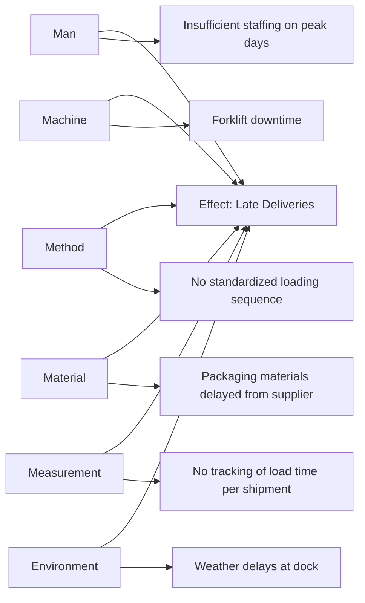
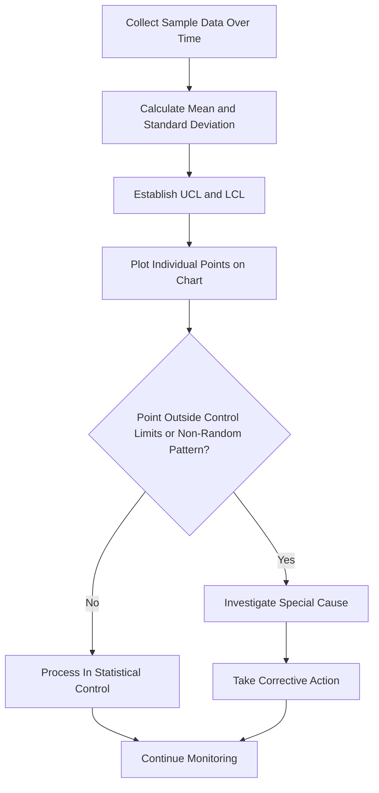
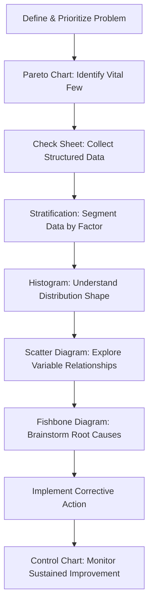

## The Seven Basic Quality Tools

### Overview

The Seven Basic Quality Tools (also called the "Seven QC Tools") are a standardized set of graphical and statistical techniques originally popularized by Kaoru Ishikawa for use by frontline workers and quality teams with minimal statistical training. They remain foundational within ISO 9001-aligned quality systems for data-driven problem-solving, process monitoring, and continual improvement (linking directly to Clause 9.1 and Clause 10.2/10.3 activities).

### Key Points

- The tools are simple enough for use by operators without advanced statistical training, distinguishing them from the more complex "Seven Management and Planning Tools" or advanced Six Sigma statistical methods
- They are most powerful when used in combination — e.g., a Pareto chart identifies priority, then a Fishbone diagram explores causes, then a control chart monitors the fix
- Widely embedded in Kaizen, Six Sigma, and TQM problem-solving methodologies
- Applicable to both manufacturing and service/transactional processes

### The Seven Tools

#### 1. Cause-and-Effect (Fishbone/Ishikawa) Diagram

Visually organizes potential causes of a problem into categories (commonly the 6M: Man, Machine, Method, Material, Measurement, Mother Nature/Environment).

#### 2. Check Sheet

A structured, prepared form for collecting and tallying data in real time at the point of occurrence, minimizing transcription error and enabling easy pattern recognition.

**Example Check Sheet**

| Defect Type | Mon | Tue | Wed | Thu | Fri | Total |
| --- | --- | --- | --- | --- | --- | --- |
| Scratch |  |  |  |  |  |  |
| Dent |  |  |  |  |  |  |
| Misalignment |  |  |  |  |  |  |
| Discoloration |  |  |  |  |  |  |

#### 3. Control Chart (Statistical Process Control)

Plots process data over time against statistically derived control limits to distinguish common-cause (normal) variation from special-cause (assignable) variation.

$$UCL = \bar{x} + 3\sigma, \quad LCL = \bar{x} - 3\sigma$$

Where $\bar{x}$ is the process mean and $\sigma$ is the standard deviation of the sampled data.

#### 4. Histogram

A bar chart displaying the frequency distribution of a continuous data set, revealing the shape (normal, skewed, bimodal), central tendency, and spread of process data.

**Example interpretation**: A histogram of part diameters clustering tightly around the target with a symmetric bell shape suggests a stable, centered process; a skewed or bimodal shape suggests an assignable cause (e.g., two machines producing at different settings feeding the same output stream).

#### 5. Pareto Chart

Combines a bar chart (frequency, descending order) with a cumulative percentage line, applying the 80/20 principle to identify the "vital few" contributors among the "trivial many."

$$\text{Cumulative \%}_n = \frac{\sum_{i=1}^{n} f_i}{\sum_{i=1}^{N} f_i} \times 100$$

**Example**

| Defect Category | Frequency | Cumulative % |
| --- | --- | --- |
| Surface scratches | 45 | 45% |
| Dimensional error | 30 | 75% |
| Discoloration | 12 | 87% |
| Packaging damage | 8 | 95% |
| Labeling error | 5 | 100% |

Here, addressing surface scratches and dimensional error alone would resolve 75% of total defects — the "vital few."

#### 6. Scatter Diagram

Plots paired numerical data on an x-y axis to reveal the presence, direction, and strength of a potential relationship between two variables.

| Pattern | Interpretation |
| --- | --- |
| Positive correlation (upward trend) | As X increases, Y increases |
| Negative correlation (downward trend) | As X increases, Y decreases |
| No correlation (scattered, no pattern) | No apparent relationship between X and Y |

**Example**: Plotting reflow oven temperature (X) against solder joint defect rate (Y) may reveal a positive correlation above a threshold temperature, suggesting a causal relationship worth investigating further (though correlation alone does not confirm causation).

#### 7. Stratification (or Flowchart, in some formulations)

**Stratification** separates aggregated data into meaningful subgroups (by shift, machine, operator, supplier, material lot) to reveal patterns masked when data is analyzed in aggregate.

**Example**: An aggregate defect rate of 3% across all shifts might mask that Shift A runs at 1% while Shift C runs at 7% — stratification reveals this disparity, redirecting investigation toward Shift C-specific factors.

*Note: Some formulations of the Seven Basic Tools substitute a simple Flowchart (mapping process steps sequentially) for Stratification as the seventh tool; both are commonly taught, and many practitioners treat the tool set as having a flexible seventh member.*

### Tool Selection Guide by Problem-Solving Stage

### Tool Comparison Summary

| Tool | Primary Purpose | Data Type |
| --- | --- | --- |
| Fishbone/Ishikawa | Cause identification/brainstorming | Qualitative |
| Check Sheet | Structured data collection | Tally/count |
| Control Chart | Distinguish common vs. special cause variation | Time-series continuous |
| Histogram | Visualize distribution shape | Continuous, single snapshot |
| Pareto Chart | Prioritize by frequency/impact | Categorical count |
| Scatter Diagram | Explore relationships between two variables | Paired continuous |
| Stratification | Segment data to reveal hidden patterns | Categorical grouping variable |

### Integration with QMS Clauses

| Tool | QMS Application |
| --- | --- |
| Control Chart | Clause 9.1 — Process monitoring and measurement |
| Pareto Chart | Clause 9.1.3 — Analysis and evaluation prioritization |
| Fishbone Diagram | Clause 10.2 — Root cause analysis for corrective action |
| Check Sheet | Clause 7.5.3 — Structured record generation |
| Histogram | Clause 9.1 — Process capability assessment support |
| Scatter Diagram | Clause 6.1 — Risk factor relationship exploration |
| Stratification | Clause 10.3 — Uncovering improvement opportunities masked in aggregate data |

### Common Misapplications

- Using a Pareto chart on a data set too small to be statistically meaningful, producing an unstable "vital few" ranking
- Treating a scatter diagram's correlation as proof of causation without further investigation
- Building a control chart without first confirming the process is stable enough for meaningful control limits (control limits calculated from an already out-of-control process are misleading)
- Skipping stratification and drawing conclusions from aggregated data that masks a significant subgroup difference
- Using a fishbone diagram as the final root cause determination without verifying the identified cause against evidence (see Root Cause Analysis for Corrective Action)

### Relationship to Broader Quality Methodology

<svg xmlns="http://www.w3.org/2000/svg" viewBox="0 0 700 240">
<text x="350" y="25" text-anchor="middle" font-size="16" font-weight="bold" fill="#1a1a1a">Seven Basic Tools Interfaces (svg_diagram)</text>
<rect x="270" y="50" width="160" height="55" rx="6" fill="#e8f0fe" stroke="#4285f4" stroke-width="1.5" />
<text x="350" y="73" text-anchor="middle" font-size="13" font-weight="bold" fill="#1a1a1a">Seven Basic Tools</text>
<text x="350" y="90" text-anchor="middle" font-size="11" fill="#1a1a1a">Frontline QC Toolkit</text>
<rect x="60" y="150" width="150" height="55" rx="6" fill="#fef7e0" stroke="#f9ab00" stroke-width="1.5" />
<text x="135" y="173" text-anchor="middle" font-size="12" font-weight="bold" fill="#1a1a1a">Clause 9.1</text>
<text x="135" y="190" text-anchor="middle" font-size="11" fill="#1a1a1a">Monitoring &amp; Measurement</text>
<rect x="250" y="150" width="150" height="55" rx="6" fill="#fce8e6" stroke="#ea4335" stroke-width="1.5" />
<text x="325" y="173" text-anchor="middle" font-size="12" font-weight="bold" fill="#1a1a1a">Clause 10.2/10.3</text>
<text x="325" y="190" text-anchor="middle" font-size="11" fill="#1a1a1a">RCA &amp; Improvement</text>
<rect x="440" y="150" width="150" height="55" rx="6" fill="#e6f4ea" stroke="#34a853" stroke-width="1.5" />
<text x="515" y="173" text-anchor="middle" font-size="12" font-weight="bold" fill="#1a1a1a">Six Sigma DMAIC</text>
<text x="515" y="190" text-anchor="middle" font-size="11" fill="#1a1a1a">Measure/Analyze Phases</text>
<line x1="270" y1="80" x2="210" y2="150" stroke="#666" stroke-width="1.5" />
<line x1="320" y1="105" x2="325" y2="150" stroke="#666" stroke-width="1.5" />
<line x1="430" y1="90" x2="510" y2="150" stroke="#666" stroke-width="1.5" />
</svg>

[Inference] Although the Seven Basic Quality Tools originated in a manufacturing context and are most commonly illustrated with production examples, the same graphical and statistical logic generally transfers to service and transactional process improvement (e.g., a Pareto chart of customer complaint categories, a control chart of call-center handle times); the degree of direct transferability without adaptation varies by how naturally the process generates countable, structured data comparable to manufacturing defect counts.

**Related Topics**

- Root Cause Analysis for Corrective Action
- Clause 9.1 — Monitoring, Measurement, Analysis and Evaluation
- Continual Improvement Methodologies (Six Sigma DMAIC, Kaizen)
- Statistical Process Control and Process Capability (Cp/Cpk)
- The Seven Management and Planning Tools (advanced complement)
- Failure Mode and Effects Analysis (FMEA)