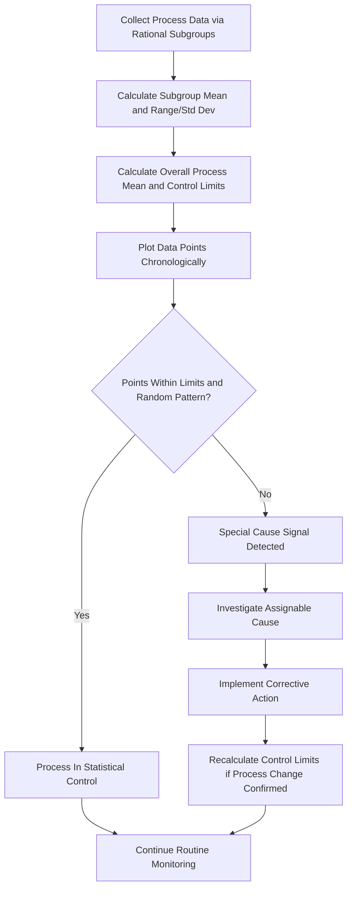
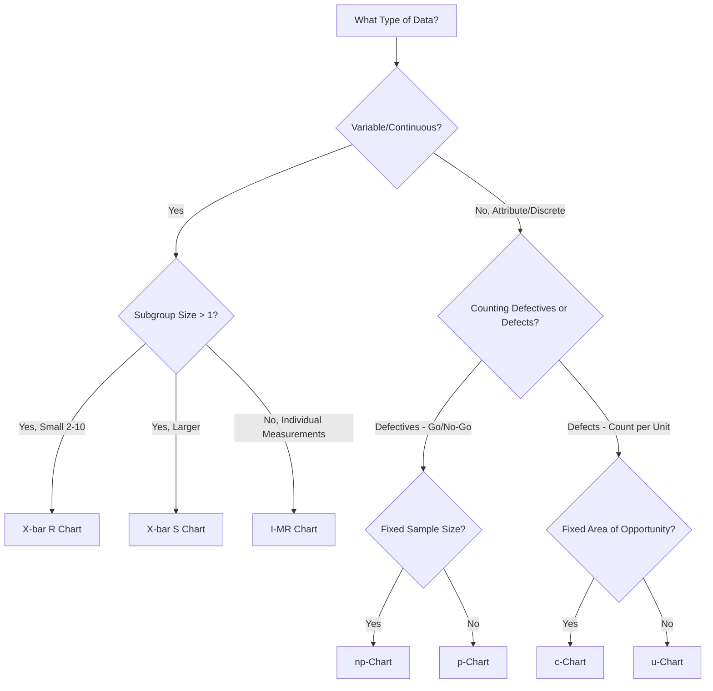
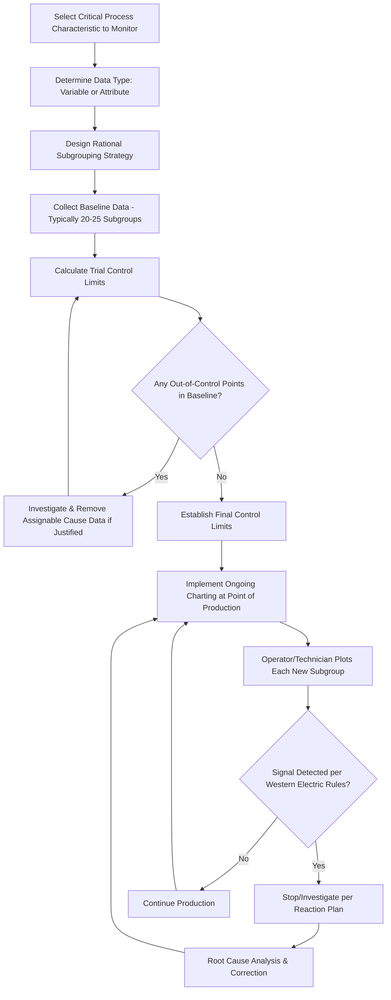

## Statistical Process Control and Control Charts

### Overview

Statistical Process Control (SPC) is a methodology using statistical methods to monitor and control a process, ensuring it operates at its full potential and produces conforming output with minimal waste. Control charts are the primary tool of SPC, distinguishing between **common cause** (inherent, random) variation and **special cause** (assignable, non-random) variation — a distinction foundational to Clause 9.1 (Monitoring and Measurement) and Clause 10.2/10.3 (Corrective and Continual Improvement) activities.

### Key Points

- SPC's core insight (originating with Walter Shewhart) is that all processes exhibit variation, but variation has two distinct sources requiring different management responses
- Reacting to common-cause variation as if it were special-cause (tampering) increases variation rather than reducing it
- Control charts assess process **stability** (statistical control), which is distinct from process **capability** (ability to meet specifications)
- Different chart types apply to different data types (variable/continuous vs. attribute/discrete)

### Common Cause vs. Special Cause Variation

| Aspect | Common Cause | Special Cause |
| --- | --- | --- |
| Nature | Inherent to the process; always present | Assignable; not always present |
| Predictability | Predictable within statistical limits | Unpredictable, indicates a change |
| Source examples | Normal machine wear, ambient temperature fluctuation, minor material variation | Tool breakage, operator error, raw material lot change, power fluctuation |
| Appropriate response | Improve the underlying process/system design | Investigate and eliminate the specific assignable cause |
| Risk of misdiagnosis | Treating as special cause leads to unnecessary process adjustment (tampering), increasing variation | Treating as common cause allows a fixable problem to persist |

### The Shewhart Control Chart Concept

$$UCL = \bar{x} + 3\sigma, \quad CL = \bar{x}, \quad LCL = \bar{x} - 3\sigma$$

The $\pm 3\sigma$ control limits are statistically derived, not specification limits — they reflect the natural variability of the process itself, not customer/design requirements.

### Major Control Chart Types

| Chart Type | Data Type | Application |
| --- | --- | --- |
| $\bar{x}$-R Chart | Variable (continuous), subgroup size 2–10 | Monitoring subgroup mean and range together |
| $\bar{x}$-S Chart | Variable (continuous), larger subgroup size | Monitoring mean and standard deviation; more precise than R for larger subgroups |
| I-MR Chart (Individuals-Moving Range) | Variable, individual measurements (subgroup size 1) | Low-volume or destructive testing scenarios where subgrouping isn't practical |
| p-Chart | Attribute (proportion nonconforming), variable subgroup size | Percentage defective in varying sample sizes |
| np-Chart | Attribute (number nonconforming), fixed subgroup size | Count of defective units in constant sample sizes |
| c-Chart | Attribute (count of defects), fixed sample size/area of opportunity | Number of defects per unit (e.g., blemishes per panel) |
| u-Chart | Attribute (defects per unit), variable sample size | Defects per unit where the inspection unit size varies |

### Chart Selection Decision Guide

### Western Electric Rules (Out-of-Control Signal Patterns)

Beyond simple limit violations, established pattern rules identify special-cause signals even within control limits:

| Rule | Pattern | Interpretation |
| --- | --- | --- |
| Rule 1 | One point beyond $3\sigma$ | Clear special cause |
| Rule 2 | 2 of 3 consecutive points beyond $2\sigma$ (same side) | Emerging shift |
| Rule 3 | 4 of 5 consecutive points beyond $1\sigma$ (same side) | Sustained drift |
| Rule 4 | 8 consecutive points on same side of centerline | Process mean has shifted |
| Rule 5 | 6 consecutive points steadily increasing/decreasing | Trend, possibly tool wear |
| Rule 6 | 14 consecutive points alternating up/down | Overcontrol or two interleaved processes |

### Rational Subgrouping

A critical SPC design decision: subgroups should be formed so that variation *within* a subgroup reflects only common cause, while variation *between* subgroups can reveal special causes.

**Example**

Correct: Subgrouping 5 consecutive parts produced within the same short time window (same operator, same setup, same material lot).

Incorrect: Subgrouping 5 parts randomly selected from across an entire 8-hour shift spanning multiple material lots and possibly a shift change — this can mask or falsely inflate control limits because within-subgroup variation now includes between-lot variation.

### Process Stability vs. Process Capability

| Concept | Question Answered | Tool |
| --- | --- | --- |
| Stability (Control) | Is the process behaving consistently over time? | Control chart (UCL/LCL) |
| Capability | Can the stable process meet customer specifications? | Cp/Cpk indices against USL/LSL |

A process can be in statistical control (stable, predictable) while still being incapable of meeting specifications — stability and capability are independent questions. Capability should only be assessed once stability is confirmed; calculating Cpk on an out-of-control process produces misleading results.

$$C_p = \frac{USL - LSL}{6\sigma}, \quad C_{pk} = \min\left(\frac{USL - \bar{x}}{3\sigma}, \frac{\bar{x} - LSL}{3\sigma}\right)$$

### SPC Implementation Process Flow

### Common Implementation Pitfalls

| Pitfall | Consequence |
| --- | --- |
| Using specification limits instead of statistically calculated control limits | Charts fail to detect process shifts before defects occur |
| Recalculating control limits too frequently | Masks genuine process shifts by continuously "resetting" the baseline |
| Overcontrol/tampering — adjusting the process in response to common-cause variation | Increases overall process variation (a well-documented SPC phenomenon) |
| Poor rational subgrouping | Control limits become too wide (masking real signals) or too narrow (excessive false alarms) |
| Charting without a defined reaction plan | Signals detected but no standardized response, undermining SPC's value |

### Reaction Plan Example

A documented reaction plan accompanying a control chart typically specifies:

1. Who is authorized to stop the process upon an out-of-control signal
2. Immediate containment steps (segregate suspect output per Clause 8.7)
3. Investigation steps (which roles, what checklist)
4. Criteria for resuming production
5. Documentation requirements linking to Clause 10.2 if corrective action is warranted

### Common Audit Findings

- Control charts maintained but no evidence any out-of-control signal ever triggered documented investigation or action
- Control limits appear to be specification limits (USL/LSL) rather than statistically calculated $\pm3\sigma$ limits
- No rational subgrouping rationale documented, making chart interpretation unreliable
- Capability indices (Cp/Cpk) reported for a process shown to be out of statistical control
- Charts kept as a compliance formality with no linkage to corrective action or continual improvement processes

### Relationship to Other Clauses

<svg xmlns="http://www.w3.org/2000/svg" viewBox="0 0 700 240">
<text x="350" y="25" text-anchor="middle" font-size="16" font-weight="bold" fill="#1a1a1a">SPC Interfaces (svg_diagram)</text>
<rect x="270" y="50" width="160" height="55" rx="6" fill="#e8f0fe" stroke="#4285f4" stroke-width="1.5" />
<text x="350" y="73" text-anchor="middle" font-size="13" font-weight="bold" fill="#1a1a1a">SPC / Control Charts</text>
<text x="350" y="90" text-anchor="middle" font-size="11" fill="#1a1a1a">Process Monitoring</text>
<rect x="60" y="150" width="150" height="55" rx="6" fill="#fef7e0" stroke="#f9ab00" stroke-width="1.5" />
<text x="135" y="173" text-anchor="middle" font-size="12" font-weight="bold" fill="#1a1a1a">Clause 9.1</text>
<text x="135" y="190" text-anchor="middle" font-size="11" fill="#1a1a1a">Monitoring &amp; Measurement</text>
<rect x="250" y="150" width="150" height="55" rx="6" fill="#fce8e6" stroke="#ea4335" stroke-width="1.5" />
<text x="325" y="173" text-anchor="middle" font-size="12" font-weight="bold" fill="#1a1a1a">Clause 8.7</text>
<text x="325" y="190" text-anchor="middle" font-size="11" fill="#1a1a1a">Nonconforming Output Trigger</text>
<rect x="440" y="150" width="150" height="55" rx="6" fill="#e6f4ea" stroke="#34a853" stroke-width="1.5" />
<text x="515" y="173" text-anchor="middle" font-size="12" font-weight="bold" fill="#1a1a1a">Clause 10.2</text>
<text x="515" y="190" text-anchor="middle" font-size="11" fill="#1a1a1a">Corrective Action</text>
<line x1="270" y1="80" x2="210" y2="150" stroke="#666" stroke-width="1.5" />
<line x1="320" y1="105" x2="325" y2="150" stroke="#666" stroke-width="1.5" />
<line x1="430" y1="90" x2="510" y2="150" stroke="#666" stroke-width="1.5" />
</svg>

[Inference] While SPC's statistical foundations are well-established and standardized (e.g., via ASTM and AIAG SPC reference manuals used in the automotive sector), the specific chart type and subgrouping strategy appropriate for a given process generally requires engineering judgment tailored to the process's actual behavior; a mismatch between chart selection and the underlying data-generating process is a commonly cited source of unreliable or ignored SPC implementations in practice.

**Related Topics**

- Clause 9.1 — Monitoring, Measurement, Analysis and Evaluation
- Process Capability Indices (Cp, Cpk, Pp, Ppk)
- The Seven Basic Quality Tools
- Measurement Systems Analysis (Gauge R&R)
- Clause 10.2 — Nonconformity Identification and Correction
- AIAG SPC Reference Manual (Automotive Core Tools)