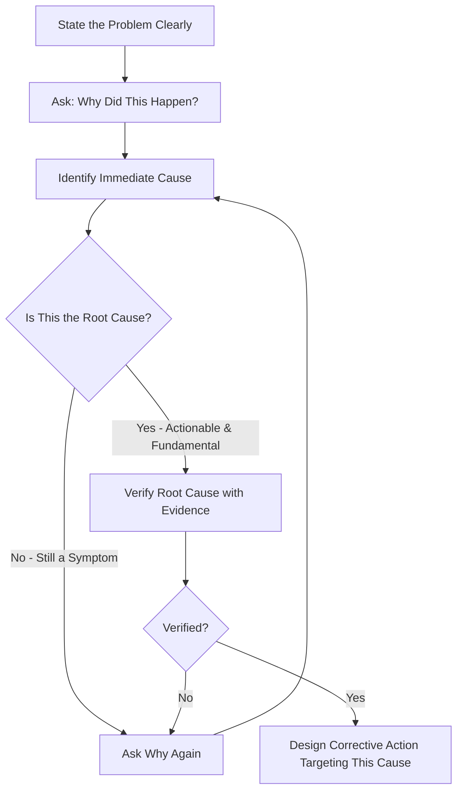
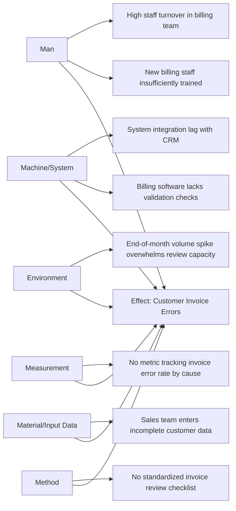

## Root Cause Analysis Techniques Including Five Whys and Fishbone Diagrams


### Overview

Root Cause Analysis Techniques Including Five Whys and Fishbone Diagrams presents these two structured problem-solving tools as the accessible, frontline-oriented core of the RCA toolkit, distinct from the more resource-intensive techniques (FTA, FMEA) reserved for higher-complexity or safety-critical investigations. Both fulfill the analytical requirement of ISO 9001:2015 Clause 10.2.1(b) — determining the causes of a nonconformity — and are frequently used together as a complementary pair.

### Key Points

- 5 Whys is best for linear, single-cause-chain problems; Fishbone is best for multi-factor problems requiring structured brainstorming across categories
- Both tools are qualitative — they organize thinking but do not themselves statistically validate a cause; verification against evidence remains a separate, necessary step
- The two techniques are frequently combined: Fishbone identifies candidate cause categories, and 5 Whys drills into the most promising branch
- Overreliance on these tools without evidence verification is a common source of ineffective corrective action

### The 5 Whys Technique

A simple, iterative interrogative technique: ask "why" repeatedly (conventionally five times, though more or fewer iterations may be needed) until a fundamental, actionable cause is reached.

**Example — Full 5 Whys Chain**

- **Problem**: A customer received an incorrect shipment.
- **Why 1**: The wrong item was picked from the warehouse. *Why?*
- **Why 2**: The item's shelf label did not match the item actually stored there. *Why?*
- **Why 3**: A recent inventory reorganization moved items without updating shelf labels. *Why?*
- **Why 4**: The reorganization procedure does not include a label-verification step. *Why?*
- **Why 5**: The warehouse reorganization was treated as a one-time project rather than a standardized, repeatable procedure with built-in quality checks.
- **Root Cause**: Absence of a standardized reorganization procedure with mandatory label verification.

### 5 Whys Process Flow



### 5 Whys — Strengths and Limitations

| Strength | Limitation |
| --- | --- |
| Simple, requires no special training | Assumes a single linear causal chain; struggles with multi-causal problems |
| Fast, low-resource | Prone to stopping too early or too late depending on facilitator skill |
| Encourages deeper thinking beyond the obvious symptom | Different facilitators may reach different "root causes" for the same problem (subjectivity) |
| Effective for straightforward operational issues | Not well-suited to complex, systemic, or safety-critical failures with multiple contributing factors |

### The Fishbone (Ishikawa/Cause-and-Effect) Diagram

A visual brainstorming tool that organizes potential causes into standard categories, converging on a single defined "effect" (the problem statement) at the head of the diagram.

### Standard Category Frameworks

| Framework | Categories | Best Suited For |
| --- | --- | --- |
| 6M (Manufacturing) | Man, Machine, Method, Material, Measurement, Mother Nature (Environment) | Production/manufacturing processes |
| 4P (Service/Process) | People, Process, Policies, Procedures | Service and administrative processes |
| 4S (Service Alternative) | Surroundings, Suppliers, Systems, Skills | Service industry variant |

### Full Fishbone Example



### Fishbone Construction Process Flow

```mermaid
flowchart TD
    A[Define the Effect - Problem Statement] --> B[Draw the Spine and Head]
    B --> C[Select Category Framework - 6M/4P/4S]
    C --> D[Add Category Branches]
    D --> E[Brainstorm Causes per Category with Cross-Functional Team]
    E --> F[Add Sub-Causes via Nested Why Questions on Each Branch]
    F --> G[Identify Most Likely/Frequent Candidate Causes]
    G --> H[Prioritize Candidates - Often via Voting or Pareto Data]
    H --> I[Verify Top Candidate(s) Against Objective Evidence]
    I --> J{Verified?}
    J -->|Yes| K[Proceed to Corrective Action Design]
    J -->|No| L[Return to Remaining Candidates]
    L --> I
```

### Combining 5 Whys and Fishbone

A common integrated approach: use the Fishbone diagram to structure broad brainstorming across categories, then apply 5 Whys within each promising branch to drill down to an actionable root cause.

**Example combined use**

Fishbone identifies "Method" as the most populated/likely category for invoice errors (multiple sub-causes noted). The team then applies 5 Whys specifically to the "no standardized review checklist" branch:

- Why 1: No standardized review checklist exists. *Why?*
- Why 2: The review process was informally established by a former employee and never formally documented. *Why?*
- Why 3: No procedure existed requiring documentation of newly established review steps.
- **Root cause**: Absence of a change-control requirement for new/informal process steps to be formally documented before becoming standard practice.

### Comparison Table

| Aspect | 5 Whys | Fishbone Diagram |
| --- | --- | --- |
| Structure | Linear, sequential | Categorical, branching |
| Best for | Single, well-defined problem with a likely linear cause chain | Multi-factor problems with unclear or numerous potential causes |
| Team involvement | Can be done individually or in small group | Typically requires cross-functional brainstorming session |
| Output | A single causal chain to root cause | A structured map of multiple candidate causes for further investigation |
| Risk | Premature stopping or false linearity assumption | Can generate too many candidates without a prioritization step |

### Verification — The Step Both Tools Require but Don't Provide

Neither 5 Whys nor Fishbone diagrams inherently validate that an identified cause is statistically or causally confirmed — they are structured hypothesis-generation tools. Verification requires:

- Testing whether removing/correcting the proposed cause eliminates the problem
- Checking the proposed cause against all known instances of the nonconformity (consistency test)
- Where feasible, controlled comparison (the cause is present when the problem occurs, absent when it does not)

### Common Misapplications

- Stopping 5 Whys at a contributing factor or symptom rather than a truly actionable root cause (e.g., stopping at "operator was rushed" rather than "no defined process for managing peak-volume workload")
- Fishbone diagrams populated with causes but never prioritized or verified, resulting in corrective action targeting a convenient rather than confirmed cause
- Using 5 Whys for genuinely multi-causal problems, forcing an artificial linear narrative onto a complex situation
- Conducting Fishbone brainstorming without cross-functional representation, missing causes visible only to certain roles (e.g., frontline operators vs. management)

### Common Audit Findings

- RCA documentation shows a Fishbone diagram with causes listed but no evidence of prioritization or verification before corrective action was implemented
- 5 Whys chain stops after 2–3 iterations at a clearly non-actionable statement (e.g., "human error")
- No cross-functional participation evident in Fishbone sessions for problems spanning multiple departments
- Same recurring nonconformity addressed by repeated, superficial 5 Whys exercises without escalation to a more rigorous technique (FTA, FMEA)

### Relationship to Other Clauses/Tools

<svg xmlns="http://www.w3.org/2000/svg" viewBox="0 0 700 240">
<text x="350" y="25" text-anchor="middle" font-size="16" font-weight="bold" fill="#1a1a1a">5 Whys &amp; Fishbone Interfaces (svg_diagram)</text>
<rect x="270" y="50" width="160" height="55" rx="6" fill="#e8f0fe" stroke="#4285f4" stroke-width="1.5" />
<text x="350" y="73" text-anchor="middle" font-size="13" font-weight="bold" fill="#1a1a1a">5 Whys &amp; Fishbone</text>
<text x="350" y="90" text-anchor="middle" font-size="11" fill="#1a1a1a">RCA Toolkit</text>
<rect x="60" y="150" width="150" height="55" rx="6" fill="#fef7e0" stroke="#f9ab00" stroke-width="1.5" />
<text x="135" y="173" text-anchor="middle" font-size="12" font-weight="bold" fill="#1a1a1a">Clause 10.2.1(b)</text>
<text x="135" y="190" text-anchor="middle" font-size="11" fill="#1a1a1a">Cause Determination</text>
<rect x="250" y="150" width="150" height="55" rx="6" fill="#fce8e6" stroke="#ea4335" stroke-width="1.5" />
<text x="325" y="173" text-anchor="middle" font-size="12" font-weight="bold" fill="#1a1a1a">Pareto Chart</text>
<text x="325" y="190" text-anchor="middle" font-size="11" fill="#1a1a1a">Prioritization Input</text>
<rect x="440" y="150" width="150" height="55" rx="6" fill="#e6f4ea" stroke="#34a853" stroke-width="1.5" />
<text x="515" y="173" text-anchor="middle" font-size="12" font-weight="bold" fill="#1a1a1a">FTA / FMEA</text>
<text x="515" y="190" text-anchor="middle" font-size="11" fill="#1a1a1a">Escalation for Complex Cases</text>
<line x1="270" y1="80" x2="210" y2="150" stroke="#666" stroke-width="1.5" />
<line x1="320" y1="105" x2="325" y2="150" stroke="#666" stroke-width="1.5" />
<line x1="430" y1="90" x2="510" y2="150" stroke="#666" stroke-width="1.5" />
</svg>

[Inference] Because both 5 Whys and Fishbone diagrams rely heavily on facilitator skill and team knowledge rather than statistical validation, practitioners generally regard them as most reliable for problems where the causal mechanism is plausible and testable through direct observation, and less reliable in isolation for complex, multi-variable, or statistically subtle process issues, where quantitative techniques (control charts, DOE, FTA) are typically recommended as a complement rather than a replacement.

**Related Topics**

- Clause 10.2 — Nonconformity Identification and Correction
- Root Cause Analysis for Corrective Action (FTA, FMEA, Pareto)
- The Seven Basic Quality Tools
- Statistical Process Control and Control Charts
- Continual Improvement Methodologies (Six Sigma DMAIC)
- Design of Experiments (DOE) for Cause Verification