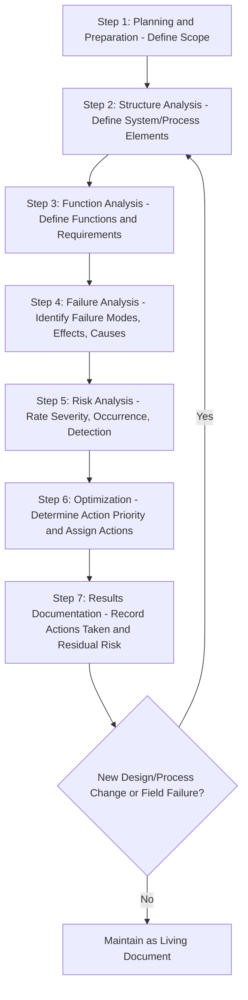
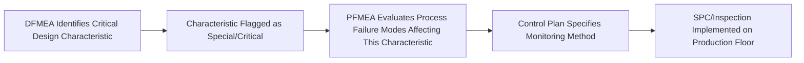

## Failure Mode and Effects Analysis

### Overview

Failure Mode and Effects Analysis (FMEA) is a systematic, proactive methodology for identifying potential failure modes within a design or process, evaluating their effects, and prioritizing risk mitigation efforts before failures occur. FMEA is one of the core reliability and risk-analysis tools referenced across ISO 9001:2015 (Clause 6.1 risk-based thinking), IATF 16949 (automotive), and AS9100 (aerospace), and is formally standardized in AIAG-VDA FMEA methodology.

### Key Points

- FMEA is fundamentally proactive/preventive, distinguishing it from reactive RCA techniques applied after a failure has occurred (though FMEA can also be updated reactively following a field failure)
- Two primary types: **Design FMEA (DFMEA)** — evaluates product/design failure modes, and **Process FMEA (PFMEA)** — evaluates manufacturing/process failure modes
- The traditional Risk Priority Number (RPN) approach has been substantially revised in the 2019 AIAG-VDA FMEA Handbook in favor of an Action Priority (AP) table
- FMEA is a living document, updated as designs/processes change or new failure information emerges

### DFMEA vs. PFMEA

| Aspect | Design FMEA (DFMEA) | Process FMEA (PFMEA) |
| --- | --- | --- |
| Focus | Product design failure modes | Manufacturing/process failure modes |
| Timing | During design development, before production | During process planning, before production start |
| Failure mode examples | Component fracture, incorrect material specification, tolerance stack-up failure | Missing operation, wrong torque applied, incorrect material used at assembly |
| Team composition | Design engineers, reliability engineers | Manufacturing/process engineers, quality engineers, operators |
| Typical trigger | New product introduction, design change | New process introduction, process change |

### Traditional FMEA Methodology (RPN-Based)

The classic approach scores three factors on a 1–10 scale each:

$$RPN = S \times O \times D$$

| Factor | Definition | Scale |
| --- | --- | --- |
| Severity (S) | How serious the effect of the failure is | 1 (no effect) to 10 (safety/regulatory hazard) |
| Occurrence (O) | How likely the failure mode is to occur | 1 (extremely unlikely) to 10 (almost certain) |
| Detection (D) | How likely current controls are to detect the failure before it reaches the customer | 1 (almost certain detection) to 10 (no detection possible) |

**Example RPN calculation**

| Failure Mode | S | O | D | RPN |
| --- | --- | --- | --- | --- |
| Weld joint cracks under load | 9 | 3 | 4 | 108 |
| Label misprint | 2 | 5 | 2 | 20 |
| Missing fastener | 8 | 2 | 6 | 96 |

Under the traditional approach, higher RPN values were prioritized for action, though this method has been criticized for allowing mathematically identical RPNs to represent very different risk profiles (e.g., S=9,O=2,D=6 vs. S=2,O=9,D=6 could produce similar RPNs despite vastly different severity implications).

### AIAG-VDA FMEA Handbook (2019) — Action Priority (AP) Approach

The updated methodology, now the standard reference in automotive and increasingly adopted across sectors, replaces the multiplicative RPN ranking with a structured **Action Priority (AP)** table that considers Severity first, then Occurrence, then Detection in a hierarchical (not purely multiplicative) decision structure, classifying each failure mode as **High**, **Medium**, or **Low** priority.

| AP Level | Meaning | Typical Response |
| --- | --- | --- |
| High (H) | Highest priority for action | Team must identify actions; if no action taken, document justification with management approval |
| Medium (M) | Should be addressed | Team should identify actions where feasible |
| Low (L) | Lower priority | Action optional at team's discretion |

This hierarchical approach ensures a high-severity failure mode cannot be masked by favorable occurrence/detection scores in the way multiplicative RPN sometimes allowed.

### FMEA Process Flow (7-Step AIAG-VDA Structure)

### Failure Mode, Effect, and Cause Relationship

| Term | Definition | Example (PFMEA) |
| --- | --- | --- |
| Function | What the process step is intended to accomplish | "Apply torque to fastener to specification" |
| Failure Mode | The manner in which the process could fail to meet the function | "Torque applied below specification" |
| Effect | The consequence of the failure mode, typically from the customer's perspective | "Fastener loosens in service, potential safety issue" |
| Cause | The mechanism by which the failure mode occurs | "Torque wrench out of calibration" |
| Current Controls (Prevention) | Existing measures preventing the cause | "Calibration schedule in place" |
| Current Controls (Detection) | Existing measures detecting the failure mode before escape | "100% torque audit at end of line" |

### FMEA Worksheet Structure (Simplified Example)

| Function | Failure Mode | Effect | S | Cause | O | Current Controls | D | AP | Recommended Action | Owner |
| --- | --- | --- | --- | --- | --- | --- | --- | --- | --- | --- |
| Apply torque to bolt | Torque below spec | Fastener loosens; safety risk | 9 | Wrench out of calibration | 3 | Calibration schedule | 5 | H | Add torque audit + calibration interlock | Process Engineer |

### DFMEA-to-PFMEA Linkage

Design FMEA and Process FMEA are interconnected — a design characteristic identified as critical in DFMEA typically becomes a special/critical characteristic flagged for controlled monitoring in the corresponding PFMEA and Control Plan.

### FMEA as a Living Document

FMEA should be revisited and updated:

- When a design or process change occurs
- Following any field failure or warranty claim traceable to a failure mode not previously identified
- Following an internal nonconformity revealing a gap in the original FMEA
- Periodically, per organizational policy, even absent a triggering event

### Integration with Broader Quality System

| Linked Document/Process | Relationship |
| --- | --- |
| Control Plan | Translates FMEA-identified risks into specific monitoring/control methods |
| PPAP (Production Part Approval Process) | FMEA is a required submission element in automotive PPAP packages |
| Clause 6.1 (Risk-Based Thinking) | FMEA is a common structured method for fulfilling risk/opportunity determination |
| 8D Problem Solving | FMEA is typically updated in 8D Step 7 (Prevent Recurrence) following a field issue |

### Common Misapplications

- FMEA created once during initial launch and never revisited despite subsequent design/process changes
- Severity, Occurrence, and Detection scores assigned inconsistently across teams without calibrated rating scales/anchors
- Using multiplicative RPN as the sole prioritization criterion without considering the AP hierarchical logic, allowing high-severity/low-occurrence risks to be deprioritized inappropriately
- FMEA treated as a compliance document (completed for audit purposes) disconnected from actual design/process decision-making
- No linkage from FMEA outputs to the Control Plan, so identified risks are not actually monitored in production

### Common Audit Findings

- FMEA on file does not reflect the current design/process configuration
- No evidence of cross-functional team involvement in FMEA development (single-author documents)
- High-severity failure modes with no corresponding action or documented justification for inaction
- FMEA and Control Plan inconsistent — a risk identified in FMEA has no corresponding control in the Control Plan
- Rating scales (S/O/D definitions) not standardized across the organization, producing inconsistent risk prioritization

### Relationship to Other Standards/Clauses

<svg xmlns="http://www.w3.org/2000/svg" viewBox="0 0 700 240">
<text x="350" y="25" text-anchor="middle" font-size="16" font-weight="bold" fill="#1a1a1a">FMEA Interfaces (svg_diagram)</text>
<rect x="270" y="50" width="160" height="55" rx="6" fill="#e8f0fe" stroke="#4285f4" stroke-width="1.5" />
<text x="350" y="73" text-anchor="middle" font-size="13" font-weight="bold" fill="#1a1a1a">FMEA</text>
<text x="350" y="90" text-anchor="middle" font-size="11" fill="#1a1a1a">DFMEA / PFMEA</text>
<rect x="60" y="150" width="150" height="55" rx="6" fill="#fef7e0" stroke="#f9ab00" stroke-width="1.5" />
<text x="135" y="173" text-anchor="middle" font-size="12" font-weight="bold" fill="#1a1a1a">Clause 6.1</text>
<text x="135" y="190" text-anchor="middle" font-size="11" fill="#1a1a1a">Risk-Based Thinking</text>
<rect x="250" y="150" width="150" height="55" rx="6" fill="#fce8e6" stroke="#ea4335" stroke-width="1.5" />
<text x="325" y="173" text-anchor="middle" font-size="12" font-weight="bold" fill="#1a1a1a">Control Plan</text>
<text x="325" y="190" text-anchor="middle" font-size="11" fill="#1a1a1a">Monitoring Implementation</text>
<rect x="440" y="150" width="150" height="55" rx="6" fill="#e6f4ea" stroke="#34a853" stroke-width="1.5" />
<text x="515" y="173" text-anchor="middle" font-size="12" font-weight="bold" fill="#1a1a1a">IATF 16949 / AS9100</text>
<text x="515" y="190" text-anchor="middle" font-size="11" fill="#1a1a1a">Sector Core Tool Requirement</text>
<line x1="270" y1="80" x2="210" y2="150" stroke="#666" stroke-width="1.5" />
<line x1="320" y1="105" x2="325" y2="150" stroke="#666" stroke-width="1.5" />
<line x1="430" y1="90" x2="510" y2="150" stroke="#666" stroke-width="1.5" />
</svg>

[Inference] While the AIAG-VDA Action Priority approach is increasingly positioned as the preferred methodology superseding pure RPN ranking, adoption varies by sector and organization; some industries and legacy quality systems continue to use traditional RPN scoring, so the specific methodology and rating scale definitions in use should generally be confirmed against the organization's current FMEA procedure and applicable customer-specific requirements rather than assumed from general practice.

**Related Topics**

- Clause 6.1 — Preventive Action and Proactive Risk Mitigation
- Root Cause Analysis Techniques (Five Whys, Fishbone)
- Control Plan Development
- AIAG-VDA FMEA Handbook (2019 Edition)
- IATF 16949 Core Tools (APQP, PPAP, MSA, SPC)
- Fault Tree Analysis (FTA)