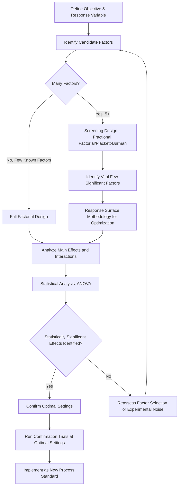

## Design of Experiments

### Overview

Design of Experiments (DOE) is a structured, statistical methodology for planning experiments so that the effects of multiple input variables (factors) on one or more output variables (responses) can be efficiently and validly determined. Unlike one-factor-at-a-time (OFAT) experimentation, DOE enables simultaneous evaluation of multiple factors and their interactions with fewer total experimental runs, making it a core tool for process optimization, root cause verification, and Six Sigma "Improve" phase activities.

### Key Points

- DOE's core advantage over OFAT is the ability to detect **interaction effects** — where the effect of one factor depends on the level of another — which OFAT cannot reveal
- Proper DOE requires careful selection of factors, levels, and a designed run matrix before any experimentation begins
- Randomization, replication, and blocking are foundational principles ensuring statistical validity
- DOE moves root cause analysis from hypothesis (Fishbone, 5 Whys) to statistically confirmed causation

### OFAT vs. DOE Comparison

| Aspect | One-Factor-at-a-Time (OFAT) | Design of Experiments (DOE) |
| --- | --- | --- |
| Factors varied per run | One, holding others constant | Multiple, systematically varied together |
| Interaction detection | Cannot detect interactions between factors | Explicitly detects and quantifies interactions |
| Experimental efficiency | Requires more runs for equivalent information | More information per run (statistically efficient) |
| Risk of misleading conclusion | High — optimal setting found may not hold when other factors change | Lower — accounts for factor interdependence |

**Example illustrating the OFAT weakness**

If oven temperature is optimized alone (holding pressure constant at a suboptimal level), then pressure is optimized alone (holding the newly found temperature constant), OFAT may converge on a local optimum that misses the true global optimum arising from a temperature-pressure interaction. DOE tests combinations directly, revealing such interactions.

### Core DOE Terminology

| Term | Definition |
| --- | --- |
| Factor | An input variable being studied (e.g., temperature, pressure, speed) |
| Level | A specific setting/value of a factor tested in the experiment (e.g., low/high) |
| Response | The output variable being measured (e.g., yield, defect rate, strength) |
| Treatment/Run | One specific combination of factor levels tested |
| Replication | Repeating a run to estimate experimental (random) error |
| Randomization | Randomizing run order to prevent confounding with time-related nuisance factors |
| Blocking | Grouping runs to control for a known nuisance variable (e.g., different material lots, shifts) |
| Interaction | When the effect of one factor depends on the level of another factor |

### Common DOE Designs

| Design Type | Description | Best Suited For |
| --- | --- | --- |
| Full Factorial | Tests all possible combinations of all factor levels | Small number of factors (2–4); complete interaction information |
| Fractional Factorial | Tests a carefully selected subset of combinations | Screening many factors (5+) efficiently, accepting some confounding |
| Plackett-Burman | Highly efficient screening design for main effects only | Initial screening of many factors to identify the vital few |
| Response Surface Methodology (RSM) | Models curvature to find optimal factor settings | Optimization after key factors are identified via screening |
| Taguchi Methods | Robust design approach emphasizing variation reduction and noise factors | Designing processes/products insensitive to uncontrollable variation |

### Full Factorial Design Example ($2^k$ Design)

For $k$ factors each at 2 levels, the number of runs required is:

$$N = 2^k$$

**Example: 2 factors, 2 levels each ($2^2$ design)**

| Run | Temperature | Pressure | Yield (%) |
| --- | --- | --- | --- |
| 1 | Low | Low | 62 |
| 2 | High | Low | 71 |
| 3 | Low | High | 68 |
| 4 | High | High | 85 |

The effect of temperature alone (average of high minus average of low) and pressure alone can each be calculated, and critically, the **interaction effect** (whether temperature's impact changes depending on pressure level) can also be quantified — something OFAT testing could never reveal.

### DOE Process Flow

### Statistical Analysis of DOE Results — ANOVA

Analysis of Variance (ANOVA) determines whether observed differences in the response across factor levels are statistically significant or attributable to random variation:

$$F = \frac{\text{Mean Square Between Groups (Treatment)}}{\text{Mean Square Within Groups (Error)}}$$

A large $F$-statistic (with an associated low p-value, typically $p < 0.05$) indicates the factor has a statistically significant effect on the response.

### Randomization, Replication, and Blocking — The Three Pillars

| Principle | Purpose | Example |
| --- | --- | --- |
| Randomization | Prevents confounding of factor effects with uncontrolled time-related trends (e.g., machine warm-up, ambient drift) | Randomizing the order in which the 4 runs in a $2^2$ design are executed rather than running them sequentially |
| Replication | Estimates inherent experimental (random) error, enabling significance testing | Running each treatment combination 3 times rather than once |
| Blocking | Controls for known nuisance variables not of primary interest | Running the full experiment across two material lots as a "block" to separate lot-to-lot variation from the factors under study |

### DOE Application Areas within Quality Management

| Application | Example |
| --- | --- |
| Process optimization | Finding optimal machine settings to maximize yield |
| Root cause verification | Confirming a Fishbone-identified candidate cause via controlled experimentation |
| New product/process development | Characterizing a new process's factor sensitivities before full-scale production |
| Robust design (Taguchi) | Designing a process insensitive to environmental noise factors (temperature, humidity variation) |
| Six Sigma DMAIC "Improve" phase | Statistically confirming the optimal solution among candidate improvements |

### Taguchi Methods — Robust Design Emphasis

Taguchi's approach distinguishes between **control factors** (settings the organization can adjust) and **noise factors** (uncontrollable variation, e.g., ambient conditions, raw material variation), aiming to find control factor settings that minimize sensitivity to noise — i.e., a robust process.

$$\text{Signal-to-Noise Ratio (Larger-the-Better)} = -10\log_{10}\left(\frac{1}{n}\sum \frac{1}{y_i^2}\right)$$

### Common DOE Pitfalls

| Pitfall | Consequence |
| --- | --- |
| Skipping randomization | Confounds factor effects with time-related trends, producing false conclusions |
| Insufficient replication | Cannot reliably distinguish real effects from experimental noise |
| Too many factors in a full factorial without screening first | Impractically large number of runs; resource-prohibitive |
| Ignoring interaction effects (analyzing factors independently) | Misses synergistic or antagonistic relationships between factors |
| No confirmation run at the identified optimal settings | Risk of implementing a statistically fragile or overfit conclusion |

### Common Audit/Implementation Findings

- DOE conducted without a documented experimental plan (factors, levels, randomization scheme) prior to execution
- Conclusions drawn from a screening design treated as final optimization without follow-up confirmation
- No replication included, making statistical significance claims unsupportable
- DOE results not integrated into updated Control Plan or Work Instructions following confirmed process improvement

### Relationship to Other Clauses/Tools

<svg xmlns="http://www.w3.org/2000/svg" viewBox="0 0 700 240">
<text x="350" y="25" text-anchor="middle" font-size="16" font-weight="bold" fill="#1a1a1a">DOE Interfaces (svg_diagram)</text>
<rect x="270" y="50" width="160" height="55" rx="6" fill="#e8f0fe" stroke="#4285f4" stroke-width="1.5" />
<text x="350" y="73" text-anchor="middle" font-size="13" font-weight="bold" fill="#1a1a1a">Design of Experiments</text>
<text x="350" y="90" text-anchor="middle" font-size="11" fill="#1a1a1a">Statistical Optimization</text>
<rect x="60" y="150" width="150" height="55" rx="6" fill="#fef7e0" stroke="#f9ab00" stroke-width="1.5" />
<text x="135" y="173" text-anchor="middle" font-size="12" font-weight="bold" fill="#1a1a1a">Clause 10.2</text>
<text x="135" y="190" text-anchor="middle" font-size="11" fill="#1a1a1a">RCA Verification</text>
<rect x="250" y="150" width="150" height="55" rx="6" fill="#fce8e6" stroke="#ea4335" stroke-width="1.5" />
<text x="325" y="173" text-anchor="middle" font-size="12" font-weight="bold" fill="#1a1a1a">Six Sigma DMAIC</text>
<text x="325" y="190" text-anchor="middle" font-size="11" fill="#1a1a1a">Improve Phase</text>
<rect x="440" y="150" width="150" height="55" rx="6" fill="#e6f4ea" stroke="#34a853" stroke-width="1.5" />
<text x="515" y="173" text-anchor="middle" font-size="12" font-weight="bold" fill="#1a1a1a">Control Plan / SPC</text>
<text x="515" y="190" text-anchor="middle" font-size="11" fill="#1a1a1a">Implementation of Optimized Settings</text>
<line x1="270" y1="80" x2="210" y2="150" stroke="#666" stroke-width="1.5" />
<line x1="320" y1="105" x2="325" y2="150" stroke="#666" stroke-width="1.5" />
<line x1="430" y1="90" x2="510" y2="150" stroke="#666" stroke-width="1.5" />
</svg>

[Inference] While DOE provides a statistically rigorous alternative to hypothesis-based RCA tools like Fishbone diagrams, its practical adoption generally requires greater statistical literacy and often dedicated software (Minitab, JMP, or similar); consequently, organizations commonly reserve DOE for higher-value or recurring problems where the investment in rigorous experimentation is justified, rather than applying it universally in place of simpler qualitative tools.

**Related Topics**

- Root Cause Analysis Techniques (Five Whys, Fishbone Diagrams)
- Continual Improvement Methodologies (Six Sigma DMAIC)
- Statistical Process Control and Control Charts
- Failure Mode and Effects Analysis
- Taguchi Robust Design Methods
- Analysis of Variance (ANOVA) Fundamentals