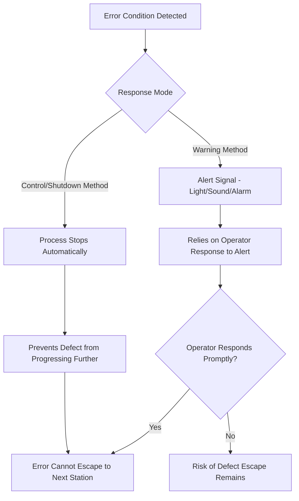
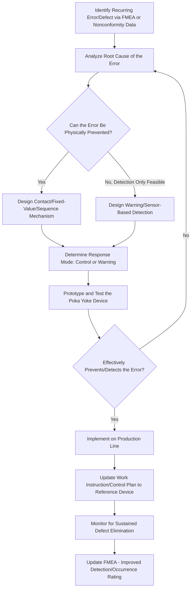
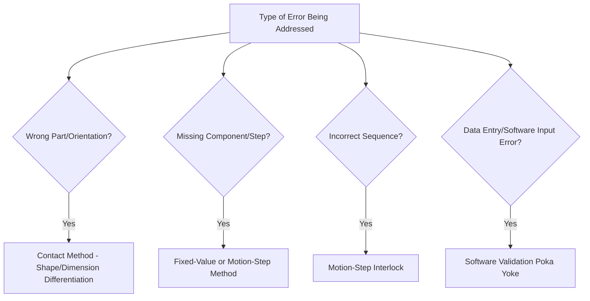

## Poka Yoke and Error Proofing Methods

### Overview

Poka Yoke (a Japanese term meaning "mistake-proofing" or "inadvertent error avoidance," coined by Shigeo Shingo) refers to design and process techniques that prevent errors from occurring or make them immediately obvious when they do occur, before they can produce a defect. Unlike inspection-based detection (finding defects after they occur), poka yoke aims to eliminate the possibility of the error at its source — representing prevention rather than detection, and directly supporting the Clause 6.1 risk-based thinking philosophy embedded in ISO 9001:2015.

### Key Points

- Poka yoke devices are typically simple, low-cost, and mechanical/procedural rather than relying on operator vigilance or judgment
- Shingo's framework distinguishes three regulatory functions: **contact**, **fixed-value**, and **motion-step** methods
- Two response modes exist: **control (shutdown)** methods that stop the process, and **warning** methods that alert but allow continuation
- Poka yoke shifts quality control "upstream" — preventing defects at the source rather than catching them via downstream inspection

### Philosophical Foundation: Prevention vs. Detection

| Approach | Timing | Example | Cost of Failure |
| --- | --- | --- | --- |
| Inspection (Detection) | After the process step, before shipment | Final inspection catching a missing component | Rework/scrap cost already incurred |
| Poka Yoke (Prevention) | At the point of the process step itself | A fixture that physically cannot accept a misaligned part | Error never becomes a defect |

Shingo's core insight: 100% inspection is often impractical and still allows human error to slip through; poka yoke instead makes the error itself physically impossible or immediately self-evident.

### Shingo's Three Regulatory Functions

| Function | Mechanism | Example |
| --- | --- | --- |
| Contact Method | Detects whether physical contact occurs correctly (shape, dimension, presence) | A part with an asymmetric hole pattern that can only be assembled in the correct orientation |
| Fixed-Value (Constant Number) Method | Ensures a fixed, predetermined quantity/count is met | A parts feeder that dispenses exactly the number of screws needed for one assembly, with an alarm if any remain |
| Motion-Step (Sequence) Method | Ensures process steps occur in the correct sequence | An assembly line that will not advance to the next station unless a photoelectric sensor confirms the prior step's fastener was installed |

### Two Response Modes

| Mode | Description | Reliability | Example |
| --- | --- | --- | --- |
| Control (Shutdown) | Automatically stops the process/machine when an error condition is detected | Higher — removes reliance on human response | Machine will not cycle if a sensor detects a part is missing |
| Warning | Alerts the operator (light, buzzer, display) but does not stop the process | Lower — still depends on timely human response | Warning light illuminates if torque is out of range, but line continues |

### Common Poka Yoke Techniques by Category

| Category | Technique | Example |
| --- | --- | --- |
| Physical/Mechanical | Shape-coded connectors/fixtures | USB-C connector design preventing incorrect insertion orientation |
| Counting | Kitting with exact part counts | Pre-counted fastener kits per assembly, with visual "empty tray" check |
| Sequencing | Interlocks preventing out-of-order steps | Software lockout preventing a next process step until prior step confirmed |
| Sensor-based | Photoelectric/proximity sensors | Sensor confirms part presence before allowing press cycle to activate |
| Checklists/Templates | Visual/procedural aids reducing omission errors | Standardized pre-flight-style checklist requiring physical check-off |
| Color-coding | Visual differentiation preventing mix-ups | Color-coded cables/connectors for different voltage levels |
| Software validation | Digital input validation | Form field rejecting an invalid date format or out-of-range value before submission |

### Poka Yoke Implementation Process Flow

### Poka Yoke Selection Guidance by Error Type

### Poka Yoke vs. Related Concepts

| Concept | Relationship to Poka Yoke |
| --- | --- |
| Jidoka | Broader Lean concept of "automation with a human touch" — poka yoke devices are often the mechanism enabling Jidoka's automatic stop-on-defect behavior |
| Inspection | Poka yoke aims to reduce reliance on inspection by preventing the error at the source; inspection remains a complementary detection layer |
| FMEA | FMEA's "Detection" rating often improves when a poka yoke device is implemented, since detection becomes near-certain (automatic) rather than dependent on human vigilance |
| Visual Management (5S) | Poka yoke often incorporates visual cues (color-coding, shadow boards) as part of the mistake-proofing design |

### Effect on FMEA Detection Rating

Implementing an effective control-method poka yoke device typically improves (lowers) the Detection score in an FMEA, since automatic prevention/detection is inherently more reliable than operator-dependent inspection:

| Before Poka Yoke | After Poka Yoke (Control Method) |
| --- | --- |
| Detection = 6 (operator visual check, moderate reliability) | Detection = 2 (automatic sensor-based shutdown, high reliability) |

This directly reduces the resulting RPN or Action Priority classification, reflecting genuinely reduced risk.

### Design Principles for Effective Poka Yoke

- **Simplicity** — Effective devices are typically low-cost and mechanically simple, not complex automation
- **100% inspection substitute, not supplement** — Aim to make inspection of that specific error unnecessary, not merely add another check
- **Immediate feedback** — The error should be caught at the moment it would occur, not downstream
- **Fail-safe design** — Where possible, prefer control (shutdown) methods over warning methods, since they do not depend on human responsiveness

### Common Misapplications

- Implementing warning-only devices for high-severity failure modes where a control/shutdown method would be more appropriate given the risk level
- Over-engineering a poka yoke solution when a simple, low-cost mechanical fix would suffice (contrary to poka yoke's inherent simplicity philosophy)
- Treating a checklist alone as a poka yoke device without recognizing it still depends on operator diligence, offering only partial mistake-proofing compared to a mechanical or sensor-based solution
- Failing to update the FMEA/Control Plan after implementing a poka yoke device, missing the opportunity to formally reduce documented risk ratings
- Implementing a poka yoke device without validating it actually prevents the specific error mode it was designed for

### Common Audit Findings

- Poka yoke devices installed but not referenced in the corresponding Control Plan or Work Instruction
- Warning-mode devices used for safety-critical failure modes without justification for not using a control/shutdown method
- No evidence poka yoke effectiveness was verified/tested before implementation
- Recurring defects for which a poka yoke solution was proposed in a prior corrective action but never actually implemented

### Relationship to Other Clauses/Tools

<svg xmlns="http://www.w3.org/2000/svg" viewBox="0 0 700 240">
<text x="350" y="25" text-anchor="middle" font-size="16" font-weight="bold" fill="#1a1a1a">Poka Yoke Interfaces (svg_diagram)</text>
<rect x="270" y="50" width="160" height="55" rx="6" fill="#e8f0fe" stroke="#4285f4" stroke-width="1.5" />
<text x="350" y="73" text-anchor="middle" font-size="13" font-weight="bold" fill="#1a1a1a">Poka Yoke</text>
<text x="350" y="90" text-anchor="middle" font-size="11" fill="#1a1a1a">Error Proofing</text>
<rect x="60" y="150" width="150" height="55" rx="6" fill="#fef7e0" stroke="#f9ab00" stroke-width="1.5" />
<text x="135" y="173" text-anchor="middle" font-size="12" font-weight="bold" fill="#1a1a1a">FMEA</text>
<text x="135" y="190" text-anchor="middle" font-size="11" fill="#1a1a1a">Detection Rating Improvement</text>
<rect x="250" y="150" width="150" height="55" rx="6" fill="#fce8e6" stroke="#ea4335" stroke-width="1.5" />
<text x="325" y="173" text-anchor="middle" font-size="12" font-weight="bold" fill="#1a1a1a">Clause 6.1</text>
<text x="325" y="190" text-anchor="middle" font-size="11" fill="#1a1a1a">Preventive Risk Mitigation</text>
<rect x="440" y="150" width="150" height="55" rx="6" fill="#e6f4ea" stroke="#34a853" stroke-width="1.5" />
<text x="515" y="173" text-anchor="middle" font-size="12" font-weight="bold" fill="#1a1a1a">Clause 8.7</text>
<text x="515" y="190" text-anchor="middle" font-size="11" fill="#1a1a1a">Nonconforming Output Prevention</text>
<line x1="270" y1="80" x2="210" y2="150" stroke="#666" stroke-width="1.5" />
<line x1="320" y1="105" x2="325" y2="150" stroke="#666" stroke-width="1.5" />
<line x1="430" y1="90" x2="510" y2="150" stroke="#666" stroke-width="1.5" />
</svg>

[Inference] While poka yoke originated in manufacturing assembly contexts, its underlying prevention-over-detection logic is generally understood to extend to service and administrative processes (e.g., software input validation, standardized digital forms preventing incomplete submissions); the specific mechanism naturally differs by context, but the core Shingo principles of contact, fixed-value, and sequence-based error prevention are commonly cited as translatable across both physical and digital/service processes.

**Related Topics**

- Failure Mode and Effects Analysis
- Clause 6.1 — Preventive Action and Proactive Risk Mitigation
- Jidoka and Lean Manufacturing Principles
- Clause 8.7 — Control of Nonconforming Outputs
- 5S Visual Management
- The Seven Basic Quality Tools