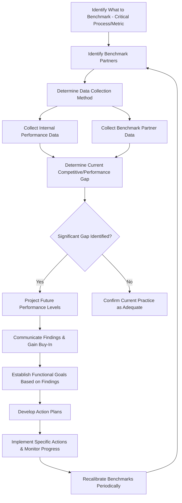

## Benchmarking Techniques and Best Practice Analysis

### Overview

Benchmarking Techniques and Best Practice Analysis encompasses the systematic process of comparing an organization's processes, performance metrics, and practices against those of other organizations — competitors, industry leaders, or best-in-class performers regardless of sector — to identify improvement opportunities. Within a QMS context, benchmarking serves as an external input to Clause 9.1.3 (Analysis and Evaluation) and Clause 10.3 (Continual Improvement), complementing internal performance data with external comparative context.

### Key Points

- Benchmarking answers "how do we compare?" and "what could we achieve?" — distinct from internal trend analysis, which only answers "how are we changing over time?"
- Effective benchmarking targets **processes and practices**, not merely outcome metrics — understanding *how* a benchmark performer achieves results is more actionable than simply knowing *that* they do
- Four primary types exist based on the comparison target: internal, competitive, functional/generic, and collaborative
- Benchmarking is not one-time; sustained benchmarking programs track competitive position over time

### Types of Benchmarking

| Type | Comparison Target | Example |
| --- | --- | --- |
| Internal Benchmarking | Different departments/sites within the same organization | Comparing defect rates across multiple manufacturing plants of the same company |
| Competitive Benchmarking | Direct industry competitors | Comparing warranty claim rates against a named competitor's publicly reported figures |
| Functional/Generic Benchmarking | Best-in-class performers of a specific *process*, regardless of industry | A hospital benchmarking patient check-in speed against a hotel chain's guest check-in process |
| Collaborative Benchmarking | Voluntary information-sharing consortium/partnership among non-competing organizations | Industry association members sharing safety metrics to jointly establish best practice standards |

### Benchmarking Process Flow (Classic 10-Step / Xerox-Style Model)

### Selecting What to Benchmark

| Selection Criterion | Rationale |
| --- | --- |
| Strategic importance | Focus on processes materially affecting customer satisfaction or competitive position |
| Performance gap suspicion | Areas where internal data (Clause 9.1.3) suggests underperformance relative to expectations |
| Cost/resource intensity | High-cost processes offer greater potential ROI from improvement |
| Customer-facing impact | Processes directly shaping customer experience are natural benchmarking priorities |

### Data Sources for Benchmarking

| Source | Applicability |
| --- | --- |
| Published industry reports/surveys | Broad competitive positioning (e.g., industry association benchmarking studies) |
| Site visits and reciprocal exchanges | Detailed process-level understanding, typically in non-competitive or collaborative arrangements |
| Public financial/regulatory filings | Competitive benchmarking of publicly available performance indicators |
| Customer feedback comparing you to competitors | Indirect competitive benchmarking signal |
| Professional/industry conferences and publications | Functional/generic process benchmarking ideas from other sectors |
| Certification body/consultant aggregate data | Anonymized cross-client benchmarking (where available) |

### Best Practice Analysis — Going Beyond the Metric

A common benchmarking pitfall is stopping at the comparative metric ("Competitor X has a 2% defect rate; we have 5%") without investigating the underlying *practice* that produces the result. Best practice analysis requires:

1. Identifying not just the performance gap, but the specific process design/practice generating superior performance
2. Assessing transferability — does the practice depend on context-specific factors (scale, technology, regulatory environment) that limit direct transfer?
3. Adapting rather than directly copying, since organizational context differences often require modification

**Example**

A benchmarking study reveals a competitor achieves 40% faster order fulfillment. Best practice analysis reveals this stems from a decentralized regional warehouse network, not merely "better process discipline." Direct copying may be infeasible due to capital investment requirements; the organization instead adapts the underlying principle (reducing fulfillment distance) through a smaller-scale regional partnership model.

### Benchmarking Metrics Framework

| Category | Example Metrics |
| --- | --- |
| Quality | Defect rate, first-pass yield, customer complaint rate |
| Cost | Cost per unit, cost of quality (COQ), warranty cost as % of revenue |
| Delivery | On-time delivery rate, order-to-delivery cycle time |
| Service | Customer satisfaction score, response time, first-call resolution rate |
| Innovation | New product development cycle time, R&D spend as % of revenue |

### Gap Analysis Visualization Approach

$$\text{Performance Gap} = \text{Benchmark Performance} - \text{Current Performance}$$

**Example Gap Analysis Table**

| Metric | Our Performance | Benchmark (Best-in-Class) | Gap | Priority |
| --- | --- | --- | --- | --- |
| On-time delivery | 87% | 98% | 11 pts | High |
| First-pass yield | 94% | 96% | 2 pts | Low |
| Customer complaint rate | 3.2% | 1.1% | 2.1 pts | High |
| Order cycle time | 5 days | 2 days | 3 days | Medium |

### Ethical and Legal Considerations in Competitive Benchmarking

- Benchmarking must rely on legitimately obtained information (public filings, published data, voluntary disclosure) — never through misrepresentation, industrial espionage, or breach of confidentiality
- Collaborative benchmarking arrangements should avoid exchanging information that could constitute anti-competitive collusion (e.g., coordinated pricing data), particularly under antitrust/competition law
- Reciprocal site-visit arrangements typically require mutual non-disclosure agreements covering proprietary process details beyond the benchmarked metric itself

### Integration with QMS Clauses

| QMS Clause | Benchmarking's Role |
| --- | --- |
| Clause 9.1.3 (Analysis and Evaluation) | Benchmarking provides external comparative context to internal performance analysis |
| Clause 9.3 (Management Review) | Benchmark findings and resulting gap analysis are appropriate management review inputs, informing improvement opportunity discussions |
| Clause 6.2 (Quality Objectives) | Benchmark targets can inform the setting of stretch or best-in-class quality objectives |
| Clause 10.3 (Continual Improvement) | Benchmark-identified best practices feed directly into improvement initiative selection |

### Common Pitfalls

| Pitfall | Consequence |
| --- | --- |
| Benchmarking only the outcome metric, not the underlying process | Superficial understanding; improvement actions may not address the actual driver |
| Comparing incompatible contexts without adjustment | Misleading conclusions (e.g., comparing a small regional firm to a global scale leader without normalizing for scale effects) |
| One-time benchmarking exercise, never repeated | Loses value as competitive landscape and internal performance evolve |
| Copying a practice without assessing transferability | Wasted investment if the practice depended on context-specific enabling conditions |
| Using benchmarking data of questionable provenance or currency | Conclusions based on outdated or unreliable comparative data |

### Common Audit Findings

- Benchmarking claimed as part of continual improvement process, but no evidence of actual comparative data collection or analysis
- Benchmark targets set without a credible external data source (aspirational figures with no supporting reference)
- No evidence benchmarking findings were considered in management review or fed into quality objectives
- Benchmarking data significantly outdated relative to the audit date, with no evidence of a recurring benchmarking cadence

### Relationship to Other Clauses/Concepts

<svg xmlns="http://www.w3.org/2000/svg" viewBox="0 0 700 240">
<text x="350" y="25" text-anchor="middle" font-size="16" font-weight="bold" fill="#1a1a1a">Benchmarking Interfaces (svg_diagram)</text>
<rect x="270" y="50" width="160" height="55" rx="6" fill="#e8f0fe" stroke="#4285f4" stroke-width="1.5" />
<text x="350" y="73" text-anchor="middle" font-size="13" font-weight="bold" fill="#1a1a1a">Benchmarking</text>
<text x="350" y="90" text-anchor="middle" font-size="11" fill="#1a1a1a">Best Practice Analysis</text>
<rect x="60" y="150" width="150" height="55" rx="6" fill="#fef7e0" stroke="#f9ab00" stroke-width="1.5" />
<text x="135" y="173" text-anchor="middle" font-size="12" font-weight="bold" fill="#1a1a1a">Clause 9.1.3</text>
<text x="135" y="190" text-anchor="middle" font-size="11" fill="#1a1a1a">Analysis &amp; Evaluation</text>
<rect x="250" y="150" width="150" height="55" rx="6" fill="#fce8e6" stroke="#ea4335" stroke-width="1.5" />
<text x="325" y="173" text-anchor="middle" font-size="12" font-weight="bold" fill="#1a1a1a">Clause 6.2</text>
<text x="325" y="190" text-anchor="middle" font-size="11" fill="#1a1a1a">Quality Objectives</text>
<rect x="440" y="150" width="150" height="55" rx="6" fill="#e6f4ea" stroke="#34a853" stroke-width="1.5" />
<text x="515" y="173" text-anchor="middle" font-size="12" font-weight="bold" fill="#1a1a1a">Clause 10.3</text>
<text x="515" y="190" text-anchor="middle" font-size="11" fill="#1a1a1a">Continual Improvement</text>
<line x1="270" y1="80" x2="210" y2="150" stroke="#666" stroke-width="1.5" />
<line x1="320" y1="105" x2="325" y2="150" stroke="#666" stroke-width="1.5" />
<line x1="430" y1="90" x2="510" y2="150" stroke="#666" stroke-width="1.5" />
</svg>

[Inference] While functional/generic benchmarking (comparing processes across unrelated industries) is often cited as yielding the most innovative insights precisely because it escapes the assumptions embedded in one's own industry, it also generally requires the most significant adaptation effort before a borrowed practice becomes implementable, so organizations commonly favor competitive or internal benchmarking for near-term, lower-risk improvement targets while reserving generic benchmarking for longer-horizon innovation initiatives.

**Related Topics**

- Clause 9.1.3 — Analysis and Evaluation
- Clause 9.3 — Management Review Process Inputs and Outputs
- Continual Improvement Methodologies
- Clause 6.2 — Quality Objectives and Planning to Achieve Them
- Competitive Intelligence and Market Analysis Ethics
- Balanced Scorecard and KPI Frameworks