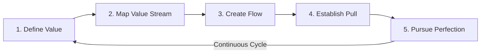
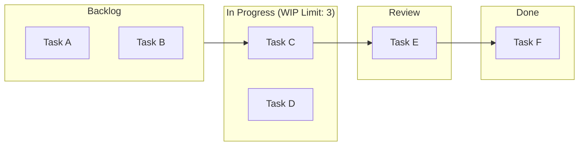

## Lean Principles and Waste Elimination

### Overview

Lean is a management philosophy originating from the Toyota Production System (TPS), centered on maximizing customer value while minimizing waste. Within a Quality Management System context, Lean principles complement ISO 9001's process approach (Clause 4.4) and risk-based thinking by providing concrete tools for improving process efficiency, which supports continual improvement (Clause 10.3) and operational planning and control (Clause 8.1).

### The Five Core Lean Principles

**Key Points**

1. **Define Value** — Value is defined strictly from the customer's perspective; any activity the customer would not pay for is a candidate for elimination
2. **Map the Value Stream** — Identify every step (value-adding and non-value-adding) required to bring a product/service from raw input to customer delivery
3. **Create Flow** — Eliminate interruptions, delays, and batching so work progresses smoothly through the process
4. **Establish Pull** — Produce only what is needed, when needed, based on downstream customer demand (as opposed to push/forecast-driven production)
5. **Pursue Perfection** — Continuous, iterative elimination of waste through Kaizen (continuous improvement)

### The Eight Wastes (TIMWOODS / DOWNTIME)

Lean identifies eight categories of waste (*muda*), commonly memorized via the acronym **DOWNTIME**:

| Waste | Description | Manufacturing Example | Service/Office Example |
| --- | --- | --- | --- |
| **D**efects | Errors requiring rework, scrap, or correction | Out-of-spec parts requiring rework | Incorrect data entry requiring re-processing |
| **O**verproduction | Producing more, sooner, or faster than needed | Building to forecast rather than order | Generating reports nobody reads |
| **W**aiting | Idle time between process steps | Machine downtime awaiting parts | Approval bottlenecks, waiting for signatures |
| **N**on-utilized Talent | Underusing employees' skills, knowledge, or creativity | Not soliciting line-worker improvement ideas | Overqualified staff on repetitive data tasks |
| **T**ransportation | Unnecessary movement of materials/products | Moving parts between distant workstations | Routing documents across multiple departments |
| **I**nventory | Excess raw materials, WIP, or finished goods | Overstocked warehouse | Backlogs of unprocessed requests |
| **M**otion | Unnecessary movement by people | Operators walking to retrieve tools | Reaching for files, switching between systems |
| **E**xtra-processing | Doing more work than the customer requires | Excess polishing beyond spec | Redundant approvals, duplicate data entry |

**Key Points**

- The original Toyota framework identified seven wastes (excluding Non-utilized Talent, which was added later in Lean's evolution toward broader applicability, particularly in service and knowledge-work contexts)
- A ninth waste sometimes cited informally is **"waste of unused ideas"** or **"complexity"**, though this is not universally standardized across Lean literature [Unverified — terminology varies by practitioner/source and is not part of the canonical Toyota framework]

### Waste Identification Diagram (svg_diagram)

<svg xmlns="http://www.w3.org/2000/svg" viewBox="0 0 800 500">
<rect x="0" y="0" width="800" height="500" fill="#ffffff" />
<text x="400" y="30" font-family="Arial, sans-serif" font-size="20" font-weight="bold" text-anchor="middle" fill="#1a1a1a">The 8 Wastes of Lean (DOWNTIME) (svg_diagram)</text>

<circle cx="400" cy="260" r="70" fill="#2c5f7c" stroke="#1a1a1a" stroke-width="2" />
<text x="400" y="255" font-family="Arial, sans-serif" font-size="16" font-weight="bold" text-anchor="middle" fill="#ffffff">CUSTOMER</text>
<text x="400" y="275" font-family="Arial, sans-serif" font-size="16" font-weight="bold" text-anchor="middle" fill="#ffffff">VALUE</text>

<circle cx="400" cy="100" r="55" fill="#c0392b" stroke="#1a1a1a" stroke-width="1.5" />
<text x="400" y="95" font-family="Arial, sans-serif" font-size="13" font-weight="bold" text-anchor="middle" fill="#ffffff">DEFECTS</text>
<text x="400" y="112" font-family="Arial, sans-serif" font-size="10" text-anchor="middle" fill="#ffffff">rework/scrap</text>
<line x1="400" y1="155" x2="400" y2="190" stroke="#666666" stroke-width="1.5" />

<circle cx="570" cy="150" r="55" fill="#d35400" stroke="#1a1a1a" stroke-width="1.5" />
<text x="570" y="145" font-family="Arial, sans-serif" font-size="13" font-weight="bold" text-anchor="middle" fill="#ffffff">OVER-</text>
<text x="570" y="160" font-family="Arial, sans-serif" font-size="13" font-weight="bold" text-anchor="middle" fill="#ffffff">PRODUCTION</text>
<line x1="530" y1="190" x2="460" y2="225" stroke="#666666" stroke-width="1.5" />

<circle cx="640" cy="260" r="55" fill="#e67e22" stroke="#1a1a1a" stroke-width="1.5" />
<text x="640" y="265" font-family="Arial, sans-serif" font-size="14" font-weight="bold" text-anchor="middle" fill="#ffffff">WAITING</text>
<line x1="585" y1="260" x2="470" y2="260" stroke="#666666" stroke-width="1.5" />

<circle cx="570" cy="370" r="55" fill="#f39c12" stroke="#1a1a1a" stroke-width="1.5" />
<text x="570" y="365" font-family="Arial, sans-serif" font-size="11" font-weight="bold" text-anchor="middle" fill="#ffffff">NON-UTILIZED</text>
<text x="570" y="380" font-family="Arial, sans-serif" font-size="11" font-weight="bold" text-anchor="middle" fill="#ffffff">TALENT</text>
<line x1="530" y1="330" x2="460" y2="295" stroke="#666666" stroke-width="1.5" />

<circle cx="400" cy="420" r="55" fill="#27ae60" stroke="#1a1a1a" stroke-width="1.5" />
<text x="400" y="415" font-family="Arial, sans-serif" font-size="12" font-weight="bold" text-anchor="middle" fill="#ffffff">TRANSPOR-</text>
<text x="400" y="430" font-family="Arial, sans-serif" font-size="12" font-weight="bold" text-anchor="middle" fill="#ffffff">TATION</text>
<line x1="400" y1="365" x2="400" y2="330" stroke="#666666" stroke-width="1.5" />

<circle cx="230" cy="370" r="55" fill="#16a085" stroke="#1a1a1a" stroke-width="1.5" />
<text x="230" y="375" font-family="Arial, sans-serif" font-size="14" font-weight="bold" text-anchor="middle" fill="#ffffff">INVENTORY</text>
<line x1="270" y1="330" x2="340" y2="295" stroke="#666666" stroke-width="1.5" />

<circle cx="160" cy="260" r="55" fill="#2980b9" stroke="#1a1a1a" stroke-width="1.5" />
<text x="160" y="265" font-family="Arial, sans-serif" font-size="14" font-weight="bold" text-anchor="middle" fill="#ffffff">MOTION</text>
<line x1="215" y1="260" x2="330" y2="260" stroke="#666666" stroke-width="1.5" />

<circle cx="230" cy="150" r="55" fill="#8e44ad" stroke="#1a1a1a" stroke-width="1.5" />
<text x="230" y="145" font-family="Arial, sans-serif" font-size="11" font-weight="bold" text-anchor="middle" fill="#ffffff">EXTRA-</text>
<text x="230" y="160" font-family="Arial, sans-serif" font-size="11" font-weight="bold" text-anchor="middle" fill="#ffffff">PROCESSING</text>
<line x1="270" y1="190" x2="340" y2="225" stroke="#666666" stroke-width="1.5" />
</svg>

### Key Lean Tools for Waste Elimination

#### 1. Value Stream Mapping (VSM)

A visual tool that documents current-state material and information flow, distinguishing value-added (VA) time from non-value-added (NVA) time.

$$\text{Process Cycle Efficiency} = \frac{\text{Value-Added Time}}{\text{Total Lead Time}} \times 100\%$$

A low Process Cycle Efficiency (PCE) indicates significant waste in the process; world-class Lean operations often target PCE well above typical baseline figures found in unoptimized processes. [Inference] Exact benchmark thresholds (e.g., "25% is good") vary considerably by industry and are cited inconsistently across Lean literature, so such figures should be treated as illustrative rather than universal standards.

#### 2. 5S Workplace Organization

| Stage (Japanese) | Stage (English) | Description |
| --- | --- | --- |
| Seiri | Sort | Remove unnecessary items from the workspace |
| Seiton | Set in Order | Arrange necessary items for efficient access |
| Seiso | Shine | Clean the workspace and equipment regularly |
| Seiketsu | Standardize | Establish standard procedures for the first 3S |
| Shitsuke | Sustain | Maintain discipline to sustain the practice long-term |

#### 3. Kanban (Pull Signaling)

A visual scheduling system that limits work-in-progress (WIP) and signals replenishment only when downstream demand exists, directly enabling the "Establish Pull" principle.

#### 4. Kaizen (Continuous Improvement)

Structured, incremental improvement activities, often conducted via short focused events ("Kaizen blitz" or "Kaizen event"), typically following a Plan-Do-Check-Act (PDCA) cycle at a localized process level.

#### 5. Poka-Yoke (Error Proofing)

Mechanisms designed to prevent defects at the source by making errors physically impossible or immediately detectable (e.g., a connector that only fits one way, a mandatory field in a digital form).

### Integration with ISO 9001

**Key Points**

- **Clause 4.4 (Process Approach)**: Value Stream Mapping directly supports process interaction analysis
- **Clause 6.1 (Risk-Based Thinking)**: Waste elimination reduces process variability, indirectly reducing conformity risk
- **Clause 8.5.1 (Control of Production/Service Provision)**: 5S and Poka-Yoke reinforce controlled conditions
- **Clause 9.1 (Monitoring and Measurement)**: PCE and cycle time metrics provide quantifiable process performance data
- **Clause 10.3 (Continual Improvement)**: Kaizen events provide a structured mechanism to fulfill this requirement

### Practical Example

A document processing unit within a local government office (e.g., permit issuance) identifies the following via VSM:

| Step | Value-Added Time | Waiting Time | Waste Type |
| --- | --- | --- | --- |
| Application intake | 5 min | 0 | — |
| Manager approval queue | 0 | 2 days | Waiting |
| Data re-entry into second system | 0 | 10 min | Extra-processing (duplicate entry) |
| Physical file routing to another building | 0 | 1 day | Transportation |
| Final signature | 3 min | 4 hours | Waiting |

**Total VA time**: 8 minutes. **Total lead time**: ~3.3 days.

$$\text{PCE} = \frac{8 \text{ min}}{3.3 \text{ days} \times 1440 \text{ min/day}} \times 100\% \approx 0.17\%$$

Applying Lean tools: eliminating duplicate data entry (integrate systems), replacing physical routing with digital transmission (eliminate transportation waste), and setting WIP limits on approval queues (Kanban) could substantially reduce lead time without adding resources.

### Common Pitfalls

- **Key Points**
  - Treating Lean as a one-time cost-cutting exercise rather than a sustained cultural discipline
  - Applying manufacturing-centric tools (e.g., 5S) to knowledge work without adapting terminology/context, reducing employee buy-in
  - Optimizing local process steps without mapping the full value stream, resulting in improvements that shift bottlenecks rather than eliminate them
  - Neglecting Non-utilized Talent, since front-line employees are often the best source of waste-identification insight but may not be structurally engaged (e.g., via suggestion systems or Kaizen participation)

**Next Steps**

- Value Stream Mapping (VSM) — Detailed Construction and Symbols
- 5S Implementation Methodology
- Kanban Systems and WIP Limits
- Kaizen Events: Planning and Facilitation
- Poka-Yoke Design Techniques
- Six Sigma DMAIC Framework (complementary methodology)
- Total Productive Maintenance (TPM)
- Takt Time and Line Balancing