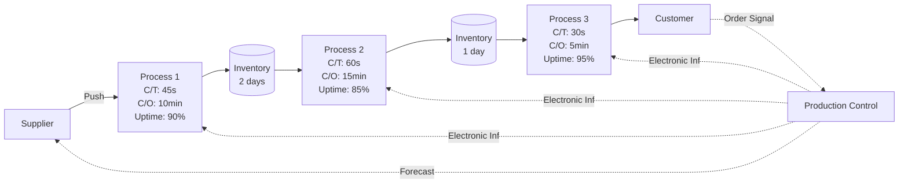

## Value Stream Mapping

### Definition and Purpose

Value Stream Mapping (VSM) is a lean management technique used to analyze, design, and manage the flow of materials and information required to bring a product or service to a customer. It originated from Toyota's Material and Information Flow Mapping practice and was popularized for broader industrial use through Lean manufacturing literature.

VSM visually documents every step in a process — both value-adding and non-value-adding — allowing teams to identify waste (muda), reduce cycle time, and design a more efficient future-state process.

In a QMS/ISO context, VSM supports:

- **ISO 9001** Clause 4.4 (process approach and interaction of processes)
- **ISO 9001** Clause 6.1 (risk-based thinking, since waste and delays are process risks)
- Continuous improvement requirements under **ISO 9001** Clause 10.2 and 10.3
- Lean Six Sigma DMAIC "Measure" and "Analyze" phases

### Key Points

- VSM maps **both** material flow and information flow — not just the physical process.
- It distinguishes between **value-added time (VA)** and **non-value-added time (NVA)**.
- It uses standardized icons/symbols for consistency across teams and facilities.
- It produces two primary deliverables: a **Current State Map** and a **Future State Map**.
- It is a team-based, cross-functional exercise — typically conducted at the gemba (actual workplace).

### Core Concepts

#### Value-Added vs. Non-Value-Added Activities

| Category | Definition | Example |
| --- | --- | --- |
| Value-Added (VA) | Activity the customer is willing to pay for; transforms the product/service | Machining a part, drafting a document |
| Non-Value-Added but Necessary (NVA-N) | Required by regulation, policy, or current constraints but adds no customer value | Quality inspection, regulatory documentation |
| Non-Value-Added / Waste (NVA) | Pure waste; should be eliminated | Waiting, rework, excess motion |

#### The Eight Wastes (TIMWOODS / DOWNTIME)

1. **T**ransportation
2. **I**nventory
3. **M**otion
4. **W**aiting
5. **O**verproduction
6. **O**ver-processing
7. **D**efects
8. **S**kills (underutilized talent)

### Standard VSM Symbols and Notation

| Symbol | Meaning |
| --- | --- |
| Process box | A single process step |
| Data box (below process box) | Cycle time (C/T), changeover time (C/O), uptime %, number of operators |
| Inventory triangle | Stock/WIP accumulation between steps |
| Push arrow (striped) | Push-based material flow |
| Straight arrow | Physical material flow |
| Lightning bolt | Electronic information flow |
| Straight thin line | Manual information flow |
| Truck icon | External shipment |
| Kaizen burst | Improvement opportunity flagged for future state |

### Value Stream Mapping Diagram (Generic Process Flow)

### Methodology: Step-by-Step Process

#### Step 1: Select the Product/Service Family

Group products or services that share similar process steps and equipment. Use a **product-process matrix** to identify families rather than mapping every SKU individually.

#### Step 2: Form the Cross-Functional Team

Include representatives from each process step, plus quality, planning, and if possible, a customer-facing role. Team size is typically 6–10 people.

#### Step 3: Walk the Process (Gemba Walk)

Physically walk the entire process flow, from receiving dock to shipping dock (or first customer touchpoint to final delivery for services), recording actual observed data — not standard/theoretical data.

#### Step 4: Draw the Current State Map

Document, for each process step:

- Cycle Time (C/T)
- Changeover Time (C/O)
- Uptime / Availability (%)
- Number of operators
- Work-in-process (WIP) inventory between steps
- Batch sizes

Add the **information flow** (how scheduling/orders move) above the process flow, and the **material flow** below it.

#### Step 5: Calculate the Timeline

Add a timeline ladder beneath the map showing:

- Value-added time segments (below the line)
- Non-value-added (wait/inventory) time segments (above the line)

**Total Lead Time** and **Total Process Time** are calculated as:

$$LT_{total} = \sum_{i=1}^{n} T_{NVA,i} + \sum_{i=1}^{n} T_{VA,i}$$

**Process Cycle Efficiency (PCE)**, a key Lean Six Sigma metric, is calculated as:

$$PCE = \frac{\sum T_{VA}}{LT_{total}} \times 100\%$$

A PCE below 25% is generally considered indicative of a process with significant waste; world-class processes often exceed 25%, though this benchmark varies by industry. [Inference — the specific PCE threshold is a commonly cited Lean Six Sigma heuristic rather than a formally standardized figure]

#### Step 6: Identify Waste and Kaizen Opportunities

Mark "kaizen bursts" directly on the current state map at points where waste, bottlenecks, or disconnects in information flow are observed.

#### Step 7: Design the Future State Map

Apply Lean design principles:

- **Takt time** alignment: match production rate to customer demand rate
- Introduce **continuous flow** where possible (eliminate batching)
- Use **pull systems** (kanban) where continuous flow isn't feasible
- Establish a **pacemaker process**
- Level production (**heijunka**)

$$Takt\ Time = \frac{Available\ Working\ Time}{Customer\ Demand}$$

#### Step 8: Create an Implementation Plan

Break the future state into a prioritized, time-bound action plan (often called a "Value Stream Plan"), typically using a Gantt-style chart with named owners.

### Worked Example

**Scenario**: An ISO 9001-certified electronics assembler experiences long lead times on a PCB assembly line.

**Current State Findings**:

- Total Lead Time: 12 days
- Total VA Time: 55 minutes
- PCE = $\frac{55\ min}{12\ days \times 1440\ min/day} \times 100\% \approx 0.032\%$

**Observations from Gemba Walk**:

- Large WIP inventory (3-day buffer) between SMT placement and manual inspection due to batch-and-queue scheduling
- Manual inspection has an uptime of only 70% due to frequent rework loops (defect waste)
- Information flow is push-based: production control issues weekly schedules to every station independently, causing overproduction

**Future State Actions**:

1. Implement a pull-based kanban between SMT and inspection to cap WIP at 4 hours of supply
2. Move to a single, synchronized production schedule sent only to the pacemaker process
3. Root-cause the inspection defects (Six Sigma DMAIC project) to raise uptime toward 95%

**Result** (post-implementation, illustrative): Lead time reduced from 12 days to 3.5 days; PCE improved to approximately 0.11%. [Inference — illustrative figures for teaching purposes, not a universal benchmark for all PCB assembly lines]

### VSM vs. Related Tools

| Tool | Primary Focus | Relationship to VSM |
| --- | --- | --- |
| Process Flowchart | Sequence of steps only | VSM adds time, inventory, and information flow data |
| SIPOC | High-level Suppliers-Inputs-Process-Outputs-Customers | Often used before VSM to scope the value stream |
| Spaghetti Diagram | Physical movement/layout | Complements VSM by visualizing motion waste |
| Swimlane Diagram | Cross-functional responsibility | Can be combined with VSM for service processes |

### Application to Service and Transactional Processes

VSM is not limited to manufacturing. For administrative, healthcare, or service QMS environments, the same principles apply, substituting:

- "Cycle time" → task processing time
- "Inventory" → queue of documents/cases/tickets waiting for action
- "Changeover" → context-switching or system setup time

This variant is sometimes called a **Value Stream Map for Administrative/Service processes (VSM-A)**.

### Integration with ISO 9001 Audits

Auditors may reference VSM outputs as objective evidence of:

- Process interaction analysis (Clause 4.4.1)
- Risk and opportunity determination (Clause 6.1)
- Performance evaluation and data-driven decision-making (Clause 9.1)
- Nonconformity root cause and corrective action linkage (Clause 10.2)

### Common Pitfalls

- Mapping the "should be" process instead of the **actual observed** process
- Failing to walk the entire value stream, including supplier and customer touchpoints
- Collecting data from time studies/standards rather than direct gemba observation
- Treating the map as a one-time exercise rather than a living document reviewed periodically
- Ignoring the information flow and focusing only on material flow

### Related Topics

- Takt Time and Line Balancing
- Kanban and Pull Systems
- SMED (Single-Minute Exchange of Die) for Changeover Reduction
- 5S Workplace Organization
- DMAIC Methodology (Six Sigma)
- Kaizen Events and Rapid Improvement Workshops
- Gemba Walks and Genchi Genbutsu
- Process Cycle Efficiency and Little's Law
- Heijunka (Production Leveling)