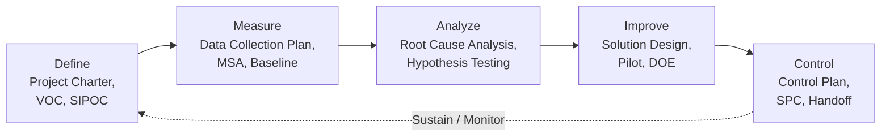
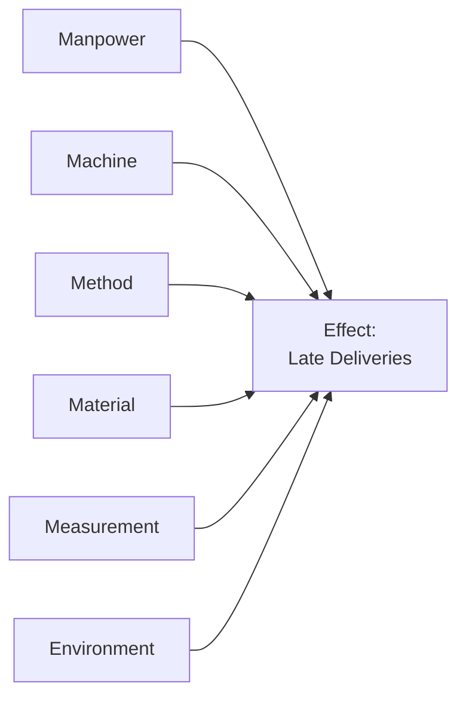

## Six Sigma DMAIC Methodology

### Definition and Purpose

DMAIC (Define, Measure, Analyze, Improve, Control) is the core data-driven improvement cycle used in Six Sigma to improve, optimize, and stabilize existing business and manufacturing processes. Unlike DMADV/DFSS (used for designing new processes), DMAIC is applied to processes that already exist but are underperforming a defined specification or customer requirement.

In a QMS/ISO context, DMAIC directly supports:

- **ISO 9001** Clause 10.2 (Nonconformity and Corrective Action) — structured root cause analysis
- **ISO 9001** Clause 9.1 (Monitoring, Measurement, Analysis, Evaluation) — measurement-based decision-making
- **ISO 9001** Clause 10.3 (Continual Improvement)
- **ISO 13053** (Quantitative methods in process improvement — Six Sigma), which formally documents DMAIC as a standard
- **ISO 18404** (competencies for Six Sigma and Lean practitioners — Green Belt, Black Belt, etc.)

### Key Points

- DMAIC is a **closed-loop, sequential** methodology — phases are not typically skipped.
- Each phase has a formal **tollgate review** before proceeding to the next.
- The methodology is fundamentally statistical — decisions are based on data, not opinion.
- It targets reduction of **process variation** (the "Sigma" in Six Sigma refers to standard deviation).
- A Six Sigma process produces **3.4 defects per million opportunities (DPMO)** at the long-term performance level.

### The Six Sigma Statistical Foundation

Process capability is commonly expressed using the **Sigma Level**, related to the process capability index $C_{pk}$:

$$C_{pk} = \min\left(\frac{USL - \mu}{3\sigma}, \frac{\mu - LSL}{3\sigma}\right)$$

Where:

- $USL$ = Upper Specification Limit
- $LSL$ = Lower Specification Limit
- $\mu$ = process mean
- $\sigma$ = process standard deviation

A "Six Sigma" process corresponds to $C_{pk} \approx 2.0$ (short-term), with the well-known **1.5-sigma long-term shift** accounting for the 3.4 DPMO figure. [Inference — the 1.5σ shift is a widely used industry convention originating from Motorola's original Six Sigma framework, not a universal physical law]

| Sigma Level | DPMO | Approx. Yield % |
| --- | --- | --- |
| 2σ | 308,537 | 69.1% |
| 3σ | 66,807 | 93.3% |
| 4σ | 6,210 | 99.38% |
| 5σ | 233 | 99.977% |
| 6σ | 3.4 | 99.9997% |

### DMAIC Phase Overview

### Phase 1: Define

**Objective**: Clearly articulate the problem, goal, scope, and business case.

**Key Tools and Deliverables**:

- **Project Charter** — includes problem statement, goal statement, scope, timeline, and team roles
- **Voice of the Customer (VOC)** — translating customer needs into measurable requirements (CTQs — Critical to Quality characteristics)
- **SIPOC Diagram** — Suppliers, Inputs, Process, Outputs, Customers (high-level process boundary map)
- **Stakeholder Analysis**

**Example Problem Statement**:

> "The order fulfillment process has an average cycle time of 5.2 days against a customer requirement of 3 days, resulting in a 22% late-delivery rate over the past 6 months, costing an estimated $180,000 annually in expedite fees and penalties."

**Tollgate Criteria**: Charter signed off by sponsor; problem is quantified, scoped, and tied to business impact.

### Phase 2: Measure

**Objective**: Establish a reliable, quantified baseline of current process performance.

**Key Tools and Deliverables**:

- **Data Collection Plan** — defines what data, how, by whom, and how often
- **Measurement System Analysis (MSA)** — Gage R&R studies to confirm the measurement system itself is not a source of variation
- **Process Baseline** — current sigma level, $C_{pk}$/$C_p$, DPMO
- **Value Stream Map / Process Map** at a detailed level

**Gage R&R Acceptance Criteria** (general guideline):

| % Gage R&R (of tolerance) | Assessment |
| --- | --- |
| < 10% | Acceptable measurement system |
| 10–30% | May be acceptable depending on application |
| > 30% | Unacceptable — measurement system needs improvement |

**Tollgate Criteria**: Baseline sigma level established; measurement system validated.

### Phase 3: Analyze

**Objective**: Identify and statistically validate root causes of the problem.

**Key Tools**:

- **Root Cause Analysis**: Fishbone/Ishikawa Diagram, 5 Whys
- **Hypothesis Testing**: t-tests, ANOVA, Chi-Square tests to confirm/reject suspected causes
- **Regression Analysis**: quantify relationship between input variables (X) and output (Y)
- **Failure Mode and Effects Analysis (FMEA)**
- **Pareto Analysis** (80/20 rule) to prioritize vital few causes

**Ishikawa Diagram (Fishbone) — 6M Categories**:

**Hypothesis Testing Framework Example**:

$$H_0: \mu_{shift1} = \mu_{shift2} \quad (\text{no difference in cycle time by shift})$$

$$H_1: \mu_{shift1} \neq \mu_{shift2}$$

If the resulting p-value $< \alpha$ (typically 0.05), reject $H_0$ and treat shift as a statistically significant contributing factor. [Standard statistical convention — significance threshold may vary by organizational policy]

**Tollgate Criteria**: Root cause(s) statistically validated, not assumed.

### Phase 4: Improve

**Objective**: Develop, test, and implement solutions that address the validated root causes.

**Key Tools**:

- **Design of Experiments (DOE)** — systematically test multiple factors simultaneously to find optimal settings
- **Brainstorming / Affinity Diagrams** for solution generation
- **Piloting** — small-scale implementation before full rollout
- **Failure Mode and Effects Analysis (FMEA)** — reassessed for the new process design
- **Cost-Benefit Analysis**

**Simple DOE Example (2-factor, 2-level full factorial)**:

| Run | Factor A (Temp) | Factor B (Speed) | Output (Yield %) |
| --- | --- | --- | --- |
| 1 | Low | Low | 78 |
| 2 | Low | High | 85 |
| 3 | High | Low | 82 |
| 4 | High | High | 94 |

Analysis of this $2^2$ design would reveal main effects and interaction effects, guiding selection of optimal factor settings.

**Tollgate Criteria**: Pilot data confirms improvement; solution is validated against the Measure-phase baseline.

### Phase 5: Control

**Objective**: Sustain the gains and prevent regression to the previous state.

**Key Tools and Deliverables**:

- **Statistical Process Control (SPC) Charts** — ongoing monitoring (X-bar/R charts, individual/moving range charts, p-charts)
- **Control Plan** — documents standard operating procedures, monitoring frequency, and response plan for out-of-control conditions
- **Mistake-Proofing (Poka-Yoke)** — designing the process so errors are physically prevented
- **Process Documentation Updates** — updating QMS-controlled documents per ISO 9001 Clause 7.5
- **Response/Reaction Plan** for out-of-control signals

**Example SPC Control Limits** (for an X-bar chart):

$$UCL = \bar{X} + 3\frac{\sigma}{\sqrt{n}}, \quad LCL = \bar{X} - 3\frac{\sigma}{\sqrt{n}}$$

**Tollgate Criteria**: Control plan implemented and handed off to process owner; monitoring shows sustained performance over a defined period.

### DMAIC Tollgate Review Summary

| Phase | Primary Question Answered | Exit Criteria |
| --- | --- | --- |
| Define | What problem are we solving and why does it matter? | Charter approved |
| Measure | How is the process performing today? | Baseline + validated measurement system |
| Analyze | Why is the problem occurring? | Root cause(s) statistically confirmed |
| Improve | What changes will fix the root cause? | Pilot results show validated improvement |
| Control | How do we sustain the improvement? | Control plan active, ownership transferred |

### Roles in a Six Sigma Deployment

| Role | Responsibility |
| --- | --- |
| Champion/Sponsor | Executive sponsor; removes organizational barriers, secures resources |
| Master Black Belt | Trains and mentors Black Belts; deploys Six Sigma strategy org-wide |
| Black Belt | Leads complex, cross-functional DMAIC projects full-time |
| Green Belt | Leads smaller DMAIC projects part-time, within their own function |
| Yellow Belt | Supports projects with basic Six Sigma knowledge; team member level |

### Worked Example: End-to-End Summary

**Define**: A call center has an average handle time (AHT) of 9.5 minutes vs. a target of 7 minutes.

**Measure**: Baseline data collected over 4 weeks confirms mean AHT = 9.4 min, $\sigma = 1.8$ min. MSA confirms the call-timing system is reliable (Gage R&R = 4%).

**Analyze**: Regression analysis shows 62% of AHT variation is explained by agents needing to navigate between 3 separate software systems to resolve a single ticket (a "Method" root cause), statistically validated via ANOVA ($p < 0.01$).

**Improve**: A unified agent desktop tool is piloted with 10 agents, reducing AHT to 7.1 min in the pilot group — a statistically significant improvement confirmed via a two-sample t-test.

**Control**: An SPC chart is implemented to monitor daily AHT by agent; control limits set at $\bar{X} \pm 3\sigma$; process ownership transferred to the Call Center Operations Manager with a documented reaction plan for out-of-control points.

### DMAIC vs. Other Improvement Frameworks

| Framework | Best Suited For |
| --- | --- |
| DMAIC | Improving an existing process |
| DMADV / DFSS | Designing a new process or product from scratch |
| PDCA (Plan-Do-Check-Act) | Simpler, faster-cycle continuous improvement |
| Kaizen Event | Rapid, focused, short-duration improvement (days, not months) |
| Lean VSM + Kaizen | Waste elimination and flow improvement (often paired with DMAIC's Analyze/Improve) |

### Common Pitfalls

- Skipping the Measure phase and jumping straight to solutions ("solutioneering")
- Using an unvalidated measurement system (skipping MSA), leading to false conclusions
- Confusing correlation with causation in the Analyze phase
- Weak or absent Control phase, causing gains to erode within months
- Overly broad project scope defined in the Define phase, causing "scope creep"

### Related Topics

- Statistical Process Control (SPC) and Control Charts
- Measurement System Analysis (Gage R&R)
- Design of Experiments (DOE)
- Failure Mode and Effects Analysis (FMEA)
- Process Capability Analysis ($C_p$, $C_{pk}$, $P_p$, $P_{pk}$)
- Hypothesis Testing and ANOVA
- Value Stream Mapping (Lean integration with DMAIC)
- ISO 13053 — Quantitative Methods in Process Improvement
- ISO 18404 — Six Sigma Competency Requirements
- DMADV / Design for Six Sigma (DFSS)