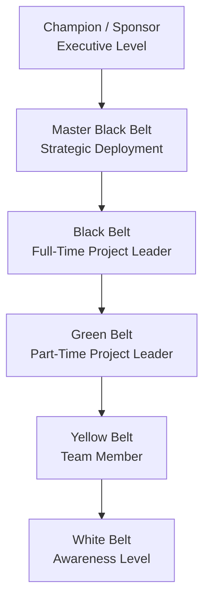

## Six Sigma Roles and Belt Certifications

### Definition and Purpose

Six Sigma Belt Certifications form a tiered competency and role hierarchy used to structure how organizations deploy Six Sigma methodology. Each "belt" (borrowed terminology from martial arts) represents a defined level of statistical knowledge, project leadership responsibility, and organizational authority within a Six Sigma or Lean Six Sigma deployment.

In a QMS/ISO context, belt structures support:

- **ISO 18404:2015** — Quantitative methods in process improvement: Six Sigma competencies for key personnel and their organizations (formally defines competency requirements for Green Belts, Black Belts, and Master Black Belts)
- **ISO 13053-1/-2** — Quantitative methods in process improvement — Six Sigma (methodology and tools/techniques)
- **ISO 9001** Clause 7.2 (Competence) — belt certification serves as documented evidence of personnel competence for process improvement roles
- **ISO 9001** Clause 5.1 (Leadership and commitment) — Champion/Sponsor roles map directly to top management engagement requirements

### Key Points

- Belt levels are **not standardized globally** by a single certifying body — requirements vary by training provider (ASQ, IASSC, university programs, internal corporate programs), though ISO 18404 provides a reference competency framework.
- Belts represent both a **skillset** (statistical/analytical tools known) and a **role** (scope of project leadership).
- Progression is typically **cumulative** — a Black Belt is expected to retain and exceed Green Belt competencies.
- **Certification ≠ Licensure** — there is no legal requirement or government regulation of Six Sigma belts, unlike engineering PE licenses.

### Belt Hierarchy Overview

### Role Definitions and Competency Matrix

| Belt Level | Typical Time Commitment | Statistical Depth | Project Scope | Typical Training Duration |
| --- | --- | --- | --- | --- |
| White Belt | Ad hoc | Basic Lean/Six Sigma awareness terminology | None (awareness only) | 1 day or less |
| Yellow Belt | Part-time, as team member | Basic tools: Pareto charts, process maps, checksheets | Supports projects; may lead very small local improvements | 2–3 days |
| Green Belt | 20–50% of role, part-time | Intermediate statistics: hypothesis testing, basic regression, control charts | Leads departmental DMAIC projects, part-time | 1–2 weeks |
| Black Belt | Full-time (100%) | Advanced statistics: DOE, ANOVA, multiple regression, non-parametric methods | Leads complex, cross-functional DMAIC/DMADV projects | 4–5 weeks (often over months) |
| Master Black Belt | Full-time, org-wide | Expert: full statistical toolkit, training design, project portfolio management | Mentors Black Belts, sets deployment strategy, trains | Years of BB experience + advanced training |
| Champion/Sponsor | Executive/managerial | Conceptual, not technical | Provides resources, removes barriers, selects projects | Executive briefing/orientation only |

### White Belt

**Purpose**: Organizational awareness of Six Sigma terminology and philosophy.

**Typical Knowledge**: Basic understanding of what Six Sigma is, DMAIC phase names, and the concept of waste/variation reduction.

**Role in Projects**: No active project leadership; may provide input as a process stakeholder.

### Yellow Belt

**Purpose**: Support role — enables broad organizational participation in improvement culture.

**Typical Knowledge**:

- Basic process mapping and flowcharting
- Pareto Charts (80/20 principle)
- 5S and basic Lean waste identification
- Basic data collection techniques

**Role in Projects**: Functions as a subject matter expert (SME) or data collector on a Green Belt or Black Belt-led team; may lead a very small, localized Kaizen-style improvement.

### Green Belt

**Purpose**: Departmental-level project leadership, typically alongside regular job duties.

**Typical Knowledge**:

- Full DMAIC methodology
- Hypothesis testing (t-tests, Chi-Square, basic ANOVA)
- Measurement System Analysis (Gage R&R)
- Basic process capability ($C_p$, $C_{pk}$)
- Control charts (X-bar/R, p-charts)

**Role in Projects**: Leads small-to-medium DMAIC projects within their own function, often mentored by a Black Belt. May be a team member on larger Black Belt-led projects.

**Example Certification Bodies**: ASQ (American Society for Quality) Certified Six Sigma Green Belt (CSSGB), IASSC Certified Lean Six Sigma Green Belt.

### Black Belt

**Purpose**: Full-time project leadership on complex, cross-functional initiatives with significant financial impact.

**Typical Knowledge**:

- Advanced Design of Experiments (DOE) — full and fractional factorial designs
- Multiple regression and multivariate analysis
- Non-parametric hypothesis testing
- Advanced SPC and process capability analysis
- FMEA and reliability engineering fundamentals
- Change management and project leadership skills

**Role in Projects**: Leads 4–6 major DMAIC/DMADV projects per year; mentors Green Belts; often reports project financial impact (cost savings, quality improvements) directly to leadership.

**Typical Prerequisites**: Green Belt certification + demonstrated project experience (many certifying bodies require at least one completed, signed-off project with documented financial impact).

### Master Black Belt (MBB)

**Purpose**: Organization-wide strategic deployment and training of the Six Sigma program.

**Typical Knowledge**: Expert-level statistics, training/curriculum design, project portfolio management, organizational change management, ability to teach and certify Black Belts and Green Belts.

**Role in Projects**: Rarely leads individual DMAIC projects directly; instead mentors multiple Black Belts simultaneously, selects and prioritizes the project portfolio, and aligns Six Sigma initiatives with overall business strategy.

**Typical Prerequisites**: Several years of Black Belt experience with a substantial portfolio of successfully completed projects.

### Champion / Sponsor

**Purpose**: Executive-level advocate who ensures organizational alignment and resource availability.

**Typical Responsibilities**:

- Selects and prioritizes projects aligned with strategic business goals
- Removes cross-functional/political barriers for Black Belts and Green Belts
- Approves project charters at the Define-phase tollgate
- Secures budget, staffing, and time allocation for project teams

**Not typically certified** in the technical sense — usually receives executive briefing/orientation training on Six Sigma concepts and their leadership role in deployment.

### ISO 18404 Competency Framework

ISO 18404 formally specifies minimum competency requirements (knowledge and demonstrated experience) for:

- Six Sigma Green Belts
- Six Sigma Black Belts
- Six Sigma Master Black Belts
- Lean practitioners (Lean Leader, Lean Practitioner, Lean Senior Practitioner)

Organizations seeking to align internal certification programs with a recognized standard (rather than a purely vendor-specific curriculum) often map their belt criteria to ISO 18404's competency tables during QMS documentation and internal audit evidence gathering. [Unverified — the degree to which any specific organization's internal program is formally mapped to ISO 18404 varies widely in practice and is not independently confirmable without organization-specific documentation]

### Comparison of Common Certifying Bodies

| Body | Certification Names | Approach |
| --- | --- | --- |
| ASQ | CSSGB, CSSBB, CSSYB | Exam-based; requires documented project experience for BB |
| IASSC | Certified Lean Six Sigma Green/Black/Yellow Belt | Exam-based; no project requirement (knowledge-only certification) |
| Internal Corporate Programs | Varies by company | Often project-completion based rather than exam-based |
| University/Institute Programs | Varies | Blended coursework + capstone project |

Because there is no single global governing body, employers and practitioners should verify what a given "Black Belt" credential actually required (exam-only vs. project-based) rather than assuming equivalence across providers. [Inference — this caution reflects a well-documented industry-wide inconsistency rather than a claim about any specific certifying body]

### Example: Typical Belt Deployment on a DMAIC Project Team

| Role | Person | Responsibility on Project |
| --- | --- | --- |
| Champion | VP of Operations | Approved charter, allocated budget for new equipment pilot |
| Black Belt | Senior Quality Engineer | Led project full-time for 4 months; ran DOE, presented tollgate reviews |
| Green Belt | Production Supervisor | Co-led Measure/Control phases within own shift; owns ongoing SPC monitoring |
| Yellow Belt (x3) | Line Operators | Collected data, participated in root-cause brainstorming sessions |
| Master Black Belt | Director of Continuous Improvement | Mentored the Black Belt monthly; ensured alignment with 3 other concurrent projects |

### Common Pitfalls

- Treating belt certification as purely credentialist without verifying actual demonstrated project competency
- Assigning Green Belts to projects requiring Black Belt-level statistical rigor (e.g., complex DOE), leading to invalid conclusions
- Under-resourcing the Champion role, leaving Black Belts without organizational authority to implement changes
- Certifying internally without any external benchmark (e.g., ISO 18404 or ASQ Body of Knowledge), causing inconsistent skill levels across "equivalent" belts
- Confusing Lean-only certifications (e.g., "Lean Practitioner") with full Lean **Six Sigma** statistical competency

### Related Topics

- Six Sigma DMAIC Methodology
- ISO 18404 — Six Sigma and Lean Competency Requirements
- ISO 13053 — Quantitative Methods in Process Improvement
- Design of Experiments (DOE)
- Measurement System Analysis (Gage R&R)
- Statistical Process Control (SPC)
- Change Management in Process Improvement
- Project Charter Development
- Lean Practitioner Competency Levels (distinct from Six Sigma belts)